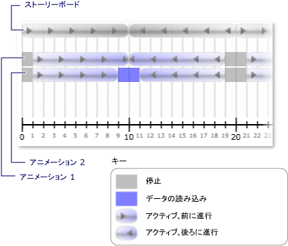

# 方法: クロックときに通知を受け取る&#39;s 状態の変更
クロックの<xref:System.Windows.Media.Animation.Clock.CurrentStateInvalidated>イベントが発生したときにその<xref:System.Windows.Media.Animation.Clock.CurrentState%2A>時計が開始または停止するなど、無効になります。 このイベントを使用して直接の登録することができます、 <xref:System.Windows.Media.Animation.Clock>、またはを使用して登録することができます、<xref:System.Windows.Media.Animation.Timeline>です。  
  
 次の例で、<xref:System.Windows.Media.Animation.Storyboard>と 2 つ<xref:System.Windows.Media.Animation.DoubleAnimation>オブジェクトは 2 つの四角形の幅をアニメーション化するために使用します。 <xref:System.Windows.Media.Animation.Timeline.CurrentStateInvalidated>クロック状態の変更をリッスンするようにイベントを使用します。  
  
## 例  
 [!code-xaml[timingbehaviors_snip#_graphicsmm_StateExampleMarkupWholePage](../../../../samples/snippets/csharp/VS_Snippets_Wpf/timingbehaviors_snip/CSharp/StateExample.xaml#_graphicsmm_stateexamplemarkupwholepage)]  
  
 [!code-csharp[timingbehaviors_snip#_graphicsmm_StateEventHandlers](../../../../samples/snippets/csharp/VS_Snippets_Wpf/timingbehaviors_snip/CSharp/StateExample.xaml.cs#_graphicsmm_stateeventhandlers)]
 [!code-vb[timingbehaviors_snip#_graphicsmm_StateEventHandlers](../../../../samples/snippets/visualbasic/VS_Snippets_Wpf/timingbehaviors_snip/visualbasic/stateexample.xaml.vb#_graphicsmm_stateeventhandlers)]  
  
 次の図は、さまざまな状態、アニメーションは、親タイムラインを入力してください (*ストーリー ボード*) が進行します。  
  
   
  
 次の表は、ある時刻を示します*Animation1*の<xref:System.Windows.Media.Animation.Timeline.CurrentStateInvalidated>イベントが発生します。  
  
||||||||  
|-|-|-|-|-|-|-|  
|時間 (秒)|1|10|19|21|30|39|  
|状態|アクティブ|アクティブ|停止|アクティブ|アクティブ|停止|  
  
 次の表は、ある時刻を示します*Animation2*の<xref:System.Windows.Media.Animation.Timeline.CurrentStateInvalidated>イベントが発生します。  
  
||||||||||  
|-|-|-|-|-|-|-|-|-|  
|時間 (秒)|1|9|11|19|21|29|31|39|  
|状態|アクティブ|いっぱいになります。|アクティブ|停止|アクティブ|いっぱいになります。|アクティブ|停止|  
  
 注意して*Animation1*の<xref:System.Windows.Media.Animation.Timeline.CurrentStateInvalidated>場合でも、その状態のまま 10 秒間にイベントが発生した<xref:System.Windows.Media.Animation.ClockState.Active>です。 変更が、10 秒間にその状態が変更されたためにである<xref:System.Windows.Media.Animation.ClockState.Active>に<xref:System.Windows.Media.Animation.ClockState.Filling>に戻ると<xref:System.Windows.Media.Animation.ClockState.Active>同じティックでします。
