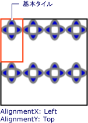
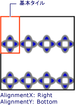

# 方法 : TileBrush の水平方向および垂直方向の配置を設定する
この例は、タイル内の内容の水平方向および垂直の配置を制御する方法を示します。 水平方向および垂直方向の配置を制御する、<xref:System.Windows.Media.TileBrush>を使用してその<xref:System.Windows.Media.TileBrush.AlignmentX%2A>と<xref:System.Windows.Media.TileBrush.AlignmentY%2A>プロパティです。  
  
 <xref:System.Windows.Media.TileBrush.AlignmentX%2A>と<xref:System.Windows.Media.TileBrush.AlignmentY%2A>のプロパティ、<xref:System.Windows.Media.TileBrush>使用は、次の条件のいずれかが true の場合。  
  
-   <xref:System.Windows.Media.TileBrush.Stretch%2A>プロパティは<xref:System.Windows.Media.Stretch.Uniform>または<xref:System.Windows.Media.Stretch.UniformToFill>と<xref:System.Windows.Media.TileBrush.Viewbox%2A>と<xref:System.Windows.Media.TileBrush.Viewport%2A>別の縦横比があります。  
  
-   <xref:System.Windows.Media.TileBrush.Stretch%2A>プロパティは<xref:System.Windows.Media.Stretch.None>と<xref:System.Windows.Media.TileBrush.Viewbox%2A>と<xref:System.Windows.Media.TileBrush.Viewport%2A>サイズが異なる。  
  
## 例  
 次の例の内容、<xref:System.Windows.Media.DrawingBrush>の型である<xref:System.Windows.Media.TileBrush>、そのタイルの左上隅にします。 例のセット、コンテンツに合わせて、<xref:System.Windows.Media.TileBrush.AlignmentX%2A>のプロパティ、<xref:System.Windows.Media.DrawingBrush>に<xref:System.Windows.Media.AlignmentX.Left>と<xref:System.Windows.Media.TileBrush.AlignmentY%2A>プロパティを<xref:System.Windows.Media.AlignmentY.Top>です。 この例を実行すると、次の出力が生成されます。  
  
   
内容が左上隅に配置された TileBrush  
  
 [!code-csharp[brushoverviewexamples_snip#TileBrushTopLeftAlignmentInline](../../../../samples/snippets/csharp/VS_Snippets_Wpf/BrushOverviewExamples_snip/CSharp/TileBrushAlignmentExample.cs#tilebrushtopleftalignmentinline)]
 [!code-vb[brushoverviewexamples_snip#TileBrushTopLeftAlignmentInline](../../../../samples/snippets/visualbasic/VS_Snippets_Wpf/BrushOverviewExamples_snip/visualbasic/tilebrushalignmentexample.vb#tilebrushtopleftalignmentinline)]
 [!code-xaml[brushoverviewexamples_snip#TileBrushTopLeftAlignmentInline](../../../../samples/snippets/xaml/VS_Snippets_Wpf/BrushOverviewExamples_snip/XAML/TileBrushAlignmentExample.xaml#tilebrushtopleftalignmentinline)]  
  
## 例  
 次の例の内容、<xref:System.Windows.Media.DrawingBrush>を設定して、タイルの右下隅に、<xref:System.Windows.Media.TileBrush.AlignmentX%2A>プロパティを<xref:System.Windows.Media.AlignmentX.Right>と<xref:System.Windows.Media.TileBrush.AlignmentY%2A>プロパティを<xref:System.Windows.Media.AlignmentY.Bottom>です。 この例では次の出力が生成されます。  
  
   
内容が右下隅に配置された TileBrush  
  
 [!code-csharp[brushoverviewexamples_snip#TileBrushBottomRightAlignmentInline](../../../../samples/snippets/csharp/VS_Snippets_Wpf/BrushOverviewExamples_snip/CSharp/TileBrushAlignmentExample.cs#tilebrushbottomrightalignmentinline)]
 [!code-vb[brushoverviewexamples_snip#TileBrushBottomRightAlignmentInline](../../../../samples/snippets/visualbasic/VS_Snippets_Wpf/BrushOverviewExamples_snip/visualbasic/tilebrushalignmentexample.vb#tilebrushbottomrightalignmentinline)]
 [!code-xaml[brushoverviewexamples_snip#TileBrushBottomRightAlignmentInline](../../../../samples/snippets/xaml/VS_Snippets_Wpf/BrushOverviewExamples_snip/XAML/TileBrushAlignmentExample.xaml#tilebrushbottomrightalignmentinline)]  
  
## 例  
 次の例の内容、<xref:System.Windows.Media.DrawingBrush>を設定して、タイルの左上隅に、<xref:System.Windows.Media.TileBrush.AlignmentX%2A>プロパティを<xref:System.Windows.Media.AlignmentX.Left>と<xref:System.Windows.Media.TileBrush.AlignmentY%2A>プロパティを<xref:System.Windows.Media.AlignmentY.Top>です。 また、設定、<xref:System.Windows.Media.TileBrush.Viewport%2A>と<xref:System.Windows.Media.TileBrush.TileMode%2A>の<xref:System.Windows.Media.DrawingBrush>タイル パターンを生成するためにします。 この例では次の出力が生成されます。  
  
   
基本タイルの左上に内容が配置されたタイル パターン  
  
 図では、内容がどのように配置されているかをわかりやすくするために、基本タイルが強調されています。 注意して、<xref:System.Windows.Media.TileBrush.AlignmentX%2A>設定には効果がないため、コンテンツの<xref:System.Windows.Media.DrawingBrush>基本タイルが水平方向に完全にいっぱいです。  
  
 [!code-csharp[brushoverviewexamples_snip#TileBrushTopLeftAlignmentTiledInline](../../../../samples/snippets/csharp/VS_Snippets_Wpf/BrushOverviewExamples_snip/CSharp/TileBrushAlignmentExample.cs#tilebrushtopleftalignmenttiledinline)]
 [!code-vb[brushoverviewexamples_snip#TileBrushTopLeftAlignmentTiledInline](../../../../samples/snippets/visualbasic/VS_Snippets_Wpf/BrushOverviewExamples_snip/visualbasic/tilebrushalignmentexample.vb#tilebrushtopleftalignmenttiledinline)]
 [!code-xaml[brushoverviewexamples_snip#TileBrushTopLeftAlignmentTiledInline](../../../../samples/snippets/xaml/VS_Snippets_Wpf/BrushOverviewExamples_snip/XAML/TileBrushAlignmentExample.xaml#tilebrushtopleftalignmenttiledinline)]  
  
## 例  
 最後の例は、タイルのコンテンツを揃えます<xref:System.Windows.Media.DrawingBrush>を設定して基本タイルの右下に、<xref:System.Windows.Media.TileBrush.AlignmentX%2A>プロパティを<xref:System.Windows.Media.AlignmentX.Right>と<xref:System.Windows.Media.TileBrush.AlignmentY%2A>プロパティを<xref:System.Windows.Media.AlignmentY.Bottom>です。 この例では次の出力が生成されます。  
  
   
基本タイルの右上に内容が配置されたタイル パターン  
  
 もう一度、<xref:System.Windows.Media.TileBrush.AlignmentX%2A>設定には効果がないため、コンテンツの<xref:System.Windows.Media.DrawingBrush>基本タイルが水平方向に完全にいっぱいです。  
  
 [!code-csharp[brushoverviewexamples_snip#TileBrushBottomRightAlignmentInline](../../../../samples/snippets/csharp/VS_Snippets_Wpf/BrushOverviewExamples_snip/CSharp/TileBrushAlignmentExample.cs#tilebrushbottomrightalignmentinline)]
 [!code-vb[brushoverviewexamples_snip#TileBrushBottomRightAlignmentInline](../../../../samples/snippets/visualbasic/VS_Snippets_Wpf/BrushOverviewExamples_snip/visualbasic/tilebrushalignmentexample.vb#tilebrushbottomrightalignmentinline)]
 [!code-xaml[brushoverviewexamples_snip#TileBrushBottomRightAlignmentInline](../../../../samples/snippets/xaml/VS_Snippets_Wpf/BrushOverviewExamples_snip/XAML/TileBrushAlignmentExample.xaml#tilebrushbottomrightalignmentinline)]  
  
 例を使用して<xref:System.Windows.Media.DrawingBrush>を示すためにオブジェクト方法、<xref:System.Windows.Media.TileBrush.AlignmentX%2A>と<xref:System.Windows.Media.TileBrush.AlignmentY%2A>プロパティが使用されます。 これらのプロパティがすべてのタイル ブラシの動作は同じです: <xref:System.Windows.Media.DrawingBrush>、 <xref:System.Windows.Media.ImageBrush>、および<xref:System.Windows.Media.VisualBrush>です。 タイル ブラシの詳細については、「[イメージ、描画、およびビジュアルによる塗りつぶし](../../../../docs/framework/wpf/graphics-multimedia/painting-with-images-drawings-and-visuals.md)」を参照してください。  
  
## 関連項目  
 <xref:System.Windows.Media.DrawingBrush>  
 <xref:System.Windows.Media.ImageBrush>  
 <xref:System.Windows.Media.VisualBrush>  
 [イメージ、描画、およびビジュアルによる塗りつぶし](../../../../docs/framework/wpf/graphics-multimedia/painting-with-images-drawings-and-visuals.md)
