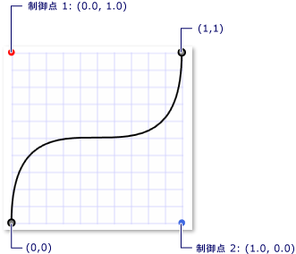
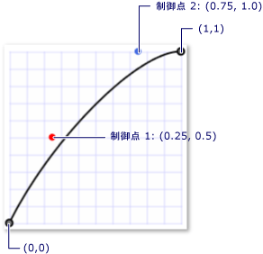

# キー フレーム アニメーションの概要Key-Frame Animations Overview
このトピックでは、キー フレーム アニメーションの概要を説明します。This topic introduces you to key-frame animations. キー フレーム アニメーションでは、3 つ以上のターゲット値を使用してアニメーション化することができ、アニメーションの補間方式を制御できます。Key-frame animations enable you to animate using more than two target values, and control an animation's interpolation method.  
  
   
## 必須コンポーネントPrerequisites  
 この概要を理解するのには、[!INCLUDE[TLA#tla_winclient](../../../../includes/tlasharptla-winclient-md.md)] アニメーションとタイムラインを理解しておく必要があります。To understand this overview, you should be familiar with [!INCLUDE[TLA#tla_winclient](../../../../includes/tlasharptla-winclient-md.md)] animations and timelines. アニメーションの概要については、「[アニメーションの概要](../../../../docs/framework/wpf/graphics-multimedia/animation-overview.md)」を参照してください。For an introduction to animations, see the [Animation Overview](../../../../docs/framework/wpf/graphics-multimedia/animation-overview.md). さらに、From/To/By アニメーションについて理解しておくと役に立ちます。It also helps to be familiar with From/To/By animations. 詳細については、「From/To/By アニメーションの概要」を参照してください。For more information, see the From/To/By Animations Overview.  
  
   
## キー フレーム アニメーションとはWhat is a Key-Frame Animation?  
 From/To/By アニメーションと同じように、キー フレーム アニメーションも、ターゲット プロパティの値をアニメーション化します。Like a From/To/By animation, a key-frame animation animates the value of a target property. 上でターゲット値間の遷移が作成、<xref:System.Windows.Media.Animation.Timeline.Duration%2A>です。It creates a transition among its target values over its <xref:System.Windows.Media.Animation.Timeline.Duration%2A>. ただし、From/To/By アニメーションは 2 つの値の間の遷移を作成しますが、キー フレーム アニメーションは、任意の数のターゲット値の間の遷移を作成できます。However, while a From/To/By animation creates a transition between two values, a single key-frame animation can create transitions among any number of target values. From/To/By アニメーションとは異なり、キー フレーム アニメーションには、ターゲット値を設定する From、To、または By プロパティはありません。Unlike a From/To/By animation, a key frame animation has no From, To, or By properties with which to set its target values. キー フレーム アニメーションのターゲット値は、キー フレーム オブジェクトを使用して記述されます (このため、"キー フレーム アニメーション" という用語が使用されます)。A key-frame animation's target values are described using key frames objects (hence the term, "key-frame animation"). アニメーションのターゲット値を指定するキー フレームのオブジェクトを作成およびアニメーションに追加<xref:System.Windows.Media.Animation.DoubleAnimationUsingKeyFrames.KeyFrames%2A>コレクション。To specify the animation's target values, you create key frame objects and add them to the animation's <xref:System.Windows.Media.Animation.DoubleAnimationUsingKeyFrames.KeyFrames%2A> collection. アニメーションを実行すると、アニメーションが指定したフレームの間で遷移します。When the animation runs, it transitions between the frames you specified.  
  
 複数のターゲット値のサポートに加え、一部のキー フレーム メソッドでは、複数の補間方式もサポートします。In addition to supporting multiple target values, some key-frame methods even support multiple interpolation methods. アニメーションの補間方式は、1 つの値から次の値にどのように遷移するかを定義します。An animation's interpolation method defines how it transitions from one value to the next. 補間には、離散、線形、およびスプラインの 3 つの種類があります。There are three types of interpolations: discrete, linear, and splined.  
  
 キー フレーム アニメーションをアニメーション化するには、次の手順を完了します。To animate with a key-frame animation, you complete the following steps.  
  
-   アニメーションを宣言し、指定の<xref:System.Windows.Media.Animation.Timeline.Duration%2A>によって/アニメーションの場合と同様、します。Declare the animation and specify its <xref:System.Windows.Media.Animation.Timeline.Duration%2A>, just like you would for a from/to/by animation.  
  
-   各ターゲット値の適切な型のキー フレームの作成、その値を設定し、 <xref:System.Windows.Media.Animation.KeyTime>、アニメーションの追加と<xref:System.Windows.Media.Animation.DoubleAnimationUsingKeyFrames.KeyFrames%2A>コレクション。For each target value, create a key frame of the appropriate type, set its value and <xref:System.Windows.Media.Animation.KeyTime>, and add it to the animation's <xref:System.Windows.Media.Animation.DoubleAnimationUsingKeyFrames.KeyFrames%2A> collection.  
  
-   From/To/By アニメーションと同じように、アニメーションをプロパティに関連付けます。Associate the animation with a property, just like you would with a From/To/By animation. ストーリーボードを使用したアニメーションのプロパティへの適用の詳細については、「[ストーリー ボードの概要](../../../../docs/framework/wpf/graphics-multimedia/storyboards-overview.md)」を参照してください。For more information about applying an animation to a property using a storyboard, see [Storyboards Overview](../../../../docs/framework/wpf/graphics-multimedia/storyboards-overview.md).  
  
 次の例では、<xref:System.Windows.Media.Animation.DoubleAnimationUsingKeyFrames>アニメーション化する、 <xref:System.Windows.Shapes.Rectangle> 4 つの異なる場所に要素。The following example uses a <xref:System.Windows.Media.Animation.DoubleAnimationUsingKeyFrames> to animate a <xref:System.Windows.Shapes.Rectangle> element to four different locations.  
  
 [!code-xaml[keyframes_ovw_snippet#BasicKeyFrameExampleWholePage](../../../../samples/snippets/csharp/VS_Snippets_Wpf/keyframes_ovw_snippet/CS/KeyFramesIntroduction.xaml#basickeyframeexamplewholepage)]  
  
 などの From/を/、アニメーション、キー フレーム アニメーションに使用できるプロパティを使用して、<xref:System.Windows.Media.Animation.Storyboard>マークアップおよびコードでまたはを使用して、<xref:System.Windows.Media.Animation.Animatable.BeginAnimation%2A>コード内のメソッドです。Like a From/To/By animation, a key-frame animation can be applied to a property by using a <xref:System.Windows.Media.Animation.Storyboard> in markup and code or by using the <xref:System.Windows.Media.Animation.Animatable.BeginAnimation%2A> method in code. 作成するキー フレーム アニメーションを使用することも、<xref:System.Windows.Media.Animation.AnimationClock>し、1 つまたは複数のプロパティに適用します。You may also use a key-frame animation to create an <xref:System.Windows.Media.Animation.AnimationClock> and apply it to one or more properties. アニメーションを適用するためのさまざまなメソッドの詳細については、「[プロパティ アニメーションの手法の概要](../../../../docs/framework/wpf/graphics-multimedia/property-animation-techniques-overview.md)」を参照してください。For more information about the different methods for applying animations, see the [Property Animation Techniques Overview](../../../../docs/framework/wpf/graphics-multimedia/property-animation-techniques-overview.md).  
  
   
## キー フレーム アニメーションの種類Key-Frame Animation Types  
 アニメーションはプロパティ値を生成するため、プロパティの型ごとに異なるアニメーションの種類があります。Because animations generate property values, there are different animation types for different property types. 受け取るプロパティをアニメーション化する、 <xref:System.Double> (要素のなど<xref:System.Windows.FrameworkElement.Width%2A>プロパティ) を生成するアニメーションを使用する<xref:System.Double>値。To animate a property that takes a <xref:System.Double> (such as an element's <xref:System.Windows.FrameworkElement.Width%2A> property), you use an animation that produces <xref:System.Double> values. 受け取るプロパティをアニメーション化する、 <xref:System.Windows.Point>、生成されるアニメーションを使用する<xref:System.Windows.Point>値、およびなどです。To animate a property that takes a <xref:System.Windows.Point>, you use an animation that produces <xref:System.Windows.Point> values, and so on.  
  
 属しているキー フレーム アニメーション クラス、<xref:System.Windows.Media.Animation>名前空間され、次の命名規則に従います。The key-frame animation classes belong to the <xref:System.Windows.Media.Animation> namespace and adhere to the following naming convention:  
  
 *\<Type>* `AnimationUsingKeyFrames`*\<Type>* `AnimationUsingKeyFrames`  
  
 ここで、*\<Type>*は、クラスがアニメーション化する値の型です。Where *\<Type>* is the type of value that the class animates.  
  
 [!INCLUDE[TLA2#tla_winclient](../../../../includes/tla2sharptla-winclient-md.md)] は、次のキー フレーム アニメーション クラスを提供します。 provides the following key-frame animation classes.  
  
|プロパティの型Property type|対応するFrom/To/By アニメーションのクラスCorresponding from/to/by animation class|サポートされる補間方式Interpolation methods supported|  
|-------------------|------------------------------------------------|-------------------------------------|  
|<xref:System.Boolean>|<xref:System.Windows.Media.Animation.BooleanAnimationUsingKeyFrames>|離散Discrete|  
|<xref:System.Byte>|<xref:System.Windows.Media.Animation.ByteAnimationUsingKeyFrames>|離散、線形、スプラインDiscrete, Linear, Splined|  
|<xref:System.Windows.Media.Color>|<xref:System.Windows.Media.Animation.ColorAnimationUsingKeyFrames>|離散、線形、スプラインDiscrete, Linear, Splined|  
|<xref:System.Decimal>|<xref:System.Windows.Media.Animation.DecimalAnimationUsingKeyFrames>|離散、線形、スプラインDiscrete, Linear, Splined|  
|<xref:System.Double>|<xref:System.Windows.Media.Animation.DoubleAnimationUsingKeyFrames>|離散、線形、スプラインDiscrete, Linear, Splined|  
|<xref:System.Int16>|<xref:System.Windows.Media.Animation.Int16AnimationUsingKeyFrames>|離散、線形、スプラインDiscrete, Linear, Splined|  
|<xref:System.Int32>|<xref:System.Windows.Media.Animation.Int32AnimationUsingKeyFrames>|離散、線形、スプラインDiscrete, Linear, Splined|  
|<xref:System.Int64>|<xref:System.Windows.Media.Animation.Int64AnimationUsingKeyFrames>|離散、線形、スプラインDiscrete, Linear, Splined|  
|<xref:System.Windows.Media.Matrix>|<xref:System.Windows.Media.Animation.MatrixAnimationUsingKeyFrames>|離散Discrete|  
|<xref:System.Object>|<xref:System.Windows.Media.Animation.ObjectAnimationUsingKeyFrames>|離散Discrete|  
|<xref:System.Windows.Point>|<xref:System.Windows.Media.Animation.PointAnimationUsingKeyFrames>|離散、線形、スプラインDiscrete, Linear, Splined|  
|<xref:System.Windows.Media.Media3D.Quaternion>|<xref:System.Windows.Media.Animation.QuaternionAnimationUsingKeyFrames>|離散、線形、スプラインDiscrete, Linear, Splined|  
|<xref:System.Windows.Rect>|<xref:System.Windows.Media.Animation.RectAnimationUsingKeyFrames>|離散、線形、スプラインDiscrete, Linear, Splined|  
|<xref:System.Windows.Media.Media3D.Rotation3D>|<xref:System.Windows.Media.Animation.Rotation3DAnimationUsingKeyFrames>|離散、線形、スプラインDiscrete, Linear, Splined|  
|<xref:System.Single>|<xref:System.Windows.Media.Animation.SingleAnimationUsingKeyFrames>|離散、線形、スプラインDiscrete, Linear, Splined|  
|<xref:System.String>|<xref:System.Windows.Media.Animation.StringAnimationUsingKeyFrames>|離散Discrete|  
|<xref:System.Windows.Size>|<xref:System.Windows.Media.Animation.SizeAnimationUsingKeyFrames>|離散、線形、スプラインDiscrete, Linear, Splined|  
|<xref:System.Windows.Thickness>|<xref:System.Windows.Media.Animation.ThicknessAnimationUsingKeyFrames>|離散、線形、スプラインDiscrete, Linear, Splined|  
|<xref:System.Windows.Media.Media3D.Vector3D>|<xref:System.Windows.Media.Animation.Vector3DAnimationUsingKeyFrames>|離散、線形、スプラインDiscrete, Linear, Splined|  
|<xref:System.Windows.Vector>|<xref:System.Windows.Media.Animation.VectorAnimationUsingKeyFrames>|離散、線形、スプラインDiscrete, Linear, Splined|  
  
   
## ターゲット値 (キー フレーム) とキー時刻Target Values (key frames) and Key Times  
 さまざまな種類のプロパティをアニメーション化するための多様な種類のキー フレーム アニメーションがあるように、さまざまな種類のキー フレーム オブジェクトがあります (アニメーション化される値の型とサポートされる補間方式ごとに 1 種類のオブジェクト)。Just as there are different types of key-frame animations for animating different property types, there are also different types of key frame objects: one for each type of value animated and interpolation method supported. キー フレームの種類は、次の名前付け規則に従います。Key frame types adhere to the following naming convention:  
  
 *\<InterpolationMethod>\<Type>* `KeyFrame`*\<InterpolationMethod>\<Type>* `KeyFrame`  
  
 ここで、*\<InterpolationMethod>*は、キー フレームで使用される補間方式であり、*\<Type>*は、クラスがアニメーション化する値の型です。Where *\<InterpolationMethod>* is the interpolation method the key frame uses and *\<Type>* is the type of value that the class animates. 3 つの補間方式のすべてをサポートするキー フレーム アニメーションでは、3 種類のキー フレームを使用できます。A key-frame animation that supports all three interpolation methods will have three key frame types that you can use. 次の 3 つのキー フレームの種類を使用するなど、 <xref:System.Windows.Media.Animation.DoubleAnimationUsingKeyFrames>: <xref:System.Windows.Media.Animation.DiscreteDoubleKeyFrame>、 <xref:System.Windows.Media.Animation.LinearDoubleKeyFrame>、および<xref:System.Windows.Media.Animation.SplineDoubleKeyFrame>です。For example, you can use three key frame types with a <xref:System.Windows.Media.Animation.DoubleAnimationUsingKeyFrames>: <xref:System.Windows.Media.Animation.DiscreteDoubleKeyFrame>, <xref:System.Windows.Media.Animation.LinearDoubleKeyFrame>, and <xref:System.Windows.Media.Animation.SplineDoubleKeyFrame>. (補間方式については、後のセクションで詳しく説明します)。(Interpolation methods are described in detail in a later section.)  
  
 キー フレームの主な目的を指定する、<xref:System.Windows.Media.Animation.IKeyFrame.KeyTime%2A>と<xref:System.Windows.Media.Animation.IKeyFrame.Value%2A>です。The primary purpose of a key frame is to specify a <xref:System.Windows.Media.Animation.IKeyFrame.KeyTime%2A> and a <xref:System.Windows.Media.Animation.IKeyFrame.Value%2A>. すべての種類のキー フレームには、次の 2 つのプロパティがあります。Every key frame type provides these two properties.  
  
-   <xref:System.Windows.Media.Animation.IKeyFrame.Value%2A>プロパティは、そのキー フレームのターゲット値を指定します。The <xref:System.Windows.Media.Animation.IKeyFrame.Value%2A> property specifies the target value for that key-frame.  
  
-   <xref:System.Windows.Media.Animation.IKeyFrame.KeyTime%2A>プロパティでは、タイミングを指定します (アニメーションの内<xref:System.Windows.Media.Animation.Timeline.Duration%2A>) キー フレームの<xref:System.Windows.Media.Animation.IKeyFrame.Value%2A>に到達します。The <xref:System.Windows.Media.Animation.IKeyFrame.KeyTime%2A> property specifies when (within the animation's <xref:System.Windows.Media.Animation.Timeline.Duration%2A>) a key frame's <xref:System.Windows.Media.Animation.IKeyFrame.Value%2A> is reached.  
  
 キー フレーム アニメーションの開始時に、そのキー フレームによって定義された順序でを反復処理、<xref:System.Windows.Media.Animation.IKeyFrame.KeyTime%2A>プロパティです。When a key frame animation begins, iterates through its key frames in the order defined by their <xref:System.Windows.Media.Animation.IKeyFrame.KeyTime%2A> properties.  
  
-   アニメーションがターゲット プロパティの現在の値の間の遷移を作成時に 0 にキー フレームがない場合、<xref:System.Windows.Media.Animation.IKeyFrame.Value%2A>最初のキー フレームです。 それ以外の場合、アニメーションの出力の最初のキー フレームの値の値になります。If there is no key frame at time 0, the animation creates a transition between the target property's current value and the <xref:System.Windows.Media.Animation.IKeyFrame.Value%2A> of the first key frame; otherwise, the animation's output value becomes the value of the first key frame.  
  
-   アニメーションの間の遷移を作成する、<xref:System.Windows.Media.Animation.IKeyFrame.Value%2A>最初と 2 番目キー フレームの 2 つ目のキー フレームによって指定された補間メソッドを使用します。The animation creates a transition between the <xref:System.Windows.Media.Animation.IKeyFrame.Value%2A> of the first and second key frames using the interpolation method specified by the second key frame. 最初のキー フレームの始まり、遷移<xref:System.Windows.Media.Animation.IKeyFrame.KeyTime%2A>とが終了 2 番目のキー フレームの<xref:System.Windows.Media.Animation.IKeyFrame.KeyTime%2A>に到達します。The transition starts at the first key frame's <xref:System.Windows.Media.Animation.IKeyFrame.KeyTime%2A> and ends when the second key frame's <xref:System.Windows.Media.Animation.IKeyFrame.KeyTime%2A> is reached.  
  
-   アニメーションは、前後のキー フレームの間の遷移を作成しながら続行されます。The animation continues, creating transitions between each subsequent key frame and its preceding key frame.  
  
-   最後で最大のキー時刻キー フレームの値をアニメーション遷移は同じか、またはアニメーションのより小さい<xref:System.Windows.Media.Animation.Timeline.Duration%2A>です。Finally, the animation transitions to the value of the key frame with the greatest key time that is equal to or smaller than the animation's <xref:System.Windows.Media.Animation.Timeline.Duration%2A>.  
  
 場合、アニメーションの<xref:System.Windows.Media.Animation.Timeline.Duration%2A>は<xref:System.Windows.Duration.Automatic%2A>またはその<xref:System.Windows.Media.Animation.Timeline.Duration%2A>が最後のキー フレーム アニメーションの終了の時刻と等しい。If the animation's <xref:System.Windows.Media.Animation.Timeline.Duration%2A> is <xref:System.Windows.Duration.Automatic%2A> or its <xref:System.Windows.Media.Animation.Timeline.Duration%2A> is equal to the time of the last key frame, the animation ends. それ以外の場合、アニメーションの<xref:System.Windows.Duration>が最後のキー フレーム アニメーション保留リストの末尾に到達するまで、キー フレーム値のキー時刻よりも大きい、<xref:System.Windows.Duration>です。Otherwise, if the animation's <xref:System.Windows.Duration> is greater than the key time of the last key frame, the animation holds the key frame value until it reaches the end of its <xref:System.Windows.Duration>. すべてのアニメーションと同様に、キー フレーム アニメーションで使用されるその<xref:System.Windows.Media.Animation.Timeline.FillBehavior%2A>かどうかが最終的な値保持のアクティブな期間の終了になったときに決定するプロパティです。Like all animations, a key-frame animation uses its <xref:System.Windows.Media.Animation.Timeline.FillBehavior%2A> property to determine whether it holds it final value when it reaches the end of its active period. 詳細については、「[タイミング動作の概要](../../../../docs/framework/wpf/graphics-multimedia/timing-behaviors-overview.md)」を参照してください。For more information, see the [Timing Behaviors Overview](../../../../docs/framework/wpf/graphics-multimedia/timing-behaviors-overview.md).  
  
 次の例では、<xref:System.Windows.Media.Animation.DoubleAnimationUsingKeyFrames>オブジェクトを示すために前の例で定義されている方法、<xref:System.Windows.Media.Animation.IKeyFrame.Value%2A>と<xref:System.Windows.Media.Animation.IKeyFrame.KeyTime%2A>プロパティ作業します。The following example uses the <xref:System.Windows.Media.Animation.DoubleAnimationUsingKeyFrames> object defined in the preceding example to demonstrate how the <xref:System.Windows.Media.Animation.IKeyFrame.Value%2A> and <xref:System.Windows.Media.Animation.IKeyFrame.KeyTime%2A> properties work.  
  
-   最初のキー フレームは、アニメーションの出力値をただちに 0 に設定します。The first key frame immediately sets the animation's output value to 0.  
  
-   2 番目のキー フレームは、0 から 350 までアニメーション化されます。The second key frame animates from 0 to 350. 最初のキー フレームが終わった時点で開始され (時刻 = 0 秒)、2 秒間再生され、時刻 = 0:0:2 で終わります。It starts after the first key frame ends (at time = 0 seconds) and plays for 2 seconds, ending at time = 0:0:2.  
  
-   3 番目のキー フレームは、350 から 50 までアニメーション化されます。The third key frame animates from 350 to 50. 2 番目のキー フレームが終わった時点で開始され (時刻 = 2 秒)、5 秒間再生され、時刻 = 0:0:7 で終わります。It starts when the second key frame ends (at time = 2 seconds) and plays for 5 seconds, ending at time = 0:0:7.  
  
-   4 番目のキー フレームは、50 から 200 までアニメーション化されます。The fourth key frame animates from 50 to 200. 3 番目のキー フレームが終わった時点で開始され (時刻 = 7 秒)、1 秒間再生され、時刻 = 0:0:8 で終わります。It starts when the third key frame ends (at time = 7 seconds) and plays for 1 second, ending at time = 0:0:8.  
  
-   <xref:System.Windows.Media.Animation.Timeline.Duration%2A>アニメーションのプロパティは、10 秒に設定された、アニメーションの終了前に 2 つの秒の最終的な値を保持する時間 = 0:0:10。Because the <xref:System.Windows.Media.Animation.Timeline.Duration%2A> property of the animation was set to 10 seconds, the animation holds its final value for two seconds before ending at time = 0:0:10.  
  
 [!code-xaml[keyframes_ovw_snippet#BasicKeyFrameExampleWholePage](../../../../samples/snippets/csharp/VS_Snippets_Wpf/keyframes_ovw_snippet/CS/KeyFramesIntroduction.xaml#basickeyframeexamplewholepage)]  
  
   
## 補間方式Interpolation Methods  
 前のセクションで、一部のキー フレーム アニメーションでは複数の補間方式がサポートされることに言及しました。The preceding sections mentioned that some key-frame animations support multiple interpolation methods. アニメーションの補間は、その継続時間中にアニメーションがどのように遷移するかを表します。An animation's interpolation describes how an animation transitions between values over its duration. アニメーションで使用するキー フレームの種類を選択することで、そのキー フレーム セグメントの補間方式を定義できます。By selecting which key frame type you use with your animation, you can define the interpolation method for that key frame segment. 補間方式には、線形、離散、およびスプラインの 3 つの種類があります。There are three different types of interpolation methods: linear, discrete, and splined.  
  
### 線形補間Linear Interpolation  
 線形補間では、アニメーションは、セグメントの継続期間中、一定の率で進行します。With linear interpolation, the animation progresses at a constant rate of the segment duration. たとえば、キー フレーム セグメントが 5 秒間で 0 から 10 に遷移する場合、アニメーションは、指定された時間に次の値を出力します。For example, if a key frame segment transitions from 0 to 10 over a duration of 5 seconds, the animation will output the following values at the specified times:  
  
|時刻Time|出力値Output value|  
|----------|------------------|  
|00|00|  
|11|22|  
|22|44|  
|33|66|  
|44|88|  
|4.254.25|8.58.5|  
|4.54.5|99|  
|55|1010|  
  
### 離散補間Discrete Interpolation  
 離散補間では、アニメーション関数は、1 つの値から次の値に補間なしでジャンプします。With discrete interpolation, the animation function jumps from one value to the next without interpolation. キー フレーム セグメントが 5 秒間で 0 から 10 に遷移する場合、アニメーションは、指定された時間で次の値を出力します。If a key frame segment transitions from 0 to 10 over a duration of 5 seconds, the animation will output the following values at the specified times:  
  
|時間Time|出力値Output value|  
|----------|------------------|  
|00|00|  
|11|00|  
|22|00|  
|33|00|  
|44|00|  
|4.254.25|00|  
|4.54.5|00|  
|55|1010|  
  
 アニメーションの出力値は、セグメント期間の最後の最後に達するまで変化しないことに注意してください。Notice how the animation does not change its output value until the very end of the segment duration.  
  
 スプライン補間はさらに複雑です。Splined interpolation is more complex. 次のセクションで説明します。It is described in the next section.  
  
   
### スプライン補間Splined Interpolation  
 スプライン補間を使用して、リアルなタイミング効果を実現できます。Splined interpolation can be used to achieve more realistic timing effects. アニメーションは現実世界で起こる効果を模倣するために使用されることが多いため、開発者は、オブジェクトの加速と減速を細かく制御し、タイミング セグメントを緻密に操作することが必要になる場合があります。Because animations are so often used to imitate effects that occur in the real world, developers might need fine control of the acceleration and deceleration of objects, and close manipulation of timing segments. スプライン キーフレームでは、スプライン補間を使用してアニメーション化できます。Spline key frames enable you to animate with splined interpolation. 指定した他のキー フレーム、<xref:System.Windows.Media.Animation.IKeyFrame.Value%2A>と<xref:System.Windows.Media.Animation.IKeyFrame.KeyTime%2A>です。With other key frames, you specify a <xref:System.Windows.Media.Animation.IKeyFrame.Value%2A> and <xref:System.Windows.Media.Animation.IKeyFrame.KeyTime%2A>. スプライン キー フレームの場合と指定することも、<xref:System.Windows.Media.Animation.SplineDoubleKeyFrame.KeySpline%2A>です。With a spline key frame, you also specify a <xref:System.Windows.Media.Animation.SplineDoubleKeyFrame.KeySpline%2A>. 次の例では、1 つスプライン キー フレームの<xref:System.Windows.Media.Animation.DoubleAnimationUsingKeyFrames>です。The following example shows a single spline key frame for a <xref:System.Windows.Media.Animation.DoubleAnimationUsingKeyFrames>. 通知、 <xref:System.Windows.Media.Animation.KeySpline> ; プロパティは、どのスプライン キー フレームのキー フレームの他の種類と異なるです。Notice the <xref:System.Windows.Media.Animation.KeySpline> property; that's what makes a spline key frame different from the other types of key frames.  
  
 [!code-xaml[keyframes_ovw_snippet#SingleSplineKeyFrameExample](../../../../samples/snippets/csharp/VS_Snippets_Wpf/keyframes_ovw_snippet/CS/InterpolationMethodsExample.xaml#singlesplinekeyframeexample)]  
  
 3 次ベジエ曲線は、開始点、終点、および 2 つの制御点によって定義されます。A cubic Bezier curve is defined by a start point, an end point, and two control points. <xref:System.Windows.Media.Animation.KeySpline>スプライン キー フレームのプロパティが (0, 0) から (1, 1) までのベジエ曲線の 2 つの制御点を定義します。The <xref:System.Windows.Media.Animation.KeySpline> property of a spline key frame defines the two control point of a Bezier curve that extends from (0,0) to (1,1). 最初の制御点は、ベジエ曲線の前半分の曲率を制御し、2 つ目の制御点は、後半分の曲率を制御します。The first control point controls the curve factor of the first half of the Bezier curve, and the second control point controls the curve factor of the second half of the Bezier segment. 結果として得られる曲線は、そのスプライン キー フレームの変化率を表します。The resulting curve describes the rate of change for that spline key frame. 曲線が急であればあるほど、キー フレームの値は急激に変化します。The steeper the curve, the faster the key frame changes its values. 曲線が平坦になると、キー フレームの値は緩やかに変化します。As the curve gets flatter, the key frame changes its values more slowly.  
  
 使用する場合があります<xref:System.Windows.Media.Animation.KeySpline>をウォーター フォール、ボールなどの物理的な軌道をシミュレートするか、他の「で容易になります」および「が容易になります」効果モーション アニメーションを適用します。You might use <xref:System.Windows.Media.Animation.KeySpline> to simulate physical trajectories like falling water or bouncing balls, or apply other "ease in" and "ease out" effects to motion animations. 背景のフェードやコントロール ボタンの復帰などのユーザー操作効果では、スプライン補間を適用して、アニメーションの変化率を特定の方法で加速したり減速したりできます。For user interaction effects like background fades or control button rebound, you might apply splined interpolation to speed up or slow down the rate of change for an animation in a specific way.  
  
 次の例を指定します、 <xref:System.Windows.Media.Animation.KeySpline> 0, 1 1, 0、次のベジエ曲線を作成するのです。The following example specifies a <xref:System.Windows.Media.Animation.KeySpline> of 0,1 1,0, which creates the following Bezier curve.  
  
   
制御点が (0.0, 1.0) および (1.0, 0.0) のキー スプラインA key spline with control points (0.0, 1.0) and (1.0, 0.0)  
  
 [!code-xaml[keyframes_ovw_snippet#SingleSplineKeyFrameExample](../../../../samples/snippets/csharp/VS_Snippets_Wpf/keyframes_ovw_snippet/CS/InterpolationMethodsExample.xaml#singlesplinekeyframeexample)]  
  
 このキー フレームは、開始されると速いスピードでアニメーション化され、その後スピードが低下し、終了前に再びスピードが上がります。This key frame animates rapidly when it begins, slows down, and then speeds up again before it ends.  
  
 次の例を指定します、<xref:System.Windows.Media.Animation.KeySpline>の 0.5,0.25 0.75,1.0 は、次のベジエ曲線を作成します。The following example specifies a <xref:System.Windows.Media.Animation.KeySpline> of 0.5,0.25 0.75,1.0, which creates the following Bezier curve.  
  
   
制御点が (0.25, 0.5) および (0.75, 1.0) のキー スプラインA key spline with control points (0.25, 0.5) and (0.75, 1.0)  
  
 [!code-xaml[keyframes_ovw_snippet#SingleSplineKeyFrameExampleInline3](../../../../samples/snippets/csharp/VS_Snippets_Wpf/keyframes_ovw_snippet/CS/InterpolationMethodsExample.xaml#singlesplinekeyframeexampleinline3)]  
  
 ベジエ曲線の曲率がほとんど変化しないため、このキー フレームは、ほぼ一定の率でアニメーション化され、最後の最後にわずかに減速します。Because the curvature of the Bezier curve changes very little, this key frame animates at an almost constant rate; it slows down somewhat toward its very end.  
  
 次の例では、<xref:System.Windows.Media.Animation.DoubleAnimationUsingKeyFrames>四角形の位置をアニメーション化します。The following example uses a <xref:System.Windows.Media.Animation.DoubleAnimationUsingKeyFrames> to animate the position of rectangle. <xref:System.Windows.Media.Animation.DoubleAnimationUsingKeyFrames>使用<xref:System.Windows.Media.Animation.SplineDoubleKeyFrame>オブジェクトをそれぞれのキー フレーム値の間の遷移がスプライン補間を使用します。Because the <xref:System.Windows.Media.Animation.DoubleAnimationUsingKeyFrames> uses <xref:System.Windows.Media.Animation.SplineDoubleKeyFrame> objects, the transition between each key frame value uses splined interpolation.  
  
 [!code-xaml[keyframes_ovw_snippet#SplinedInterpolationExample](../../../../samples/snippets/csharp/VS_Snippets_Wpf/keyframes_ovw_snippet/CS/InterpolationMethodsExample.xaml#splinedinterpolationexample)]  
  
 スプライン補間は理解するのが難しいことがあります。さまざまな設定で実験すると理解しやすくなります。Splined interpolation can be difficult to understand; experimenting with different settings can help. [キー スプライン アニメーションのサンプル](http://go.microsoft.com/fwlink/?LinkID=160011)を使用して、キー スプライン値を変更し、その結果をアニメーションで確認することができます。The [Key Spline Animation Sample](http://go.microsoft.com/fwlink/?LinkID=160011) enables you to change key spline values and see the result it has on an animation.  
  
   
### 補間方式の組み合わせCombining Interpolation Methods  
 補間の種類が異なるキー フレームを 1 つのキー フレーム アニメーションで使用できます。You can use key frames with different interpolation types in a single key frame animation. 補間の種類が異なる 2 つのキー フレーム アニメーションが連続する場合は、2 番目のキー フレームの補間方式を使用して、最初の値から 2 番目の値への遷移が作成されます。When two key frame animations with different interpolations follow each other, the interpolation method of the second key frame is used to create the transition from the first value to the second.  
  
 次の例で、<xref:System.Windows.Media.Animation.DoubleAnimationUsingKeyFrames>を使用して線形、スプライン、および離散補間を作成します。In the following example, a <xref:System.Windows.Media.Animation.DoubleAnimationUsingKeyFrames> is created that uses linear, splined, and discrete interpolation.  
  
 [!code-xaml[keyframes_ovw_snippet#ComboInterpolationExample](../../../../samples/snippets/csharp/VS_Snippets_Wpf/keyframes_ovw_snippet/CS/InterpolationMethodsExample.xaml#combointerpolationexample)]  
  
   
## 継続時間とキー時刻の詳細More about Duration and Key Times  
 キー フレーム アニメーションにあるその他のアニメーションと同様に、<xref:System.Windows.Duration>プロパティです。Like other animations, key-frame animations have a <xref:System.Windows.Duration> property. アニメーションを指定するだけでなく<xref:System.Windows.Duration>、各キー フレームにその期間のどの部分が指定されたを指定する必要があります。In addition to specifying the animation's <xref:System.Windows.Duration>, you need to specify what portion of that duration is given to each key frame. 記述することで、これを行う、<xref:System.Windows.Media.Animation.IKeyFrame.KeyTime%2A>アニメーションのキー フレームの各します。You do so by describing a   <xref:System.Windows.Media.Animation.IKeyFrame.KeyTime%2A> for each of the animation's key frames. 各キー フレームの<xref:System.Windows.Media.Animation.IKeyFrame.KeyTime%2A>そのキー フレームの終了を指定します。Each key frame's <xref:System.Windows.Media.Animation.IKeyFrame.KeyTime%2A> specifies when that key frame ends.  
  
 <xref:System.Windows.Media.Animation.IKeyFrame.KeyTime%2A>プロパティがキーの時間の再生時間を指定していません。The <xref:System.Windows.Media.Animation.IKeyFrame.KeyTime%2A> property does not specify how long the key time plays. キー フレームが再生される時間の長さは、そのキー フレームの終了時刻、前のキー フレームの終了時刻、およびアニメーションの継続時間によって決まります。The amount of time a key frame plays is determined by when the key frame ends, when the previous key frame ended, and the animation's duration. 時間の値、パーセンテージ、または特殊な値として、キー時刻を指定することがあります<xref:System.Windows.Media.Animation.KeyTime.Uniform%2A>または<xref:System.Windows.Media.Animation.KeyTime.Paced%2A>です。Key times may be specified as a time value, a percentage, or as the special values <xref:System.Windows.Media.Animation.KeyTime.Uniform%2A> or <xref:System.Windows.Media.Animation.KeyTime.Paced%2A>.  
  
 次の一覧で、キー時刻を指定するさまざまな方法について説明します。The following list describes the different ways of specifying key times.  
  
### TimeSpan 値TimeSpan Values  
 使用することは<xref:System.TimeSpan>に指定する値、<xref:System.Windows.Media.Animation.KeyTime>です。You may use <xref:System.TimeSpan> values to specify a <xref:System.Windows.Media.Animation.KeyTime>. 値は、0 以上、アニメーションの継続時間以下にする必要があります。The value should be greater than or equal to 0 and less than or equal to the animation's duration. 次の例は、継続時間が 10 秒で、キー時刻が時刻値として指定されている 4 つのキー フレームがあるアニメーションを示しています。The following example shows an animation with a duration of 10 seconds and four key frames whose key times are specified as time values.  
  
-   最初のキー フレームは、最初の 3 秒間で基準値から 100 までアニメーション化され、時刻 = 0:0:03 で終わります。The first key frame animates from the base value to 100 over the first 3 seconds, ending at time = 0:0:03.  
  
-   2 番目のキー フレームは、100 から 200 までアニメーション化されます。The second key frame animates from 100 to 200. 最初のキー フレームが終わった時点で開始され (時刻 = 3 秒)、5 秒間再生され、時刻 = 0:0:8 で終わります。It starts after the first key frame ends (at time = 3 seconds) and plays for 5 seconds, ending at time = 0:0:8.  
  
-   3 番目のキー フレームは、200 から 500 までアニメーション化されます。The third key frame animates from 200 to 500. 2 番目のキー フレームが終わった時点で開始され (時刻 = 8 秒)、1 秒間再生され、時刻 = 0:0:9 で終わります。It starts when the second key frame ends (at time = 8 seconds) and plays for 1 second, ending at time = 0:0:9.  
  
-   4 番目のキー フレームは、500 から 600 までアニメーション化されます。The fourth key frame animates from 500 to 600. 3 番目のキー フレームが終わった時点で開始され (時刻 = 9 秒)、1 秒間再生され、時刻 = 0:0:10 で終わります。It starts when the third key frame ends (at time = 9 seconds) and plays for 1 second, ending at time = 0:0:10.  
  
 [!code-xaml[keyframes_ovw_snippet#TimeSpanKeyTimeExample](../../../../samples/snippets/csharp/VS_Snippets_Wpf/keyframes_ovw_snippet/CS/KeyTimesExample.xaml#timespankeytimeexample)]  
  
### パーセント値Percentage Values  
 キー フレームのアニメーションの割合で終了する割合値を指定<xref:System.Windows.Media.Animation.Timeline.Duration%2A>です。A percentage value specifies that the key frame ends at some percentage of the animation's <xref:System.Windows.Media.Animation.Timeline.Duration%2A>. [!INCLUDE[TLA2#tla_xaml](../../../../includes/tla2sharptla-xaml-md.md)] では、後ろに `%` 記号が付いた数値として指定します。In [!INCLUDE[TLA2#tla_xaml](../../../../includes/tla2sharptla-xaml-md.md)], you specify the percentage as a number followed by the `%` symbol. 使用するコードでは、<xref:System.Windows.Media.Animation.KeyTime.FromPercent%2A>メソッドに渡すと、<xref:System.Double>割合を示すです。In code, you use the <xref:System.Windows.Media.Animation.KeyTime.FromPercent%2A> method and pass it a <xref:System.Double> indicating the percentage. 値は、0 以上、100 パーセント以下にする必要があります。The value must be greater than or equal to 0 and less than or equal to 100 percent. 次の例は、継続時間が 10 秒で、キー時刻がパーセントとして指定されている 4 つのキー フレームがあるアニメーションを示しています。The following example shows an animation with a duration of 10 seconds and four key frames whose key times are specified as percentages.  
  
-   最初のキー フレームは、最初の 3 秒間で基準値から 100 までアニメーション化され、時刻 = 0:0:3 で終わります。The first key frame animates from the base value to 100 over the first 3 seconds, ending at time = 0:0:3.  
  
-   2 番目のキー フレームは、100 から 200 までアニメーション化されます。The second key frame animates from 100 to 200. 最初のキー フレームが終わった時点で開始され (時刻 = 3 秒)、5 秒間再生され、時刻 = 0:0:8 (0.8 * 10 = 8) で終わります。It starts after the first key frame ends (at time = 3 seconds) and plays for 5 seconds, ending at time = 0:0:8 (0.8 * 10 = 8).  
  
-   3 番目のキー フレームは、200 から 500 までアニメーション化されます。The third key frame animates from 200 to 500. 2 番目のキー フレームが終わった時点で開始され (時刻 = 8 秒)、1 秒間再生され、時刻 = 0:0:9 (0.9 * 10 = 9) で終わります。It starts when the second key frame ends (at time = 8 seconds) and plays for 1 second, ending at time = 0:0:9 (0.9 * 10 = 9).  
  
-   4 番目のキー フレームは、500 から 600 までアニメーション化されます。The fourth key frame animates from 500 to 600. 3 番目のキー フレームが終わった時点で開始され (時刻 = 9 秒)、1 秒間再生され、時刻 = 0:0:10 (1 * 10 = 10)で終わります。It starts when the third key frame ends (at time = 9 seconds) and plays for 1 second, ending at time = 0:0:10 (1 * 10 = 10).  
  
 [!code-xaml[keyframes_ovw_snippet#PercentageKeyTimeExample](../../../../samples/snippets/csharp/VS_Snippets_Wpf/keyframes_ovw_snippet/CS/KeyTimesExample.xaml#percentagekeytimeexample)]  
  
### 特殊な値 UniformSpecial Value, Uniform  
 使用して<xref:System.Windows.Media.Animation.KeyTime.Uniform%2A>各キー フレームの同じ時間に対処するときにタイムアウトします。Use <xref:System.Windows.Media.Animation.KeyTime.Uniform%2A> timing when you want each key frame to take the same amount of time.  
  
 A<xref:System.Windows.Media.Animation.KeyTime.Uniform%2A>キー時刻使用可能な時間均等で除算を各キー フレームの終了時刻を特定のキー フレームの数。A <xref:System.Windows.Media.Animation.KeyTime.Uniform%2A> key time divides the available time equally by the number of key frames to determine the end time of each key frame. 次の例では、期間が 10 秒のアニメーションととして指定されたタイムアウトにキーを持つ 4 つのキー フレーム<xref:System.Windows.Media.Animation.KeyTime.Uniform%2A>です。The following example shows an animation with a duration of 10 seconds and four key frames whose key times are specified as <xref:System.Windows.Media.Animation.KeyTime.Uniform%2A>.  
  
-   最初のキー フレームは、最初の 2.5 秒間で基準値から 100 までアニメーション化され、時刻 = 0:0:2.5 で終わります。The first key frame animates from the base value to 100 over the first 2.5 seconds, ending at time = 0:0:2.5.  
  
-   2 番目のキー フレームは、100 から 200 までアニメーション化されます。The second key frame animates from 100 to 200. 最初のキー フレームが終わった時点で開始され (時刻 = 0:0:2.5 秒)、2.5 秒間再生され、時刻 = 0:0:5 で終わります。It starts after the first key frame ends (at time = 2.5 seconds) and plays for approximately 2.5 seconds, ending at time = 0:0:5.  
  
-   3 番目のキー フレームは、200 から 500 までアニメーション化されます。The third key frame animates from 200 to 500. 2 番目のキー フレームが終わった時点で開始され (時刻 = 5 秒)、2.5 秒間再生され、時刻 = 0:0:7.5 で終わります。It starts when the second key frame ends (at time = 5 seconds) and plays for 2.5 seconds, ending at time = 0:0:7.5.  
  
-   4 番目のキー フレームは、500 から 600 までアニメーション化されます。The fourth key frame animates from 500 to 600. 2 番目のキー フレームが終わった時点で開始され (時刻 = 7.5 秒)、2.5 秒間再生され、時刻 = 0:0:10 で終わります。It starts when the second key frame ends (at time = 7.5 seconds) and plays for 2.5 seconds, ending at time = 0:0:1.  
  
 [!code-xaml[keyframes_ovw_snippet#UniformKeyTimeExample](../../../../samples/snippets/csharp/VS_Snippets_Wpf/keyframes_ovw_snippet/CS/KeyTimesExample.xaml#uniformkeytimeexample)]  
  
### 特殊な値 PacedSpecial Value, Paced  
 使用して<xref:System.Windows.Media.Animation.KeyTime.Paced%2A>一定の割合でアニメーション化するときにタイムアウトします。Use <xref:System.Windows.Media.Animation.KeyTime.Paced%2A> timing when you want to animate at a constant rate.  
  
 A<xref:System.Windows.Media.Animation.KeyTime.Paced%2A>キー時刻は、各フレームの存続期間を決定するキー フレームのそれぞれの長さに従って使用可能な時間を割り当てます。A <xref:System.Windows.Media.Animation.KeyTime.Paced%2A> key time allocates the available time according to the length of each of the key frames to determine the duration of each frame.  これにより、アニメーションの速さ (ペース) を一定に保つ動作が提供されます。This will provide the behavior that the velocity or pace of the animation remains constant.  次の例では、期間が 10 秒のアニメーションととして指定されたタイムアウトにキーを持つ 3 つのキー フレーム<xref:System.Windows.Media.Animation.KeyTime.Paced%2A>です。The following example shows an animation with a duration of 10 seconds and three key frames whose key times are specified as <xref:System.Windows.Media.Animation.KeyTime.Paced%2A>.  
  
 [!code-xaml[keyframes_ovw_snippet#PacedKeyTimeExample](../../../../samples/snippets/csharp/VS_Snippets_Wpf/keyframes_ovw_snippet/CS/KeyTimesExample.xaml#pacedkeytimeexample)]  
  
 最後のキー フレームのキー時刻がある場合、注意してください。<xref:System.Windows.Media.Animation.KeyTime.Paced%2A>または<xref:System.Windows.Media.Animation.KeyTime.Uniform%2A>、解決された、キー時刻を 100% に設定されます。Note that, if the last key frame's key time is <xref:System.Windows.Media.Animation.KeyTime.Paced%2A> or <xref:System.Windows.Media.Animation.KeyTime.Uniform%2A>, its resolved key time will be set to 100 percent. マルチ フレーム アニメーションの最初のキー フレームが Paced の場合、解決されたキー時刻は 0 に設定されます If the first key frame in a multiframe animation is paced, its resolved key time will be set to 0. (キー フレーム コレクションにキー フレームが 1 つだけ含まれているときに、それが Paced が設定されたキー フレームの場合は、解決されたキー時刻は 100% に設定されます)。(If the key frame collection contains only a single key frame and it is a paced key frame, its resolved key time will be set to 100 percent.)  
  
 1 つのキー フレーム アニメーション内の異なるキー フレームで異なるキー時刻を使用できます。Different key frames within a single key frame animation may use different key time types.  
  
   
## キー時刻と順不同のキー フレームの組み合わせCombining Key Times, Out-Of-Order Key Frames  
 キー フレームを使用するには異なる<xref:System.Windows.Media.Animation.KeyTime>同じアニメーション内の型の値します。You can use key frames with different <xref:System.Windows.Media.Animation.KeyTime> value types in the same animation. さらに、キー フレームは再生する順序で追加することをお勧めしますが、それは必須ではありません。And, although it's recommended that you add key frames in the order in which they should play, it's not necessary. アニメーションとタイミング システムは、順不同のキー フレームを解決できます。The animation and timing system is capable of resolving out of order key frames. キー時刻が無効なキー フレームは無視されます。Key frames with invalid key times are ignored.  
  
 キー フレーム アニメーションのキー フレームのキー時刻が解決される手順を次に示します。The following list describes the procedure by which key times are resolved for a key-frame animation's key frames.  
  
1.  解決するには<xref:System.TimeSpan><xref:System.Windows.Media.Animation.KeyTime>値。Resolve <xref:System.TimeSpan> <xref:System.Windows.Media.Animation.KeyTime> values.  
  
2.  アニメーションの*合計補間時間*を決定します。これは、キー フレーム アニメーションが順方向の反復を完了するまでにかかる合計時間です。Determine the animation’s *total interpolation time*, the total time it takes the key-frame animation to complete a forward iteration.  
  
    1.  場合、アニメーションの<xref:System.Windows.Media.Animation.Timeline.Duration%2A>は<xref:System.Windows.Duration.Automatic%2A>または<xref:System.Windows.Duration.Forever%2A>、合計補間の時間のアニメーションの値は、<xref:System.Windows.Media.Animation.Timeline.Duration%2A>プロパティです。If the animation's <xref:System.Windows.Media.Animation.Timeline.Duration%2A> is not <xref:System.Windows.Duration.Automatic%2A> or <xref:System.Windows.Duration.Forever%2A>, the total interpolation time is the value of the animation's <xref:System.Windows.Media.Animation.Timeline.Duration%2A> property.  
  
    2.  それ以外の場合、合計補間の時間が最大<xref:System.TimeSpan><xref:System.Windows.Media.Animation.KeyTime>に存在する場合、そのキー フレームの間で指定された値。Otherwise, the total interpolation time is the largest <xref:System.TimeSpan> <xref:System.Windows.Media.Animation.KeyTime> value specified among its key frames, if any exist.  
  
    3.  それ以外の場合、合計補間時間は 1 秒間です。Otherwise, the total interpolation time is 1 second.  
  
3.  解決するのには、合計補間の時刻の値を使用して<xref:System.Windows.Media.Animation.KeyTimeType.Percent><xref:System.Windows.Media.Animation.KeyTime>値。Use the total interpolation time value to resolve <xref:System.Windows.Media.Animation.KeyTimeType.Percent> <xref:System.Windows.Media.Animation.KeyTime> values.  
  
4.  前の手順で解決されていなければ、最後のキー フレームを解決します。Resolve last key frame, if it wasn't already resolved in the previous steps. 場合、<xref:System.Windows.Media.Animation.KeyTime>キー フレームは、最後の<xref:System.Windows.Media.Animation.KeyTime.Uniform%2A>または<xref:System.Windows.Media.Animation.KeyTime.Paced%2A>、解決された時刻、合計補間の時間に等しくなります。If the <xref:System.Windows.Media.Animation.KeyTime> of the last key frame is <xref:System.Windows.Media.Animation.KeyTime.Uniform%2A> or <xref:System.Windows.Media.Animation.KeyTime.Paced%2A>, its resolved time will be equal to the total interpolation time.  
  
     場合、<xref:System.Windows.Media.Animation.KeyTime>が最初のキー フレームの<xref:System.Windows.Media.Animation.KeyTime.Paced%2A>このアニメーションが複数のキー フレームの解決とその<xref:System.Windows.Media.Animation.KeyTime>0 です値の 1 つだけのキー フレームがある場合、その<xref:System.Windows.Media.Animation.KeyTime>値は<xref:System.Windows.Media.Animation.KeyTime.Paced%2A>、合計値に解決される。前の手順で説明されている補間時間。If the <xref:System.Windows.Media.Animation.KeyTime> of the first key frame is <xref:System.Windows.Media.Animation.KeyTime.Paced%2A> and this animation has more than on key frames, resolve its <xref:System.Windows.Media.Animation.KeyTime> value to zero; if there is only one key frame and its <xref:System.Windows.Media.Animation.KeyTime> value is <xref:System.Windows.Media.Animation.KeyTime.Paced%2A>, it is resolved to the total interpolation time, as described in the preceding step.  
  
5.  解決するには残り<xref:System.Windows.Media.Animation.KeyTime.Uniform%2A><xref:System.Windows.Media.Animation.KeyTime>値: それぞれ指定が、使用可能な時間の均等な割合。Resolve remaining <xref:System.Windows.Media.Animation.KeyTime.Uniform%2A> <xref:System.Windows.Media.Animation.KeyTime> values: they are each given an equal share of the available time.  このプロセス中に未解決の<xref:System.Windows.Media.Animation.KeyTime.Paced%2A><xref:System.Windows.Media.Animation.KeyTime>値が一時的として扱われます<xref:System.Windows.Media.Animation.KeyTime.Uniform%2A><xref:System.Windows.Media.Animation.KeyTime>値、および一時的な解決時間を取得します。During this process, unresolved <xref:System.Windows.Media.Animation.KeyTime.Paced%2A> <xref:System.Windows.Media.Animation.KeyTime> values  are temporarily treated as <xref:System.Windows.Media.Animation.KeyTime.Uniform%2A> <xref:System.Windows.Media.Animation.KeyTime> values, and get a temporary resolved time.  
  
6.  解決するには、<xref:System.Windows.Media.Animation.KeyTime>キー フレームの値は解決されている最も近い場所に宣言されているキー フレームを使用してキー時刻を指定しない<xref:System.Windows.Media.Animation.KeyTime>値。Resolve the <xref:System.Windows.Media.Animation.KeyTime> values of key frames with unspecified key times by using the key frames declared nearest them that have resolved <xref:System.Windows.Media.Animation.KeyTime> values.  
  
7.  解決するには残り<xref:System.Windows.Media.Animation.KeyTime.Paced%2A><xref:System.Windows.Media.Animation.KeyTime>値。Resolve remaining <xref:System.Windows.Media.Animation.KeyTime.Paced%2A> <xref:System.Windows.Media.Animation.KeyTime> values. <xref:System.Windows.Media.Animation.KeyTime.Paced%2A><xref:System.Windows.Media.Animation.KeyTime>を使用して、<xref:System.Windows.Media.Animation.KeyTime>の近隣の値のキー フレームの解決時間を決定します。<xref:System.Windows.Media.Animation.KeyTime.Paced%2A> <xref:System.Windows.Media.Animation.KeyTime> use the <xref:System.Windows.Media.Animation.KeyTime> values of the neighboring key frames to determine their resolved time.  目標は、アニメーションの速度がこのキー フレームの解決時間近くで一定であることを保証することです。The goal is to ensure that the velocity of the animation is constant around this key frame's resolved time.  
  
8.  つまり解決された時刻 (主キー) の順序と (セカンダリ キー) の宣言の順序でのキー フレームを並べ替え、安定した並べ替えに使用するが、解決済みのキー フレームに基づく<xref:System.Windows.Media.Animation.KeyTime>値。Sort key frames in order of resolved time (primary key), and order of declaration (secondary key), i.e., use a stable sort based on the resolved key frame <xref:System.Windows.Media.Animation.KeyTime> values.  
  
## 参照See Also  
 <xref:System.Windows.Media.Animation.KeyTime>  
 <xref:System.Windows.Media.Animation.KeySpline>  
 <xref:System.Windows.Media.Animation.Timeline>  
 [キー スプライン アニメーションのサンプルKey Spline Animation Sample](http://go.microsoft.com/fwlink/?LinkID=160011)  
 [キーフレーム アニメーションのサンプルKeyFrame Animation Sample](http://go.microsoft.com/fwlink/?LinkID=160012)  
 [アニメーションの概要Animation Overview](../../../../docs/framework/wpf/graphics-multimedia/animation-overview.md)  
 [ストーリーボードの概要Storyboards Overview](../../../../docs/framework/wpf/graphics-multimedia/storyboards-overview.md)  
 [キー フレームに関する「方法」トピックKey-Frame How-to Topics](../../../../docs/framework/wpf/graphics-multimedia/key-frame-animation-how-to-topics.md)  
 [タイミング動作の概要Timing Behaviors Overview](../../../../docs/framework/wpf/graphics-multimedia/timing-behaviors-overview.md)
