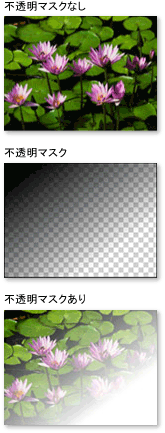
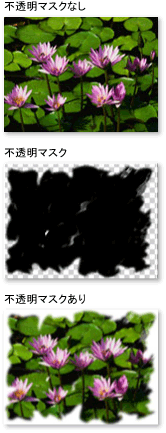
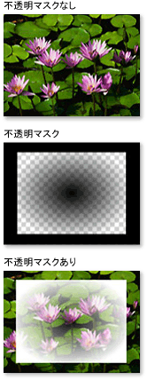

# 不透明マスクの概要
不透明マスクを使用すると、要素またはビジュアルの一部分を透明または部分的に透明にすることができます。  不透明マスクを作成するには、要素または <xref:System.Windows.Media.Visual> の <xref:System.Windows.UIElement.OpacityMask%2A> プロパティに <xref:System.Windows.Media.Brush> を適用します。  ブラシは要素またはビジュアルにマップされ、各ブラシのピクセルの不透明度の値を使用して、要素またはビジュアルの対応する各ピクセルの不透明度が決定されます。  
  
 このトピックは、次のセクションで構成されています。  
  
   
-   [必要条件](#prereqs)  
  
-   [不透明マスクを用いた視覚効果の作成](#opacitymasks)  
  
-   [不透明マスクの作成](#creatingopacitymasks)  
  
-   [不透明マスクとしてのグラデーションの使用](#creatingopacitymaskswithgradients)  
  
-   [不透明マスクでのグラデーションの終了位置の指定](#specifyinggradientcolors)  
  
-   [不透明マスクとしてのイメージの使用](#usingimageasopacitymask)  
  
-   [描画から不透明マスクを作成](#drawingbrushasopacitymask)  
  
-   [関連トピック](#seeAlsoToggle)  
  
   
## 必要条件  
 この概要では、<xref:System.Windows.Media.Brush> オブジェクトに精通していることを前提にしています。  ブラシの使用の概要については、「[純色およびグラデーションによる塗りつぶしの概要](../../../../docs/framework/wpf/graphics-multimedia/painting-with-solid-colors-and-gradients-overview.md)」を参照してください。  <xref:System.Windows.Media.ImageBrush> と <xref:System.Windows.Media.DrawingBrush> の詳細については、「[イメージ、描画、およびビジュアルによる塗りつぶし](../../../../docs/framework/wpf/graphics-multimedia/painting-with-images-drawings-and-visuals.md)」を参照してください。  
  
   
## 不透明マスクを用いた視覚効果の作成  
 不透明マスクは、そのコンテンツを要素またはビジュアルにマップすることによって機能します。  さらに、ブラシの各ピクセルの[アルファ チャネル](GTMT)を使用して、要素またはビジュアルの対応するピクセルの不透明度を決定します。ブラシの実際の色は無視されます。  ブラシの指定された部分が透明の場合、要素またはビジュアルの対応する部分は透明になります。  ブラシの指定された部分が不透明の場合、要素またはビジュアルの対応する部分の不透明度は変更されません。  不透明マスクによって指定される不透明度は、要素またはビジュアル内に含まれている不透明度の設定と結合されます。  たとえば、不透明度 25% の要素に、完全に不透明から完全に透明まで遷移する不透明マスクが適用された場合、要素は 25% の不透明度から完全な透明まで遷移します。  
  
> [!NOTE]
>  この概要では、イメージ要素で不透明マスクを使用する例を示していますが、不透明マスクはパネルやコントロールなどの任意の要素または <xref:System.Windows.Media.Visual> に適用できます。  
  
 不透明マスクを使用すると、ビューから消えるイメージまたはボタンを作成する、要素にテクスチャを追加する、あるいはグラデーションを組み合わせてガラスのような表面を生成するなど、人の目をひく視覚効果を作成できます。  不透明マスクの使用方法を次の図に示します。  格子模様の背景はマスクの透過部分を表しています。  
  
   
不透明マスクの例  
  
   
## 不透明マスクの作成  
 不透明マスクを作成するには、<xref:System.Windows.Media.Brush> を作成し、要素またはビジュアルの <xref:System.Windows.UIElement.OpacityMask%2A> プロパティに適用します。  任意の種類の <xref:System.Windows.Media.Brush> を不透明マスクとして使用できます。  
  
-   <xref:System.Windows.Media.LinearGradientBrush>、<xref:System.Windows.Media.RadialGradientBrush> : 要素またはビジュアルをビューから消すために使用します。  
  
     次の例は、不透明マスクとして使用された <xref:System.Windows.Media.LinearGradientBrush> を示しています。  
  
       
LinearGradientBrush 不透明マスクの例  
  
-   <xref:System.Windows.Media.ImageBrush> : ぼかし、またはぎざぎざのエッジ効果を作成するために使用します。  
  
     次の例は、不透明マスクとして使用された <xref:System.Windows.Media.ImageBrush> を示しています。  
  
       
LinearGradientBrush 不透明マスクの例  
  
-   <xref:System.Windows.Media.DrawingBrush> : 図形、イメージ、およびグラデーションのパターンから複雑な不透明マスクを作成する場合に使用します。  
  
     次の例は、不透明マスクとして使用された <xref:System.Windows.Media.DrawingBrush> を示しています。  
  
       
DrawingBrush 不透明マスクの例  
  
 グラデーション ブラシ \(<xref:System.Windows.Media.LinearGradientBrush> および <xref:System.Windows.Media.RadialGradientBrush>\) は、不透明マスクとして使用するのに特に適しています。  <xref:System.Windows.Media.SolidColorBrush> は均一な色で領域を塗りつぶすため、不透明マスクには適していません。<xref:System.Windows.Media.SolidColorBrush> を使用することは、要素またはビジュアルの <xref:System.Windows.UIElement.OpacityMask%2A> プロパティを設定することと同じです。  
  
   
## 不透明マスクとしてのグラデーションの使用  
 グラデーションの塗りつぶしを作成するには、グラデーションの複数の終了位置を指定します。  グラデーションの各終了位置には、色および位置の記述が含まれます \(グラデーションの作成および使用の詳細については、「[純色およびグラデーションによる塗りつぶしの概要](../../../../docs/framework/wpf/graphics-multimedia/painting-with-solid-colors-and-gradients-overview.md)」を参照してください\)。  このプロセスは、グラデーションを不透明マスクとして使用する場合も同様ですが、不透明マスクのグラデーションの場合は色をブレンドするのではなく、アルファ チャネル値をブレンドします。  したがって、グラデーションのコンテンツの実際の色は無視されます。それぞれの色のアルファ チャネルまたは不透明度だけが意味を持ちます。  例を次に示します。  
  
 [!code-xml[OpacityMasksExample#LinearGradientOpacityMaskonImage](../../../../samples/snippets/csharp/VS_Snippets_Wpf/OpacityMasksExample/CS/GradientBrushExample.xaml#lineargradientopacitymaskonimage)]
 [!code-xml[OpacityMasksExample#LinearGradientOpacityMaskonImage](../../../../samples/snippets/xaml/VS_Snippets_Wpf/OpacityMasksExample/XAML/GradientBrushExample.xaml#lineargradientopacitymaskonimage)]  
  
   
## 不透明マスクでのグラデーションの終了位置の指定  
 前の例では、システム定義色の <xref:System.Windows.Media.Colors.Black%2A> がグラデーションの開始色として使用されています。  <xref:System.Windows.Media.Colors.Transparent%2A> を除き、<xref:System.Windows.Media.Colors> クラスのすべての色は完全に不透明であるため、これらを使用するとグラデーションの不透明マスクの開始色を簡単に定義できます。  
  
 不透明マスクを定義する際にアルファ値をさらに細かく制御するために、マークアップ内で [!INCLUDE[TLA#tla_argb](../../../../includes/tlasharptla-argb-md.md)] の 16 進数表記を使用したり、<xref:System.Windows.Media.Color.FromScRgb%2A?displayProperty=fullName> メソッドを使用して、色のアルファ チャネルを指定できます。  
  
   
### "XAML" での色の透過度の指定  
 [!INCLUDE[TLA#tla_xaml](../../../../includes/tlasharptla-xaml-md.md)] では、[!INCLUDE[TLA2#tla_argb](../../../../includes/tla2sharptla-argb-md.md)] 16 進数表記を使用して、個別の色の透過度を指定します。  [!INCLUDE[TLA2#tla_argb](../../../../includes/tla2sharptla-argb-md.md)] の 16 進数表記では次の構文が使用されます。  
  
 `#`**aa** *rrggbb*  
  
 この構文の *aa* は、色の不透明度を指定する 2 桁の 16 進数の値を表します。  *rr*、*gg*、*bb* はそれぞれ、赤、緑、青の各色の量を指定する 2 桁の 16 進数を表します。  16 進数の各桁には、0 から 9、または A から F の値を指定できます。  0 が最小値で、F が最大値になります。  00 のアルファ値は、完全に透明な色の指定、FF のアルファ値は、完全に不透明な色の指定を表します。  次の例に、16 進数の [!INCLUDE[TLA2#tla_argb](../../../../includes/tla2sharptla-argb-md.md)] 表記を使用した 2 種類の色の指定方法を示します。  1 つ目には完全に不透明な色を指定し、2 つ目には完全に透明な色を指定しています。  
  
 [!code-xml[OpacityMasksExample#AARRGGBBValueonOpacityMask](../../../../samples/snippets/csharp/VS_Snippets_Wpf/OpacityMasksExample/CS/GradientBrushExample.xaml#aarrggbbvalueonopacitymask)]
 [!code-xml[OpacityMasksExample#AARRGGBBValueonOpacityMask](../../../../samples/snippets/xaml/VS_Snippets_Wpf/OpacityMasksExample/XAML/GradientBrushExample.xaml#aarrggbbvalueonopacitymask)]  
  
   
## 不透明マスクとしてのイメージの使用  
 イメージも不透明マスクとして使用できます。  例を次に示します。  格子模様の背景はマスクの透過部分を表しています。  
  
   
不透明マスクの例  
  
 イメージを不透明マスクとして使用するには、イメージを格納する <xref:System.Windows.Media.ImageBrush> を使用します。  不透明マスクとして使用するイメージを作成する場合は、複数の透過性レベルをサポートしている[!INCLUDE[TLA#tla_png](../../../../includes/tlasharptla-png-md.md)] などの形式でイメージを保存してください。  前の図を作成するために使用するコード例を次に示します。  
  
 [!code-xml[OpacityMasksExample#UIElementOpacityMask](../../../../samples/snippets/csharp/VS_Snippets_Wpf/OpacityMasksExample/CS/ImageBrushExample.xaml#uielementopacitymask)]
 [!code-xml[OpacityMasksExample#UIElementOpacityMask](../../../../samples/snippets/xaml/VS_Snippets_Wpf/OpacityMasksExample/XAML/ImageBrushExample.xaml#uielementopacitymask)]  
  
   
### 不透明マスクとしての並べて表示されたイメージの使用  
 次の例では、同じイメージを別の <xref:System.Windows.Media.ImageBrush> で使用していますが、ブラシを並べて表示する機能を使用して、50 x 50 ピクセルのイメージのタイルを生成しています。  
  
 [!code-xml[OpacityMasksExample#TiledImageasOpacityMask](../../../../samples/snippets/csharp/VS_Snippets_Wpf/OpacityMasksExample/CS/ImageBrushExample.xaml#tiledimageasopacitymask)]
 [!code-xml[OpacityMasksExample#TiledImageasOpacityMask](../../../../samples/snippets/xaml/VS_Snippets_Wpf/OpacityMasksExample/XAML/ImageBrushExample.xaml#tiledimageasopacitymask)]  
  
   
## 描画から不透明マスクを作成  
 描画を不透明マスクとして使用できます。  描画内に含まれる図形は、グラデーション、純色、イメージ、または他の描画を使用して塗りつぶすことができます。  次の例は、不透明マスクとして使用された描画を示しています。  格子模様の背景はマスクの透過部分を表しています。  
  
   
DrawingBrush 不透明マスクの例  
  
 描画を不透明マスクとして使用するには、描画を格納する <xref:System.Windows.Media.DrawingBrush> を使用します。  前の図を作成するために使用するコード例を次に示します。  
  
 [!code-xml[OpacityMasksExample#OpacityMaskfromDrawing](../../../../samples/snippets/csharp/VS_Snippets_Wpf/OpacityMasksExample/CS/DrawingBrushExample.xaml#opacitymaskfromdrawing)]
 [!code-xml[OpacityMasksExample#OpacityMaskfromDrawing](../../../../samples/snippets/xaml/VS_Snippets_Wpf/OpacityMasksExample/XAML/DrawingBrushExample.xaml#opacitymaskfromdrawing)]  
  
   
### 不透明マスクとしての並べて表示された描画の使用  
 <xref:System.Windows.Media.ImageBrush> と同様に、<xref:System.Windows.Media.DrawingBrush> によって描画を並べることができます。  次の例では、描画ブラシを使用して、並べて表示された不透明マスクを作成しています。  
  
 [!code-xml[OpacityMasksExample#TiledDrawingasOpacityMask](../../../../samples/snippets/csharp/VS_Snippets_Wpf/OpacityMasksExample/CS/DrawingBrushExample.xaml#tileddrawingasopacitymask)]
 [!code-xml[OpacityMasksExample#TiledDrawingasOpacityMask](../../../../samples/snippets/xaml/VS_Snippets_Wpf/OpacityMasksExample/XAML/DrawingBrushExample.xaml#tileddrawingasopacitymask)]  
  
## 参照  
 [イメージ、描画、およびビジュアルによる塗りつぶし](../../../../docs/framework/wpf/graphics-multimedia/painting-with-images-drawings-and-visuals.md)   
 [純色およびグラデーションによる塗りつぶしの概要](../../../../docs/framework/wpf/graphics-multimedia/painting-with-solid-colors-and-gradients-overview.md)