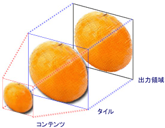
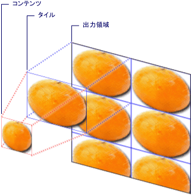

# イメージ、描画、およびビジュアルによる塗りつぶし
このトピックを使用する方法について説明<xref:System.Windows.Media.ImageBrush>、 <xref:System.Windows.Media.DrawingBrush>、および<xref:System.Windows.Media.VisualBrush>、イメージを使用して領域を描画するオブジェクト、 <xref:System.Windows.Media.Drawing>、または<xref:System.Windows.Media.Visual>です。  
    
  
   
## 必須コンポーネント  
 このトピックを理解するには、[!INCLUDE[TLA#tla_winclient](../../../../includes/tlasharptla-winclient-md.md)] に用意されているさまざまな種類のブラシとその基本的な機能を理解している必要があります。 概要については、「[WPF のブラシの概要](../../../../docs/framework/wpf/graphics-multimedia/wpf-brushes-overview.md)」を参照してください。  
  
   
## イメージで領域を塗りつぶす  
 <xref:System.Windows.Media.ImageBrush>領域を塗りつぶします、<xref:System.Windows.Media.ImageSource>です。 最も一般的な種類<xref:System.Windows.Media.ImageSource>で使用する、<xref:System.Windows.Media.ImageBrush>は、 <xref:System.Windows.Media.Imaging.BitmapImage>、ビットマップ グラフィックをについて説明します。 使用することができます、<xref:System.Windows.Media.DrawingImage>ペイントを使用する、<xref:System.Windows.Media.Drawing>オブジェクトが簡単に使用できる、<xref:System.Windows.Media.DrawingBrush>代わりにします。 詳細については<xref:System.Windows.Media.ImageSource>、オブジェクトを参照してください、[イメージングの概要](../../../../docs/framework/wpf/graphics-multimedia/imaging-overview.md)です。  
  
 描くに、 <xref:System.Windows.Media.ImageBrush>、作成、<xref:System.Windows.Media.Imaging.BitmapImage>およびビットマップ コンテンツの読み込みに使用します。 次に、使用、<xref:System.Windows.Media.Imaging.BitmapImage>を設定する、<xref:System.Windows.Media.ImageBrush.ImageSource%2A>のプロパティ、<xref:System.Windows.Media.ImageBrush>です。 最後に、適用、<xref:System.Windows.Media.ImageBrush>を描画するオブジェクト。  [!INCLUDE[TLA#tla_xaml](../../../../includes/tlasharptla-xaml-md.md)]、だけでも設定することができます、<xref:System.Windows.Media.ImageBrush.ImageSource%2A>のプロパティ、<xref:System.Windows.Media.ImageBrush>読み込む画像のパスを使用します。  
  
 などのすべて<xref:System.Windows.Media.Brush>、オブジェクト、<xref:System.Windows.Media.ImageBrush>図形、パネル、コントロール、およびテキストなどのオブジェクトの描画に使用できます。 次の図に、一部の効果を実現できる、<xref:System.Windows.Media.ImageBrush>です。  
  
   
ImageBrush で描画されたオブジェクト  
  
 既定では、<xref:System.Windows.Media.ImageBrush>端まで拡大を完全に領域を埋めるには、そのイメージ描画、イメージを引き伸ばして塗りつぶされる領域は、イメージよりも縦横比が異なる場合。 この動作を変更するには変更することによって、<xref:System.Windows.Media.TileBrush.Stretch%2A>プロパティの既定値から<xref:System.Windows.Media.Stretch.Fill>に<xref:System.Windows.Media.Stretch.None>、 <xref:System.Windows.Media.Stretch.Uniform>、または<xref:System.Windows.Media.Stretch.UniformToFill>です。 <xref:System.Windows.Media.ImageBrush>の種類は、 <xref:System.Windows.Media.TileBrush>、でもパターンの作成し、正確にイメージ ブラシが出力領域を塗りつぶす方法を指定できます。 詳細設定の詳細については<xref:System.Windows.Media.TileBrush>機能を参照してください、 [TileBrush 概要](../../../../docs/framework/wpf/graphics-multimedia/tilebrush-overview.md)です。  
  
   
## 例: ビットマップ イメージによるオブジェクトの塗りつぶし  
 次の例では、<xref:System.Windows.Media.ImageBrush>を描画する、<xref:System.Windows.Controls.Panel.Background%2A>の<xref:System.Windows.Controls.Canvas>です。  
  
 [!code-xaml[BrushOverviewExamples_snip#GraphicsMMImageBrushAsCanvasBackgroundExampleWholePage](../../../../samples/snippets/xaml/VS_Snippets_Wpf/BrushOverviewExamples_snip/XAML/ImageBrushExample.xaml#graphicsmmimagebrushascanvasbackgroundexamplewholepage)]  
  
 [!code-csharp[BrushOverviewExamples_procedural_snip#GraphicsMMImageBrushAsCanvasBackgroundExampleWholePage](../../../../samples/snippets/csharp/VS_Snippets_Wpf/BrushOverviewExamples_procedural_snip/CSharp/ImageBrushExample.cs#graphicsmmimagebrushascanvasbackgroundexamplewholepage)]
 [!code-vb[BrushOverviewExamples_procedural_snip#GraphicsMMImageBrushAsCanvasBackgroundExampleWholePage](../../../../samples/snippets/visualbasic/VS_Snippets_Wpf/BrushOverviewExamples_procedural_snip/visualbasic/imagebrushexample.vb#graphicsmmimagebrushascanvasbackgroundexamplewholepage)]  
  
   
## 描画を使用して領域を塗りつぶす  
 A<xref:System.Windows.Media.DrawingBrush>図形、テキスト、イメージ、およびビデオを使用して領域を描画することができます。 描画ブラシ内部の図形が自体を描画する純色、グラデーション、イメージ、または別<xref:System.Windows.Media.DrawingBrush>です。 次の図に示しますのいくつかの使用、<xref:System.Windows.Media.DrawingBrush>です。  
  
   
DrawingBrush で塗りつぶされたオブジェクト  
  
 A<xref:System.Windows.Media.DrawingBrush>領域を塗りつぶします、<xref:System.Windows.Media.Drawing>オブジェクト。 A<xref:System.Windows.Media.Drawing>オブジェクトには、図形、ビットマップ、ビデオ、または行のテキストなど、表示されているコンテンツがについて説明します。 さまざまな種類の描画で、さまざまな種類のコンテンツを記述します。 次の一覧に、さまざまな種類の描画オブジェクトを示します。  
  
-   <xref:System.Windows.Media.GeometryDrawing> – 図形を描画します。  
  
-   <xref:System.Windows.Media.ImageDrawing> – イメージを描画します。  
  
-   <xref:System.Windows.Media.GlyphRunDrawing> – テキストを描画します。  
  
-   <xref:System.Windows.Media.VideoDrawing> – オーディオまたはビデオ ファイルを再生します。  
  
-   <xref:System.Windows.Media.DrawingGroup> – 他の描画を描画します。 他の描画を 1 つの複合描画に結合するには、描画グループを使用します。  
  
 詳細については<xref:System.Windows.Media.Drawing>、オブジェクトを参照してください、[描画オブジェクトの概要](../../../../docs/framework/wpf/graphics-multimedia/drawing-objects-overview.md)です。  
  
 同様に、 <xref:System.Windows.Media.ImageBrush>、<xref:System.Windows.Media.DrawingBrush>伸縮その<xref:System.Windows.Media.DrawingBrush.Drawing%2A>出力領域に挿入します。 この動作をオーバーライドするには、変更することによって、<xref:System.Windows.Media.TileBrush.Stretch%2A>プロパティの既定の設定から<xref:System.Windows.Media.Stretch.Fill>です。 詳細については、<xref:System.Windows.Media.TileBrush.Stretch%2A> プロパティを参照してください。  
  
   
## 例: 描画によるオブジェクトの塗りつぶし  
 次の例は、3 つの楕円の描画によってオブジェクトを塗りつぶす方法を示しています。 A<xref:System.Windows.Media.GeometryDrawing>省略記号を表すために使用します。  
  
 [!code-xaml[BrushOverviewExamples_snip#GraphicsMMDrawingBrushAsButtonBackgroundExample](../../../../samples/snippets/xaml/VS_Snippets_Wpf/BrushOverviewExamples_snip/XAML/DrawingBrushExample.xaml#graphicsmmdrawingbrushasbuttonbackgroundexample)]  
  
 [!code-csharp[BrushOverviewExamples_procedural_snip#GraphicsMMDrawingBrushAsButtonBackgroundExample1](../../../../samples/snippets/csharp/VS_Snippets_Wpf/BrushOverviewExamples_procedural_snip/CSharp/DrawingBrushExample.cs#graphicsmmdrawingbrushasbuttonbackgroundexample1)]
 [!code-vb[BrushOverviewExamples_procedural_snip#GraphicsMMDrawingBrushAsButtonBackgroundExample1](../../../../samples/snippets/visualbasic/VS_Snippets_Wpf/BrushOverviewExamples_procedural_snip/visualbasic/drawingbrushexample.vb#graphicsmmdrawingbrushasbuttonbackgroundexample1)]  
  
   
## ビジュアルで領域を塗りつぶす  
 最も便利で、すべてのブラシの強力な<xref:System.Windows.Media.VisualBrush>領域を塗りつぶします、<xref:System.Windows.Media.Visual>です。 A<xref:System.Windows.Media.Visual>は多くの便利なグラフィカルなコンポーネントの先祖として機能する低レベルのグラフィカルな型です。 たとえば、 <xref:System.Windows.Window>、 <xref:System.Windows.FrameworkElement>、および<xref:System.Windows.Controls.Control>クラスは、すべての種類の<xref:System.Windows.Media.Visual>オブジェクト。 使用して、 <xref:System.Windows.Media.VisualBrush>、ほぼすべて領域を塗りつぶすことができます[!INCLUDE[TLA#tla_winclient](../../../../includes/tlasharptla-winclient-md.md)]グラフィカル オブジェクト。  
  
> [!NOTE]
>  <xref:System.Windows.Media.VisualBrush>の種類は、<xref:System.Windows.Freezable>オブジェクトを固定することはできません (読み取り専用に) とその<xref:System.Windows.Media.VisualBrush.Visual%2A>プロパティが以外の値に設定`null`です。  
  
 2 つの方法を指定する、<xref:System.Windows.Media.VisualBrush.Visual%2A>のコンテンツ、<xref:System.Windows.Media.VisualBrush>です。  
  
-   新しい<xref:System.Windows.Media.Visual>設定を使用して、<xref:System.Windows.Media.VisualBrush.Visual%2A>のプロパティ、<xref:System.Windows.Media.VisualBrush>です。 例については、この後の「[例: ビジュアルによるオブジェクトの塗りつぶし](#examplevisualbrush1)」セクションを参照してください。  
  
-   既存の使用<xref:System.Windows.Media.Visual>、ターゲットの重複するイメージを作成する<xref:System.Windows.Media.Visual>です。 使用してできます、<xref:System.Windows.Media.VisualBrush>リフレクションや拡大などの興味深い効果を作成します。 例については、「[方法 : 反射を作成する](#examplevisualbrush2)」セクションを参照してください。  
  
 新しいを定義するとき<xref:System.Windows.Media.VisualBrush.Visual%2A>の<xref:System.Windows.Media.VisualBrush>ことと<xref:System.Windows.Media.Visual>は、<xref:System.Windows.UIElement>で (パネルやコントロール)、レイアウト システムが実行されます、<xref:System.Windows.UIElement>とその子要素と、<xref:System.Windows.Media.VisualBrush.AutoLayoutContent%2A>プロパティに設定されている`true`です。 ただし、ルート<xref:System.Windows.UIElement>は基本的に、システムの残りの部分から分離: スタイル、および外部のレイアウトは、この境界を超えることはできません。 そのため、ルートのサイズを指定する必要があります明示的に<xref:System.Windows.UIElement>のみ親があるため、<xref:System.Windows.Media.VisualBrush>し、そのため、できませんサイズを自動的に塗りつぶされている領域にします。 [!INCLUDE[TLA#tla_winclient](../../../../includes/tlasharptla-winclient-md.md)] でのレイアウトの詳細については、「[レイアウト](../../../../docs/framework/wpf/advanced/layout.md)」を参照してください。  
  
 同様に<xref:System.Windows.Media.ImageBrush>と<xref:System.Windows.Media.DrawingBrush>、<xref:System.Windows.Media.VisualBrush>出力領域に挿入するには、そのコンテンツを拡大します。 この動作をオーバーライドするには、変更することによって、<xref:System.Windows.Media.TileBrush.Stretch%2A>プロパティの既定の設定から<xref:System.Windows.Media.Stretch.Fill>です。 詳細については、<xref:System.Windows.Media.TileBrush.Stretch%2A> プロパティを参照してください。  
  
   
## 例: ビジュアルによるオブジェクトの塗りつぶし  
 次の例では、さまざまなコントロールとパネルを使用して四角形を塗りつぶします。  
  
 [!code-xaml[BrushOverviewExamples_snip#GraphicsMMVisualBrushAsRectangleBackgroundExample](../../../../samples/snippets/xaml/VS_Snippets_Wpf/BrushOverviewExamples_snip/XAML/VisualBrushExample.xaml#graphicsmmvisualbrushasrectanglebackgroundexample)]  
  
 [!code-csharp[BrushOverviewExamples_procedural_snip#GraphicsMMVisualBrushAsRectangleBackgroundExample1](../../../../samples/snippets/csharp/VS_Snippets_Wpf/BrushOverviewExamples_procedural_snip/CSharp/VisualBrushExample.cs#graphicsmmvisualbrushasrectanglebackgroundexample1)]
 [!code-vb[BrushOverviewExamples_procedural_snip#GraphicsMMVisualBrushAsRectangleBackgroundExample1](../../../../samples/snippets/visualbasic/VS_Snippets_Wpf/BrushOverviewExamples_procedural_snip/visualbasic/visualbrushexample.vb#graphicsmmvisualbrushasrectanglebackgroundexample1)]  
  
   
## 方法 : 反射を作成する  
 前の例では、新しいを作成する方法を示しました<xref:System.Windows.Media.Visual>の背景として使用します。 使用することも、<xref:System.Windows.Media.VisualBrush>を既存の visual; を表示するこの機能では、反射や拡大などの興味深いビジュアル効果を生成することができます。 次の例では、<xref:System.Windows.Media.VisualBrush>の反射、<xref:System.Windows.Controls.Border>いくつかの要素を格納しています。 次の図は、この例で生成される出力を示しています。  
  
   
反映された Visual オブジェクト  
  
 [!code-csharp[visualbrush_markup_snip#GraphicsMMVisualBrushReflectionExampleWholePage](../../../../samples/snippets/csharp/VS_Snippets_Wpf/visualbrush_markup_snip/CSharp/ReflectionExample.cs#graphicsmmvisualbrushreflectionexamplewholepage)]
 [!code-vb[visualbrush_markup_snip#GraphicsMMVisualBrushReflectionExampleWholePage](../../../../samples/snippets/visualbasic/VS_Snippets_Wpf/visualbrush_markup_snip/visualbasic/reflectionexample.vb#graphicsmmvisualbrushreflectionexamplewholepage)]
 [!code-xaml[visualbrush_markup_snip#GraphicsMMVisualBrushReflectionExampleWholePage](../../../../samples/snippets/xaml/VS_Snippets_Wpf/visualbrush_markup_snip/XAML/ReflectionExample.xaml#graphicsmmvisualbrushreflectionexamplewholepage)]  
  
 画面の一部を引き伸ばす方法と反射を作成する方法のその他の例については、「[VisualBrush のサンプル](http://go.microsoft.com/fwlink/?LinkID=160049)」を参照してください。  
  
   
## TileBrush の機能  
 <xref:System.Windows.Media.ImageBrush>、 <xref:System.Windows.Media.DrawingBrush>、および<xref:System.Windows.Media.VisualBrush>種類<xref:System.Windows.Media.TileBrush>オブジェクト。 <xref:System.Windows.Media.TileBrush> オブジェクトを提供するイメージ、図形、または visual で領域を描画する方法を細かく制御が大幅に向上します。 たとえば、1 つのイメージを引き伸ばして領域を塗りつぶす代わりに、一連のイメージ タイルでパターンを作って領域を塗りつぶすことができます。  
  
 A<xref:System.Windows.Media.TileBrush>は 3 つの主なコンポーネントがあります。 コンテンツ、タイル、および、出力領域。  
  
   
1 つのタイルが TileBrush のコンポーネント  
  
   
複数のタイルを使用する TileBrush のコンポーネント  
  
 タイルの機能の詳細については<xref:System.Windows.Media.TileBrush>、オブジェクトを参照してください、 [TileBrush 概要](../../../../docs/framework/wpf/graphics-multimedia/tilebrush-overview.md)です。  
  
## 関連項目  
 <xref:System.Windows.Media.ImageBrush>  
 <xref:System.Windows.Media.DrawingBrush>  
 <xref:System.Windows.Media.VisualBrush>  
 <xref:System.Windows.Media.TileBrush>  
 [TileBrush の概要](../../../../docs/framework/wpf/graphics-multimedia/tilebrush-overview.md)  
 [WPF のブラシの概要](../../../../docs/framework/wpf/graphics-multimedia/wpf-brushes-overview.md)  
 [イメージングの概要](../../../../docs/framework/wpf/graphics-multimedia/imaging-overview.md)  
 [Drawing オブジェクトの概要](../../../../docs/framework/wpf/graphics-multimedia/drawing-objects-overview.md)  
 [不透明度マスクの概要](../../../../docs/framework/wpf/graphics-multimedia/opacity-masks-overview.md)  
 [WPF グラフィックス レンダリングの概要](../../../../docs/framework/wpf/graphics-multimedia/wpf-graphics-rendering-overview.md)  
 [ImageBrush のサンプル](http://go.microsoft.com/fwlink/?LinkID=160005)  
 [VisualBrush のサンプル](http://go.microsoft.com/fwlink/?LinkID=160049)
