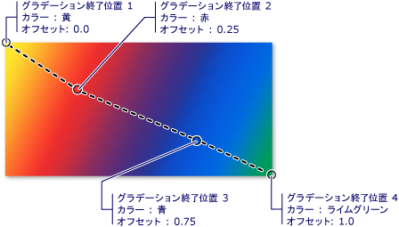
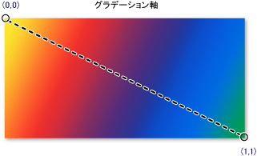
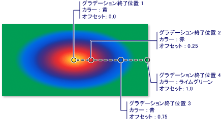

# 純色およびグラデーションによる塗りつぶしの概要
このトピックを使用する方法について説明<xref:System.Windows.Media.SolidColorBrush>、 <xref:System.Windows.Media.LinearGradientBrush>、および<xref:System.Windows.Media.RadialGradientBrush>純色の線形グラデーションおよび放射状グラデーションで塗りつぶすオブジェクト。  
  

  
   
## 領域を純色で塗りつぶす  
 任意のプラットフォームでの最も一般的な操作の 1 つは、純色で領域を塗りつぶす<xref:System.Windows.Media.Color>です。 このタスクを実行する[!INCLUDE[TLA#tla_winclient](../../../../includes/tlasharptla-winclient-md.md)]提供、<xref:System.Windows.Media.SolidColorBrush>クラスです。 次のセクションで描くにさまざまな方法を説明する、<xref:System.Windows.Media.SolidColorBrush>です。  
  
   
### "XAML" での SolidColorBrush の使用  
 [!INCLUDE[TLA2#tla_xaml](../../../../includes/tla2sharptla-xaml-md.md)] で領域を純色で塗りつぶすには、次のオプションのいずれかを使用します。  
  
-   定義済みの純色のブラシを名前で選択します。  たとえば、ボタンを設定することができます<xref:System.Windows.Controls.Control.Background%2A>"Red"または"MediumBlue"にします。  他の定義済みの純色のブラシの静的プロパティを参照してください、<xref:System.Windows.Media.Brushes>クラスです。 次に例を示します。  
  
     [!code-xaml[BrushOverviewExamples_snip#SolidColorBrushNamedColor1XAML](../../../../samples/snippets/xaml/VS_Snippets_Wpf/BrushOverviewExamples_snip/XAML/SolidColorBrushExample.xaml#solidcolorbrushnamedcolor1xaml)]  
  
-   赤、緑、および青の量を指定して単一の純色に結合することで、32 ビット カラー パレットからカラーを選択します。  32 ビット パレットからカラーを指定するための書式は、"*#rrggbb*" です。ここで、*rr* は赤の相対的な量を指定する 2 桁の 16 進数であり、*gg* は緑の量を、*bb*は青の量を指定します。  さらに、カラーは、"#*aarrggbb*" として指定することもできます。ここで、*aa* はカラーの*アルファ*値 (透明度) を指定します。 この方法により、部分的に透明な色を作成することができます。  次の例で、<xref:System.Windows.Controls.Control.Background%2A>の<xref:System.Windows.Controls.Button>は 16 進数表記を使用して完全に不透明な赤に設定します。  
  
     [!code-xaml[BrushOverviewExamples_snip#SolidColorBrushHex1XAML](../../../../samples/snippets/xaml/VS_Snippets_Wpf/BrushOverviewExamples_snip/XAML/SolidColorBrushExample.xaml#solidcolorbrushhex1xaml)]  
  
-   記述するプロパティ タグの構文を使用して、<xref:System.Windows.Media.SolidColorBrush>です。 この構文は冗長ですが、ブラシの不透明度などの追加設定を指定することができます。 次の例で、 <xref:System.Windows.Controls.Control.Background%2A> 2 つのプロパティ<xref:System.Windows.Controls.Button>要素は完全に不透明な赤に設定します。 最初のブラシの色は、定義済みの色の名前を使用して記述されています。 2 番目のブラシの色は、16 進表記で記述されています。  
  
     [!code-xaml[BrushOverviewExamples_snip#SolidColorBrushPropertyTag1XAML](../../../../samples/snippets/xaml/VS_Snippets_Wpf/BrushOverviewExamples_snip/XAML/SolidColorBrushExample.xaml#solidcolorbrushpropertytag1xaml)]  
  
   
### コードでの SolidColorBrush による塗りつぶし  
 コードで領域を純色で塗りつぶすには、次のオプションのいずれかを使用します。  
  
-   によって提供される定義済みのブラシのいずれかを使用して、<xref:System.Windows.Media.Brushes>クラスです。 次の例で、<xref:System.Windows.Controls.Control.Background%2A>の<xref:System.Windows.Controls.Button>に設定されている<xref:System.Windows.Media.Brushes.Red%2A>です。  
  
     [!code-csharp[BrushOverviewExamples_snip#SolidColorBrushPredefinedBrush1CSharp](../../../../samples/snippets/csharp/VS_Snippets_Wpf/BrushOverviewExamples_snip/CSharp/SolidColorBrushExample.cs#solidcolorbrushpredefinedbrush1csharp)]  
  
-   作成、<xref:System.Windows.Media.SolidColorBrush>設定とその<xref:System.Windows.Media.SolidColorBrush.Color%2A>プロパティを使用して、<xref:System.Windows.Media.Color>構造体。 定義済みの色を使用することができます、<xref:System.Windows.Media.Colors>クラスを作成できます、<xref:System.Windows.Media.Color>静的<xref:System.Windows.Media.Color.FromArgb%2A>メソッドです。  
  
     次の例は、設定する方法を示します、<xref:System.Windows.Media.SolidColorBrush.Color%2A>のプロパティ、<xref:System.Windows.Media.SolidColorBrush>定義済みの色を使用します。  
  
     [!code-csharp[BrushOverviewExamples_snip#SolidColorBrushPredefinedColor1CSharp](../../../../samples/snippets/csharp/VS_Snippets_Wpf/BrushOverviewExamples_snip/CSharp/SolidColorBrushExample.cs#solidcolorbrushpredefinedcolor1csharp)]  
  
 静的な<xref:System.Windows.Media.Color.FromArgb%2A>色のアルファ、赤、緑、および青の値を指定することができます。 これらの各値の一般的な範囲は、0 ～ 255 です。 たとえば、アルファ値 0 はカラーが完全に透明であることを示し、値 255 はカラーが完全に不透明であることを示します。 同様に、赤値 0 はカラーに赤が全く含まれないことを示し、値 255 は可能な最大量の赤が含まれることを示します。  次の例では、ブラシのカラーは、アルファ、赤、緑、および青の値を指定することで記述されています。  
  
 [!code-csharp[BrushOverviewExamples_snip#SolidColorBrushfromArgbExample1CSharp](../../../../samples/snippets/csharp/VS_Snippets_Wpf/BrushOverviewExamples_snip/CSharp/SolidColorBrushExample.cs#solidcolorbrushfromargbexample1csharp)]  
  
 色を指定するその他の方法を参照してください、<xref:System.Windows.Media.Color>リファレンス トピックを参照します。  
  
   
## 領域をグラデーションで塗りつぶす  
 グラデーション ブラシは、軸に沿って互いに溶け込む複数の色で領域を塗りつぶします。 これらを使用して、光と影の感じを作り出して、コントロールを立体的に見せることができます。 ガラス、クロム メッキ、水、その他の滑らかな表面をシミュレートするためにも使用できます。  [!INCLUDE[TLA2#tla_winclient](../../../../includes/tla2sharptla-winclient-md.md)] グラデーション ブラシの 2 つの型を提供します。<xref:System.Windows.Media.LinearGradientBrush>と<xref:System.Windows.Media.RadialGradientBrush>です。  
  
   
## 線状グラデーション  
 A <xref:System.Windows.Media.LinearGradientBrush> 、線に沿って定義されているグラデーションで領域を塗りつぶします、*グラデーション軸*です。  グラデーションの色とグラデーション軸を使用して、上の場所を指定する<xref:System.Windows.Media.GradientStop>オブジェクト。  グラデーション軸を変更することもできます。これにより、水平方向と垂直方向のグラデーションの作成やグラデーションの方向の反転を行うことができます。 グラデーション軸については、次のセクションで説明します。 既定では、対角線方向のグラデーションが作成されます。  
  
 次の例では、4 津のカラーを使用して線状グラデーションを作成するコードを示します。  
  
 [!code-xaml[GradientBrushExamples_snip#DiagonalGradient1XAML](../../../../samples/snippets/xaml/VS_Snippets_Wpf/GradientBrushExamples_snip/XAML/LinearGradientBrushExample.xaml#diagonalgradient1xaml)]  
  
 [!code-csharp[GradientBrushExamples_snip#DiagonalGradient1CSharp](../../../../samples/snippets/csharp/VS_Snippets_Wpf/GradientBrushExamples_snip/CSharp/LinearGradientBrushExample.cs#diagonalgradient1csharp)]  
  
 このコードを実行すると、次のグラデーションが生成されます。  
  
   
  
 **注:** このトピックのグラデーションの例では、始点と終点の設定で既定の座標系を使用しています。 既定の座標系は、境界ボックスに相対する座標系であり、0 は境界ボックスの 0% を示し、1 は境界ボックスの 100% を示します。 この座標系を変更するには設定して、<xref:System.Windows.Media.GradientBrush.MappingMode%2A>プロパティ値を<xref:System.Windows.Media.BrushMappingMode.Absolute>です。 絶対座標系は、境界ボックスに相対しません。 値は、ローカル空間に直接変換されます。  
  
 <xref:System.Windows.Media.GradientStop>グラデーション ブラシの基本的なビルディング ブロックです。  グラデーションの分岐点を指定します、<xref:System.Windows.Media.GradientStop.Color%2A>で、<xref:System.Windows.Media.GradientStop.Offset%2A>グラデーション軸に沿ってです。  
  
-   グラデーションの分岐点の<xref:System.Windows.Media.GradientStop.Color%2A>プロパティは、グラデーションの分岐点の色を指定します。 定義済みの色を使用して色を設定することがあります (によって提供される、<xref:System.Windows.Media.Colors>クラス) または ScRGB または ARGB 値を指定します。 [!INCLUDE[TLA2#tla_xaml](../../../../includes/tla2sharptla-xaml-md.md)] では、16 進表記を使用してカラーを記述することもできます。 詳細については、次を参照してください。、<xref:System.Windows.Media.Color>構造体。  
  
-   グラデーションの分岐点の<xref:System.Windows.Media.GradientStop.Offset%2A>プロパティは、グラデーション軸のグラデーションの分岐点の色の位置を指定します。 オフセットは、 <xref:System.Double> ~ 1 の 0 から範囲をします。 グラデーション境界のオフセット値が 0 に近ければ近いほど、カラーはグラデーションの始まりに近づきます。 グラデーションのオフセット値が 1 に近ければ近いほど、カラーはグラデーションの終わりに近づきます。  
  
 グラデーション境界の間の各点のカラーは、2 つのグラデーション境界によって指定されたカラーの混合として線形補間されます。 次の図は、前の例のグラデーション境界を強調しています。 円はグラデーション境界の位置をマークし、破線はグラデーション軸を示しています。  
  
   
  
 最初のグラデーション境界は、オフセット`0.0` に黄色を指定しています。  2 番目のグラデーション境界は、オフセット `0.25` に赤色を指定しています。  これら 2 つの境界の間の点は、グラデーション軸に沿って左から右に移動するにつれて、黄色から徐々に赤色に変化します。  3 番目のグラデーション境界は、オフセット `0.75` に青色を指定しています。  2 番目と 3 番目のグラデーション境界の間の点は、赤から青に徐々に変化します。 4 番目のグラデーション境界は、オフセット `1.0` に緑色を指定しています。 3 番目と 4 番目のグラデーション境界の間の点は、青から緑に徐々に変化します。  
  
   
### グラデーション軸  
 前述のように、線状グラデーション ブラシのグラデーション境界は、直線のグラデーション軸に沿って配置されます。 ブラシを使用して行のサイズと向きを変更することがあります<xref:System.Windows.Media.LinearGradientBrush.StartPoint%2A>と<xref:System.Windows.Media.LinearGradientBrush.EndPoint%2A>プロパティです。 ブラシを操作することによって<xref:System.Windows.Media.LinearGradientBrush.StartPoint%2A>と<xref:System.Windows.Media.LinearGradientBrush.EndPoint%2A>水平を作成することができます、および垂直グラデーション、グラデーションの方向を反転する、グラデーションのスプレッドなどを縮小します。  
  
 既定では、線形グラデーション ブラシの<xref:System.Windows.Media.LinearGradientBrush.StartPoint%2A>と<xref:System.Windows.Media.LinearGradientBrush.EndPoint%2A>は塗りつぶされている領域を基準とします。 点 (0, 0) は塗りつぶされる領域の左上隅を、点 (1, 1) は塗りつぶされる領域の右下隅を表します。 既定値<xref:System.Windows.Media.LinearGradientBrush.StartPoint%2A>の<xref:System.Windows.Media.LinearGradientBrush>(0, 0) とその既定<xref:System.Windows.Media.LinearGradientBrush.EndPoint%2A>(1, 1) は、これは、左上隅から開始し、塗りつぶされている領域の右下隅に拡張する対角線のグラデーションを作成します。 次の図は、既定値は線形グラデーション ブラシのグラデーション軸<xref:System.Windows.Media.LinearGradientBrush.StartPoint%2A>と<xref:System.Windows.Media.LinearGradientBrush.EndPoint%2A>です。  
  
   
  
 ブラシを指定することで、次の例がグラデーションにある水平方向を作成する方法を示します<xref:System.Windows.Media.LinearGradientBrush.StartPoint%2A>と<xref:System.Windows.Media.LinearGradientBrush.EndPoint%2A>です。 グラデーション境界は前の例と同じことに注意してください。変更するだけで、<xref:System.Windows.Media.LinearGradientBrush.StartPoint%2A>と<xref:System.Windows.Media.LinearGradientBrush.EndPoint%2A>、グラデーション斜めから水平方向に変更されました。  
  
 [!code-xaml[GradientBrushExamples_snip#HorizontalGradient1XAML](../../../../samples/snippets/xaml/VS_Snippets_Wpf/GradientBrushExamples_snip/XAML/LinearGradientBrushExample.xaml#horizontalgradient1xaml)]  
  
 [!code-csharp[GradientBrushExamples_snip#HorizontalGradient1CSharp](../../../../samples/snippets/csharp/VS_Snippets_Wpf/GradientBrushExamples_snip/CSharp/LinearGradientBrushExample.cs#horizontalgradient1csharp)]  
  
 次の図は、作成されるグラデーションを示しています。 グラデーション軸は破線でマークされ、グラデーション境界は円でマークされています。  
  
   
  
 次の例では、垂直方向のグラデーションを作成する方法を示します。  
  
 [!code-xaml[GradientBrushExamples_snip#VerticalGradient1XAML](../../../../samples/snippets/xaml/VS_Snippets_Wpf/GradientBrushExamples_snip/XAML/LinearGradientBrushExample.xaml#verticalgradient1xaml)]  
  
 [!code-csharp[GradientBrushExamples_snip#VerticalGradient1CSharp](../../../../samples/snippets/csharp/VS_Snippets_Wpf/GradientBrushExamples_snip/CSharp/LinearGradientBrushExample.cs#verticalgradient1csharp)]  
  
 次の図は、作成されるグラデーションを示しています。 グラデーション軸は破線でマークされ、グラデーション境界は円でマークされています。  
  
   
  
   
## 放射状グラデーション  
 同様に、 <xref:System.Windows.Media.LinearGradientBrush>、<xref:System.Windows.Media.RadialGradientBrush>軸に沿ったブレンド色で領域を塗りつぶします。 前の例では、線状グラデーション ブラシの軸は直線であることを示しました。 放射状グラデーション ブラシの軸は円によって定義され、そのカラーはその原点から外側に "放射" されます。  
  
 次の例では、放射状グラデーション ブラシを使用して、四角形の内側を塗りつぶします。  
  
 [!code-xaml[GradientBrushExamples_snip#RadialGradient1XAML](../../../../samples/snippets/xaml/VS_Snippets_Wpf/GradientBrushExamples_snip/XAML/RadialGradientBrushExample.xaml#radialgradient1xaml)]  
  
 [!code-csharp[GradientBrushExamples_snip#RadialGradient1CSharp](../../../../samples/snippets/csharp/VS_Snippets_Wpf/GradientBrushExamples_snip/CSharp/RadialGradientBrushExample.cs#radialgradient1csharp)]  
  
 次の図は、前の例で作成されるグラデーションを示しています。 ブラシのグラデーション境界が強調されています。 結果は異なっていますが、この例のグラデーション境界は、前の線状グラデーション ブラシの例のグラデーション境界と同じであることに注目してください。  
  
   
  
 <xref:System.Windows.Media.RadialGradientBrush.GradientOrigin%2A>放射状グラデーション ブラシのグラデーション軸の開始位置を指定します。 グラデーション軸は、グラデーションの原点からグラデーション円に放射状に広がります。 ブラシのグラデーションの円がによって定義されたその<xref:System.Windows.Media.RadialGradientBrush.Center%2A>、 <xref:System.Windows.Media.RadialGradientBrush.RadiusX%2A>、および<xref:System.Windows.Media.RadialGradientBrush.RadiusY%2A>プロパティです。  
  
 次の図に、異なるいくつかの放射状グラデーション<xref:System.Windows.Media.RadialGradientBrush.GradientOrigin%2A>、 <xref:System.Windows.Media.RadialGradientBrush.Center%2A>、 <xref:System.Windows.Media.RadialGradientBrush.RadiusX%2A>、および<xref:System.Windows.Media.RadialGradientBrush.RadiusY%2A>設定します。  
  
   
GradientOrigin、Center、RadiusX、および RadiusY の設定が異なる RadialGradientBrushes。  
  
   
## 透明または部分的に透明なグラデーション境界の指定  
 グラデーション境界は、不透明度のプロパティを提供しないので、色のアルファ チャネルを使用してを指定する必要があります[!INCLUDE[TLA#tla_argb](../../../../includes/tlasharptla-argb-md.md)]マークアップや使用で 16 進数表記、<xref:System.Windows.Media.Color.FromScRgb%2A?displayProperty=nameWithType>メソッドを透明または部分的にはグラデーション境界を作成します。 以降のセクションで、部分的に透明なグラデーション境界を [!INCLUDE[TLA2#tla_xaml](../../../../includes/tla2sharptla-xaml-md.md)] とコードで作成する方法を説明します。  
  
   
### "XAML" でのカラーの不透明度の指定  
 [!INCLUDE[TLA2#tla_xaml](../../../../includes/tla2sharptla-xaml-md.md)] では、[!INCLUDE[TLA2#tla_argb](../../../../includes/tla2sharptla-argb-md.md)] の 16 進表記を使用して、個々の色の不透明度を指定します。 [!INCLUDE[TLA2#tla_argb](../../../../includes/tla2sharptla-argb-md.md)] の 16 進表記では、次の構文を使用します。  
  
 `#` **aa** *rrggbb*  
  
 前の行の *aa* は、カラーの不透明度を指定するために使用する 2 桁の 16 進値を表します。 *rr*、*gg*、および *bb* は、それぞれ、カラーの赤、緑、および青の量を指定するために使用される 2 桁の 16 進値を表します。 各 16 進数には、0 ～ 9 または A ～ F の値を指定できます。 0 は最小値であり、F は最大値です。 アルファ値 00 は完全に透明なカラーを指定し、アルファ値 FF は完全に不透明なカラーを指定します。  次の例では、[!INCLUDE[TLA2#tla_argb](../../../../includes/tla2sharptla-argb-md.md)] の 16 進表記を使用して、2 つのカラーを指定しています。 1 つ目は部分的に透明 (アルファ値 x20 ) であり、2 つ目は完全に不透明です。  
  
 [!code-xaml[GradientBrushExamples_snip#TransparentGradientStopExample1XAML](../../../../samples/snippets/xaml/VS_Snippets_Wpf/GradientBrushExamples_snip/XAML/GradientStopsExample.xaml#transparentgradientstopexample1xaml)]  
  
   
### コードでのカラーの不透明度の指定  
 静的なコードを使用するときに<xref:System.Windows.Media.Color.FromArgb%2A>メソッドでは、色を作成するときは、アルファ値を指定することができます。 このメソッドは型の 4 つのパラメーターを受け取ります<xref:System.Byte>です。 最初のパラメーターはカラーのアルファ チャネルを指定し、その他の 3 つのパラメーターはカラーの赤、緑、および青の値を指定します。 各値は、0 ～ 255 (0 と 255 を含む) の数値にする必要があります。 アルファ値 0 はカラーが完全に透明であることを指定し、アルファ値 255 はカラーが完全に不透明であることを指定します。 次の例で、<xref:System.Windows.Media.Color.FromArgb%2A>メソッドが 2 つの色を生成するために使用します。 1 つ目のカラーは部分的に透明 (アルファ値32) であり、2 つ目のカラーは完全に不透明です。  
  
 [!code-csharp[GradientBrushExamples_snip#TransparentGradientStopExample1CSharp](../../../../samples/snippets/csharp/VS_Snippets_Wpf/GradientBrushExamples_snip/CSharp/GradientStopsExample.cs#transparentgradientstopexample1csharp)]  
  
 また、使用することがあります、<xref:System.Windows.Media.Color.FromScRgb%2A>メソッドで、ScRGB 値を使用して色を作成することができます。  
  
   
## イメージ、描画、ビジュアル、およびパターンによる塗りつぶし  
 <xref:System.Windows.Media.ImageBrush>、 <xref:System.Windows.Media.DrawingBrush>、および<xref:System.Windows.Media.VisualBrush>クラスを使用すると、画像、図形、またはビジュアルを使用して領域を描画します。 イメージ、描画、およびパターンによる塗りつぶしの詳細については、「[イメージ、描画、およびビジュアルによる塗りつぶし](../../../../docs/framework/wpf/graphics-multimedia/painting-with-images-drawings-and-visuals.md)」を参照してください。  
  
## 関連項目  
 <xref:System.Windows.Media.Brush>  
 <xref:System.Windows.Media.SolidColorBrush>  
 <xref:System.Windows.Media.LinearGradientBrush>  
 <xref:System.Windows.Media.RadialGradientBrush>  
 [イメージ、描画、およびビジュアルによる塗りつぶし](../../../../docs/framework/wpf/graphics-multimedia/painting-with-images-drawings-and-visuals.md)  
 [ブラシの変換の概要](../../../../docs/framework/wpf/graphics-multimedia/brush-transformation-overview.md)  
 [グラフィックスの描画層](../../../../docs/framework/wpf/advanced/graphics-rendering-tiers.md)
