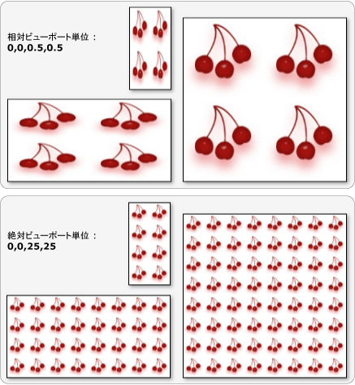

# TileBrush の概要TileBrush Overview
<xref:System.Windows.Media.TileBrush>オブジェクトを使用する、イメージで領域を描画する方法を細かく制御が大幅に向上<xref:System.Windows.Media.Drawing>、または<xref:System.Windows.Media.Visual>です。<xref:System.Windows.Media.TileBrush> objects provide you with a great deal of control over how an area is painted with an image, <xref:System.Windows.Media.Drawing>, or <xref:System.Windows.Media.Visual>. このトピックを使用する方法について説明<xref:System.Windows.Media.TileBrush>の機能をより細かく方法、 <xref:System.Windows.Media.ImageBrush>、 <xref:System.Windows.Media.DrawingBrush>、または<xref:System.Windows.Media.VisualBrush>領域を塗りつぶします。This topic describes how to use <xref:System.Windows.Media.TileBrush> features to gain more control over how an <xref:System.Windows.Media.ImageBrush>, <xref:System.Windows.Media.DrawingBrush>, or <xref:System.Windows.Media.VisualBrush> paints an area.  
  
  
   
## 必須コンポーネントPrerequisites  
 このトピックの内容を理解するのにはの基本的な機能を使用する方法を理解しておいて、 <xref:System.Windows.Media.ImageBrush>、 <xref:System.Windows.Media.DrawingBrush>、または<xref:System.Windows.Media.VisualBrush>クラスです。To understand this topic, it's helpful to understand how to use the basic features of the <xref:System.Windows.Media.ImageBrush>, <xref:System.Windows.Media.DrawingBrush>, or <xref:System.Windows.Media.VisualBrush> class. これらの型の概要については、次を参照してください。、[イメージ、図形、およびビジュアルの描画](../../../../docs/framework/wpf/graphics-multimedia/painting-with-images-drawings-and-visuals.md)です。For an introduction to these types, see the [Painting with Images, Drawings, and Visuals](../../../../docs/framework/wpf/graphics-multimedia/painting-with-images-drawings-and-visuals.md).  
  
   
## タイルで領域を塗りつぶすPainting an Area with Tiles  
 <xref:System.Windows.Media.ImageBrush>、 <xref:System.Windows.Media.DrawingBrush>、は<xref:System.Windows.Media.VisualBrush>種類<xref:System.Windows.Media.TileBrush>オブジェクト。<xref:System.Windows.Media.ImageBrush>, <xref:System.Windows.Media.DrawingBrush>, are <xref:System.Windows.Media.VisualBrush> are types of <xref:System.Windows.Media.TileBrush> objects. タイル ブラシを使用すると、イメージ、描画、またはビジュアルで領域を塗りつぶす方法を細かく制御できます。Tile brushes provide you with a great deal of control over how an area is painted with an image, drawing, or visual. たとえば、単一のイメージを引き伸ばして領域を塗りつぶすだけではなく、一連のイメージ タイルでパターンを作って領域を塗りつぶすことができます。For example, instead of just painting an area with a single stretched image, you can paint an area with a series of image tiles that create a pattern.  
  
 タイル ブラシによる領域の塗りつぶしには、コンテンツ、基本タイル、および出力領域の 3 つのコンポーネントが含まれます。Painting an area with a tile brush involves three components: content, the base tile, and the output area.  
  
   
1 つのタイルが TileBrush のコンポーネントComponents of a TileBrush with a single tile  
  
   
Tile の TileMode を使用する TileBrush のコンポーネントComponents of a TileBrush with a TileMode of Tile  
  
 出力領域のように、描画する領域が、<xref:System.Windows.Shapes.Shape.Fill%2A>の<xref:System.Windows.Shapes.Ellipse>または<xref:System.Windows.Controls.Control.Background%2A>の<xref:System.Windows.Controls.Button>です。The output area is the area being painted, such as the <xref:System.Windows.Shapes.Shape.Fill%2A> of an <xref:System.Windows.Shapes.Ellipse> or the <xref:System.Windows.Controls.Control.Background%2A> of a <xref:System.Windows.Controls.Button>. 次のセクションでは、の他の 2 つのコンポーネントを記述する、<xref:System.Windows.Media.TileBrush>です。The next sections describe the other two components of a <xref:System.Windows.Media.TileBrush>.  
  
   
## ブラシのコンテンツBrush Content  
 3 つの種類がある<xref:System.Windows.Media.TileBrush>様々 な種類のコンテンツを描画各とします。There are three different types of <xref:System.Windows.Media.TileBrush> and each paints with a different type of content.  
  
-   ブラシがの場合、 <xref:System.Windows.Media.ImageBrush>、このコンテンツは、イメージ、<xref:System.Windows.Media.ImageBrush.ImageSource%2A>プロパティの内容を指定する、<xref:System.Windows.Media.ImageBrush>です。If the brush is an <xref:System.Windows.Media.ImageBrush>, this content is an image The <xref:System.Windows.Media.ImageBrush.ImageSource%2A> property specifies the contents of the <xref:System.Windows.Media.ImageBrush>.  
  
-   ブラシがの場合、 <xref:System.Windows.Media.DrawingBrush>、このコンテンツは、描画します。If the brush is a <xref:System.Windows.Media.DrawingBrush>, this content is a drawing. <xref:System.Windows.Media.DrawingBrush.Drawing%2A>プロパティの内容を指定する、<xref:System.Windows.Media.DrawingBrush>です。The <xref:System.Windows.Media.DrawingBrush.Drawing%2A> property specifies the contents of the <xref:System.Windows.Media.DrawingBrush>.  
  
-   ブラシがの場合、 <xref:System.Windows.Media.VisualBrush>、このコンテンツは、ビジュアル。If the brush is a <xref:System.Windows.Media.VisualBrush>, this content is a visual. <xref:System.Windows.Media.VisualBrush.Visual%2A>プロパティの内容を指定する、<xref:System.Windows.Media.VisualBrush>です。The <xref:System.Windows.Media.VisualBrush.Visual%2A> property specifies the content of the <xref:System.Windows.Media.VisualBrush>.  
  
 位置および寸法を指定することができます<xref:System.Windows.Media.TileBrush>コンテンツを使用して、<xref:System.Windows.Media.TileBrush.Viewbox%2A>プロパティのままにするが一般的ですが、<xref:System.Windows.Media.TileBrush.Viewbox%2A>その既定値に設定します。You can specify the position and dimensions of <xref:System.Windows.Media.TileBrush> content by using the <xref:System.Windows.Media.TileBrush.Viewbox%2A> property, although it is common to leave the <xref:System.Windows.Media.TileBrush.Viewbox%2A> set to its default value. 既定では、<xref:System.Windows.Media.TileBrush.Viewbox%2A>ブラシの内容を完全に格納するように構成します。By default, the <xref:System.Windows.Media.TileBrush.Viewbox%2A> is configured to completely contain the brush's contents. 構成の詳細については、<xref:System.Windows.Controls.Viewbox>を参照してください、<xref:System.Windows.Controls.Viewbox>プロパティ ページ。For more information about configuring the <xref:System.Windows.Controls.Viewbox>, see the <xref:System.Windows.Controls.Viewbox> property page.  
  
   
## 基本タイルThe Base Tile  
 A<xref:System.Windows.Media.TileBrush>基本タイルの内容を射影します。A <xref:System.Windows.Media.TileBrush> projects its content onto a base tile. <xref:System.Windows.Media.TileBrush.Stretch%2A>プロパティ コントロール方法<xref:System.Windows.Media.TileBrush>コンテンツが基本タイルに合わせて引き伸ばされます。The <xref:System.Windows.Media.TileBrush.Stretch%2A> property controls how <xref:System.Windows.Media.TileBrush> content is stretched to fill the base tile. <xref:System.Windows.Media.TileBrush.Stretch%2A>プロパティによって定義された、次の値では、<xref:System.Windows.Media.Stretch>列挙します。The <xref:System.Windows.Media.TileBrush.Stretch%2A> property accepts the following values, defined by the <xref:System.Windows.Media.Stretch> enumeration:  
  
-   <xref:System.Windows.Media.Stretch.None>: ブラシのコンテンツは、タイルに合わせて引き伸ばされますされません。<xref:System.Windows.Media.Stretch.None>: The brush's content is not stretched to fill the tile.  
  
-   <xref:System.Windows.Media.Stretch.Fill>: ブラシのコンテンツは、タイルに合わせてスケーリングされます。<xref:System.Windows.Media.Stretch.Fill>: The brush's content is scaled to fit the tile. コンテンツの高さと幅は別々にスケーリングされるため、コンテンツの元の縦横比が維持されない場合があります。Because the content's height and width are scaled independently, the original aspect ratio of the content might not be preserved. つまり、出力タイルを完全に塗りつぶすために、ブラシのコンテンツがいびつになることがあります。That is, the brush's content might be warped in order to completely fill the output tile.  
  
-   <xref:System.Windows.Media.Stretch.Uniform>: ブラシのコンテンツは、に、タイル内で完全に収まるようにスケーリングされます。<xref:System.Windows.Media.Stretch.Uniform>: The brush's content is scaled so that it fits completely within the tile. コンテンツの縦横比は維持されます。The content's aspect ratio is preserved.  
  
-   <xref:System.Windows.Media.Stretch.UniformToFill>: ブラシのコンテンツは、コンテンツの元の縦横比を維持しながら、出力領域が完全にいっぱいされるようにスケーリングされます。<xref:System.Windows.Media.Stretch.UniformToFill>: The brush's content is scaled so that it completely fills the output area while preserving the content's original aspect ratio.  
  
 次の図は、さまざまな示します<xref:System.Windows.Media.TileBrush.Stretch%2A>設定します。The following image illustrates the different <xref:System.Windows.Media.TileBrush.Stretch%2A> settings.  
  
   
  
 次の例の内容、<xref:System.Windows.Media.ImageBrush>設定されているため、出力領域に合わせて伸縮しません。In the following example, the content of an <xref:System.Windows.Media.ImageBrush> is set so that it does not stretch to fill the output area.  
  
 [!code-xaml[BrushOverviewExamples_snip#GraphicsMMNoStretchExample](../../../../samples/snippets/xaml/VS_Snippets_Wpf/BrushOverviewExamples_snip/XAML/StretchExample.xaml#graphicsmmnostretchexample)]  
  
 [!code-csharp[BrushOverviewExamples_procedural_snip#GraphicsMMNoStretchExample](../../../../samples/snippets/csharp/VS_Snippets_Wpf/BrushOverviewExamples_procedural_snip/CSharp/StretchExample.cs#graphicsmmnostretchexample)]
 [!code-vb[BrushOverviewExamples_procedural_snip#GraphicsMMNoStretchExample](../../../../samples/snippets/visualbasic/VS_Snippets_Wpf/BrushOverviewExamples_procedural_snip/visualbasic/stretchexample.vb#graphicsmmnostretchexample)]  
  
 既定では、 <xref:System.Windows.Media.TileBrush> 1 つのタイル (基本タイル) を生成し、出力領域がいっぱいにするには、そのタイルを拡大します。By default, a <xref:System.Windows.Media.TileBrush> generates a single tile (the base tile) and stretches that tile to completely fill the output area. 基本タイルの位置とサイズを変更するには設定して、<xref:System.Windows.Media.TileBrush.Viewport%2A>と<xref:System.Windows.Media.TileBrush.ViewportUnits%2A>プロパティです。You can change the size and position of the base tile by setting the <xref:System.Windows.Media.TileBrush.Viewport%2A> and <xref:System.Windows.Media.TileBrush.ViewportUnits%2A> properties.  
  
   
### 基本タイルのサイズBase Tile Size  
 <xref:System.Windows.Media.TileBrush.Viewport%2A>プロパティは、基本のタイルの位置とサイズを決定し、<xref:System.Windows.Media.TileBrush.ViewportUnits%2A>プロパティを決定するかどうか、<xref:System.Windows.Media.TileBrush.Viewport%2A>絶対または相対座標を使用して指定します。The <xref:System.Windows.Media.TileBrush.Viewport%2A> property determines the size and position of the base tile, and the <xref:System.Windows.Media.TileBrush.ViewportUnits%2A> property determines whether the <xref:System.Windows.Media.TileBrush.Viewport%2A> is specified using absolute or relative coordinates. 座標が相対的な場合、座標は出力領域のサイズに対して相対的になります。If the coordinates are relative, they are relative to the size of the output area. 点 (0,0) は出力領域の左上隅を表し、(1,1) は出力領域の右下隅を表します。The point (0,0) represents the top left corner of the output area, and (1,1) represents the bottom right corner of the output area. 指定する、<xref:System.Windows.Media.TileBrush.Viewport%2A>プロパティが絶対座標を使用して、設定、<xref:System.Windows.Media.TileBrush.ViewportUnits%2A>プロパティを<xref:System.Windows.Media.BrushMappingMode.Absolute>です。To specify that the <xref:System.Windows.Media.TileBrush.Viewport%2A> property uses absolute coordinates, set the <xref:System.Windows.Media.TileBrush.ViewportUnits%2A> property to <xref:System.Windows.Media.BrushMappingMode.Absolute>.  
  
 次の図に、出力の間の違い、<xref:System.Windows.Media.TileBrush>絶対と相対で<xref:System.Windows.Media.TileBrush.ViewportUnits%2A>です。The following illustration shows the difference in output between a <xref:System.Windows.Media.TileBrush> with relative versus absolute <xref:System.Windows.Media.TileBrush.ViewportUnits%2A>. どの図も、並べて表示するパターンを示しています。次のセクションでは、パターンの指定方法について説明します。Notice that the illustrations each show a tiled pattern; the next section describes how to specify tile pattern.  
  
   
  
 次の例では、イメージを使用して幅と高さが 50% のタイルを作成しています。In the following example, an image is used to create a tile that has a width and height of 50%. 基本タイルは、出力領域の (0,0) の位置にあります。The base tile is located at (0,0) of the output area.  
  
 [!code-xaml[BrushOverviewExamples_snip#GraphicsMMRelativeViewportUnitsExample1](../../../../samples/snippets/xaml/VS_Snippets_Wpf/BrushOverviewExamples_snip/XAML/TileSizeExample.xaml#graphicsmmrelativeviewportunitsexample1)]  
  
 [!code-csharp[BrushOverviewExamples_procedural_snip#GraphicsMMRelativeViewportUnitsExample1](../../../../samples/snippets/csharp/VS_Snippets_Wpf/BrushOverviewExamples_procedural_snip/CSharp/TileSizeExample.cs#graphicsmmrelativeviewportunitsexample1)]
 [!code-vb[BrushOverviewExamples_procedural_snip#GraphicsMMRelativeViewportUnitsExample1](../../../../samples/snippets/visualbasic/VS_Snippets_Wpf/BrushOverviewExamples_procedural_snip/visualbasic/tilesizeexample.vb#graphicsmmrelativeviewportunitsexample1)]  
  
 次の例では、のタイル、 <xref:System.Windows.Media.ImageBrush> 25 で 25 デバイス非依存のピクセルにします。The next example sets the tiles of an <xref:System.Windows.Media.ImageBrush> to 25 by 25 device independent pixels. <xref:System.Windows.Media.TileBrush.ViewportUnits%2A>絶対では、<xref:System.Windows.Media.ImageBrush>タイルは 25 で 25 (ピクセル単位) 描画される領域のサイズに関係なく、常にします。Because the <xref:System.Windows.Media.TileBrush.ViewportUnits%2A> are absolute, the <xref:System.Windows.Media.ImageBrush> tiles are always 25 by 25 pixels, regardless of the size of the area being painted.  
  
 [!code-xaml[BrushOverviewExamples_snip#GraphicsMMAbsoluteViewportUnitsExample1](../../../../samples/snippets/xaml/VS_Snippets_Wpf/BrushOverviewExamples_snip/XAML/TileSizeExample.xaml#graphicsmmabsoluteviewportunitsexample1)]  
  
 [!code-csharp[BrushOverviewExamples_procedural_snip#GraphicsMMAbsoluteViewportUnitsExample1](../../../../samples/snippets/csharp/VS_Snippets_Wpf/BrushOverviewExamples_procedural_snip/CSharp/TileSizeExample.cs#graphicsmmabsoluteviewportunitsexample1)]
 [!code-vb[BrushOverviewExamples_procedural_snip#GraphicsMMAbsoluteViewportUnitsExample1](../../../../samples/snippets/visualbasic/VS_Snippets_Wpf/BrushOverviewExamples_procedural_snip/visualbasic/tilesizeexample.vb#graphicsmmabsoluteviewportunitsexample1)]  
  
   
### 並べて表示する動作Tiling Behavior  
 A<xref:System.Windows.Media.TileBrush>基本タイルが完全にいっぱいにならない、出力領域とし、他のタイル モード時に、並べて表示するパターンを生成する<xref:System.Windows.Media.TileMode.None>を指定します。A <xref:System.Windows.Media.TileBrush> produces a tiled pattern when its base tile does not completely fill the output area and a tiling mode other then <xref:System.Windows.Media.TileMode.None> is specified. タイル ブラシのタイルが完全にいっぱいにならない、出力領域とその<xref:System.Windows.Media.TileBrush.TileMode%2A>プロパティ基本タイルが出力領域を塗りつぶすに複製する必要があり場合は、基本のタイル複製するかどうかを指定します。When a tile brush's tile does not completely fill the output area, its <xref:System.Windows.Media.TileBrush.TileMode%2A> property specifies whether the base tile should be duplicated to fill the output area and, if so, how the base tile should be duplicated. <xref:System.Windows.Media.TileBrush.TileMode%2A>プロパティによって定義された、次の値では、<xref:System.Windows.Media.TileMode>列挙します。The <xref:System.Windows.Media.TileBrush.TileMode%2A> property accepts the following values, defined by the <xref:System.Windows.Media.TileMode> enumeration:  
  
-   <xref:System.Windows.Media.TileMode.None>: 基本タイルのみが描画されます。<xref:System.Windows.Media.TileMode.None>: Only the base tile is drawn.  
  
-   <xref:System.Windows.Media.TileMode.Tile>: 基本タイルが描画され、残りの領域が繰り返しで塗りつぶされます基本タイルを 1 つのタイルの右エッジは、次の左の端に同様に上下の。<xref:System.Windows.Media.TileMode.Tile>: The base tile is drawn and the remaining area is filled by repeating the base tile such that the right edge of one tile is adjacent to the left edge of the next, and similarly for bottom and top.  
  
-   <xref:System.Windows.Media.TileMode.FlipX>: 同じ<xref:System.Windows.Media.TileMode.Tile>、が、タイルの代替列が水平方向に反転します。<xref:System.Windows.Media.TileMode.FlipX>: The same as <xref:System.Windows.Media.TileMode.Tile>, but alternate columns of tiles are flipped horizontally.  
  
-   <xref:System.Windows.Media.TileMode.FlipY>: 同じ<xref:System.Windows.Media.TileMode.Tile>、が、タイルの代替の行が垂直方向に反転します。<xref:System.Windows.Media.TileMode.FlipY>: The same as <xref:System.Windows.Media.TileMode.Tile>, but alternate rows of tiles are flipped vertically.  
  
-   <xref:System.Windows.Media.TileMode.FlipXY>: を組み合わせた<xref:System.Windows.Media.TileMode.FlipX>と<xref:System.Windows.Media.TileMode.FlipY>です。<xref:System.Windows.Media.TileMode.FlipXY>: A combination of <xref:System.Windows.Media.TileMode.FlipX> and <xref:System.Windows.Media.TileMode.FlipY>.  
  
 並べて表示するさまざまなモードを次のイメージに示します。The following image illustrates the different tiling modes.  
  
   
  
 次の例では、幅と高さが 100 ピクセルの四角形がイメージを使用して塗りつぶされます。In the following example, an image is used to paint a rectangle that is 100 pixels wide and 100 pixels tall. ブラシを設定して<xref:System.Windows.Media.TileBrush.Viewport%2A>が設定されている 0,0,0.25,0.25、するブラシの基本タイルが出力領域の 1/4 を作成します。By setting the brush's <xref:System.Windows.Media.TileBrush.Viewport%2A> has been set to 0,0,0.25,0.25, the brush's base tile is made to be 1/4 of the output area. ブラシの<xref:System.Windows.Media.TileBrush.TileMode%2A>に設定されている<xref:System.Windows.Media.TileMode.FlipXY>です。The brush's <xref:System.Windows.Media.TileBrush.TileMode%2A> is set to <xref:System.Windows.Media.TileMode.FlipXY>. そのため、四角形はタイルの行で塗りつぶされます。so that it fills the rectangle with rows of tiles.  
  
 [!code-xaml[BrushOverviewExamples_snip#GraphicsMMFlipXYExample](../../../../samples/snippets/xaml/VS_Snippets_Wpf/BrushOverviewExamples_snip/XAML/TilingExample.xaml#graphicsmmflipxyexample)]  
  
 [!code-csharp[BrushOverviewExamples_procedural_snip#GraphicsMMFlipXYExample](../../../../samples/snippets/csharp/VS_Snippets_Wpf/BrushOverviewExamples_procedural_snip/CSharp/TilingExample.cs#graphicsmmflipxyexample)]
 [!code-vb[BrushOverviewExamples_procedural_snip#GraphicsMMFlipXYExample](../../../../samples/snippets/visualbasic/VS_Snippets_Wpf/BrushOverviewExamples_procedural_snip/visualbasic/tilingexample.vb#graphicsmmflipxyexample)]  
  
## 参照See Also  
 <xref:System.Windows.Media.ImageBrush>  
 <xref:System.Windows.Media.DrawingBrush>  
 <xref:System.Windows.Media.VisualBrush>  
 <xref:System.Windows.Media.TileBrush>  
 [イメージ、描画、およびビジュアルによる塗りつぶしPainting with Images, Drawings, and Visuals](../../../../docs/framework/wpf/graphics-multimedia/painting-with-images-drawings-and-visuals.md)  
 [方法トピックHow-to Topics](../../../../docs/framework/wpf/graphics-multimedia/brushes-how-to-topics.md)  
 [Freezable オブジェクトの概要Freezable Objects Overview](../../../../docs/framework/wpf/advanced/freezable-objects-overview.md)  
 [ImageBrush のサンプルImageBrush Sample](http://go.microsoft.com/fwlink/?LinkID=160005)  
 [VisualBrush のサンプルVisualBrush Sample](http://go.microsoft.com/fwlink/?LinkID=160049)
