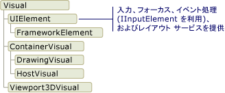
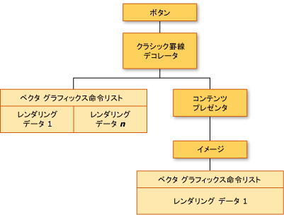
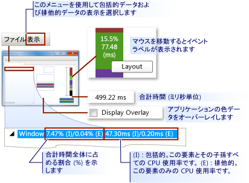
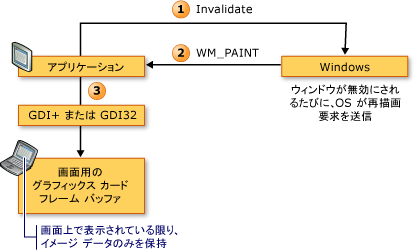
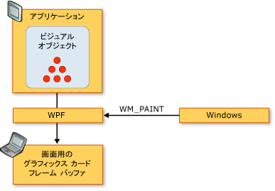
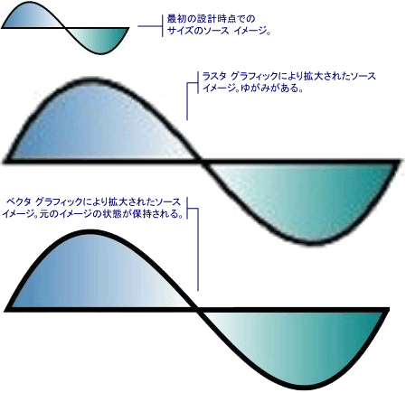
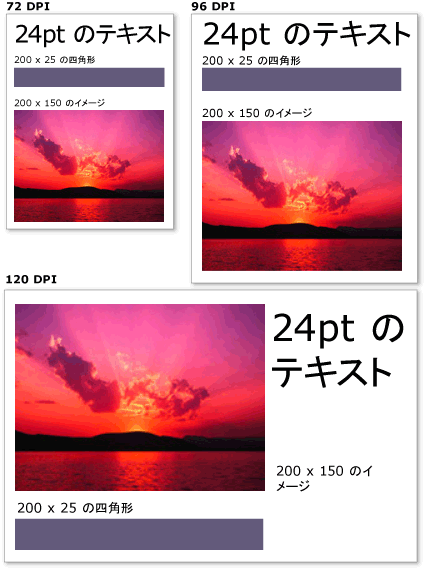

# WPF グラフィックス レンダリングの概要
ここでは、[!INCLUDE[TLA2#tla_winclient](../../../../includes/tla2sharptla-winclient-md.md)] のビジュアル層の概要について説明します。  [!INCLUDE[TLA2#tla_winclient](../../../../includes/tla2sharptla-winclient-md.md)] モデルのレンダリング サポートに関する <xref:System.Windows.Media.Visual> クラスの役割に重点を置いて説明します。  
  
   
  
   
## ビジュアル オブジェクトの役割  
 <xref:System.Windows.Media.Visual> クラスは、すべての <xref:System.Windows.FrameworkElement> オブジェクトの派生元となる基本抽象クラスです。  また、このクラスは、[!INCLUDE[TLA2#tla_winclient](../../../../includes/tla2sharptla-winclient-md.md)] で新しいコントロールを作成するためのエントリ ポイントとしても機能し、多くの点で Win32 アプリケーション モデルのウィンドウ ハンドル \(HWND\) と考えることができます。  
  
 <xref:System.Windows.Media.Visual> オブジェクトは、[!INCLUDE[TLA2#tla_winclient](../../../../includes/tla2sharptla-winclient-md.md)] の中心的なオブジェクトであり、その第一の役割は描画をサポートすることです。  <xref:System.Windows.Controls.Button> および <xref:System.Windows.Controls.TextBox> などのユーザー インターフェイス コントロールは、<xref:System.Windows.Media.Visual> クラスから派生し、このクラスを使用して描画データを保持します。  <xref:System.Windows.Media.Visual> オブジェクトは、以下をサポートしています。  
  
-   出力表示 : ビジュアルのシリアル化された永続的な描画内容を表示します。  
  
-   変換 : ビジュアルで変換を実行します。  
  
-   クリッピング : ビジュアルのクリッピング領域をサポートします。  
  
-   ヒット テスト : 座標またはジオメトリがビジュアルの境界内に含まれているかどうかを判断します。  
  
-   境界ボックスの計算 : ビジュアルの外接する四角形を決定します。  
  
 ただし、<xref:System.Windows.Media.Visual> オブジェクトでは、次のような描画以外の機能はサポートしていません。  
  
-   イベント処理  
  
-   \[レイアウト\]  
  
-   スタイル  
  
-   データ バインディング  
  
-   グローバリゼーション  
  
 <xref:System.Windows.Media.Visual> は、パブリック抽象クラスとして公開され、子クラスはこのクラスから派生する必要があります。  [!INCLUDE[TLA2#tla_winclient](../../../../includes/tla2sharptla-winclient-md.md)] で公開されるビジュアル オブジェクトの階層構造を次の図に示します。  
  
   
Visual クラスの階層構造  
  
### DrawingVisual クラス  
 <xref:System.Windows.Media.DrawingVisual> は、図形、イメージ、またはテキストの描画に使用する軽量の描画クラスです。  このクラスが軽量と見なされる理由は、レイアウトやイベントの処理を実現しないため、実行時のパフォーマンスが向上するからです。  このため、背景やクリップ アートの描画に適しています。  <xref:System.Windows.Media.DrawingVisual> を使用すると、カスタム ビジュアル オブジェクトを作成できます。  詳細については、「[DrawingVisual オブジェクトの使用](../../../../docs/framework/wpf/graphics-multimedia/using-drawingvisual-objects.md)」を参照してください。  
  
### Viewport3DVisual クラス  
 <xref:System.Windows.Media.Media3D.Viewport3DVisual> は、2D <xref:System.Windows.Media.Visual> と <xref:System.Windows.Media.Media3D.Visual3D> オブジェクト間のブリッジを提供します。  <xref:System.Windows.Media.Media3D.Visual3D> クラスは、すべての 3D ビジュアル要素の基本クラスです。  <xref:System.Windows.Media.Media3D.Viewport3DVisual> では、<xref:System.Windows.Media.Media3D.Viewport3DVisual.Camera%2A> 値と <xref:System.Windows.Media.Media3D.Viewport3DVisual.Viewport%2A> 値を定義する必要があります。  カメラを使用するとシーンを表示できます。  ビューポートは、投影が 2D サーフェイス上にマップされる場所を設定します。  [!INCLUDE[TLA2#tla_winclient](../../../../includes/tla2sharptla-winclient-md.md)] の 3D の詳細については、「[3\-D グラフィックスの概要](../../../../docs/framework/wpf/graphics-multimedia/3-d-graphics-overview.md)」を参照してください。  
  
### ContainerVisual クラス  
 <xref:System.Windows.Media.ContainerVisual> クラスは、<xref:System.Windows.Media.Visual> オブジェクトのコレクションのコンテナーとして使用されます。  <xref:System.Windows.Media.DrawingVisual> クラスは、<xref:System.Windows.Media.ContainerVisual> クラスから派生するため、ビジュアル オブジェクトのコレクションを格納できます。  
  
### ビジュアル オブジェクトの描画コンテンツ  
 <xref:System.Windows.Media.Visual> オブジェクトは、レンダリング データをベクター グラフィックス命令リストとして格納します。  命令リスト内の各項目は、シリアル化された形式のグラフィックス データおよび関連リソースの低レベル セットを表します。  描画コンテンツを格納可能なレンダリング データには次の 4 種類があります。  
  
|描画コンテンツの種類|Description|  
|----------------|-----------------|  
|ベクター グラフィックス|ベクター グラフィックス データと、関連する <xref:System.Windows.Media.Brush> および <xref:System.Windows.Media.Pen> の情報を表します。|  
|Image|<xref:System.Windows.Rect> で定義されている領域内のイメージを表します。|  
|グリフ|指定したフォント リソースからの一連のグリフである <xref:System.Windows.Media.GlyphRun> をレンダリングする描画を表します。  これはテキストの表示方法です。|  
|モニター|ビデオをレンダリングする描画を表します。|  
  
 <xref:System.Windows.Media.DrawingContext> を使用すると、<xref:System.Windows.Media.Visual> にビジュアル コンテンツを読み込むことができます。  <xref:System.Windows.Media.DrawingContext> オブジェクトの描画コマンドを使用すると、リアルタイムで画面に描画するのではなく、実際にはグラフィックス システムで今後使用する一連のレンダリング データが格納されます。  
  
 <xref:System.Windows.Controls.Button> などの [!INCLUDE[TLA2#tla_winclient](../../../../includes/tla2sharptla-winclient-md.md)] コントロールを作成した場合、そのコントロールは、それ自身を描画するためのレンダリング データを暗黙的に生成します。  たとえば、<xref:System.Windows.Controls.Button> の <xref:System.Windows.Controls.ContentControl.Content%2A> プロパティを設定すると、グリフのレンダリング表現がコントロールに格納されます。  
  
 <xref:System.Windows.Media.Visual> のコンテンツは、<xref:System.Windows.Media.DrawingGroup> 内の 1 つ以上の <xref:System.Windows.Media.Drawing> オブジェクトとして表されます。  <xref:System.Windows.Media.DrawingGroup> は、コンテンツに適用される不透明マスク、変換、ビットマップ効果などの操作も表します。  コンテンツがレンダリングされるときには、<xref:System.Windows.Media.DrawingGroup.OpacityMask%2A>、<xref:System.Windows.Media.DrawingGroup.Opacity%2A>、<xref:System.Windows.Media.DrawingGroup.BitmapEffect%2A>、<xref:System.Windows.Media.DrawingGroup.ClipGeometry%2A>、<xref:System.Windows.Media.DrawingGroup.GuidelineSet%2A>、そして <xref:System.Windows.Media.DrawingGroup.Transform%2A> の順に <xref:System.Windows.Media.DrawingGroup> 操作が適用されます。  
  
 レンダリング シーケンス中に <xref:System.Windows.Media.DrawingGroup> 操作が適用される順序を次の図に示します。  
  
   
DrawingGroup 操作の順序  
  
 詳細については、「[Drawing オブジェクトの概要](../../../../docs/framework/wpf/graphics-multimedia/drawing-objects-overview.md)」を参照してください。  
  
#### ビジュアル層での描画コンテンツ  
 <xref:System.Windows.Media.DrawingContext> を直接インスタンス化することはできませんが、<xref:System.Windows.Media.DrawingGroup.Open%2A?displayProperty=fullName> や <xref:System.Windows.Media.DrawingVisual.RenderOpen%2A?displayProperty=fullName> などの一部のメソッドから描画コンテキストを取得できます。  <xref:System.Windows.Media.DrawingVisual> から <xref:System.Windows.Media.DrawingContext> を取得して四角形の描画に使用する例を次に示します。  
  
 [!code-csharp[drawingvisualsample#101](../../../../samples/snippets/csharp/VS_Snippets_Wpf/DrawingVisualSample/CSharp/Window1.xaml.cs#101)]
 [!code-vb[drawingvisualsample#101](../../../../samples/snippets/visualbasic/VS_Snippets_Wpf/DrawingVisualSample/visualbasic/window1.xaml.vb#101)]  
  
#### ビジュアル層で描画コンテンツを列挙する  
 <xref:System.Windows.Media.Drawing> オブジェクトは、他の用途に加えて、<xref:System.Windows.Media.Visual> のコンテンツを列挙するためのオブジェクト モデルも提供します。  
  
> [!NOTE]
>  ビジュアルのコンテンツの列挙の際には、ベクター グラフィックス命令リストとして基になるレンダリング データ表現を取得しているのではなく、<xref:System.Windows.Media.Drawing> オブジェクトを取得しています。  
  
 <xref:System.Windows.Media.VisualTreeHelper.GetDrawing%2A> メソッドを使用して、<xref:System.Windows.Media.Visual> の <xref:System.Windows.Media.DrawingGroup> 値を取得し列挙する例を次に示します。  
  
 [!code-csharp[DrawingMiscSnippets_snip#GraphicsMMRetrieveDrawings](../../../../samples/snippets/csharp/VS_Snippets_Wpf/DrawingMiscSnippets_snip/CSharp/EnumerateDrawingsExample.xaml.cs#graphicsmmretrievedrawings)]  
  
   
## ビジュアル オブジェクトを使用してコントロールをビルドする方法  
 [!INCLUDE[TLA2#tla_winclient](../../../../includes/tla2sharptla-winclient-md.md)] のオブジェクトの多くは、他のビジュアル オブジェクトで構成されています。これは、子孫オブジェクトのさまざまな階層をこれらのオブジェクトに格納できることを意味します。  [!INCLUDE[TLA2#tla_winclient](../../../../includes/tla2sharptla-winclient-md.md)] のユーザー インターフェイス要素 \(コントロールなど\) の多くは、さまざまな種類のレンダリング要素を表す複数のビジュアル オブジェクトで構成されています。  たとえば、<xref:System.Windows.Controls.Button> コントロールは、<xref:Microsoft.Windows.Themes.ClassicBorderDecorator>、<xref:System.Windows.Controls.ContentPresenter>、<xref:System.Windows.Controls.TextBlock> など他の多数のオブジェクトを格納できます。  
  
 次のコードは、マークアップで定義されている <xref:System.Windows.Controls.Button> コントロールを示しています。  
  
 [!code-xml[VisualsOverview#VisualsOverviewSnippet1](../../../../samples/snippets/csharp/VS_Snippets_Wpf/VisualsOverview/CSharp/Window1.xaml#visualsoverviewsnippet1)]  
  
 既定の <xref:System.Windows.Controls.Button> コントロールを構成するビジュアル オブジェクトを列挙すると、次の図に示すビジュアル オブジェクトの階層がわかります。  
  
   
ビジュアル ツリー階層の図  
  
 <xref:System.Windows.Controls.Button> コントロールには <xref:Microsoft.Windows.Themes.ClassicBorderDecorator> 要素が含まれており、さらにこの要素には <xref:System.Windows.Controls.ContentPresenter> 要素が含まれています。  <xref:Microsoft.Windows.Themes.ClassicBorderDecorator> 要素は、<xref:System.Windows.Controls.Button> の境界線と背景を描画します。  <xref:System.Windows.Controls.ContentPresenter> 要素は、<xref:System.Windows.Controls.Button> の内容を表示します。  この場合、テキストを表示しているため、<xref:System.Windows.Controls.ContentPresenter> 要素には <xref:System.Windows.Controls.TextBlock> 要素が格納されています。  <xref:System.Windows.Controls.Button> コントロールは <xref:System.Windows.Controls.ContentPresenter> を使用します。これは、<xref:System.Windows.Controls.Image> やジオメトリ \(<xref:System.Windows.Media.EllipseGeometry> など\) など他の要素でコンテンツを表現できるということを意味します。  
  
### コントロール テンプレート  
 コントロールをコントロールの階層に拡張する場合、<xref:System.Windows.Controls.ControlTemplate> が重要になります。  コントロール テンプレートは、コントロールの既定のビジュアル階層を指定します。  コントロールを明示的に参照すると、コントロールのビジュアル階層が暗黙的に参照されます。  コントロール テンプレートの既定値をオーバーライドして、コントロールの外観をカスタマイズできます。  たとえば、<xref:System.Windows.Controls.Button> コントロールの背景色の値を変更して、純色値の代わりに線形グラデーション値を使用することができます。  詳細については、「[ボタンのスタイルとテンプレート](../../../../docs/framework/wpf/controls/button-styles-and-templates.md)」を参照してください。  
  
 <xref:System.Windows.Controls.Button> コントロールなどのユーザー インターフェイス要素には、コントロールのすべてのレンダリング定義を表す複数のベクター グラフィックス命令リストが含まれています。  次のコードは、マークアップで定義されている <xref:System.Windows.Controls.Button> コントロールを示しています。  
  
 [!code-xml[VisualsOverview#VisualsOverviewSnippet2](../../../../samples/snippets/csharp/VS_Snippets_Wpf/VisualsOverview/CSharp/Window1.xaml#visualsoverviewsnippet2)]  
  
 <xref:System.Windows.Controls.Button> コントロールを構成するビジュアル オブジェクトとベクター グラフィックス命令リストを列挙すると、次の図に示すビジュアル オブジェクトの階層がわかります。  
  
   
ビジュアル ツリーおよびレンダリング データの図  
  
 <xref:System.Windows.Controls.Button> コントロールには <xref:Microsoft.Windows.Themes.ClassicBorderDecorator> 要素が含まれており、さらにこの要素には <xref:System.Windows.Controls.ContentPresenter> 要素が含まれています。  <xref:Microsoft.Windows.Themes.ClassicBorderDecorator> 要素は、ボタンの境界線と背景を構成する個々のグラフィックス要素をすべて描画します。  <xref:System.Windows.Controls.ContentPresenter> 要素は、<xref:System.Windows.Controls.Button> の内容を表示します。  この場合、イメージを表示しているため、<xref:System.Windows.Controls.ContentPresenter> 要素には <xref:System.Windows.Controls.Image> 要素が格納されています。  
  
 ビジュアル オブジェクトとベクター グラフィックス命令リストの階層については、次の点に注意する必要があります。  
  
-   階層内の順序は、描画情報のレンダリング順序を表します。  子要素は、ルート ビジュアル要素を起点として、左から右、上から下に走査されます。  要素が子ビジュアル要素を持つ場合、子ビジュアル要素は要素の兄弟の前に走査されます。  
  
-   階層内の非リーフ要素 \(<xref:System.Windows.Controls.ContentPresenter> など\) は子要素の格納に使用されます。これらの要素には、命令リストは格納されません。  
  
-   ベクター グラフィックス命令リストとビジュアル子の両方がビジュアル要素に含まれている場合、ビジュアル子オブジェクトが描画される前に、親ビジュアル要素の命令リストがレンダリングされます。  
  
-   ベクター グラフィックス命令リスト内の項目は、左から右の順にレンダリングされます。  
  
   
## ビジュアル ツリー  
 ビジュアル ツリーには、アプリケーションのユーザー インターフェイスで使用するすべてのビジュアル要素が含まれます。  ビジュアル要素には永続化された描画情報が含まれているため、ビジュアル ツリーは、ディスプレイ デバイスへの出力を構成するのに必要なレンダリング情報をすべて含むシーン グラフであると考えることができます。  このツリーは、コードかマークアップかを問わず、アプリケーションで直接作成されたすべてのビジュアル要素を累積したものです。  ビジュアル ツリーには、コントロールやデータ オブジェクトなどの要素のテンプレート拡張によって作成されたビジュアル要素もすべて含まれます。  
  
 マークアップで定義された <xref:System.Windows.Controls.StackPanel> 要素を次のコードに示します。  
  
 [!code-xml[VisualsOverview#VisualsOverviewSnippet3](../../../../samples/snippets/csharp/VS_Snippets_Wpf/VisualsOverview/CSharp/Window1.xaml#visualsoverviewsnippet3)]  
  
 マークアップ例の <xref:System.Windows.Controls.StackPanel> 要素を構成するビジュアル オブジェクトを列挙すると、次の図に示すビジュアル オブジェクトの階層がわかります。  
  
   
ビジュアル ツリー階層の図  
  
### レンダリング順序  
 ビジュアル ツリーは、[!INCLUDE[TLA2#tla_winclient](../../../../includes/tla2sharptla-winclient-md.md)] のビジュアル オブジェクトと描画オブジェクトの表示順序を決定します。  検査の順序は、ビジュアル ツリーの最上位ノードであるルート ビジュアルで始まります。  次に、ルート ビジュアルの子が左から右に走査されます。  ビジュアルが子を持つ場合、子はビジュアルの兄弟の前に走査されます。  つまり、子ビジュアルの内容は、そのビジュアル自体の内容の前に表示されます。  
  
   
ビジュアル ツリー レンダリング順序の図  
  
### ルート ビジュアル  
 ルート ビジュアルは、ビジュアル ツリー階層内の最上位の要素です。  ほとんどのアプリケーションでは、ルート ビジュアルの基本クラスは <xref:System.Windows.Window> または <xref:System.Windows.Navigation.NavigationWindow> のいずれかです。  ただし、ビジュアル オブジェクトを Win32 アプリケーションでホストする場合は、Win32 ウィンドウにホストする最上位のビジュアルがルート ビジュアルになります。  詳細については、「[チュートリアル : Win32 アプリケーションでのビジュアル オブジェクトのホスト](../../../../docs/framework/wpf/graphics-multimedia/tutorial-hosting-visual-objects-in-a-win32-application.md)」を参照してください。  
  
### 論理ツリーとの関係  
 [!INCLUDE[TLA2#tla_winclient](../../../../includes/tla2sharptla-winclient-md.md)] の論理ツリーは、実行時のアプリケーションの要素を表します。  このツリーを直接操作することはありませんが、アプリケーションのこのビューは、プロパティの継承やイベントのルーティングを理解する上で役立ちます。  ビジュアル ツリーとは異なり、論理ツリーは、<xref:System.Windows.Documents.ListItem> などのビジュアル データ オブジェクト以外のオブジェクトを表すことができます。  多くの場合、論理ツリーはアプリケーションのマークアップ定義にほぼ一致します。  マークアップで定義された <xref:System.Windows.Controls.DockPanel> 要素を次のコードに示します。  
  
 [!code-xml[VisualsOverview#VisualsOverviewSnippet5](../../../../samples/snippets/csharp/VS_Snippets_Wpf/VisualsOverview/CSharp/Window1.xaml#visualsoverviewsnippet5)]  
  
 マークアップ例の <xref:System.Windows.Controls.DockPanel> 要素を構成する論理オブジェクトを列挙すると、次の図に示す論理オブジェクトの階層がわかります。  
  
   
論理ツリーの図  
  
 ビジュアル ツリーおよび論理ツリーは、現在のアプリケーション要素のセットと同期し、要素の追加、削除、または変更をすべて反映します。  ただし、ツリーにはアプリケーションの異なるビューが表示されます。  ビジュアル ツリーとは異なり、論理ツリーでは、コントロールの <xref:System.Windows.Controls.ContentPresenter> が展開されません。  これは、論理ツリーとビジュアルツリーが同一のオブジェクト セットに対して 1 対 1 で直接対応しないということを意味します。  実際、同一の要素をパラメーターとして使用して、**LogicalTreeHelper** オブジェクトの <xref:System.Windows.LogicalTreeHelper.GetChildren%2A> メソッドと **VisualTreeHelper** オブジェクトの <xref:System.Windows.Media.VisualTreeHelper.GetChild%2A> メソッドを呼び出すと、異なる結果が返されます。  
  
 論理ツリーの詳細については、「[WPF のツリー](../../../../docs/framework/wpf/advanced/trees-in-wpf.md)」を参照してください。  
  
### XamlPad を使用したビジュアル ツリーの表示  
 [!INCLUDE[TLA2#tla_winclient](../../../../includes/tla2sharptla-winclient-md.md)] ツールである XamlPad は、現在定義されている[!INCLUDE[TLA#tla_titlexaml](../../../../includes/tlasharptla-titlexaml-md.md)] コンテンツに対応するビジュアル ツリーを表示および探索するためのオプションを提供します。  ビジュアル ツリーを表示するには、メニュー バーの \[Show Visual Tree\] ボタンをクリックします。  XamlPad の \[Visual Tree Explorer\] パネルのビジュアル ツリー ノードに展開された [!INCLUDE[TLA#tla_titlexaml](../../../../includes/tlasharptla-titlexaml-md.md)] コンテンツを次の図に示します。  
  
   
XamlPad の Visual Tree Explorer パネル  
  
 XamlPad の \[Visual Tree Explorer\] パネルでは、<xref:System.Windows.Controls.Label>、<xref:System.Windows.Controls.TextBox>、および <xref:System.Windows.Controls.Button> の各コントロールが別々のビジュアル オブジェクト階層を表示していることに注意してください。  これは、[!INCLUDE[TLA2#tla_winclient](../../../../includes/tla2sharptla-winclient-md.md)] コントロールにそのコントロールのビジュアル ツリーを含む <xref:System.Windows.Controls.ControlTemplate> があるためです。  コントロールを明示的に参照すると、コントロールのビジュアル階層が暗黙的に参照されます。  
  
### ビジュアル パフォーマンスのプロファイリング  
 [!INCLUDE[TLA2#tla_winclient](../../../../includes/tla2sharptla-winclient-md.md)] は、アプリケーションの実行時の動作を分析したり、適用可能なパフォーマンス最適化の種類を決定できるパフォーマンス プロファイリング ツール スイートを提供します。  ビジュアル プロファイラー ツール スイートでは、アプリケーションのビジュアル ツリーに直接マップすることにより、パフォーマンス データを多彩なグラフィカル ビューで示します。  このスクリーンショットでは、ビジュアル プロファイラーの **\[CPU 使用率\]** セクションに、レンダリングやレイアウトなど、[!INCLUDE[TLA2#tla_winclient](../../../../includes/tla2sharptla-winclient-md.md)] サービスのオブジェクトの使用率の詳細が示されています。  
  
   
ビジュアル プロファイラー表示出力  
  
   
## ビジュアル レンダリング動作  
 [!INCLUDE[TLA2#tla_winclient](../../../../includes/tla2sharptla-winclient-md.md)] では、保持モード グラフィックス、ベクター グラフィックス、デバイスに依存しないグラフィックスといった、ビジュアル オブジェクトのレンダリング動作に影響を及ぼす機能が導入されています。  
  
### 保持モード グラフィックス  
 ビジュアル オブジェクトの役割を理解するためには、即時モードのグラフィックス システムと保持モードのグラフィックス システムの違いについて理解することが重要です。  GDI または GDI\+ に基づく標準的な Win32 アプリケーションでは、即時モードのグラフィックス システムが使用されます。  これは、ウィンドウのサイズ変更やオブジェクトの外観の変更などのアクションによって無効化されたクライアント領域の部分を、アプリケーションが再描画するということを意味します。  
  
   
Win32 レンダリング シーケンスの図  
  
 一方、[!INCLUDE[TLA2#tla_winclient](../../../../includes/tla2sharptla-winclient-md.md)] では、保持モード システムが使用されます。  これは、外観を持つアプリケーション オブジェクトがシリアル化された一連の描画データを定義するということを意味します。  描画データが定義された後は、アプリケーション オブジェクトをレンダリングするために、システムがすべての再描画要求に応答します。  実行時であっても、アプリケーション オブジェクトを変更または作成し、描画要求に対する応答を引き続きシステムに任せることができます。  保持モードのグラフィックス システムでは、アプリケーションによって描画情報が常にシリアル化された状態に保たれます。ただし、レンダリングはシステムによって実行されます。これは保持モードのグラフィックス システムの長所です。  次の図は、アプリケーションが描画要求への応答で [!INCLUDE[TLA2#tla_winclient](../../../../includes/tla2sharptla-winclient-md.md)] に依存しているしくみを示しています。  
  
   
WPF レンダリング シーケンスの図  
  
#### 高度な再描画  
 保持モード グラフィックスを使用することの最も大きな利点の 1 つは、[!INCLUDE[TLA2#tla_winclient](../../../../includes/tla2sharptla-winclient-md.md)] がアプリケーション内の再描画を必要とする項目を効率的に最適化できることです。  さまざまな不透明度を持つ複雑なシーンがある場合でも、特別な目的を持つコードを記述して再描画を最適化する必要は通常ありません。  これと Win32 プログラミングを比較してください。Win32 プログラミングでは、更新領域での再描画量を最小化してアプリケーションを最適化するのに多大な労力を費やすことがあります。  Win32 アプリケーションでの再描画の最適化に関連する複雑さの例については、「[Redrawing in the Update Region](_win32_Redrawing_in_the_Update_Region)」を参照してください。  
  
### ベクター グラフィックス  
 [!INCLUDE[TLA2#tla_winclient](../../../../includes/tla2sharptla-winclient-md.md)] では、ベクター グラフィックスがレンダリング データ形式として使用されます。  スケーラブル ベクター グラフィックス \(SVG\)、Windows メタファイル \(.wmf\)、TrueType フォントなどのベクター グラフィックスは、レンダリング データを格納し、グラフィックス プリミティブを使用してイメージを再作成する方法を表す命令リストとして送信します。  たとえば、TrueType フォントは、ピクセル配列ではなく、直線、曲線、およびコマンドのセットを表すアウトライン フォントです。  ベクター グラフィックスの主な利点の 1 つは、任意のサイズおよび解像度にスケーリングできることです。  
  
 ベクター グラフィックスとは異なり、ビットマップ グラフィックスは、特定の解像度で事前にレンダリングされたピクセル単位のイメージ表現としてレンダリング データを格納します。  ビットマップ グラフィックス形式とベクター グラフィックス形式の主な違いの 1 つは、元のソース イメージへの忠実性です。  たとえば、ソース イメージのサイズを変更した場合、ビットマップ グラフィックス システムではイメージが伸縮されます。一方、ベクター グラフィックス システムでは、イメージがスケーリングされるため、イメージの忠実性が保持されます。  
  
 3 倍に拡大されたソース イメージを次の図に示します。  ソース イメージをビットマップ グラフィックス イメージとして伸縮した場合、イメージにゆがみが生じることに注意してください。ベクター グラフィックス イメージとしてスケーリングした場合、こうしたゆがみは生じません。  
  
   
ラスター グラフィックスとベクター グラフィックスの違い  
  
 次のマークアップでは、2 つの <xref:System.Windows.Shapes.Path> 要素を定義しています。  2 番目の要素では、<xref:System.Windows.Media.ScaleTransform> を使用して、最初の要素の描画命令を 3 倍に拡大しています。  <xref:System.Windows.Shapes.Path> 要素の描画命令は変更されないことに注意してください。  
  
 [!code-xml[VectorGraphicsSnippets#VectorGraphicsSnippet1](../../../../samples/snippets/csharp/VS_Snippets_Wpf/VectorGraphicsSnippets/CS/PageOne.xaml#vectorgraphicssnippet1)]  
  
### 解像度およびデバイスに依存しないグラフィックスについて  
 画面上のテキストとグラフィックスのサイズを決定するシステム要素には、解像度と DPI の 2 つがあります。  解像度は、画面に表示されるピクセルの数を表します。  解像度が高くなるとピクセルが小さくなり、グラフィックスとテキストがより滑らかに表示されます。  解像度が 1024 x 768 に設定されたモニターに表示されるグラフィックスは、解像度を 1600 x 1200 に変更すると、一段と小さく表示されます。  
  
 もう 1 つのシステム設定である DPI は、画面上の 1 インチのサイズをピクセル単位で表したものです。  ほとんどの [!INCLUDE[TLA#tla_mswin](../../../../includes/tlasharptla-mswin-md.md)] システムは 96 DPI であり、これは、画面上の 1 インチが 96 ピクセルであることを意味します。  DPI の設定を上げると、画面上の 1 インチが長くなり、設定を下げると、画面上の 1 インチが短くなります。  このため、画面上の 1 インチと実際の 1 インチは同じサイズでなく、ほとんどのシステムで異なる可能性があります。  DPI を大きくすると、画面上の 1 インチのサイズが大きくなるため、DPI 対応のグラフィックスとテキストは大きくなります。  DPI を大きくすると、特に高解像度の場合にはテキストが読みやすくなります。  
  
 すべてのアプリケーションが DPI に対応しているわけではありません。一部のアプリケーションでは、主要な測定単位としてハードウェア ピクセルが使用されているため、システム DPI を変更しても影響がありません。  また、フォント サイズを表す場合は DPI 対応の単位を使用しても、それ以外にはすべてピクセルを使用するアプリケーションも数多くあります。  これらのアプリケーションで DPI を過度に小さくしたり、大きくしたりすると、アプリケーションのテキストがシステムの DPI 設定に従ってスケーリングされても、アプリケーションの UI はスケーリングされないため、レイアウトの問題が発生する可能性があります。  この問題は [!INCLUDE[TLA2#tla_winclient](../../../../includes/tla2sharptla-winclient-md.md)] を使用して開発されたアプリケーションでは発生しません。  
  
 [!INCLUDE[TLA2#tla_winclient](../../../../includes/tla2sharptla-winclient-md.md)] では、ハードウェア ピクセルの代わりにデバイス非依存ピクセルを主要測定単位として用いた自動拡大縮小機能がサポートされています。つまり、アプリケーション開発者が手を加えなくても、グラフィックスとテキストが適切に拡大縮小されます。  次の図は [!INCLUDE[TLA2#tla_winclient](../../../../includes/tla2sharptla-winclient-md.md)] のテキストとグラフィックスが DPI が異なる場合にどのように表示されるかを示したものです。  
  
   
さまざまな DPI 設定のグラフィックとテキスト  
  
   
## VisualTreeHelper クラス  
 <xref:System.Windows.Media.VisualTreeHelper> クラスは、ビジュアル オブジェクト レベルでの低レベルのプログラミング機能を提供する静的なヘルパー クラスです。このプログラミング機能は、高性能のカスタム コントロールの開発など、非常に限定されたシナリオで役立ちます。  ほとんどの場合、より高レベルの [!INCLUDE[TLA2#tla_winclient](../../../../includes/tla2sharptla-winclient-md.md)]フレームワーク \(<xref:System.Windows.Controls.Canvas> や <xref:System.Windows.Controls.TextBlock> など\) を使用することで、柔軟性と使いやすさが向上します。  
  
### ヒット テスト  
 <xref:System.Windows.Media.VisualTreeHelper> クラスは、ビジュアル オブジェクトに対するヒット テストのためのメソッドを提供します。既定のヒット テスト サポートが要件を満たさない場合は、これらのメソッドを使用できます。  <xref:System.Windows.Media.VisualTreeHelper> クラスの <xref:System.Windows.Media.VisualTreeHelper.HitTest%2A> メソッドを使用すると、ジオメトリまたはポイントの座標値が特定のオブジェクト \(コントロールやグラフィック要素など\) の境界内にあるかどうかを確認できます。  たとえば、ヒット テストを使用することで、オブジェクトの外接する四角形内でのマウス クリックが円のジオメトリ内にあるかどうかを確認できます。また、ヒット テストの既定の実装をオーバーライドして、独自のカスタム ヒット テスト計算を実行することもできます。  
  
 ヒット テストの詳細については、「[ビジュアル層でのヒット テスト](../../../../docs/framework/wpf/graphics-multimedia/hit-testing-in-the-visual-layer.md)」参照してください。  
  
### ビジュアル ツリーを列挙する  
 <xref:System.Windows.Media.VisualTreeHelper> クラスは、ビジュアル ツリーのメンバーを列挙するための機能を提供します。  親を取得するには、<xref:System.Windows.Media.VisualTreeHelper.GetParent%2A> メソッドを呼び出します。  ビジュアル オブジェクトの子または直接の子孫を取得するには、<xref:System.Windows.Media.VisualTreeHelper.GetChild%2A> メソッドを呼び出します。  このメソッドは、指定したインデックス位置にある親の子 <xref:System.Windows.Media.Visual> を返します。  
  
 ビジュアル オブジェクトのすべての子孫を列挙する方法を次の例に示します。これは、ビジュアル オブジェクト階層のすべての描画情報のシリアル化が必要である場合に使用できる手法です。  
  
 [!code-csharp[VisualsOverview#101](../../../../samples/snippets/csharp/VS_Snippets_Wpf/VisualsOverview/CSharp/Window1.xaml.cs#101)]
 [!code-vb[VisualsOverview#101](../../../../samples/snippets/visualbasic/VS_Snippets_Wpf/VisualsOverview/visualbasic/window1.xaml.vb#101)]  
  
 ほとんどの場合、[!INCLUDE[TLA2#tla_winclient](../../../../includes/tla2sharptla-winclient-md.md)] アプリケーションの要素を表すときには論理ツリーの方が役立ちます。  論理ツリーを直接変更することはありませんが、アプリケーションのこのビューは、プロパティの継承やイベントのルーティングを理解する上で役立ちます。  ビジュアル ツリーとは異なり、論理ツリーは、<xref:System.Windows.Documents.ListItem> などのビジュアル データ オブジェクト以外のオブジェクトを表すことができます。  論理ツリーの詳細については、「[WPF のツリー](../../../../docs/framework/wpf/advanced/trees-in-wpf.md)」を参照してください。  
  
 <xref:System.Windows.Media.VisualTreeHelper> クラスは、ビジュアル オブジェクトの外接する四角形を返すメソッドを提供します。  <xref:System.Windows.Media.VisualTreeHelper.GetContentBounds%2A> を呼び出すと、ビジュアル オブジェクトの外接する四角形が返されます。  <xref:System.Windows.Media.VisualTreeHelper.GetDescendantBounds%2A> を呼び出すと、ビジュアル オブジェクトのすべての子孫 \(ビジュアル オブジェクト自体も含む\) の外接する四角形が返されます。  ビジュアル オブジェクトとそのすべての子孫の外接する四角形を計算する方法を次のコード例に示します。  
  
 [!code-csharp[VisualsOverview#102](../../../../samples/snippets/csharp/VS_Snippets_Wpf/VisualsOverview/CSharp/Window1.xaml.cs#102)]
 [!code-vb[VisualsOverview#102](../../../../samples/snippets/visualbasic/VS_Snippets_Wpf/VisualsOverview/visualbasic/window1.xaml.vb#102)]  
  
## 参照  
 <xref:System.Windows.Media.Visual>   
 <xref:System.Windows.Media.VisualTreeHelper>   
 <xref:System.Windows.Media.DrawingVisual>   
 [2D グラフィックスとイメージング](../../../../docs/framework/wpf/advanced/optimizing-performance-2d-graphics-and-imaging.md)   
 [ビジュアル層でのヒット テスト](../../../../docs/framework/wpf/graphics-multimedia/hit-testing-in-the-visual-layer.md)   
 [DrawingVisual オブジェクトの使用](../../../../docs/framework/wpf/graphics-multimedia/using-drawingvisual-objects.md)   
 [チュートリアル : Win32 アプリケーションでのビジュアル オブジェクトのホスト](../../../../docs/framework/wpf/graphics-multimedia/tutorial-hosting-visual-objects-in-a-win32-application.md)   
 [WPF アプリケーションのパフォーマンスの最適化](../../../../docs/framework/wpf/advanced/optimizing-wpf-application-performance.md)