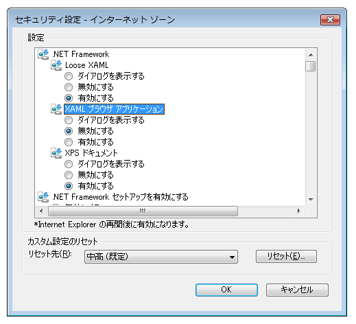

# セキュリティ (WPF)
 [!INCLUDE[TLA#tla_wpf](../../../includes/tlasharptla-wpf-md.md)] のスタンドアロン アプリケーションおよびブラウザー ホスト アプリケーションを開発する場合は、セキュリティ モデルを考慮する必要があります。[!INCLUDE[TLA2#tla_wpf](../../../includes/tla2sharptla-wpf-md.md)] スタンドアロン アプリケーションは、Windows インストーラー \(.msi\)、XCopy、または [!INCLUDE[TLA2#tla_clickonce](../../../includes/tla2sharptla-clickonce-md.md)] のいずれで配置されても、無制限のアクセス許可 \([!INCLUDE[TLA2#tla_cas](../../../includes/tla2sharptla-cas-md.md)] **FullTrust** アクセス許可セット\) で実行されます。  部分信頼を配置した場合は、ClickOnce を使用したスタンドアロン WPF アプリケーションはサポートされません。  ただし、完全信頼ホスト アプリケーションは、.NET Framework アドイン モデルを使用して部分信頼 <xref:System.AppDomain> を作成できます。  詳細については、「[WPF アドインの概要](../../../docs/framework/wpf/app-development/wpf-add-ins-overview.md)」を参照してください。  
  
 [!INCLUDE[TLA2#tla_wpf](../../../includes/tla2sharptla-wpf-md.md)] ブラウザー ホスト アプリケーションは、[!INCLUDE[TLA#tla_iegeneric](../../../includes/tlasharptla-iegeneric-md.md)] または Firefox によってホストされ、[!INCLUDE[TLA#tla_xbap#plural](../../../includes/tlasharptla-xbapsharpplural-md.md)] にすることも、Loose [!INCLUDE[TLA#tla_xaml](../../../includes/tlasharptla-xaml-md.md)] ドキュメントにすることもできます。詳細については、「[WPF XAML ブラウザー アプリケーションの概要](../../../docs/framework/wpf/app-development/wpf-xaml-browser-applications-overview.md)」を参照してください。  
  
 [!INCLUDE[TLA2#tla_wpf](../../../includes/tla2sharptla-wpf-md.md)] ブラウザー ホスト アプリケーションは、既定では部分信頼セキュリティ サンドボックス内で実行され、既定の [!INCLUDE[TLA2#tla_cas](../../../includes/tla2sharptla-cas-md.md)] インターネット ゾーン アクセス許可セットに制限されます。  これにより、一般的な Web アプリケーションが分離されるのと同じ方法で、[!INCLUDE[TLA2#tla_wpf](../../../includes/tla2sharptla-wpf-md.md)] ブラウザー ホスト アプリケーションがクライアント コンピューターから効果的に分離されます。  配置 URL のセキュリティ ゾーンおよびクライアントのセキュリティ構成に応じて、XBAP は特権を完全信頼まで昇格させることができます。  詳細については、「[WPF 部分信頼セキュリティ](../../../docs/framework/wpf/wpf-partial-trust-security.md)」を参照してください。  
  
 ここでは、[!INCLUDE[TLA#tla_wpf](../../../includes/tlasharptla-wpf-md.md)] のスタンドアロン アプリケーションとブラウザー ホストアプリケーションのセキュリティ モデルについて説明します。  
  
 このトピックは、次のセクションで構成されています。  
  
-   [安全なナビゲーション](#SafeTopLevelNavigation)  
  
-   [Web ブラウザーのセキュリティ設定](#InternetExplorerSecuritySettings)  
  
-   [WebBrowser コントロールと機能コントロール](#webbrowser_control_and_feature_controls)  
  
-   [部分信頼クライアント アプリケーションに対する APTCA アセンブリの無効化](#APTCA)  
  
-   [Loose XAML ファイルに対するサンドボックスの動作](#LooseContentSandboxing)  
  
-   [セキュリティを向上する WPF アプリケーションを開発するためのリソース](#BestPractices)  
  
   
## 安全なナビゲーション  
 [!INCLUDE[TLA2#tla_xbap#plural](../../../includes/tla2sharptla-xbapsharpplural-md.md)] の場合、[!INCLUDE[TLA2#tla_wpf](../../../includes/tla2sharptla-wpf-md.md)] はアプリケーションとブラウザーという 2 種類のナビゲーションを区別します。  
  
 アプリケーション ナビゲーションは、ブラウザーによってホストされるアプリケーション内のコンテンツの項目間のナビゲーションです。  ブラウザー ナビゲーションは、ブラウザー自体のコンテンツと場所の URL を変更するナビゲーションです。  アプリケーション ナビゲーション \(通常は XAML\) とブラウザー ナビゲーション \(通常は HTML\) の関係を次の図に示します。  
  
   
  
 [!INCLUDE[TLA2#tla_xbap](../../../includes/tla2sharptla-xbap-md.md)] の移動先として安全と見なされるコンテンツの種類は、主に、使用されるアプリケーション ナビゲーションとブラウザー ナビゲーションによって決まります。  
  
   
### アプリケーション ナビゲーションのセキュリティ  
 アプリケーション ナビゲーションが安全と見なされるのは、それが、次の 4 種類のコンテンツをサポートするパック [!INCLUDE[TLA2#tla_uri](../../../includes/tla2sharptla-uri-md.md)] で識別できる場合です。  
  
|コンテンツ タイプ|Description|URI の例|  
|---------------|-----------------|------------|  
|リソース|ビルドの種類が **Resource** のプロジェクトに追加されるファイル。|`pack://application:,,,/MyResourceFile.xaml`|  
|Content|ビルドの種類が **Content** のプロジェクトに追加されるファイル。|`pack://application:,,,/MyContentFile.xaml`|  
|起点サイト|ビルドの種類が **None** のプロジェクトに追加されるファイル。|`pack://siteoforigin:,,,/MySiteOfOriginFile.xaml`|  
|アプリケーション コード|コンパイルされた分離コードを含む XAML リソース、   または   ビルドの種類が **Page** のプロジェクトに追加される XAML ファイル。|`pack://application:,,,/MyResourceFile` `.xaml`|  
  
> [!NOTE]
>  アプリケーション データ ファイルとパック [!INCLUDE[TLA2#tla_uri#plural](../../../includes/tla2sharptla-urisharpplural-md.md)] の詳細については、「[WPF アプリケーションのリソース ファイル、コンテンツ ファイル、およびデータ ファイル](../../../docs/framework/wpf/app-development/wpf-application-resource-content-and-data-files.md)」を参照してください。  
  
 これらのコンテンツ タイプのファイルには、ユーザーまたはプログラムによって移動できます。  
  
-   **ユーザー ナビゲーション**。  ユーザーは <xref:System.Windows.Documents.Hyperlink> 要素をクリックして移動します。  
  
-   **プログラム ナビゲーション**。  アプリケーションは、<xref:System.Windows.Navigation.NavigationWindow.Source%2A?displayProperty=fullName> プロパティを設定するなど、ユーザーとは無関係に移動します。  
  
   
### ブラウザー ナビゲーションのセキュリティ  
 ブラウザー ナビゲーションは、次の条件の下でのみ安全と見なされます。  
  
-   **ユーザー ナビゲーション**。  ユーザーは、入れ子になった <xref:System.Windows.Controls.Frame> 内ではなく、メインの <xref:System.Windows.Navigation.NavigationWindow> 内にある <xref:System.Windows.Documents.Hyperlink> 要素をクリックすることで移動する。  
  
-   **ゾーン**。  移動先のコンテンツが、インターネットまたはローカル イントラネット上に存在する。  
  
-   **プロトコル**。  使用されるプロトコルは、**http**、**https**、**file**、または **mailto**。  
  
 これらの条件に適合しない方法で [!INCLUDE[TLA2#tla_xbap](../../../includes/tla2sharptla-xbap-md.md)] がコンテンツに移動しようとすると、<xref:System.Security.SecurityException> がスローされます。  
  
   
## Web ブラウザーのセキュリティ設定  
 コンピューターのセキュリティ設定により、Web ブラウザーに付与されるアクセス権が決まります。  Web ブラウザーには、Internet Explorer や PresentationHost.exe など、[WinINet](http://go.microsoft.com/fwlink/?LinkId=179379) API または [UrlMon](http://go.microsoft.com/fwlink/?LinkId=179383) API を使用するアプリケーションやコンポーネントがあります。  
  
 [!INCLUDE[TLA2#tla_iegeneric](../../../includes/tla2sharptla-iegeneric-md.md)] は、[!INCLUDE[TLA2#tla_iegeneric](../../../includes/tla2sharptla-iegeneric-md.md)] での実行が可能な機能を構成できる機構を備えています。これらの機能には、次のものがあります。  
  
-   [!INCLUDE[TLA2#tla_winfx](../../../includes/tla2sharptla-winfx-md.md)] 依存コンポーネント  
  
-   ActiveX コントロールおよびプラグイン  
  
-   ダウンロード  
  
-   スクリプト  
  
-   ユーザー認証  
  
 このような方法でセキュリティ保護できる機能のコレクションは、**インターネット**、**イントラネット**、**信頼済みサイト**、および**制限付きサイト**の各ゾーンのゾーン単位で構成されます。  次の手順では、セキュリティ設定を構成する方法について説明します。  
  
1.  **コントロール パネル**を開きます。  
  
2.  **\[ネットワークとインターネット\]** をクリックし、**\[インターネット オプション\]** をクリックします。  
  
     \[インターネット オプション\] ダイアログ ボックスが表示されます。  
  
3.  **\[セキュリティ\]** タブで、セキュリティ設定を構成するゾーンを選択します。  
  
4.  **\[レベルのカスタマイズ\]** をクリックします。  
  
     **\[セキュリティの設定\]** ダイアログ ボックスが表示されるので、選択したゾーンのセキュリティ設定を構成します。  
  
       
  
> [!NOTE]
>  \[インターネット オプション\] ダイアログ ボックスは、Internet Explorer から開くこともできます。  **\[ツール\]** をクリックし、**\[インターネット オプション\]** をクリックします。  
  
 [!INCLUDE[TLA#tla_ie7](../../../includes/tlasharptla-ie7-md.md)] 以降では、特に [!INCLUDE[TLA2#tla_winfx](../../../includes/tla2sharptla-winfx-md.md)] を対象にした次のセキュリティ設定があります。  
  
-   **Loose XAML**。  [!INCLUDE[TLA2#tla_iegeneric](../../../includes/tla2sharptla-iegeneric-md.md)] が Loose [!INCLUDE[TLA2#tla_xaml](../../../includes/tla2sharptla-xaml-md.md)] ファイルに移動できるかどうかを制御します  \(\[有効\]、\[無効\]、および \[ダイアログを表示する\] オプション\)。  
  
-   **XAML ブラウザー アプリケーション**。  [!INCLUDE[TLA2#tla_iegeneric](../../../includes/tla2sharptla-iegeneric-md.md)] が [!INCLUDE[TLA2#tla_xbap#plural](../../../includes/tla2sharptla-xbapsharpplural-md.md)] に移動して実行できるかどうかを制御します   \(\[有効\]、\[無効\]、および \[ダイアログを表示する\] オプション\)。  
  
 既定では、これらの設定は **\[インターネット\]**、**\[イントラネット\]**、および **\[信頼済みサイト\]** の各ゾーンではすべて有効になり、**\[制限付きサイト\]** ゾーンでは無効になります。  
  
   
### セキュリティ関連の WPF レジストリの設定  
 \[インターネット オプション\] から使用できるセキュリティ設定以外に、セキュリティ上重要なさまざまな WPF 機能を選択的にブロックするために次のレジストリ値を使用できます。  値は次のキーで定義されます。  
  
 `HKEY_LOCAL_MACHINE\SOFTWARE\Microsoft\.NETFramework\Windows Presentation Foundation\Features`  
  
 設定可能な値を次の表に示します。  
  
|値名|値型|値のデータ|  
|--------|--------|-----------|  
|XBAPDisallow|REG\_DWORD|許可しない場合は 1、許可する場合は 0。|  
|LooseXamlDisallow|REG\_DWORD|許可しない場合は 1、許可する場合は 0。|  
|WebBrowserDisallow|REG\_DWORD|許可しない場合は 1、許可する場合は 0。|  
|MediaAudioDisallow|REG\_DWORD|許可しない場合は 1、許可する場合は 0。|  
|MediaImageDisallow|REG\_DWORD|許可しない場合は 1、許可する場合は 0。|  
|MediaVideoDisallow|REG\_DWORD|許可しない場合は 1、許可する場合は 0。|  
|ScriptInteropDisallow|REG\_DWORD|許可しない場合は 1、許可する場合は 0。|  
  
   
## WebBrowser コントロールと機能コントロール  
 WPF <xref:System.Windows.Controls.WebBrowser> コントロールを使用すると、Web コンテンツをホストできます。  WPF <xref:System.Windows.Controls.WebBrowser> コントロールは、基になる WebBrowser ActiveX コントロールをラップします。  WPF では、WPF <xref:System.Windows.Controls.WebBrowser> コントロールを使用して信頼されていない Web コンテンツをホストするときに、アプリケーションの保護を一部サポートします。  ただし、一部のセキュリティ機能は、<xref:System.Windows.Controls.WebBrowser> コントロールを使用してアプリケーションによって直接適用する必要があります。  WebBrowser ActiveX コントロールの詳細については、「[WebBrowser Control Overviews and Tutorials \(WebBrowser コントロールの概要とチュートリアル\)](http://go.microsoft.com/fwlink/?LinkId=179388)」を参照してください。  
  
> [!NOTE]
>  このセクションの内容は、<xref:System.Windows.Controls.Frame> コントロールにも当てはまります。このコントロールは、<xref:System.Windows.Controls.WebBrowser> を使用して HTML コンテンツに移動するためです。  
  
 WPF <xref:System.Windows.Controls.WebBrowser> コントロールを使用して信頼されていない Web コンテンツをホストする場合、アプリケーションでは、部分信頼 <xref:System.AppDomain> を使用して、悪意のある HTML スクリプト コードからアプリケーション コードを分離する必要があります。  これは、特に、アプリケーションが <xref:System.Windows.Controls.WebBrowser.InvokeScript%2A> メソッドと <xref:System.Windows.Controls.WebBrowser.ObjectForScripting%2A> プロパティを使用してホストされたスクリプトと対話している場合に当てはまります。  詳細については、「[WPF アドインの概要](../../../docs/framework/wpf/app-development/wpf-add-ins-overview.md)」を参照してください。  
  
 アプリケーションで WPF <xref:System.Windows.Controls.WebBrowser> コントロールを使用する場合は、セキュリティを強化して攻撃を軽減するもう 1 つの方法として、Internet Explorer 機能コントロールを有効にする方法があります。  機能コントロールは Internet Explorer の追加機能で、これにより、管理者および開発者は、WebBrowser ActiveX コントロールをホストする Internet Explorer およびアプリケーションの機能を構成できます。WebBrowser ActiveX コントロールは、WPF <xref:System.Windows.Controls.WebBrowser> コントロールによってラップされます。  機能コントロールを構成するには、[CoInternetSetFeatureEnabled](http://go.microsoft.com/fwlink/?LinkId=179394) 関数を使用するか、レジストリの値を変更します。  機能コントロールの詳細については、「[Introduction to Feature Controls \(機能コントロールの概要\)](http://go.microsoft.com/fwlink/?LinkID=179390)」および「[Internet Feature Controls \(インターネット機能コントロール\)](http://go.microsoft.com/fwlink/?LinkID=179392)」を参照してください。  
  
 WPF <xref:System.Windows.Controls.WebBrowser> コントロールを使用するスタンドアロン WPF アプリケーションを開発している場合は、アプリケーションに対して次の機能コントロールが自動的に有効になります。  
  
|機能コントロール|  
|--------------|  
|FEATURE\_MIME\_HANDLING|  
|FEATURE\_MIME\_SNIFFING|  
|FEATURE\_OBJECT\_CACHING|  
|FEATURE\_SAFE\_BINDTOOBJECT|  
|FEATURE\_WINDOW\_RESTRICTIONS|  
|FEATURE\_ZONE\_ELEVATION|  
|FEATURE\_RESTRICT\_FILEDOWNLOAD|  
|FEATURE\_RESTRICT\_ACTIVEXINSTALL|  
|FEATURE\_ADDON\_MANAGEMENT|  
|FEATURE\_HTTP\_USERNAME\_PASSWORD\_DISABLE|  
|FEATURE\_SECURITYBAND|  
|FEATURE\_UNC\_SAVEDFILECHECK|  
|FEATURE\_VALIDATE\_NAVIGATE\_URL|  
|FEATURE\_DISABLE\_TELNET\_PROTOCOL|  
|FEATURE\_WEBOC\_POPUPMANAGEMENT|  
|FEATURE\_DISABLE\_LEGACY\_COMPRESSION|  
|FEATURE\_SSLUX|  
  
 これらの機能コントロールは無条件で有効になるため、完全信頼アプリケーションに悪影響が及ぶ場合があります。  この場合、特定のアプリケーションとそのアプリケーションがホストしているコンテンツに対するセキュリティ上のリスクがなければ、対応する機能コントロールを無効にできます。  
  
 機能コントロールは、WebBrowser ActiveX オブジェクトをインスタンス化するプロセスによって適用されます。  そのため、信頼されていないコンテンツに移動できるスタンドアロン アプリケーションを作成する場合は、その他の機能コントロールを有効にすることを検討する必要があります。  
  
> [!NOTE]
>  この推奨事項は、MSHTML および SHDOCVW ホスト セキュリティの一般的な推奨事項に基づいています。  詳細については、「[The MSHTML Host Security FAQ: Part I of II \(MSHTML ホスト セキュリティに関する FAQ: 第 I 部\)](http://go.microsoft.com/fwlink/?LinkId=179396)」および「[The MSHTML Host Security FAQ: Part II of II \(MSHTML ホスト セキュリティに関する FAQ: 第 II 部\)](http://go.microsoft.com/fwlink/?LinkId=179415)」を参照してください。  
  
 実行可能ファイルでは、レジストリ値を 1 に設定することで、次の機能コントロールを有効にすることを検討してください。  
  
|機能コントロール|  
|--------------|  
|FEATURE\_ACTIVEX\_REPURPOSEDETECTION|  
|FEATURE\_BLOCK\_LMZ\_IMG|  
|FEATURE\_BLOCK\_LMZ\_OBJECT|  
|FEATURE\_BLOCK\_LMZ\_SCRIPT|  
|FEATURE\_RESTRICT\_RES\_TO\_LMZ|  
|FEATURE\_RESTRICT\_ABOUT\_PROTOCOL\_IE7|  
|FEATURE\_SHOW\_APP\_PROTOCOL\_WARN\_DIALOG|  
|FEATURE\_LOCALMACHINE\_LOCKDOWN|  
|FEATURE\_FORCE\_ADDR\_AND\_STATUS|  
|FEATURE\_RESTRICTED\_ZONE\_WHEN\_FILE\_NOT\_FOUND|  
  
 実行可能ファイルでは、レジストリ値を 0 に設定することで、次の機能コントロールを無効にすることを検討してください。  
  
|機能コントロール|  
|--------------|  
|FEATURE\_ENABLE\_SCRIPT\_PASTE\_URLACTION\_IF\_PROMPT|  
  
 WPF <xref:System.Windows.Controls.WebBrowser> コントロールを含む部分信頼 [!INCLUDE[TLA#tla_xbap](../../../includes/tlasharptla-xbap-md.md)] を [!INCLUDE[TLA#tla_iegeneric](../../../includes/tlasharptla-iegeneric-md.md)] で実行する場合、WPF は、Internet Explorer プロセスのアドレス空間で WebBrowser ActiveX コントロールをホストします。  WebBrowser ActiveX コントロールは [!INCLUDE[TLA2#tla_iegeneric](../../../includes/tla2sharptla-iegeneric-md.md)] プロセスでホストされるため、Internet Explorer のすべての機能コントロールは、WebBrowser ActiveX コントロールに対しても有効になります。  
  
 Internet Explorer で実行されている XBAP にも、標準のスタンドアロン アプリケーションよりも高いレベルのセキュリティが適用されます。  このセキュリティの強化の理由は、[!INCLUDE[TLA#tla_winvista](../../../includes/tlasharptla-winvista-md.md)] および [!INCLUDE[win7](../../../includes/win7-md.md)] では、既定で、Internet Explorer \(および WebBrowser ActiveX コントロール\) が保護モードで実行されるためです。  保護モードの詳細については、「[保護モードの Internet Explorer の理解と機能](http://go.microsoft.com/fwlink/?LinkId=179393)」を参照してください。  
  
> [!NOTE]
>  WPF <xref:System.Windows.Controls.WebBrowser> コントロールを含む XBAP を Firefox で実行しようとすると、インターネット ゾーン内に存在するため、<xref:System.Security.SecurityException> がスローされます。  これは、WPF セキュリティ ポリシーが原因です。  
  
   
## 部分信頼クライアント アプリケーションに対する APTCA アセンブリの無効化  
 マネージ アセンブリを [!INCLUDE[TLA#tla_gac](../../../includes/tlasharptla-gac-md.md)] にインストールした場合、ユーザーは、インストールの際に明示的なアクセス許可を提供する必要があるので、これらは完全信頼になります。  完全信頼であるため、これらのアセンブリは完全信頼マネージ クライアント アプリケーションのみが使用できます。  それらを部分信頼アプリケーションで使用できるようにする場合は、<xref:System.Security.AllowPartiallyTrustedCallersAttribute> \(APTCA\) という属性を設定する必要があります。  この属性は、部分信頼で実行しても安全であることがテストで確認されたアセンブリだけに設定する必要があります。  
  
 ただし、APTCA アセンブリは、[!INCLUDE[TLA2#tla_gac](../../../includes/tla2sharptla-gac-md.md)] にインストールされた後にセキュリティの欠陥を露呈する可能性があります。  セキュリティの欠陥が発見された場合、アセンブリの発行者は、既存のインストールでの問題を解決し、問題の発見後に配置される可能性のあるインストールに備えるためのセキュリティ更新プログラムを作成できます。  更新プログラムの 1 つのオプションは、アセンブリをアンインストールすることですが、アンインストールにより、このアセンブリを使用する完全信頼クライアント アプリケーションが破損するおそれがあります。  
  
 [!INCLUDE[TLA2#tla_wpf](../../../includes/tla2sharptla-wpf-md.md)] は、APTCA アセンブリをアンインストールせずに、部分信頼 [!INCLUDE[TLA2#tla_xbap#plural](../../../includes/tla2sharptla-xbapsharpplural-md.md)] アプリケーションに対して APTCA アセンブリを無効にできる機構を備えています。  
  
 APTCA アセンブリを無効にするには、特別なレジストリ キーを作成する必要があります。  
  
 `HKEY_LOCAL_MACHINE\SOFTWARE\Microsoft\.NETFramework\policy\APTCA\<AssemblyFullName>, FileVersion=<AssemblyFileVersion>`  
  
 例を次に示します。  
  
 `HKEY_LOCAL_MACHINE\SOFTWARE\Microsoft\.NETFramework\policy\APTCA\aptcagac, Version=1.0.0.0, Culture=neutral, PublicKeyToken=215e3ac809a0fea7, FileVersion=1.0.0.0`  
  
 このキーにより、APTCA アセンブリのエントリが設定されます。  また、アセンブリを有効または無効にする値をこのキーに作成する必要があります。  値の詳細を次に示します。  
  
-   値の名前 : **APTCA\_FLAG**。  
  
-   値の型 : **REG\_DWORD**。  
  
-   値のデータ : 無効にする場合は **1**、有効にする場合は **0**。  
  
 部分信頼クライアント アプリケーションに対してアセンブリを無効にする必要がある場合は、レジストリ キーおよび値を作成する更新プログラムを作成できます。  
  
> [!NOTE]
>  コア [!INCLUDE[TLA2#tla_winfx](../../../includes/tla2sharptla-winfx-md.md)] アセンブリは、マネージ アプリケーションを実行するために必要であるため、この方法で無効にしても影響を受けません。  APTCA アセンブリの無効化のサポートは、主に、サードパーティ アプリケーションを対象にしたものです。  
  
   
## Loose XAML ファイルに対するサンドボックスの動作  
 Loose [!INCLUDE[TLA2#tla_xaml](../../../includes/tla2sharptla-xaml-md.md)] ファイルは、分離コード、イベント ハンドラー、またはアプリケーション固有のアセンブリに依存しない、マークアップのみの XAML ファイルです。  ブラウザーから Loose [!INCLUDE[TLA2#tla_xaml](../../../includes/tla2sharptla-xaml-md.md)] ファイルに直接移動するときは、既定のインターネット ゾーン アクセス許可セットに基づいてファイルがセキュリティ サンドボックスに読み込まれます。  
  
 一方、スタンドアロン アプリケーションの <xref:System.Windows.Navigation.NavigationWindow> または <xref:System.Windows.Controls.Frame> から Loose [!INCLUDE[TLA2#tla_xaml](../../../includes/tla2sharptla-xaml-md.md)] ファイルに移動した場合は、セキュリティ動作が異なります。  
  
 どちらの場合も、移動先の Loose [!INCLUDE[TLA2#tla_xaml](../../../includes/tla2sharptla-xaml-md.md)] ファイルは、ホスト アプリケーションのアクセス許可を継承します。  ただし、この動作はセキュリティの観点からは望ましくない場合があります。特に、Loose [!INCLUDE[TLA2#tla_xaml](../../../includes/tla2sharptla-xaml-md.md)] ファイルが信頼されていないエンティティまたは不明エンティティによって生成された場合には問題があります。  この種のコンテンツは外部コンテンツと呼ばれ、外部コンテンツにナビゲートされたときに外部コンテンツを分離するように <xref:System.Windows.Controls.Frame> と <xref:System.Windows.Navigation.NavigationWindow> を構成できます。  分離するには、次の <xref:System.Windows.Controls.Frame> と <xref:System.Windows.Navigation.NavigationWindow> の例に示されているように、**SandboxExternalContent** プロパティを true に設定します。  
  
 [!code-xml[SecurityOverviewSnippets#FrameMARKUP](../../../samples/snippets/csharp/VS_Snippets_Wpf/SecurityOverviewSnippets/CS/Window2.xaml#framemarkup)]  
  
 [!code-xml[SecurityOverviewSnippets#NavigationWindowMARKUP](../../../samples/snippets/csharp/VS_Snippets_Wpf/SecurityOverviewSnippets/CS/Window1.xaml#navigationwindowmarkup)]  
  
 このように設定すると、外部コンテンツは、アプリケーションをホストするプロセスとは異なるプロセスに読み込まれます。  このプロセスは既定のインターネット ゾーン アクセス許可セットに限定されており、ホスト アプリケーションとクライアント コンピューターから外部コンテンツを効果的に分離します。  
  
> [!NOTE]
>  スタンドアロン アプリケーションの <xref:System.Windows.Navigation.NavigationWindow> または <xref:System.Windows.Controls.Frame> から Loose [!INCLUDE[TLA2#tla_xaml](../../../includes/tla2sharptla-xaml-md.md)] ファイルへの移動を、WPF のブラウザーのホスト処理インフラストラクチャ \(PresentationHost プロセスを含む\) に基づいて実装しても、[!INCLUDE[wiprlhext](../../../includes/wiprlhext-md.md)] および [!INCLUDE[win7](../../../includes/win7-md.md)] 上の Internet Explorer でコンテンツを直接読み込む場合 \(この場合も PresentationHost を使用\) よりもセキュリティ レベルは若干低くなります。これは、Web ブラウザーを使用しているスタンドアロン WPF アプリケーションに、Internet Explorer の保護モード セキュリティ機能が追加されていないためです。  
  
   
## セキュリティを向上する WPF アプリケーションを開発するためのリソース  
 セキュリティを向上する [!INCLUDE[TLA2#tla_wpf](../../../includes/tla2sharptla-wpf-md.md)] アプリケーションの開発に役立つその他のリソースを次に示します。  
  
|区分|リソース|  
|--------|----------|  
|マネージ コード|[patterns & practices アプリケーション セキュリティ ガイダンス インデックス](http://go.microsoft.com/fwlink/?LinkId=117426)|  
|[!INCLUDE[TLA2#tla_cas](../../../includes/tla2sharptla-cas-md.md)]|[コード アクセス セキュリティ](../../../docs/framework/misc/code-access-security.md)|  
|[!INCLUDE[TLA2#tla_clickonce](../../../includes/tla2sharptla-clickonce-md.md)]|[ClickOnce のセキュリティと配置](../Topic/ClickOnce%20Security%20and%20Deployment.md)|  
|[!INCLUDE[TLA2#tla_wpf](../../../includes/tla2sharptla-wpf-md.md)]|[WPF 部分信頼セキュリティ](../../../docs/framework/wpf/wpf-partial-trust-security.md)|  
  
## 参照  
 [WPF 部分信頼セキュリティ](../../../docs/framework/wpf/wpf-partial-trust-security.md)   
 [WPF のセキュリティ方針 \- プラットフォーム セキュリティ](../../../docs/framework/wpf/wpf-security-strategy-platform-security.md)   
 [WPF のセキュリティ方針 \- セキュリティ エンジニアリング](../../../docs/framework/wpf/wpf-security-strategy-security-engineering.md)   
 [patterns & practices アプリケーション セキュリティ ガイダンス インデックス](http://go.microsoft.com/fwlink/?LinkId=117426)   
 [コード アクセス セキュリティ](../../../docs/framework/misc/code-access-security.md)   
 [ClickOnce のセキュリティと配置](../Topic/ClickOnce%20Security%20and%20Deployment.md)   
 [XAML の概要 \(WPF\)](../../../docs/framework/wpf/advanced/xaml-overview-wpf.md)