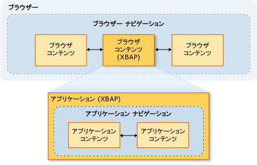

# セキュリティ (WPF)
 開発するときに[!INCLUDE[TLA#tla_wpf](../../../includes/tlasharptla-wpf-md.md)]スタンドアロン アプリケーションとブラウザーによってホストされるアプリケーション、セキュリティ モデルを考慮する必要があります。 [!INCLUDE[TLA2#tla_wpf](../../../includes/tla2sharptla-wpf-md.md)] 無制限のアクセス許可を持つスタンドアロンのアプリケーションを実行 ( [!INCLUDE[TLA2#tla_cas](../../../includes/tla2sharptla-cas-md.md)] **FullTrust**アクセス許可セット) Windows インストーラー (.msi)、XCopy を使用して配置するかどうか、または[!INCLUDE[TLA2#tla_clickonce](../../../includes/tla2sharptla-clickonce-md.md)]です。 部分的に信頼されたスタンドアロンの WPF アプリケーションを ClickOnce で展開することはサポートされていません。 ただし、完全に信頼されたホスト アプリケーションが部分的に信頼を作成できます<xref:System.AppDomain>アドインの .NET Framework モデルを使用します。 詳細については、次を参照してください。 [WPF アドイン概要](../../../docs/framework/wpf/app-development/wpf-add-ins-overview.md)です。  
  
 [!INCLUDE[TLA2#tla_wpf](../../../includes/tla2sharptla-wpf-md.md)] ブラウザー ホスト アプリケーションがによってホストされている[!INCLUDE[TLA#tla_iegeneric](../../../includes/tlasharptla-iegeneric-md.md)]Firefox、またはいずれかを指定できます[!INCLUDE[TLA#tla_xbap#plural](../../../includes/tlasharptla-xbapsharpplural-md.md)]またはルース[!INCLUDE[TLA#tla_xaml](../../../includes/tlasharptla-xaml-md.md)]詳細については、ドキュメントを参照してください[WPF XAML ブラウザー アプリケーションの概要](../../../docs/framework/wpf/app-development/wpf-xaml-browser-applications-overview.md)です。  
  
 [!INCLUDE[TLA2#tla_wpf](../../../includes/tla2sharptla-wpf-md.md)] 既定では、既定値に限定したブラウザーによってホストされるアプリケーションが部分信頼のセキュリティのサンド ボックス内で実行[!INCLUDE[TLA2#tla_cas](../../../includes/tla2sharptla-cas-md.md)]**インターネット**ゾーン アクセス許可セット。 これを効果的に分離[!INCLUDE[TLA2#tla_wpf](../../../includes/tla2sharptla-wpf-md.md)]ことが期待する一般的な Web アプリケーションの分離と同様に、クライアント コンピューターからブラウザーでホストされるアプリケーション。 XBAP は、デプロイメント URL およびクライアントのセキュリティ構成のセキュリティ ゾーンに基づいて、完全な信頼まで特権を昇格することができます。 詳細については、次を参照してください。 [WPF 部分信頼セキュリティ](../../../docs/framework/wpf/wpf-partial-trust-security.md)です。  
  
 このトピックでのセキュリティ モデルについて説明します[!INCLUDE[TLA#tla_wpf](../../../includes/tlasharptla-wpf-md.md)]スタンドアロンおよびブラウザーによってホストされるアプリケーション。  
  
 このトピックは、次のセクションで構成されています。  
  
-   [安全なナビゲーション](#SafeTopLevelNavigation)  
  
-   [Web ブラウザーのセキュリティ設定](#InternetExplorerSecuritySettings)  
  
-   [WebBrowser コントロールと機能コントロール](#webbrowser_control_and_feature_controls)  
  
-   [部分信頼クライアント アプリケーションに対する APTCA の無効化](#APTCA)  
  
-   [Loose XAML ファイルに対するサンドボックスの動作](#LooseContentSandboxing)  
  
-   [セキュリティを向上する WPF アプリケーションを開発するためのリソース](#BestPractices)  
  
   
## 安全なナビゲーション  
 [!INCLUDE[TLA2#tla_xbap#plural](../../../includes/tla2sharptla-xbapsharpplural-md.md)]、[!INCLUDE[TLA2#tla_wpf](../../../includes/tla2sharptla-wpf-md.md)]ナビゲーションの 2 つの種類に区別: アプリケーションとブラウザー。  
  
 *アプリケーション ナビゲーション*は、ブラウザーによってホストされるアプリケーション内のコンテンツ項目間のナビゲーションです。 *ブラウザー ナビゲーション*は、ブラウザー自体のコンテンツとロケーション URL を変更するナビゲーションです。 アプリケーションのナビゲーション (通常は XAML) とブラウザー ナビゲーション (通常は HTML) 間のリレーションシップは、次の図に表示されます。
  
   
  
 安全と見なされるコンテンツの種類、[!INCLUDE[TLA2#tla_xbap](../../../includes/tla2sharptla-xbap-md.md)]への移動には、主にによって決まりますアプリケーションまたはブラウザー ナビゲーションが使用されているか。  
  
   
### アプリケーション ナビゲーションのセキュリティ  
 アプリケーションのナビゲーションはパックに指定できる場合は、安全と見なされます[!INCLUDE[TLA2#tla_uri](../../../includes/tla2sharptla-uri-md.md)]、4 種類のコンテンツをサポートします。  
  
|コンテンツ タイプ|説明|URI の例|  
|------------------|-----------------|-----------------|  
|リソース|ビルドの種類のプロジェクトに追加されるファイル**リソース**です。|`pack://application:,,,/MyResourceFile.xaml`|  
|Content|ビルドの種類のプロジェクトに追加されるファイル**コンテンツ**です。|`pack://application:,,,/MyContentFile.xaml`|  
|起点サイト|ビルドの種類のプロジェクトに追加されるファイル**None**です。|`pack://siteoforigin:,,,/MySiteOfOriginFile.xaml`|  
|アプリケーション コード|コンパイルされたコード分離を含む XAML リソース。   - または -   XAML ファイルのビルドの種類のプロジェクトに追加される**ページ**です。|`pack://application:,,,/MyResourceFile` `.xaml`|  
  
> [!NOTE]
>  アプリケーションのデータ ファイルとパックの詳細については[!INCLUDE[TLA2#tla_uri#plural](../../../includes/tla2sharptla-urisharpplural-md.md)]を参照してください[WPF アプリケーションのリソース、コンテンツ、およびデータ ファイル](../../../docs/framework/wpf/app-development/wpf-application-resource-content-and-data-files.md)です。  
  
 これらのコンテンツ タイプのファイルは、ユーザーまたはプログラムを使用して移動できます。  
  
-   **ユーザー ナビゲーション**。 ユーザーが移動する をクリックして、<xref:System.Windows.Documents.Hyperlink>要素。  
  
-   **プログラム ナビゲーション**。 アプリケーションの移動を設定して、ユーザーを使用することがなく、<xref:System.Windows.Navigation.NavigationWindow.Source%2A?displayProperty=nameWithType>プロパティです。  
  
   
### ブラウザー ナビゲーションのセキュリティ  
 ブラウザー ナビゲーションは、次の条件の下でのみ安全と見なされます。  
  
-   **ユーザー ナビゲーション**。 ユーザーが移動する をクリックして、<xref:System.Windows.Documents.Hyperlink>メイン内にある要素<xref:System.Windows.Navigation.NavigationWindow>ではなく、入れ子になった<xref:System.Windows.Controls.Frame>です。  
  
-   **ゾーン**。 移動先のコンテンツが、インターネットまたはローカル イントラネット上に存在する。  
  
-   **プロトコル**。 使用されているプロトコルは、いずれかの**http**、 **https**、**ファイル**、または**mailto**です。  
  
 場合、[!INCLUDE[TLA2#tla_xbap](../../../includes/tla2sharptla-xbap-md.md)]これらの条件に準拠していない方法でコンテンツに移動しようとしています、<xref:System.Security.SecurityException>がスローされます。  
  
   
## Web ブラウザーのセキュリティ設定  
 コンピューターのセキュリティ設定によって、Web ブラウザーに付与されるアクセス権が決まります。 Web ブラウザーでは、すべてのアプリケーションまたはを使用するコンポーネントが含まれています、 [WinINet](http://go.microsoft.com/fwlink/?LinkId=179379)または[UrlMon](http://go.microsoft.com/fwlink/?LinkId=179383) Api では、Internet Explorer、PresentationHost.exe などです。  
  
 [!INCLUDE[TLA2#tla_iegeneric](../../../includes/tla2sharptla-iegeneric-md.md)] またはを実行するのには許可されている機能を構成できますメカニズムを備えています[!INCLUDE[TLA2#tla_iegeneric](../../../includes/tla2sharptla-iegeneric-md.md)]次を含みます。  
  
-   .NET framework に依存するコンポーネント  
  
-   ActiveX コントロールおよびプラグイン  
  
-   ダウンロード  
  
-   [スクリプティング]  
  
-   ユーザー認証  
  
 に対して、ゾーンごとにこの方法でセキュリティで保護することができる機能のコレクションが構成されている、**インターネット**、**イントラネット**、**信頼済みサイト**、および**制限付きサイト**ゾーンです。 次の手順では、セキュリティ設定の構成方法について説明します。  
  
1.  **[コントロール パネル]** を開きます。  
  
2.  をクリックして**ネットワークとインターネット** をクリックし、**インターネット オプション**です。  
  
     [インターネット オプション] ダイアログ ボックスが表示されます。  
  
3.  **セキュリティ** タブのセキュリティ設定を構成するゾーンを選択します。  
  
4.  クリックして、**レベルのカスタマイズ**ボタンをクリックします。  
  
     **セキュリティ設定** ダイアログ ボックスが表示され、選択されたゾーンのセキュリティ設定を構成することができます。  
  
     ![[セキュリティ設定] ダイアログ ボックス](../../../docs/framework/wpf/media/wpfsecurityfigure1.PNG "WPFSecurityFigure1")  
  
> [!NOTE]
>  [インターネット オプション] ダイアログ ボックスは、Internet Explorer から開くこともできます。 をクリックして**ツール** をクリックし、**インターネット オプション**です。  
  
 以降で[!INCLUDE[TLA#tla_ie7](../../../includes/tlasharptla-ie7-md.md)]、.NET Framework について具体的には次のセキュリティ設定が含まれます。  
  
-   **Loose XAML**。 コントロールかどうか[!INCLUDE[TLA2#tla_iegeneric](../../../includes/tla2sharptla-iegeneric-md.md)]に移動し、失われたことができます[!INCLUDE[TLA2#tla_xaml](../../../includes/tla2sharptla-xaml-md.md)]ファイル。 ([有効]、[無効]、および [ダイアログを表示する] オプション)。  
  
-   **XAML ブラウザー アプリケーション**。 コントロールかどうか[!INCLUDE[TLA2#tla_iegeneric](../../../includes/tla2sharptla-iegeneric-md.md)]に移動して、実行[!INCLUDE[TLA2#tla_xbap#plural](../../../includes/tla2sharptla-xbapsharpplural-md.md)]です。 ([有効]、[無効]、および [ダイアログを表示する] オプション)。  
  
 既定では、これらの設定はすべて有効になっているため、**インターネット**、**ローカル イントラネット**、および**信頼済みサイト**ゾーン、および無効にするには**制限付きサイト**ゾーンです。  
  
   
### セキュリティ関連の WPF レジストリの設定  
 [インターネット オプション] から使用できるセキュリティ設定以外に、セキュリティ上重要なさまざまな WPF 機能を選択的にブロックするために次のレジストリ値を使用できます。 値は次のキーで定義されます。  
  
 `HKEY_LOCAL_MACHINE\SOFTWARE\Microsoft\.NETFramework\Windows Presentation Foundation\Features`  
  
 設定可能な値を次の表に示します。  
  
|値名|値型|値のデータ|  
|----------------|----------------|----------------|  
|XBAPDisallow|REG_DWORD|許可しない場合は 1、許可する場合は 0。|  
|LooseXamlDisallow|REG_DWORD|許可しない場合は 1、許可する場合は 0。|  
|WebBrowserDisallow|REG_DWORD|許可しない場合は 1、許可する場合は 0。|  
|MediaAudioDisallow|REG_DWORD|許可しない場合は 1、許可する場合は 0。|  
|MediaImageDisallow|REG_DWORD|許可しない場合は 1、許可する場合は 0。|  
|MediaVideoDisallow|REG_DWORD|許可しない場合は 1、許可する場合は 0。|  
|ScriptInteropDisallow|REG_DWORD|許可しない場合は 1、許可する場合は 0。|  
  
   
## WebBrowser コントロールと機能コントロール  
 WPF<xref:System.Windows.Controls.WebBrowser>コントロールは、Web コンテンツをホストするために使用できます。 WPF<xref:System.Windows.Controls.WebBrowser>コントロールは、基になる WebBrowser ActiveX コントロールをラップします。 WPF では、WPF を使用すると、アプリケーションを保護するためのサポートが用意されています<xref:System.Windows.Controls.WebBrowser>ホストへのコントロールには、Web コンテンツが信頼されていません。 使用してアプリケーションによって直接ただし、一部のセキュリティ機能を適用する必要があります、<xref:System.Windows.Controls.WebBrowser>コントロール。 WebBrowser ActiveX コントロールの詳細については、次を参照してください。 [WebBrowser コントロールの概要とチュートリアル](http://go.microsoft.com/fwlink/?LinkId=179388)です。  
  
> [!NOTE]
>  このセクションにも適用されます、<xref:System.Windows.Controls.Frame>制御が使用されるため、 <xref:System.Windows.Controls.WebBrowser> HTML コンテンツに移動します。  
  
 場合は、WPF<xref:System.Windows.Controls.WebBrowser>コントロールを使用して、信頼されていない Web コンテンツをホスト、アプリケーションは部分的に信頼を使用する必要があります<xref:System.AppDomain>アプリケーション コードが悪意のある HTML スクリプト コードから分離されるためです。 これを使用して、アプリケーションがホストされているスクリプトと対話する場合、特に、<xref:System.Windows.Controls.WebBrowser.InvokeScript%2A>メソッドおよび<xref:System.Windows.Controls.WebBrowser.ObjectForScripting%2A>プロパティです。 詳細については、次を参照してください。 [WPF アドイン概要](../../../docs/framework/wpf/app-development/wpf-add-ins-overview.md)です。  
  
 アプリケーションは、WPF を使用する場合<xref:System.Windows.Controls.WebBrowser>を Internet Explorer の機能のコントロールを有効にするはのセキュリティを強化し、攻撃を緩和する別の方法を制御します。 機能のコントロールは、Internet Explorer と WebBrowser ActiveX コントロールをホストするアプリケーションの機能を構成するには、管理者および開発者ができるようにする Internet Explorer に追加する、WPF<xref:System.Windows.Controls.WebBrowser>ラップを制御します。 コントロールの機能を使用して構成することができます、 [CoInternetSetFeatureEnabled](http://go.microsoft.com/fwlink/?LinkId=179394)関数、レジストリの値を変更することによってです。 機能のコントロールの詳細については、次を参照してください。[機能コントロールの概要](http://go.microsoft.com/fwlink/?LinkId=179390)と[インターネット機能を制御](http://go.microsoft.com/fwlink/?LinkId=179392)です。  
  
 WPF を使用するスタンドアロン WPF アプリケーションを開発しているかどうか<xref:System.Windows.Controls.WebBrowser>コントロール、WPF アプリケーションの次の機能のコントロールを自動的に有効にします。  
  
|機能コントロール|  
|---------------------|  
|FEATURE_MIME_HANDLING|  
|FEATURE_MIME_SNIFFING|  
|FEATURE_OBJECT_CACHING|  
|FEATURE_SAFE_BINDTOOBJECT|  
|FEATURE_WINDOW_RESTRICTIONS|  
|FEATURE_ZONE_ELEVATION|  
|FEATURE_RESTRICT_FILEDOWNLOAD|  
|FEATURE_RESTRICT_ACTIVEXINSTALL|  
|FEATURE_ADDON_MANAGEMENT|  
|FEATURE_HTTP_USERNAME_PASSWORD_DISABLE|  
|FEATURE_SECURITYBAND|  
|FEATURE_UNC_SAVEDFILECHECK|  
|FEATURE_VALIDATE_NAVIGATE_URL|  
|FEATURE_DISABLE_TELNET_PROTOCOL|  
|FEATURE_WEBOC_POPUPMANAGEMENT|  
|FEATURE_DISABLE_LEGACY_COMPRESSION|  
|FEATURE_SSLUX|  
  
 これらの機能コントロールは無条件で有効になるため、完全信頼アプリケーションに悪影響が及ぶ場合があります。 この場合、特定のアプリケーションとそのアプリケーションがホストしているコンテンツにセキュリティ上のリスクがなければ、対応する機能コントロールを無効にできます。  
  
 WebBrowser ActiveX オブジェクトをインスタンス化するプロセスでは、機能は、制御が適用されます。 そのため、信頼されていないコンテンツに移動できるスタンドアロン アプリケーションを作成する場合は、その他の機能コントロールを有効にすることを検討すべきです。  
  
> [!NOTE]
>  この推奨事項は、MSHTML および SHDOCVW ホスト セキュリティの一般的な推奨事項に基づいています。 詳細については、次を参照してください。 [、MSHTML ホストのセキュリティに関する FAQ: II の第 1 部](http://go.microsoft.com/fwlink/?LinkId=179396)と[、MSHTML ホストのセキュリティに関する FAQ: パート II II](http://go.microsoft.com/fwlink/?LinkId=179415)です。  
  
 実行可能ファイルでは、レジストリ値を 1 に設定して以下の機能コントロールを有効にすることを検討してください。  
  
|機能コントロール|  
|---------------------|  
|FEATURE_ACTIVEX_REPURPOSEDETECTION|  
|FEATURE_BLOCK_LMZ_IMG|  
|FEATURE_BLOCK_LMZ_OBJECT|  
|FEATURE_BLOCK_LMZ_SCRIPT|  
|FEATURE_RESTRICT_RES_TO_LMZ|  
|FEATURE_RESTRICT_ABOUT_PROTOCOL_IE7|  
|FEATURE_SHOW_APP_PROTOCOL_WARN_DIALOG|  
|FEATURE_LOCALMACHINE_LOCKDOWN|  
|FEATURE_FORCE_ADDR_AND_STATUS|  
|FEATURE_RESTRICTED_ZONE_WHEN_FILE_NOT_FOUND|  
  
 実行可能ファイルでは、レジストリ値を 0 に設定して以下の機能コントロールを無効にすることを検討してください。  
  
|機能コントロール|  
|---------------------|  
|FEATURE_ENABLE_SCRIPT_PASTE_URLACTION_IF_PROMPT|  
  
 部分的に信頼を実行する場合[!INCLUDE[TLA#tla_xbap](../../../includes/tlasharptla-xbap-md.md)]WPF が含まれている<xref:System.Windows.Controls.WebBrowser>で制御[!INCLUDE[TLA#tla_iegeneric](../../../includes/tlasharptla-iegeneric-md.md)]WPF は、Internet Explorer プロセスのアドレス空間内の WebBrowser ActiveX コントロールをホストします。 内の WebBrowser ActiveX コントロールがホストされているため、[!INCLUDE[TLA2#tla_iegeneric](../../../includes/tla2sharptla-iegeneric-md.md)]プロセス、WebBrowser ActiveX コントロールのすべての Internet Explorer の機能のコントロールも有効にします。  
  
 Internet Explorer で実行されている XBAP にも、標準のスタンドアロン アプリケーションよりも高いレベルのセキュリティが適用されます。 この追加のセキュリティは、Internet Explorer、およびそのため、WebBrowser ActiveX コントロールで実行されるため保護モードでは既定で[!INCLUDE[TLA#tla_winvista](../../../includes/tlasharptla-winvista-md.md)]と[!INCLUDE[win7](../../../includes/win7-md.md)]です。 保護モードの詳細については、次を参照してください。[を理解すると、保護モードの Internet Explorer で作業して](http://go.microsoft.com/fwlink/?LinkId=179393)です。  
  
> [!NOTE]
>  含む、WPF XBAP を実行しようとするかどうかは<xref:System.Windows.Controls.WebBrowser>firefox の場合、インターネット ゾーンでのコントロール、<xref:System.Security.SecurityException>がスローされます。 これは、WPF セキュリティ ポリシーが原因です。  
  
   
## 部分信頼クライアント アプリケーションに対する APTCA の無効化  
 マネージ アセンブリがインストールされている場合、[!INCLUDE[TLA#tla_gac](../../../includes/tlasharptla-gac-md.md)]になる完全に信頼されているため、ユーザーがそれらをインストールするアクセス許可が明示的に指定する必要があります。 完全に信頼されているため、これらを使用できるのは完全信頼マネージ クライアント アプリケーションのみです。 部分的に信頼されたアプリケーションをそれらを使用できるように、これらと共に設定されなければなりません、 <xref:System.Security.AllowPartiallyTrustedCallersAttribute> (APTCA)。 この属性は、部分信頼で実行しても安全であるとテストで確認されたアセンブリだけに設定します。  
  
 ただし、可能であれば、APTCA アセンブリにインストール後にセキュリティ上の欠陥が発生すること、[!INCLUDE[TLA2#tla_gac](../../../includes/tla2sharptla-gac-md.md)]です。 セキュリティ上の欠陥が検出されたら、アセンブリの発行者は、既存のインストールでの問題を解決し、問題発見後に発生する可能性があるインストールに備えるため、セキュリティ更新プログラムを作成できます。 更新プログラムの 1 つのオプションとして、アセンブリのアンインストールが考えられますが、その場合はこのアセンブリを使用する他の完全信頼クライアント アプリケーションを破損するおそれがあります。  
  
 [!INCLUDE[TLA2#tla_wpf](../../../includes/tla2sharptla-wpf-md.md)] 部分的な信頼で APTCA アセンブリを無効にするメカニズムを備えています[!INCLUDE[TLA2#tla_xbap#plural](../../../includes/tla2sharptla-xbapsharpplural-md.md)]APTCA アセンブリをアンインストールせずにします。  
  
 APTCA アセンブリを無効にするには、特殊なレジストリ キーを作成する必要があります。  
  
 `HKEY_LOCAL_MACHINE\SOFTWARE\Microsoft\.NETFramework\policy\APTCA\<AssemblyFullName>, FileVersion=<AssemblyFileVersion>`  
  
 次のコードは一例を示しています。  
  
 `HKEY_LOCAL_MACHINE\SOFTWARE\Microsoft\.NETFramework\policy\APTCA\aptcagac, Version=1.0.0.0, Culture=neutral, PublicKeyToken=215e3ac809a0fea7, FileVersion=1.0.0.0`  
  
 このキーにより、APTCA アセンブリのエントリが設定されます。 また、アセンブリを有効または無効にする値をこのキーに作成する必要があります。 値の詳細を次に示します。  
  
-   値の名前: **APTCA_FLAG**です。  
  
-   値の種類: **REG_DWORD**です。  
  
-   値のデータ: **1** ; を無効にするには**0**を有効にします。  
  
 部分信頼クライアント アプリケーションに対してアセンブリを無効にする必要がある場合は、レジストリ キーおよび値を作成する更新プログラムを作成します。  
  
> [!NOTE]
>  .NET Framework のコア アセンブリには、マネージ アプリケーションを実行するために必要であるために、この方法で無効にしては受けません。 APTCA アセンブリの無効化のサポートは、主にサードパーティ アプリケーションを対象にしたものです。  
  
   
## Loose XAML ファイルに対するサンドボックスの動作  
 厳密でない[!INCLUDE[TLA2#tla_xaml](../../../includes/tla2sharptla-xaml-md.md)]ファイルは、分離コード、イベント ハンドラー、またはアプリケーション固有のアセンブリに依存しないマークアップのみの XAML ファイル。 失われたときに[!INCLUDE[TLA2#tla_xaml](../../../includes/tla2sharptla-xaml-md.md)]ブラウザーから直接ファイルが移動先、既定のインターネット ゾーン アクセス許可セットに基づくセキュリティ サンド ボックスに読み込まれます。  
  
 ただし、このセキュリティ動作は厳密でない場合は、異なる[!INCLUDE[TLA2#tla_xaml](../../../includes/tla2sharptla-xaml-md.md)]いずれかのファイルが移動先、<xref:System.Windows.Navigation.NavigationWindow>または<xref:System.Windows.Controls.Frame>スタンドアロン アプリケーションです。  
  
 どちらの場合も、緩やかな[!INCLUDE[TLA2#tla_xaml](../../../includes/tla2sharptla-xaml-md.md)]への移動がファイルは、ホスト アプリケーションのアクセス許可を継承します。 ただし、この動作できない可能性があります、厳密でない場合は特に、セキュリティの観点から望ましい[!INCLUDE[TLA2#tla_xaml](../../../includes/tla2sharptla-xaml-md.md)]ファイルは、信頼されていないか、不明なしたエンティティが作成されました。 この種類のコンテンツと呼ばれます*外部コンテンツ*、および両方<xref:System.Windows.Controls.Frame>と<xref:System.Windows.Navigation.NavigationWindow>に移動したときにこれを分離するように構成できます。 設定の分離が実現、 **、SandboxExternalContent**プロパティを true の次の例に示すように<xref:System.Windows.Controls.Frame>と<xref:System.Windows.Navigation.NavigationWindow>:  
  
 [!code-xaml[SecurityOverviewSnippets#FrameMARKUP](../../../samples/snippets/csharp/VS_Snippets_Wpf/SecurityOverviewSnippets/CS/Window2.xaml#framemarkup)]  
  
 [!code-xaml[SecurityOverviewSnippets#NavigationWindowMARKUP](../../../samples/snippets/csharp/VS_Snippets_Wpf/SecurityOverviewSnippets/CS/Window1.xaml#navigationwindowmarkup)]  
  
 このように設定すると、外部コンテンツは、アプリケーションをホストするプロセスとは異なるプロセスに読み込まれます。 このプロセスは既定のインターネット ゾーン アクセス許可セットに限定されており、ホスト アプリケーションとクライアント コンピューターから外部コンテンツを効果的に分離します。  
  
> [!NOTE]
>  にもかかわらず loose へのナビゲーション[!INCLUDE[TLA2#tla_xaml](../../../includes/tla2sharptla-xaml-md.md)]からいずれかのファイル、<xref:System.Windows.Navigation.NavigationWindow>または<xref:System.Windows.Controls.Frame>スタンドアロンのアプリケーションが実装されている PresentationHost プロセスに関連するインフラストラクチャをホストする WPF ブラウザーに基づくセキュリティ レベルとはInternet Explorer で直接、コンテンツが読み込まれるときによりも若干小さい[!INCLUDE[wiprlhext](../../../includes/wiprlhext-md.md)]と[!INCLUDE[win7](../../../includes/win7-md.md)](これもよい PresentationHost 経由)。 これは、Web ブラウザーを使用しているスタンドアロン WPF アプリケーションに、Internet Explorer の保護モード セキュリティ機能が追加されていないためです。  
  
   
## セキュリティを向上する WPF アプリケーションを開発するためのリソース  
 開発するのに役立つその他のリソースは、次のとおり[!INCLUDE[TLA2#tla_wpf](../../../includes/tla2sharptla-wpf-md.md)]セキュリティを向上するアプリケーション。  
  
|区分|リソース|  
|----------|--------------|  
|マネージ コード|[patterns & practices アプリケーション セキュリティ ガイダンス インデックス](http://go.microsoft.com/fwlink/?LinkId=117426)|  
|[!INCLUDE[TLA2#tla_cas](../../../includes/tla2sharptla-cas-md.md)]|[コード アクセス セキュリティ](../../../docs/framework/misc/code-access-security.md)|  
|[!INCLUDE[TLA2#tla_clickonce](../../../includes/tla2sharptla-clickonce-md.md)]|[ClickOnce のセキュリティと配置](/visualstudio/deployment/clickonce-security-and-deployment)|  
|[!INCLUDE[TLA2#tla_wpf](../../../includes/tla2sharptla-wpf-md.md)]|[WPF 部分信頼セキュリティ](../../../docs/framework/wpf/wpf-partial-trust-security.md)|  
  
## 関連項目  
 [WPF 部分信頼セキュリティ](../../../docs/framework/wpf/wpf-partial-trust-security.md)  
 [WPF のセキュリティ方針 - プラットフォーム セキュリティ](../../../docs/framework/wpf/wpf-security-strategy-platform-security.md)  
 [WPF のセキュリティ方針 - セキュリティ エンジニアリング](../../../docs/framework/wpf/wpf-security-strategy-security-engineering.md)  
 [patterns & practices アプリケーション セキュリティ ガイダンス インデックス](http://go.microsoft.com/fwlink/?LinkId=117426)  
 [コード アクセス セキュリティ](../../../docs/framework/misc/code-access-security.md)  
 [ClickOnce のセキュリティと配置](/visualstudio/deployment/clickonce-security-and-deployment)  
 [XAML の概要 (WPF)](../../../docs/framework/wpf/advanced/xaml-overview-wpf.md)
