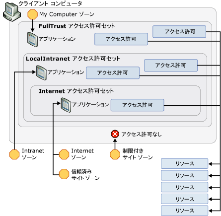

# WPF のセキュリティ方針 - プラットフォーム セキュリティWPF Security Strategy - Platform Security
[!INCLUDE[TLA#tla_wpf](../../../includes/tlasharptla-wpf-md.md)] は、さまざまなセキュリティ サービスを提供する一方で、基になるプラットフォーム (オペレーティング システム、[!INCLUDE[TLA2#tla_clr](../../../includes/tla2sharptla-clr-md.md)]、[!INCLUDE[TLA2#tla_ie](../../../includes/tla2sharptla-ie-md.md)] など) のセキュリティ機能も活用します。While [!INCLUDE[TLA#tla_wpf](../../../includes/tlasharptla-wpf-md.md)] provides a variety of security services, it also leverages the security features of the underlying platform, which includes the operating system, the [!INCLUDE[TLA2#tla_clr](../../../includes/tla2sharptla-clr-md.md)], and [!INCLUDE[TLA2#tla_ie](../../../includes/tla2sharptla-ie-md.md)]. これらの層を組み合わせることで、[!INCLUDE[TLA2#tla_wpf](../../../includes/tla2sharptla-wpf-md.md)] に強力な多重防御のセキュリティ モデルが提供されます。このセキュリティ モデルでは、次の図に示すように、単一障害点の回避を試みます。These layers combine to provide [!INCLUDE[TLA2#tla_wpf](../../../includes/tla2sharptla-wpf-md.md)] a strong, defense-in-depth security model that attempts to avoid any single point of failure, as shown in the following figure:  
  
   
  
 このトピックの残りの部分では、[!INCLUDE[TLA2#tla_wpf](../../../includes/tla2sharptla-wpf-md.md)] に関連するこれらの各層の機能について具体的に説明します。The remainder of this topic discusses the features in each of these layers that pertain to [!INCLUDE[TLA2#tla_wpf](../../../includes/tla2sharptla-wpf-md.md)] specifically.  
  

  
   
## オペレーティング システムのセキュリティOperating System Security  
 [!INCLUDE[TLA2#tla_wpf](../../../includes/tla2sharptla-wpf-md.md)] が必要とするオペレーティング システムの最小レベルは [!INCLUDE[TLA2#tla_winxpsp2](../../../includes/tla2sharptla-winxpsp2-md.md)] です。The minimum level of operating system that is required by [!INCLUDE[TLA2#tla_wpf](../../../includes/tla2sharptla-wpf-md.md)] is [!INCLUDE[TLA2#tla_winxpsp2](../../../includes/tla2sharptla-winxpsp2-md.md)]. 中核を成す[!INCLUDE[TLA2#tla_winxpsp2](../../../includes/tla2sharptla-winxpsp2-md.md)]でビルドされたものも含めて、すべての Windows アプリケーションのセキュリティの基盤を形成するいくつかのセキュリティ機能を提供[!INCLUDE[TLA2#tla_wpf](../../../includes/tla2sharptla-wpf-md.md)]です。The core of [!INCLUDE[TLA2#tla_winxpsp2](../../../includes/tla2sharptla-winxpsp2-md.md)] provides several security features that form the security foundation for all Windows applications, including those built with [!INCLUDE[TLA2#tla_wpf](../../../includes/tla2sharptla-wpf-md.md)]. [!INCLUDE[TLA#tla_longhorn](../../../includes/tlasharptla-longhorn-md.md)] には、[!INCLUDE[TLA2#tla_wpf](../../../includes/tla2sharptla-wpf-md.md)] のセキュリティ機能が搭載され、それをさらに拡張しています。 incorporates the security features of [!INCLUDE[TLA2#tla_wpf](../../../includes/tla2sharptla-wpf-md.md)] and extends them further. このトピックでは、[!INCLUDE[TLA2#tla_wpf](../../../includes/tla2sharptla-wpf-md.md)] にとって重要なセキュリティ機能の一式、および [!INCLUDE[TLA2#tla_wpf](../../../includes/tla2sharptla-wpf-md.md)] がそれらを統合してさらに多重防御を行う方法について説明します。This topic discusses the breadth of these security features that are important to [!INCLUDE[TLA2#tla_wpf](../../../includes/tla2sharptla-wpf-md.md)], as well as how [!INCLUDE[TLA2#tla_wpf](../../../includes/tla2sharptla-wpf-md.md)] integrates with them to provide further defense-in-depth.  
  
   
### Microsoft Windows XP Service Pack 2 (SP2)Microsoft Windows XP Service Pack 2 (SP2)  
 次の 3 つの主要機能があるだけでなく、一般のレビューと Windows の強化、[!INCLUDE[TLA2#tla_winxpsp2](../../../includes/tla2sharptla-winxpsp2-md.md)]このトピックの内容について説明します。In addition to a general review and strengthening of Windows, there are three key features from [!INCLUDE[TLA2#tla_winxpsp2](../../../includes/tla2sharptla-winxpsp2-md.md)] that we will discuss in this topic:  
  
-   /GS のコンパイル/GS compilation  
  
-   [!INCLUDE[TLA#tla_win_update](../../../includes/tlasharptla-win-update-md.md)]..  
  
#### /GS のコンパイル/GS Compilation  
 [!INCLUDE[TLA2#tla_winxpsp2](../../../includes/tla2sharptla-winxpsp2-md.md)] は、バッファー オーバーランを軽減するために、[!INCLUDE[TLA2#tla_clr](../../../includes/tla2sharptla-clr-md.md)] など、[!INCLUDE[TLA2#tla_wpf](../../../includes/tla2sharptla-wpf-md.md)] の依存関係のすべてを含む多数のコア システム ライブラリを再コンパイルして、保護を行います。 provides protection by recompiling many core system libraries, including all of the [!INCLUDE[TLA2#tla_wpf](../../../includes/tla2sharptla-wpf-md.md)] dependencies such as the [!INCLUDE[TLA2#tla_clr](../../../includes/tla2sharptla-clr-md.md)], to help mitigate buffer overruns. これは、C や C++ のコマンド ライン コンパイラの /GS パラメーターを使用して実現されます。This is achieved by using the /GS parameter with the C/C++ command-line compiler. バッファー オーバーランを明示的に避ける必要はありますが、/GS コンパイルは、故意であるかないかにかかわらずバッファー オーバーランによって生み出される潜在的な脆弱性に対する多重防御の一例となります。Although buffer overruns should be explicitly avoided, /GS compilation provides an example of a defense-in-depth against potential vulnerabilities that are inadvertently or maliciously created by them.  
  
 従来、バッファー オーバーランは、影響が大きいセキュリティ攻撃の多くの原因となっていました。Historically, buffer overruns have been the cause of many high-impact security exploits. バッファー オーバーランは、バッファーの境界を超えて書き込む、悪意のあるコードの挿入を許すコードの脆弱性を攻撃者が利用するときに発生します。A buffer overrun occurs when an attacker takes advantage of a code vulnerability that allows the injection of malicious code that writes past the boundaries of a buffer. これにより、攻撃者はプロセスを乗っ取ることができます。この場合、コードは、攻撃者のコードを実行するように関数のリターン アドレスを上書きすることで実行されます。This then allows an attacker to hijack the process in which the code is executing by overwriting the return address of a function to cause the execution of the attacker's code. 結果として、乗っ取ったプロセスと同じ特権を持つ任意のコードを実行する悪意のあるコードが生成されます。The result is malicious code that executes arbitrary code with the same privileges as the hijacked process.  
  
 概略でとらえると、/GS コンパイラ フラグは、ローカル文字列のバッファーを持つ関数のリターン アドレスを保護する特殊なセキュリティ クッキーを挿入して、潜在的なバッファー オーバーランから保護します。At a high level, the /GS compiler flag protects against some potential buffer overruns by injecting a special security cookie to protect the return address of a function that has local string buffers. 関数が返されると、セキュリティ クッキーはその前の値と比較されます。After a function returns, the security cookie is compared with its previous value. 値が変更されている場合、バッファー オーバーランが発生した可能性があるとして、プロセスはエラー状態によって停止されます。If the value has changed, a buffer overrun may have occurred and the process is stopped with an error condition. プロセスの停止により、悪意のある可能性があるコードの実行を防止できます。Stopping the process prevents the execution of potentially malicious code. 参照してください[/GS (バッファー セキュリティ チェック)](http://msdn.microsoft.com/library/8dbf701c.aspx)詳細についてはします。See [/GS (Buffer Security Check)](http://msdn.microsoft.com/library/8dbf701c.aspx) for more details.  
  
 [!INCLUDE[TLA2#tla_wpf](../../../includes/tla2sharptla-wpf-md.md)] は、/GS フラグでコンパイルされて、[!INCLUDE[TLA2#tla_wpf](../../../includes/tla2sharptla-wpf-md.md)] アプリケーションに別の防御層を追加します。 is compiled with the /GS flag to add yet another layer of defense to [!INCLUDE[TLA2#tla_wpf](../../../includes/tla2sharptla-wpf-md.md)] applications.  
  
#### Microsoft Windows 更新プログラムの拡張機能Microsoft Windows Update Enhancements  
 [!INCLUDE[TLA2#tla_winxpsp2](../../../includes/tla2sharptla-winxpsp2-md.md)] では、[!INCLUDE[TLA#tla_win_update](../../../includes/tlasharptla-win-update-md.md)] も改善され、更新プログラムのダウンロードとインストールのプロセスが簡略化されました。 was also improved in [!INCLUDE[TLA2#tla_winxpsp2](../../../includes/tla2sharptla-winxpsp2-md.md)] to simplify the process for downloading and installing updates. これらの変更により、特にセキュリティ更新プログラムに関して、システムを確実に最新の状態にすることで、[!INCLUDE[TLA2#tla_wpf](../../../includes/tla2sharptla-wpf-md.md)] のお客様のセキュリティ保護が大きく拡大しました。These changes significantly enhance security for [!INCLUDE[TLA2#tla_wpf](../../../includes/tla2sharptla-wpf-md.md)] customers by helping to ensure that their systems are up-to-date, particularly with respect to security updates.  
  
   
### Windows VistaWindows Vista  
 [!INCLUDE[TLA#tla_longhorn](../../../includes/tlasharptla-longhorn-md.md)] の [!INCLUDE[TLA2#tla_wpf](../../../includes/tla2sharptla-wpf-md.md)] ユーザーは、「最小限の特権によるユーザー アクセス」、コードの整合性チェック、および特権の分離など、オペレーティング システムのさらなるセキュリティ機能強化の恩恵を受けられます。 users on [!INCLUDE[TLA#tla_longhorn](../../../includes/tlasharptla-longhorn-md.md)] will benefit from the operating system's additional security enhancements, including "Least-Privilege User Access", code integrity checks, and privilege isolation.  
  
#### ユーザー アカウント制御 [UAC]User Account Control (UAC)  
 今日では、Windows ユーザーは、多くのアプリケーションの必要なインストールの実行、またはその両方のために、管理者特権で実行する傾向があります。Today, Windows users tend to run with administrator privileges because many applications require them for either installation or execution, or both. 既定のアプリケーションの設定をレジストリに書き込めることが、その一例です。Being able to write default application settings to the Registry is one example.  
  
 管理者特権で実行することの本当の意味は、管理者特権を付与されているプロセスからアプリケーションを実行することです。Running with administrator privileges really means that applications execute from processes that are granted administrator privileges. これによるセキュリティへの影響は、管理者特権で実行するプロセスを乗っ取る悪意のあるコードが、重要なシステム リソースへのアクセスなど、これらの権限を自動的に継承することです。The security impact of this is that any malicious code that hijacks a process running with administrator privileges will automatically inherit those privileges, including access to critical system resources.  
  
 このセキュリティの脅威から保護するための 1 つの方法は、必要最小限の特権でアプリケーションを実行することです。One way to protect against this security threat is to run applications with the least amount of privileges that are required. これは、最小特権の原則として知られ、[!INCLUDE[TLA#tla_longhorn](../../../includes/tlasharptla-longhorn-md.md)] オペレーティング システムの主要機能となっています。This is known as the principle of least privilege, and is a core feature of the [!INCLUDE[TLA#tla_longhorn](../../../includes/tlasharptla-longhorn-md.md)] operating system. この機能をユーザー アカウント制御 (UAC) といい、[!INCLUDE[TLA#tla_longhorn](../../../includes/tlasharptla-longhorn-md.md)] UAC によって主に次の 2 つの方法で使用されます。This feature is called User Account Control (UAC), and is used by [!INCLUDE[TLA#tla_longhorn](../../../includes/tlasharptla-longhorn-md.md)] UAC in two key ways:  
  
-   ユーザーが管理者であっても、既定で UAC 特権を持つほとんどのアプリケーションを実行するために、管理者特権を必要とするアプリケーションのみが管理者特権で実行されます。To run most applications with UAC privileges by default, even if the user is an administrator; only applications that need administrator privileges will run with administrator privileges. 管理者特権で実行するためには、アプリケーションは、アプリケーション マニフェストで、またはセキュリティ ポリシーのエントリとして明示的にマークされる必要があります。To run with administrative privileges, applications must be explicitly marked in either their application manifest or as an entry in security policy.  
  
-   仮想化のような互換性に関する解決策を提供します。To provide compatibility solutions like virtualization. たとえば、多くのアプリケーションが C:\Program Files のような制限された場所への書き込みを試みるなどです。For example, many applications try to write to restricted locations like C:\Program Files. UAC の下で実行するアプリケーションでは、書き込みに管理者特権が必要でない、ユーザーごとの代替の場所が存在します。For applications executing under UAC, an alternative per-user location exists that does not require administrator privileges to write to. UAC の下で実行するアプリケーションでは、UAC は C:\Program Files を仮想化して、書き込もうとしているアプリケーションが、実際はユーザーごとの代替の場所に書き込むようにします。For applications running under UAC, UAC virtualizes C:\Program Files so that applications who think they are writing to it are actually writing to the alternative, per-user location. このような互換性の作業により、オペレーティング システムは、以前は UAC で実行できなかった多くのアプリケーションを実行できるようになります。This kind of compatibility work enables the operating system to run many applications that couldn't previously run in UAC.  
  
#### コードの整合性チェックCode Integrity Checks  
 [!INCLUDE[TLA#tla_longhorn](../../../includes/tlasharptla-longhorn-md.md)] には、読み込み時または実行時に、悪意のあるコードがシステム ファイルやカーネルに挿入されないようにするための、より詳細なコード整合性チェックが組み込まれています。 incorporates deeper code integrity checks to help prevent malicious code from being injected into system files or into the kernel at load/run time. これは、システム ファイルの保護を超えて動作します。This goes beyond system file protection.  
  
   
### ブラウザーでホストされるアプリケーションの制限付き権限のプロセスLimited Rights Process for Browser-Hosted Applications  
 ブラウザーでホストされる [!INCLUDE[TLA2#tla_wpf](../../../includes/tla2sharptla-wpf-md.md)] アプリケーションは、インターネット ゾーンのサンド ボックス内で実行します。Browser-hosted [!INCLUDE[TLA2#tla_wpf](../../../includes/tla2sharptla-wpf-md.md)] applications execute within the Internet zone sandbox. [!INCLUDE[TLA2#tla_wpf](../../../includes/tla2sharptla-wpf-md.md)] と [!INCLUDE[TLA#tla_ie](../../../includes/tlasharptla-ie-md.md)] を統合すると、この保護が追加のサポートで拡張されます。 integration with [!INCLUDE[TLA#tla_ie](../../../includes/tlasharptla-ie-md.md)] extends this protection with additional support.  
  
#### Internet Explorer 6 Service Pack 2 および XP 用の Internet Explorer 7Internet Explorer 6 Service Pack 2 and Internet Explorer 7 for XP  
 [!INCLUDE[TLA2#tla_wpf](../../../includes/tla2sharptla-wpf-md.md)] は、オペレーティング システムのセキュリティを利用して、[!INCLUDE[TLA#tla_winfxwebapp#plural](../../../includes/tlasharptla-winfxwebappsharpplural-md.md)] のプロセスの特権を制限してさらに保護します。 leverages operating system security by limiting process privileges for [!INCLUDE[TLA#tla_winfxwebapp#plural](../../../includes/tlasharptla-winfxwebappsharpplural-md.md)] for further protection. ブラウザーでホストされる [!INCLUDE[TLA2#tla_wpf](../../../includes/tla2sharptla-wpf-md.md)] アプリケーションを起動する前に、オペレーティング システムは、プロセス トークンから不要な特権を取り除くホスト プロセスを作成します。Before a browser-hosted [!INCLUDE[TLA2#tla_wpf](../../../includes/tla2sharptla-wpf-md.md)] application is launched, the operating system creates a host process that removes unnecessary privileges from the process token. 取り除かれる特権のいくつかの例として、ユーザーのコンピューターのシャット ダウン機能、ドライバーの読み込み、およびコンピューター上の全ファイルに対する読み取りアクセスがあります。Some examples of privileges that are removed include the ability to shut down the user's machine, load drivers, and read access to all files on the machine.  
  
#### Vista 用 Internet Explorer 7Internet Explorer 7 for Vista  
 [!INCLUDE[TLA#tla_ie7](../../../includes/tlasharptla-ie7-md.md)] では、[!INCLUDE[TLA2#tla_wpf](../../../includes/tla2sharptla-wpf-md.md)] アプリケーションは保護モードで実行します。In [!INCLUDE[TLA#tla_ie7](../../../includes/tlasharptla-ie7-md.md)], [!INCLUDE[TLA2#tla_wpf](../../../includes/tla2sharptla-wpf-md.md)] applications run in protected mode. 具体的には、[!INCLUDE[TLA#tla_xbap#plural](../../../includes/tlasharptla-xbapsharpplural-md.md)] は中レベルの整合性で実行します。Specifically, [!INCLUDE[TLA#tla_xbap#plural](../../../includes/tlasharptla-xbapsharpplural-md.md)] run with medium-level integrity.  
  
#### 多重防御層Defense-In-Depth Layer  
 [!INCLUDE[TLA#tla_winfxwebapp#plural](../../../includes/tlasharptla-winfxwebappsharpplural-md.md)] は一般に、インターネット ゾーン アクセス許可セットによってセキュリティで保護されるため、互換性の観点から、これらの特権を取り除いても、[!INCLUDE[TLA#tla_winfxwebapp#plural](../../../includes/tlasharptla-winfxwebappsharpplural-md.md)] には害を及ぼしません。Since [!INCLUDE[TLA#tla_winfxwebapp#plural](../../../includes/tlasharptla-winfxwebappsharpplural-md.md)] are generally sandboxed by the Internet zone permission set, removing these privileges does not harm [!INCLUDE[TLA#tla_winfxwebapp#plural](../../../includes/tlasharptla-winfxwebappsharpplural-md.md)] from a compatibility perspective. 代わりに、追加の多重防御層が作成されます。セキュリティで保護されたアプリケーションが他のレイヤーを利用してプロセスを乗っ取ることができる場合、プロセスの特権は制限されたままとなります。Instead, an additional defense-in-depth layer is created; if a sandboxed application is able to exploit other layers and hijack the process, the process will still only have limited privileges.  
  
 参照してください[最小特権のユーザー アカウントを使用して](http://technet.microsoft.com/library/cc700846.aspx)です。See [Using a Least-Privileged User Account](http://technet.microsoft.com/library/cc700846.aspx).  
  
   
## 共通言語ランタイムのセキュリティCommon Language Runtime Security  
 [!INCLUDE[TLA#tla_clr](../../../includes/tlasharptla-clr-md.md)] は、確認と検証、[!INCLUDE[TLA#tla_cas](../../../includes/tlasharptla-cas-md.md)]、およびセキュリティ クリティカルな方法などの、多数のセキュリティ上の重要なメリットをもたらします。The [!INCLUDE[TLA#tla_clr](../../../includes/tlasharptla-clr-md.md)] offers a number of key security benefits that include validation and verification, [!INCLUDE[TLA#tla_cas](../../../includes/tlasharptla-cas-md.md)], and the Security Critical Methodology.  
  
   
### 確認と検証Validation and Verification  
 アセンブリの分離と整合性を提供するため、[!INCLUDE[TLA2#tla_clr](../../../includes/tla2sharptla-clr-md.md)] は検証のプロセスを使用します。To provide assembly isolation and integrity, the [!INCLUDE[TLA2#tla_clr](../../../includes/tla2sharptla-clr-md.md)] uses a process of validation. [!INCLUDE[TLA2#tla_clr](../../../includes/tla2sharptla-clr-md.md)] の検証では、アセンブリの外部にポイントするアドレスのポータブル実行可能ファイル (PE) ファイル形式を検証して、アセンブリが分離されていることを確認します。 validation ensures that assemblies are isolated by validating their Portable Executable (PE) file format for addresses that point outside the assembly. また、[!INCLUDE[TLA2#tla_clr](../../../includes/tla2sharptla-clr-md.md)] 検証では、アセンブリ内に埋め込まれているメタデータの整合性を検証します。[!INCLUDE[TLA2#tla_clr](../../../includes/tla2sharptla-clr-md.md)] validation also validates the integrity of the metadata that is embedded within an assembly.  
  
 型の安全を確保するには、一般的なセキュリティ問題を防ぐためのヘルプ (バッファー オーバーランなど)、サブプロセスの分離をサンド ボックス化を有効にして[!INCLUDE[TLA2#tla_clr](../../../includes/tla2sharptla-clr-md.md)]セキュリティは、検証の概念を使用します。To ensure type safety, help prevent common security issues (e.g. buffer overruns), and enable sandboxing through sub-process isolation, [!INCLUDE[TLA2#tla_clr](../../../includes/tla2sharptla-clr-md.md)] security uses the concept of verification.  
  
 マネージ アプリケーションは、Microsoft Intermediate Language (MSIL) にコンパイルされます。Managed applications are compiled into Microsoft Intermediate Language (MSIL). マネージ アプリケーション内のメソッドを実行する際、その MSIL は Just-In-Time (JIT) コンパイルを通じてネイティブ コードにコンパイルされます。When methods in a managed application are executed, its MSIL is compiled into native code through Just-In-Time (JIT) compilation. JIT コンパイルには、コードが以下を行わないようにする多数の安全性と堅牢性ルールを適用する検証プロセスがあります。JIT compilation includes a verification process that applies many safety and robustness rules that ensure code does not:  
  
-   型のコントラクトの違反Violate type contracts  
  
-   バッファー オーバーランの導入Introduce buffer overruns  
  
-   乱暴なメモリへのアクセスWildly access memory.  
  
 マネージ コードが信頼されたコードと見なされない限り、検証ルールに適合しないマネージ コードの実行は許可されません。Managed code that does not conform to verification rules is not allowed to execute, unless it is considered trusted code.  
  
 検証可能なコードの利点は、[!INCLUDE[TLA2#tla_wpf](../../../includes/tla2sharptla-wpf-md.md)] が [!INCLUDE[TLA2#tla_winfx](../../../includes/tla2sharptla-winfx-md.md)] 上に構築される主な理由になります。The advantage of verifiable code is a key reason why [!INCLUDE[TLA2#tla_wpf](../../../includes/tla2sharptla-wpf-md.md)] builds on the [!INCLUDE[TLA2#tla_winfx](../../../includes/tla2sharptla-winfx-md.md)]. 検証可能なコードを使用する範囲で、起こりうる脆弱性の悪用の可能性が大幅に減少します。To the extent that verifiable code is used, the possibility of exploiting possible vulnerabilities is greatly lowered.  
  
   
### コード アクセス セキュリティCode Access Security  
 クライアント コンピューターは、ファイル システム、レジストリ、印刷サービス、ユーザー インターフェイス、リフレクション、および環境変数など、マネージ アプリケーションがアクセスできる多種多様なリソースを公開します。A client machine exposes a wide variety of resources that a managed application can have access to, including the file system, the Registry, printing services, the user interface, reflection, and environment variables. マネージ アプリケーションは、クライアント コンピューター上のリソースのいずれかでアクセスできますが、前に必要があります[!INCLUDE[TLA2#tla_winfx](../../../includes/tla2sharptla-winfx-md.md)][!INCLUDE[TLA#tla_cas](../../../includes/tlasharptla-cas-md.md)]で許可します。Before a managed application can access any of the resources on a client machine, it must have [!INCLUDE[TLA2#tla_winfx](../../../includes/tla2sharptla-winfx-md.md)][!INCLUDE[TLA#tla_cas](../../../includes/tlasharptla-cas-md.md)] permission to do so. [!INCLUDE[TLA2#tla_cas](../../../includes/tla2sharptla-cas-md.md)] のアクセス許可は、<xref:System.Security.CodeAccessPermission> のサブクラスです。[!INCLUDE[TLA2#tla_cas](../../../includes/tla2sharptla-cas-md.md)] は、マネージ アプリケーションがアクセスできるリソースごとに 1 つのサブクラスを実装します。A permission in [!INCLUDE[TLA2#tla_cas](../../../includes/tla2sharptla-cas-md.md)] is a subclass of the <xref:System.Security.CodeAccessPermission>; [!INCLUDE[TLA2#tla_cas](../../../includes/tla2sharptla-cas-md.md)] implements one subclass for each resource that managed applications can access.  
  
 マネージ アプリケーションが実行を開始する際に [!INCLUDE[TLA2#tla_cas](../../../includes/tla2sharptla-cas-md.md)] によって付与される一連のアクセス許可は、アクセス許可セットとして知られ、アプリケーションが提供する証拠によって決定されます。The set of permissions that a managed application is granted by [!INCLUDE[TLA2#tla_cas](../../../includes/tla2sharptla-cas-md.md)] when it starts executing is known as a permission set and is determined by evidence provided by the application. [!INCLUDE[TLA2#tla_wpf](../../../includes/tla2sharptla-wpf-md.md)] アプリケーションでは、提供される証拠は、アプリケーションが起動される場所またはゾーンです。For [!INCLUDE[TLA2#tla_wpf](../../../includes/tla2sharptla-wpf-md.md)] applications, the evidence that is provided is the location, or zone, from which the applications are launched. [!INCLUDE[TLA2#tla_cas](../../../includes/tla2sharptla-cas-md.md)] は次のゾーンを識別します。 identifies the following zones:  
  
-   **マイ コンピューター**。**My Computer**. クライアント コンピューターから起動するアプリケーション (完全信頼)。Applications launched from the client machine (Fully Trusted).  
  
-   **ローカル イントラネット**。**Local Intranet**. イントラネットから起動するアプリケーション。Applications launched from the intranet. (部分信頼)。(Somewhat Trusted).  
  
-   **インターネット**。**Internet**. インターネットから起動するアプリケーション。Applications launched from the Internet. (最小信頼)。(Least Trusted).  
  
-   **信頼済みサイト**。**Trusted Sites**. ユーザーから信頼すると特定されたアプリケーション。Applications identified by a user as being trusted. (最小信頼)。(Least Trusted).  
  
-   **信頼されないサイト**。**Untrusted Sites**. ユーザーから信頼しないと特定されたアプリケーション。Applications identified by a user as being untrusted. (非信頼)。(Untrusted).  
  
 これらのゾーンごとに、[!INCLUDE[TLA2#tla_cas](../../../includes/tla2sharptla-cas-md.md)] は、それぞれが関連付けられている信頼レベルと一致するアクセス許可を含む定義済みの権限セットを提供します。For each of these zones, [!INCLUDE[TLA2#tla_cas](../../../includes/tla2sharptla-cas-md.md)] provides a predefined permission set that includes the permissions which matches the level of trust associated with each. 次の設定があります。These include:  
  
-   **FullTrust**。**FullTrust**. 起動したアプリケーションの**マイ コンピューター**ゾーンです。For applications launched from the **My Computer** zone. 可能性のあるすべてのアクセス許可が付与されます。All possible permissions are granted.  
  
-   **LocalIntranet**。**LocalIntranet**. 起動したアプリケーションの**ローカル イントラネット**ゾーンです。For applications launched from the **Local Intranet** zone. 分離ストレージ、UI の無制限のアクセス、制約のないファイル ダイアログ、制限付きのリフレクション、環境変数へのアクセス制限など、クライアント コンピューターのリソースへの中程度のアクセスを提供するアクセス許可のサブセットが付与されます。A subset of permissions are granted to provide moderate access to a client machine’s resources, including isolated storage, unrestricted UI access, unrestricted file dialogs, limited reflection, limited access to environment variables. レジストリのような重要なリソースに対するアクセス許可は提供されません。Permissions for critical resources like the Registry are not provided.  
  
-   **インターネット**。**Internet**. 起動したアプリケーションの**インターネット**または**信頼済みサイト**ゾーンです。For applications launched from the **Internet** or **Trusted Sites** zone. 分離ストレージ、ファイルを開くのみ、および制限付きの UI など、クライアント コンピューターに制限付きのアクセス権を付与するため、アクセス許可のサブセットを付与します。A subset of permissions are granted to provided limited access to a client machine’s resources, including isolated storage, file open only, and limited UI. 基本的に、このアクセス許可セットでは、アプリケーションはクライアント コンピューターから分離されます。Essentially, this permission sets isolates applications from the client machine.  
  
 として識別されたアプリケーション、**信頼されていないサイト**ゾーンに、アクセス許可は与えられず、[!INCLUDE[TLA2#tla_cas](../../../includes/tla2sharptla-cas-md.md)]まったくです。Applications identified as being from the **Untrusted Sites** zone are granted no permissions by [!INCLUDE[TLA2#tla_cas](../../../includes/tla2sharptla-cas-md.md)] at all. その結果、定義済みのアクセス許可セットは存在しません。Consequently, a predefined permission set does not exist for them.  
  
 次の図は、ゾーン、アクセス許可セット、アクセス許可、およびリソース間の関係を示しています。The following figure illustrates the relationship between zones, permission sets, permissions, and resources.  
  
   
  
 インターネット ゾーンのセキュリティ サンドボックスの制約は、[!INCLUDE[TLA2#tla_winfxwebapp](../../../includes/tla2sharptla-winfxwebapp-md.md)] が [!INCLUDE[TLA2#tla_wpf](../../../includes/tla2sharptla-wpf-md.md)] を含むシステム ライブラリからインポートする任意のコードに等しく適用されます。The restrictions of the Internet zone security sandbox apply equally to any code that a [!INCLUDE[TLA2#tla_winfxwebapp](../../../includes/tla2sharptla-winfxwebapp-md.md)] imports from a system library, including [!INCLUDE[TLA2#tla_wpf](../../../includes/tla2sharptla-wpf-md.md)]. これにより、[!INCLUDE[TLA2#tla_wpf](../../../includes/tla2sharptla-wpf-md.md)] であっても、コードはビットごとにロック ダウンされます。This ensures that every bit of the code is locked down, even [!INCLUDE[TLA2#tla_wpf](../../../includes/tla2sharptla-wpf-md.md)]. 残念ながら、実行できるようにするためには、[!INCLUDE[TLA2#tla_winfxwebapp](../../../includes/tla2sharptla-winfxwebapp-md.md)] は、インターネット ゾーンのセキュリティ サンドボックスで有効化されたアクセス許可より多くのアクセス許可を必要とする機能を実行する必要があります。Unfortunately, to be able to execute, a [!INCLUDE[TLA2#tla_winfxwebapp](../../../includes/tla2sharptla-winfxwebapp-md.md)] needs to execute functionality that requires more permissions than those enabled by the Internet zone security sandbox.  
  
 次のページを含む [!INCLUDE[TLA2#tla_winfxwebapp](../../../includes/tla2sharptla-winfxwebapp-md.md)] アプリケーションを検討してください。Consider a [!INCLUDE[TLA2#tla_winfxwebapp](../../../includes/tla2sharptla-winfxwebapp-md.md)] application that includes the following page:  
  
 [!code-csharp[WPFPlatformSecuritySnippets#Permission](../../../samples/snippets/csharp/VS_Snippets_Wpf/WPFPlatformSecuritySnippets/CSharp/Page1.xaml.cs#permission)]
 [!code-vb[WPFPlatformSecuritySnippets#Permission](../../../samples/snippets/visualbasic/VS_Snippets_Wpf/WPFPlatformSecuritySnippets/VisualBasic/Page1.xaml.vb#permission)]  
  
 この [!INCLUDE[TLA2#tla_winfxwebapp](../../../includes/tla2sharptla-winfxwebapp-md.md)] を実行するために、基になる [!INCLUDE[TLA2#tla_wpf](../../../includes/tla2sharptla-wpf-md.md)] コードは、呼び出し元の [!INCLUDE[TLA2#tla_winfxwebapp](../../../includes/tla2sharptla-winfxwebapp-md.md)] で使用できるより多くの機能を実行する必要があります。それらは次のとおりです。To execute this [!INCLUDE[TLA2#tla_winfxwebapp](../../../includes/tla2sharptla-winfxwebapp-md.md)], the underlying [!INCLUDE[TLA2#tla_wpf](../../../includes/tla2sharptla-wpf-md.md)] code must execute more functionality than is available to the calling [!INCLUDE[TLA2#tla_winfxwebapp](../../../includes/tla2sharptla-winfxwebapp-md.md)], including:  
  
-   表示するためのウィンドウ ハンドル (hWnd) の作成Creating a window handle (hWnd) for rendering  
  
-   メッセージのディスパッチDispatching messages  
  
-   Tahoma フォントの読み込みLoading the Tahoma font  
  
 セキュリティの観点から、セキュリティで保護されたアプリケーションからこれらの操作のいずれかに直接アクセスを許可すると、致命的な状態になります。From a security point of view, allowing direct access to any of these operations from the sandboxed application would be catastrophic.  
  
 幸い、[!INCLUDE[TLA2#tla_wpf](../../../includes/tla2sharptla-wpf-md.md)] は、セキュリティで保護されたアプリケーションの代わりに、これらの操作が昇格した特権で実行できるようにすることで、この状況に対応します。Fortunately, [!INCLUDE[TLA2#tla_wpf](../../../includes/tla2sharptla-wpf-md.md)] caters to this situation by allowing these operations to execute with elevated privileges on behalf of the sandboxed application. すべての [!INCLUDE[TLA2#tla_wpf](../../../includes/tla2sharptla-wpf-md.md)] の操作に対して [!INCLUDE[TLA2#tla_winfxwebapp](../../../includes/tla2sharptla-winfxwebapp-md.md)] のアプリケーション ドメインにおける制限付きのインターネット ゾーンのセキュリティのアクセス許可がチェックされます。[!INCLUDE[TLA2#tla_wpf](../../../includes/tla2sharptla-wpf-md.md)] には、(その他のシステム ライブラリと同様に、) 可能性があるすべてのアクセス許可を含むアクセス許可が付与されます。While all [!INCLUDE[TLA2#tla_wpf](../../../includes/tla2sharptla-wpf-md.md)] operations are checked against the limited Internet zone security permissions of the application domain of the [!INCLUDE[TLA2#tla_winfxwebapp](../../../includes/tla2sharptla-winfxwebapp-md.md)], [!INCLUDE[TLA2#tla_wpf](../../../includes/tla2sharptla-wpf-md.md)] (as with other system libraries) is granted a permission set that includes all possible permissions  
  
 そのためには、[!INCLUDE[TLA2#tla_wpf](../../../includes/tla2sharptla-wpf-md.md)] が昇格した特権を受け取る一方、それらの特権がホスト アプリケーション ドメインのインターネット ゾーンのアクセス許可セットによって制御されないようにする必要があります。This requires that [!INCLUDE[TLA2#tla_wpf](../../../includes/tla2sharptla-wpf-md.md)] receives elevated privileges while preventing those privileges from being governed by the Internet zone permission set of the host application domain.  
  
 [!INCLUDE[TLA2#tla_wpf](../../../includes/tla2sharptla-wpf-md.md)] これを使用して、 **Assert**アクセス許可のメソッドです。 does this by using the **Assert** method of a permission. 次のコードは、その方法を示しています。The following code shows how this happens.  
  
 [!code-csharp[WPFPlatformSecuritySnippets#Permission](../../../samples/snippets/csharp/VS_Snippets_Wpf/WPFPlatformSecuritySnippets/CSharp/Page1.xaml.cs#permission)]
 [!code-vb[WPFPlatformSecuritySnippets#Permission](../../../samples/snippets/visualbasic/VS_Snippets_Wpf/WPFPlatformSecuritySnippets/VisualBasic/Page1.xaml.vb#permission)]  
  
 **Assert**基本的に必要な無制限のアクセス許可を防止[!INCLUDE[TLA2#tla_wpf](../../../includes/tla2sharptla-wpf-md.md)]からインターネットによって制限されるゾーンのアクセス許可、[!INCLUDE[TLA2#tla_winfxwebapp](../../../includes/tla2sharptla-winfxwebapp-md.md)]です。The **Assert** essentially prevents the unlimited permissions required by [!INCLUDE[TLA2#tla_wpf](../../../includes/tla2sharptla-wpf-md.md)] from being restricted by the Internet zone permissions of the [!INCLUDE[TLA2#tla_winfxwebapp](../../../includes/tla2sharptla-winfxwebapp-md.md)].  
  
 プラットフォームの観点から[!INCLUDE[TLA2#tla_wpf](../../../includes/tla2sharptla-wpf-md.md)]を使用する担当**Assert**の不適切な使用に正しく; **Assert**特権を昇格する悪意のあるコードを有効にする可能性があります。From a platform perspective, [!INCLUDE[TLA2#tla_wpf](../../../includes/tla2sharptla-wpf-md.md)] is responsible for using **Assert** correctly; an incorrect use of **Assert** could enable malicious code to elevate privileges. そのため、のみを呼び出すし、さらに重要なは**Assert** 、必要なときの制限はそのまま保持することを確認するとします。Consequently, it is important then to only call **Assert** when needed, and to ensure that sandbox restrictions remain intact. たとえば、セキュリティで保護されたコードでは、ランダムなファイルを開くことはできませんが、フォントは使用できます。For example, sandboxed code is not allowed to open random files, but it is allowed to use fonts. [!INCLUDE[TLA2#tla_wpf](../../../includes/tla2sharptla-wpf-md.md)] サンド ボックス化されたアプリケーションを呼び出すことによってフォント機能を使用できます**Assert**、および[!INCLUDE[TLA2#tla_wpf](../../../includes/tla2sharptla-wpf-md.md)]サンド ボックス化されたアプリケーションに代わってそれらのフォントを含むファイルを読み取る。 enables sandboxed applications to use font functionality by calling **Assert**, and for [!INCLUDE[TLA2#tla_wpf](../../../includes/tla2sharptla-wpf-md.md)] to read files known to contain those fonts on behalf of the sandboxed application.  
  
   
### ClickOnce 配置ClickOnce Deployment  
 [!INCLUDE[TLA#tla_clickonce](../../../includes/tlasharptla-clickonce-md.md)] 含まれている包括的な配置テクノロジは、[!INCLUDE[TLA2#tla_winfx](../../../includes/tla2sharptla-winfx-md.md)]と連携および統合[!INCLUDE[TLA#tla_visualstu](../../../includes/tlasharptla-visualstu-md.md)](を参照してください[ClickOnce の配置の概要](http://msdn.microsoft.com/library/142dbbz4.aspx)詳細な情報の)。 is a comprehensive deployment technology that is included with [!INCLUDE[TLA2#tla_winfx](../../../includes/tla2sharptla-winfx-md.md)], and integrates with [!INCLUDE[TLA#tla_visualstu](../../../includes/tlasharptla-visualstu-md.md)] (see [ClickOnce Deployment Overview](http://msdn.microsoft.com/library/142dbbz4.aspx) for detailed information). スタンドアロンの [!INCLUDE[TLA2#tla_wpf](../../../includes/tla2sharptla-wpf-md.md)] アプリケーションは、[!INCLUDE[TLA#tla_clickonce](../../../includes/tlasharptla-clickonce-md.md)] を使用して配置できます。一方、ブラウザーでホストされるアプリケーションは [!INCLUDE[TLA2#tla_clickonce](../../../includes/tla2sharptla-clickonce-md.md)] で配置する必要があります。Standalone [!INCLUDE[TLA2#tla_wpf](../../../includes/tla2sharptla-wpf-md.md)] applications can be deployed using [!INCLUDE[TLA#tla_clickonce](../../../includes/tlasharptla-clickonce-md.md)], while browser-hosted applications must be deployed with [!INCLUDE[TLA2#tla_clickonce](../../../includes/tla2sharptla-clickonce-md.md)].  
  
 [!INCLUDE[TLA2#tla_clickonce](../../../includes/tla2sharptla-clickonce-md.md)] を使用して配置されたアプリケーションには、[!INCLUDE[TLA#tla_cas](../../../includes/tlasharptla-cas-md.md)] の上に追加のセキュリティ層が設けられます。基本的に、[!INCLUDE[TLA#tla_clickonce](../../../includes/tlasharptla-clickonce-md.md)] の配置済みのアプリケーションは、必要なアクセス許可を要求します。Applications deployed using [!INCLUDE[TLA2#tla_clickonce](../../../includes/tla2sharptla-clickonce-md.md)] are given an additional security layer over [!INCLUDE[TLA#tla_cas](../../../includes/tlasharptla-cas-md.md)]; essentially, [!INCLUDE[TLA#tla_clickonce](../../../includes/tlasharptla-clickonce-md.md)] deployed applications request the permissions that they need. これらのアプリケーションが、アプリケーションの配置元ゾーンのアクセス許可セット数を超えていない場合、これらのアプリケーションには必要なアクセス許可のみが付与されます。They are granted only those permissions if they do not exceed the set of permissions for the zone from which the application is deployed. アクセス許可セット数を必要な数のみに減らすことで、起動ゾーンのアクセス許可セットが提供するアクセス許可数を下回る場合でも、アプリケーションがアクセスできるリソースの数が最小限まで削減されます。By reducing the set of permissions to only those that are needed, even if they are less than those provided by the launch zone's permission set, the number of resources that the application has access to is reduce to a bare minimum. その結果、アプリケーションが乗っ取られた場合、クライアント コンピューターの損傷の可能性が低減します。Consequently, if the application is hijacked, the potential for damage to the client machine is reduced.  
  
   
### セキュリティ クリティカルな方法Security-Critical Methodology  
 [!INCLUDE[TLA2#tla_wpf](../../../includes/tla2sharptla-wpf-md.md)] アプリケーションでインターネット ゾーンのサンド ボックスを有効にするアクセス許可を使用する [!INCLUDE[TLA2#tla_winfxwebapp](../../../includes/tla2sharptla-winfxwebapp-md.md)] コードは、セキュリティ監査および制御の程度を可能な限り高く保持する必要があります。The [!INCLUDE[TLA2#tla_wpf](../../../includes/tla2sharptla-wpf-md.md)] code that uses permissions to enable the Internet zone sandbox for [!INCLUDE[TLA2#tla_winfxwebapp](../../../includes/tla2sharptla-winfxwebapp-md.md)] applications must be held to highest possible degree of security audit and control. この要件に対応するため、[!INCLUDE[TLA2#tla_winfx](../../../includes/tla2sharptla-winfx-md.md)] は、特権を昇格するコードを管理するための新しいサポートを提供します。To facilitate this requirement, [!INCLUDE[TLA2#tla_winfx](../../../includes/tla2sharptla-winfx-md.md)] provides new support for managing code that elevates privilege. 具体的には、[!INCLUDE[TLA2#tla_clr](../../../includes/tla2sharptla-clr-md.md)]権限を昇格させるコードを特定し、使用してマークすることができます、 <xref:System.Security.SecurityCriticalAttribute>; 任意のコードでマークされていない<xref:System.Security.SecurityCriticalAttribute>なります*透過的*この手法を使用して。Specifically, the [!INCLUDE[TLA2#tla_clr](../../../includes/tla2sharptla-clr-md.md)] enables you to identify code that elevates privilege and mark it with the <xref:System.Security.SecurityCriticalAttribute>; any code not marked with <xref:System.Security.SecurityCriticalAttribute> becomes *transparent* using this methodology. 逆に、<xref:System.Security.SecurityCriticalAttribute> でマークされていないマネージ コードは特権の昇格ができなくなります。Conversely, managed code that is not marked with <xref:System.Security.SecurityCriticalAttribute> is prevented from elevating privilege.  
  
 セキュリティ クリティカルな手法により、組織の[!INCLUDE[TLA2#tla_wpf](../../../includes/tla2sharptla-wpf-md.md)]権限を昇格するコード*セキュリティ クリティカルなカーネル*、透過的なされている残りの部分をします。The Security-Critical Methodology allows the organization of [!INCLUDE[TLA2#tla_wpf](../../../includes/tla2sharptla-wpf-md.md)] code that elevates privilege into *security-critical kernel*, with the remainder being transparent. により、セキュリティ クリティカルなコードを分離する、[!INCLUDE[TLA2#tla_wpf](../../../includes/tla2sharptla-wpf-md.md)]エンジニア リング チームの標準的なセキュリティ プラクティス他に、セキュリティ クリティカルなカーネルで追加のセキュリティ分析とソース管理をフォーカス (を参照してください[WPF のセキュリティ方針-セキュリティ エンジニア リング](../../../docs/framework/wpf/wpf-security-strategy-security-engineering.md))。Isolating the security-critical code enables the [!INCLUDE[TLA2#tla_wpf](../../../includes/tla2sharptla-wpf-md.md)] engineering team focus an additional security analysis and source control on the security-critical kernel above and beyond standard security practices (see [WPF Security Strategy - Security Engineering](../../../docs/framework/wpf/wpf-security-strategy-security-engineering.md)).  
  
 なお [!INCLUDE[TLA2#tla_winfx](../../../includes/tla2sharptla-winfx-md.md)] は、開発者が [!INCLUDE[TLA2#tla_winfxwebapp](../../../includes/tla2sharptla-winfxwebapp-md.md)] (APTCA) でマークされ、ユーザーのグローバル アセンブリ キャッシュ (GAC) に配置されたマネージ アセンブリに書き込めるようにすることで、信頼されたコードが <xref:System.Security.AllowPartiallyTrustedCallersAttribute> のインターネット ゾーンのサンドボックスに拡張することを許可します。Note that [!INCLUDE[TLA2#tla_winfx](../../../includes/tla2sharptla-winfx-md.md)] permits trusted code to extend the [!INCLUDE[TLA2#tla_winfxwebapp](../../../includes/tla2sharptla-winfxwebapp-md.md)] Internet zone sandbox by allowing developers to write managed assemblies that are marked with <xref:System.Security.AllowPartiallyTrustedCallersAttribute> (APTCA) and deployed to the user's Global Assembly Cache (GAC). アセンブリを APTCA でマークすることは、機密性の高いセキュリティ操作です。インターネットからの悪意のあるコードなど、いずれのコードもそのアセンブリを呼び出すことができるためです。Marking an assembly with APTCA is a highly sensitive security operation as it allows any code to call that assembly, including malicious code from the Internet. これを実施する際は十分注意し、ベスト プラクティスを使用する必要があります。ソフトウェアをインストールするためには、ユーザーがそのソフトウェアを信頼することを選択する必要があります。Extreme caution and best practices must be used when doing this and users must choose to trust that software in order for it to be installed.  
  
   
## Microsoft Internet Explorer のセキュリティMicrosoft Internet Explorer Security  
 セキュリティ上の問題を減らし、セキュリティの構成を簡素化するだけでなく、[!INCLUDE[TLA#tla_ie6sp2](../../../includes/tlasharptla-ie6sp2-md.md)] には、[!INCLUDE[TLA#tla_winfxwebapp#plural](../../../includes/tlasharptla-winfxwebappsharpplural-md.md)] のユーザーのセキュリティを強化するようセキュリティが向上した複数の機能が含まれています。Beyond reducing security issues and simplifying security configuration, [!INCLUDE[TLA#tla_ie6sp2](../../../includes/tlasharptla-ie6sp2-md.md)] contains several features that security improvements that enhance security for users of [!INCLUDE[TLA#tla_winfxwebapp#plural](../../../includes/tlasharptla-winfxwebappsharpplural-md.md)]. これらの機能の推進により、ユーザーが閲覧の制御を拡大できるようにしています。The thrust of these features attempts to allow users greater control over their browsing experience.  
  
 [!INCLUDE[TLA2#tla_ie6sp2](../../../includes/tla2sharptla-ie6sp2-md.md)] の前のバージョンでは、ユーザーは次のいずれかの影響を受ける可能性がありました。Prior to [!INCLUDE[TLA2#tla_ie6sp2](../../../includes/tla2sharptla-ie6sp2-md.md)], users could be subject to any of the following:  
  
-   ランダムなポップアップ ウィンドウ。Random popup windows.  
  
-   スクリプトのリダイレクトの混乱。Confusing script redirection.  
  
-   一部の Web サイトでの多数のセキュリティ ダイアログ。Numerous security dialogs on some Web sites.  
  
 場合によっては、信頼できない Web サイトで [!INCLUDE[TLA#tla_ui](../../../includes/tlasharptla-ui-md.md)] のインストールのなりすましをしたり、ユーザーがキャンセルしていても [!INCLUDE[TLA#tla_actx](../../../includes/tlasharptla-actx-md.md)] のインストールのダイアログ ボックスを繰り返し表示したりしてユーザーを騙そうとします。In some cases, untrustworthy Web sites would try to trick users by spoofing installation [!INCLUDE[TLA#tla_ui](../../../includes/tlasharptla-ui-md.md)] or repeatedly showing a [!INCLUDE[TLA#tla_actx](../../../includes/tlasharptla-actx-md.md)] installation dialog box, even though the user may have canceled it. これらの方法によって、大多数のユーザーが騙されて不適切な判断を行い、スパイウェア アプリケーションのインストールにつながる可能性があります。Using these techniques, it is possible that a significant number of users have been tricked into making poor decisions that resulted with the installation of spyware applications.  
  
 [!INCLUDE[TLA2#tla_ie6sp2](../../../includes/tla2sharptla-ie6sp2-md.md)] には、ユーザーによる開始の概念にまつわるこのような問題を軽減するいくつかの機能があります。 includes several features to mitigate these types of issues, which revolve around the concept of user initiation. [!INCLUDE[TLA2#tla_ie6sp2](../../../includes/tla2sharptla-ie6sp2-md.md)] 検出と呼ばれる、操作の前に、リンクまたはページの要素、ユーザーがクリックしたときに*開始に使用するユーザー*、され、同様のアクションは、代わりにトリガーされたときに、ページのスクリプトでは異なる扱われます。 detects when a user has clicked on a link or page element prior to an action, which is known as *user initiation*, and treats it differently than when a similar action is instead triggered by the script on a page. 例として、[!INCLUDE[TLA2#tla_ie6sp2](../../../includes/tla2sharptla-ie6sp2-md.md)]が組み込まれており、**ポップアップ ブロック**ユーザーが、ページのポップアップを作成する前にボタンをクリックしたときを検出します。As an example, [!INCLUDE[TLA2#tla_ie6sp2](../../../includes/tla2sharptla-ie6sp2-md.md)] incorporates a **Pop-Up Blocker** that detects when a user clicks a button prior to the page creating a pop-up. これにより、[!INCLUDE[TLA2#tla_ie6sp2](../../../includes/tla2sharptla-ie6sp2-md.md)] は何の問題もないポップアップを許可する一方、ユーザーが要求も希望もしていないポップアップを防ぎます。This enables [!INCLUDE[TLA2#tla_ie6sp2](../../../includes/tla2sharptla-ie6sp2-md.md)] to allow most innocuous pop-ups while preventing pop-ups that users neither ask for nor want. ブロックされたポップアップは、新しい トラップ**情報バー**、により、ユーザーは手動でブロックをオーバーライドし、ポップアップの表示にします。Blocked pop-ups are trapped under the new **Information Bar**, which allows the user to manually override the block and view the pop-up.  
  
 同じユーザー実行のロジックにも適用**開く**/**保存**セキュリティ プロンプトです。The same user-initiation logic is also applied to **Open**/**Save** security prompts. [!INCLUDE[TLA2#tla_actx](../../../includes/tla2sharptla-actx-md.md)] のインストールのダイアログ ボックスは、以前インストールされたコントロールからのアップグレードを表す場合を除いて、情報バーにトラップされます。 installation dialog boxes are always trapped under the Information Bar unless they represent an upgrade from a previously installed control. これらの対策を組み合わせると、より安全かつ制御されたユーザー エクスペリエンスがユーザーに提供されます。ユーザーを攻撃して不要または悪意のあるソフトウェアをインストールさせるサイトからユーザーが保護されるためです。These measures combine to give users a safer, more controlled user experience since they are protected against sites which harass them to install either unwanted or malicious software.  
  
 これらの機能は、[!INCLUDE[TLA2#tla_ie6sp2](../../../includes/tla2sharptla-ie6sp2-md.md)] アプリケーションのダウンロードとインストールを行えるようにする Web サイトを閲覧するために [!INCLUDE[TLA2#tla_wpf](../../../includes/tla2sharptla-wpf-md.md)] を使用するお客様も保護します。These features also protect customers who use [!INCLUDE[TLA2#tla_ie6sp2](../../../includes/tla2sharptla-ie6sp2-md.md)] to browse to web sites that allow them to download and install [!INCLUDE[TLA2#tla_wpf](../../../includes/tla2sharptla-wpf-md.md)] applications. 特に [!INCLUDE[TLA2#tla_ie6sp2](../../../includes/tla2sharptla-ie6sp2-md.md)] では、[!INCLUDE[TLA2#tla_wpf](../../../includes/tla2sharptla-wpf-md.md)] を含め、構築にどのテクノロジを使用したかに関係なく、悪意のあるまたは不正なアプリケーションをユーザーがインストールする機会を減らす上でユーザーエクスペリエンスの向上を提供しているからです。In particular, this is because [!INCLUDE[TLA2#tla_ie6sp2](../../../includes/tla2sharptla-ie6sp2-md.md)] offers a better user experience that reduces the chance for users to install malicious or devious applications irrespective of what technology was used to build it, including [!INCLUDE[TLA2#tla_wpf](../../../includes/tla2sharptla-wpf-md.md)]. [!INCLUDE[TLA2#tla_wpf](../../../includes/tla2sharptla-wpf-md.md)] では、[!INCLUDE[TLA#tla_clickonce](../../../includes/tlasharptla-clickonce-md.md)] を使用してこのような保護を追加することで、インターネット経由でアプリケーションをダウンロードしやすくします。 adds to these protections by using [!INCLUDE[TLA#tla_clickonce](../../../includes/tlasharptla-clickonce-md.md)] to facilitate downloading of its applications over the Internet. [!INCLUDE[TLA#tla_winfxwebapp#plural](../../../includes/tlasharptla-winfxwebappsharpplural-md.md)] はインターネット ゾーンのセキュリティ サンドボックス内で実行するので、シームレスに起動することができます。Since [!INCLUDE[TLA#tla_winfxwebapp#plural](../../../includes/tlasharptla-winfxwebappsharpplural-md.md)] execute within an Internet zone security sandbox, they can be seamlessly launched. 一方、スタンドアロンの [!INCLUDE[TLA2#tla_wpf](../../../includes/tla2sharptla-wpf-md.md)] アプリケーションでは、実行するには完全な信頼が必要になります。On the other hand, standalone [!INCLUDE[TLA2#tla_wpf](../../../includes/tla2sharptla-wpf-md.md)] applications require full trust to execute. これらのアプリケーションでは、起動プロセス中に [!INCLUDE[TLA#tla_clickonce](../../../includes/tlasharptla-clickonce-md.md)] はセキュリティに関するダイアログ ボックスを表示して、アプリケーションの追加のセキュリティ要件を使用するよう通知します。For these applications, [!INCLUDE[TLA#tla_clickonce](../../../includes/tlasharptla-clickonce-md.md)] will display a security dialog box during the launch process to notify the use of the application's additional security requirements. ただし、これはユーザーが開始する必要があり、ユーザーが開始したロジックによって制御されるとともに、キャンセルが可能です。However, this must be user-initiated, will also be governed by user initiated logic, and can be canceled.  
  
 [!INCLUDE[TLA2#tla_ie7](../../../includes/tla2sharptla-ie7-md.md)] は、継続的なセキュリティへの取り組みの一環として、[!INCLUDE[TLA2#tla_ie6sp2](../../../includes/tla2sharptla-ie6sp2-md.md)] のセキュリティ機能を強化しています。 incorporates and extends the security capabilities of [!INCLUDE[TLA2#tla_ie6sp2](../../../includes/tla2sharptla-ie6sp2-md.md)] as part of an ongoing commitment to security.  
  
## 関連項目See Also  
 [Windows XP SP2 では、Microsoft Internet Explorer 6 でのセキュリティについて理解します。Understanding Security in Microsoft Internet Explorer 6 in Windows XP SP2](http://www.microsoft.com/downloads/details.aspx?FamilyId=E550F940-37A0-4541-B5E2-704AB386C3ED&displaylang=en)  
 [概要と保護モードの Internet Explorer での作業Understanding and Working in Protected Mode Internet Explorer](http://msdn.microsoft.com/library/bb250462.aspx)  
 [Windows XP Service Pack 3Windows XP Service Pack 3](http://www.microsoft.com/windows/products/windowsxp/sp3/default.mspx)  
 [Windows Vista セキュリティ ガイドWindows Vista Security Guide](http://www.microsoft.com/downloads/details.aspx?familyid=a3d1bbed-7f35-4e72-bfb5-b84a526c1565&displaylang=en)  
 [コード アクセス セキュリティCode Access Security](../../../docs/framework/misc/code-access-security.md)  
 [セキュリティSecurity](../../../docs/framework/wpf/security-wpf.md)  
 [WPF 部分信頼セキュリティWPF Partial Trust Security](../../../docs/framework/wpf/wpf-partial-trust-security.md)  
 [WPF のセキュリティ方針 - セキュリティ エンジニアリングWPF Security Strategy - Security Engineering](../../../docs/framework/wpf/wpf-security-strategy-security-engineering.md)
