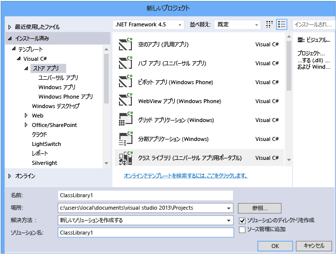
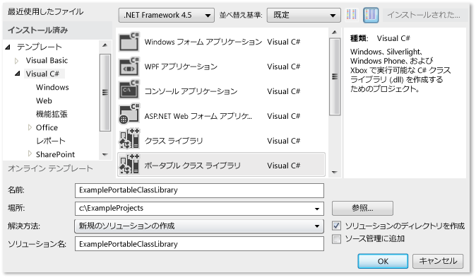
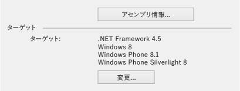
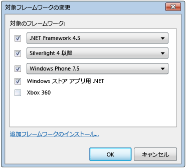
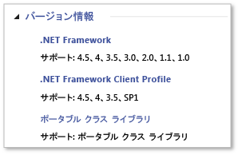

# <a name="cross-platform-development-with-the-portable-class-library"></a>汎用性のあるクラス ライブラリを使用したプラットフォーム間の開発
Visual Studio の .NET Framework ポータブル クラス ライブラリ プロジェクト タイプにより、Microsoft プラットフォームを対象としたクロスプラットフォーム アプリとライブラリをすばやく簡単に開発できます。  
  
 ポータブル クラス ライブラリにより、コードの開発とテストにかかる時間とコストを削減できます。 このプロジェクト タイプを使用してポータブル .NET Framework アセンブリを記述およびビルドし、Windows や Windows Phone など複数のプラットフォームを対象としたアプリから、これらのアセンブリを参照します。  
  
 Visual Studio でポータブル クラス ライブラリ プロジェクトを作成し、プロジェクトの開発を開始した後でも、ターゲット プラットフォームを変更できます。 Visual Studio は新しいアセンブリを使用してライブラリをコンパイルするので、コードに対して行う必要がある変更を確認できます。  
  
 この記事では、Visual Studio でのアプリの開発について説明します。しかし、Microsoft は、Xamarin などのほかのツールを使用してアプリとライブラリを開発するときに使用できるポータブル クラス ライブラリ参照アセンブリも提供します。 このようなアプリとライブラリは、Microsoft 以外のプラットフォーム上で .NET Framework ベースのランタイムで使用できます。 参照アセンブリの詳細については、ブログ記事を参照してください。[ポータブル クラス ライブラリ (PCL) すべてのプラットフォームで利用可能](http://blogs.msdn.com/b/dotnet/archive/2013/10/14/portable-class-library-pcl-now-available-on-all-platforms.aspx)です。 アセンブリをダウンロードするを参照してください。 [Microsoft .NET ポータブル ライブラリ参照アセンブリ](http://www.microsoft.com/download/details.aspx?id=40727)、Microsoft ダウンロード センターにします。 Xamarin を使用したアセンブリを使用する方法の詳細については、ブログ記事を参照してください。 [PCL および .NET NuGet ライブラリの Xamarin のようになりました](http://blogs.msdn.com/b/dotnet/archive/2013/11/13/pcl-and-net-nuget-libraries-are-now-enabled-for-xamarin.aspx)です。  
  
 Visual Studio には、ポータブル クラス ライブラリの開発に役立つテンプレートがあります。 使用している Visual Studio のバージョンによっては、使用可能なテンプレートやメニューはこの記事で説明するものとは異なることがあります。  
  
> [!WARNING]
>  Visual Studio 2013 Update 2 には、ポータブル クラス ライブラリ テンプレートの更新が含まれています。 Visual Studio と同じコンピューターにインストールされている Visual Studio 2013 以前のバージョンがあり、更新プログラム 2 への変更をインストールする場合、**ターゲット フレームワーク**選択肢は、Visual Studio の両方のバージョンに適用されます。  
  
 このトピックの内容:  
  
 [Visual Studio のサポート](#vs_support)  
 [ポータブル クラス ライブラリ プロジェクトを作成します。](#create_pcl)  
 [ターゲット オプション](#platforms)  
 [ターゲットの変更](#change_targets)  
 [サポートされる機能](#features)  
 [サポートされている型およびメンバー](#members)  
 [ポータブル クラス ライブラリの API の相違点](#API_diff)  
 [ポータブル クラス ライブラリの使用](#using)  
  
<a name="vs_support"></a>   
## <a name="visual-studio-support"></a>Visual Studio のサポート  
 Visual Studio のポータブル クラス ライブラリのサポートは、ご使用の Visual Studio のバージョンで異なります。 次の表に示すように、必要なアイテムがすべて揃っている場合と、追加のアイテムをインストールする必要がある場合があります。  
  
|Visual Studio SKU|ポータブル クラス ライブラリ プロジェクト作成のサポート|  
|-----------------------|---------------------------------------------------|  
|Visual Studio 2010、Professional、Premium、または Ultimate|[はい] をインストールするときに、[ポータブル ライブラリ ツール](https://marketplace.visualstudio.com/items?itemName=BCLTeam.PortableLibraryTools2)です。|  
|Visual Studio Express 2010 の各バージョン|いいえ。|  
|Visual Studio 2012、Professional、Premium、または Ultimate|はい。 Windows Phone 8.0 のサポート、インストール、 [Windows Phone SDK 8.0](https://www.microsoft.com/download/details.aspx?id=35471)です。|  
|Visual Studio Express 2012 の各バージョン|いいえ。|  
|Visual Studio 2013、Professional、Premium、または Ultimate|はい。 Windows Phone 8.1 をサポートする、インストール、[最新バージョンの Visual Studio 2013](https://www.visualstudio.com/vs/older-downloads/)です。|  
|Windows 用の visual Studio Community 2013|[はい] をインストールするときに、[最新バージョンの Visual Studio Community 2013](https://www.visualstudio.com/vs/older-downloads/)、更新プログラム 2 が含まれます。|  
  
<a name="create_pcl"></a>   
## <a name="creating-a-portable-class-library-project"></a>ポータブル クラス ライブラリ プロジェクトの作成  
 ポータブル クラス ライブラリを作成するには、Visual Studio に用意されているテンプレートのいずれかを使用してください。 新しいプロジェクトを作成し、、**新しいプロジェクト**ダイアログ ボックスで、**テンプレート**(c# または Visual Basic) で、目的の言語を選択して、対象となるプラットフォームのいずれかを選択します。 次のステップで追加のプラットフォームを選択できます。  
  
 Visual Studio 2013 Update 2 でを選択できます、**クラス ライブラリ (ポータブル)** 選択した言語とポータブル クラス ライブラリを作成するためのプラットフォーム用のテンプレートです。 このテンプレートは次のプラットフォームで表示されます。  
  
-   ストア アプリ  
  
-   Windows デスクトップ  
  
-   Silverlight  
  
 C# の場合にターゲット Windows Phone 8.1 および Windows 8.1 にライブラリを作成する場合は、選択**ストア アプリ**を選択し**クラス ライブラリ (ユニバーサル アプリ用ポータブル)** です。  
  
   
  
 このテンプレートでは、ターゲットとして Windows 8.1 と Windows Phone 8.1 が自動的に選択されます。 Windows 8.1 と Windows Phone 8.1 のみをターゲットとするライブラリを作成する場合は、後でターゲット プラットフォームを変更したり、プラットフォームを追加したりできます。  
  
 新しいプロジェクトを作成しを選択して Visual Studio 2012 または更新プログラム 2 なしの Visual Studio 2013 を使用している場合、**ポータブル クラス ライブラリ**Visual c# または Visual Basic でテンプレート。  
  
   
  
 **ポータブル クラス ライブラリの追加** ダイアログ ボックスが表示され、その他のプラットフォームを選択することができます。 このダイアログ ボックスに、選択したターゲットに基づいて互換性に関する警告が表示されます。  
  
   
Visual Studio 2013 更新プログラム 2 の [ポータブル クラス ライブラリの追加] ダイアログ ボックス  
  
 Visual Studio 2012 と Visual Studio 2013 のどちらを使用している場合でも、ポータブル クラス ライブラリ プロジェクトを作成するときにプラットフォームを選択できます。また、プロジェクトの作成後にプロジェクトのプロパティを使用してターゲット プラットフォームを変更できます。  
  
<a name="platforms"></a>   
## <a name="target-options"></a>ターゲット オプション  
 ポータブル クラス ライブラリ プロジェクトを作成するときに、ターゲットにするオペレーティング システムと .NET Framework バージョンを選択できます。 Visual Studio 2013 を使用しているや更新プログラム 2 をインストールした後で、ことができる場合、**クラス ライブラリ (ユニバーサル アプリ用ポータブル)** を Windows 8.1 および Windows Phone 8.1 を対象とするポータブル クラス ライブラリを作成するテンプレートです。 Visual Studio のバージョン別に選択可能なターゲットを次の表に示します。  
  
|ターゲット オプション|Visual Studio 2012|Visual Studio 2013|Visual Studio 2013 Update 2 以降|  
|-|-|-|-|  
|.NET Framework|.NET framework 4 以降<br /><br /> .NET framework 4.0.3 以上<br /><br /> .NET framework 4.5|.NET framework 4 以降<br /><br /> .NET framework 4.0.3 以上<br /><br /> .NET framework 4.5 以降<br /><br /> .NET framework 4.5.1|.NET framework 4<br /><br /> .NET framework 4.0.3<br /><br /> .NET framework 4.5<br /><br /> .NET framework 4.5.1|  
|Windows Phone|-Windows Phone 7 以降<br /><br /> -Windows Phone 7.5 以降<br /><br /> -Windows Phone 8|-Windows Phone 8|-Windows Phone Silverlight 8<br /><br /> -Windows Phone Silverlight 8.1<br /><br /> Windows ランタイムと XAML をサポートするには、次を選択してください。<br /><br /> -Windows Phone 8.1|  
|Windows ストア|Windows ストア アプリ用 .NET|Windows ストア アプリ (Windows 8) 以降<br /><br /> Windows ストア アプリ (Windows 8.1)|Windows 8<br /><br /> -Windows 8.1|  
|-Silverlight|Silverlight 4 以上<br /><br /> Silverlight 5|Silverlight 5|Silverlight 5|  
|Xbox|Xbox 360|N/A|N/A|  
  
<a name="change_targets"></a>   
## <a name="changing-targets"></a>ターゲットの変更  
 ポータブル クラス ライブラリ テンプレートを選択すると、既定のプラットフォームが自動的に選択されます。ただしこの既定値は、インストールされている Visual Studio のバージョンと、以前に選択したターゲットに応じて異なります。 ポータブル クラス ライブラリの作成時、またはポータブル クラス ライブラリの開発開始後、プラットフォームを変更できます。  
  
 プロジェクトを作成した後でターゲットを変更する場合は、**ソリューション エクスプ ローラー**(ソリューションではなく)、ポータブル クラス ライブラリ プロジェクトのショートカット メニューを開きを選択し、**プロパティ**. プロジェクトのプロパティ ページで、**ライブラリ** タブは、プロジェクトが現在対象プラットフォームを示します。  
  
   
Visual Studio 2013 更新プログラム 2 のポータブル クラス ライブラリ プロパティ ページ  
  
 追加またはターゲットを削除、選択、**変更**ボタンをクリックしを選択し、該当するチェック ボックスをオフにします。  
  
 ターゲットを変更すると、変更後のターゲットに合わせて、プロジェクトの開発に使用できる API が変更されます。 Visual Studio は、ターゲットを変更したことで発生する可能性があるエラーと警告を報告します。  
  
 Visual Studio で変更を加える前に、アセンブリの移植性を評価する場合は、使用することができます、 [.NET 移植性アナライザー](http://visualstudiogallery.msdn.microsoft.com/1177943e-cfb7-4822-a8a6-e56c7905292b)です。  
  
 メニュー オプションは、ご使用の Visual Studio のバージョンによって異なります。  
  
   
Visual Studio 2012 の [ターゲットの変更] ダイアログ ボックス  
  
<a name="features"></a>   
## <a name="supported-features"></a>サポートされている機能  
 次の表に、各プラットフォームでサポートされている機能とバージョンを示します。 中には Microsoft がNuGet パッケージのリリースのサポートを追加しているものがありますが、その場合は注記が付されています。 .NET Framework 用の NuGet パッケージの詳細については、次を参照してください。 [.NET Framework および帯域外のリリース](../../../docs/framework/get-started/the-net-framework-and-out-of-band-releases.md)です。  
  
|機能|.NET Framework|.NET Framework|.NET Framework|Windows ストア|Windows ストア|Windows Phone ストア|Windows Phone Silverlight|Windows Phone Silverlight|Windows Phone Silverlight|Silverlight|Silverlight|Xbox 360|  
|-------------|--------------------|--------------------|--------------------|-------------------|-------------------|-------------------------|-------------------------------|-------------------------------|-------------------------------|-----------------|-----------------|--------------|  
||**4**|**4.0.3**|**4.5**|**8**|**8.1**|**8.1**|**7.5**|**8**|**8.1**|**4**|**5**||  
|コア ライブラリ|✓|✓|✓|✓|✓|✓|✓|✓|✓|✓|✓|✓|  
|非同期サポート|➊|➊|✓|✓|✓|✓|➊|➊|✓|➊|➊||  
|[圧縮]|||✓|✓|✓|✓||➋|➋||||  
|データの注釈||✓|✓|✓|✓|||||✓|✓||  
|Dynamic キーワード|✓|✓|✓|✓|✓|||||✓|✓||  
|HTTPClient|➌|➌|✓|✓|✓|✓|➌|➌|➌|➌|➌||  
|IQueryable|✓|✓|✓|✓|✓|✓|✓|✓|✓|✓|✓||  
|統合言語クエリ (LINQ)|✓|✓|✓|✓|✓|✓|✓|✓|✓|✓|✓||  
|Managed Extensibility Network (MEF)|✓|✓|✓|✓|✓|||||✓|✓||  
|Network Class Library (NCL)|✓|✓|✓|✓|✓|✓|✓|✓|✓|✓|✓||  
|シリアル化 (データ コントラクト、XML、JSON)|✓|✓|✓|✓|✓|✓|✓|✓|✓|✓|✓||  
|System.Numerics|✓|✓|✓|✓|✓|||||✓|✓||  
|ビュー モデル (MVVM)|||✓|✓|✓|✓|✓|✓|✓|✓|✓||  
|Windows Communication Foundation (WCF)|✓|✓|✓|✓|✓||✓|✓|✓|✓|✓||  
|Windows ランタイム API|||||✓|✓|||||||  
|Windows.UI.XAML|||||✓|✓|||||||  
|XLINQ||✓|✓|✓|✓|✓|✓|✓|✓|✓|✓|✓|  
  
 ➊ 必要[Microsoft Async](https://www.nuget.org/packages/Microsoft.Bcl.Async/)パッケージ  
 ➋ 必要[Microsoft Compression](https://www.nuget.org/packages/Microsoft.Bcl.Compression)パッケージ  
 ➌ 必要[Microsoft HTTP Client Libraries](https://www.nuget.org/packages/Microsoft.Net.Http)パッケージ  
  
> [!WARNING]
>  参照するときにエラーが発生する可能性があります、 [Microsoft Compression](https://www.nuget.org/packages/Microsoft.Bcl.Compression)と[Microsoft HTTP Client Libraries](https://www.nuget.org/packages/Microsoft.Net.Http) Windows Phone Silverlight 8.1 アプリで使用するポータブル ライブラリからのパッケージです。 詳細については、次を参照してください。[プラットフォームの互換性と最新の Windows Phone Silverlight 8.1 アプリ変更](/previous-versions/windows/apps/dn642084(v=vs.105))です。  
  
<a name="members"></a>   
## <a name="supported-types-and-members"></a>サポートされている型とメンバー  
 ポータブル クラス ライブラリのプロジェクトで使用できる型とメンバーは、互換性に関するいくつかの要因による制約を受けます。  
  
-   選択したターゲット間で共有される必要があります。  
  
-   それらのターゲット間で同様に動作する必要があります。  
  
-   廃止候補であってはなりません。  
  
-   特にサポートしているメンバーがポータブルでない場合は、ポータブルな環境に意味がある必要があります。  
  
 たとえば、ターゲットが Windows 8.1 と Windows Phone 8.1 の場合、ポータブル クラス ライブラリには UI 関連の型のみが含まれます。 また、ポータブル クラス ライブラリが導入される前にリリースされたプラットフォーム (Xbox、.NET Framework 4、Windows Phone 7 など) を対象とする場合、制限が課せられる可能性があります。 .NET Framework は NuGet でパッケージをリリースしています。これにより、このような古いプラットフォームの一部でのポータブル クラス ライブラリのサポートが向上します。 NuGet パッケージの一覧および詳細については、次を参照してください。 [.NET Framework および帯域外のリリース](../../../docs/framework/get-started/the-net-framework-and-out-of-band-releases.md)です。  
  
 メンバーがポータブル クラス ライブラリでサポートされており、選択したターゲットのメンバーである場合、IntelliSense でプロジェクトにこのメンバーが表示されます。 また、ポータブル クラス ライブラリ アイコンメンバー テーブルに表示されます、 [.NET Framework クラス ライブラリ](https://msdn.microsoft.com/library/mt472912.aspx)横にメンバーをサポートします。 たとえば、次のメンバー テーブルは、ポータブル クラス ライブラリで <xref:System.String.Chars%2A> クラスの <xref:System.String> プロパティがサポートされていることを示しています。  
  
   
ポータブル クラス ライブラリのアイコン  
  
 検索することも、**バージョン情報**型またはメンバーがポータブル クラス ライブラリ プロジェクトでサポートされていることを示す注のリファレンス トピックのセクション。  
  
   
バージョン情報の例  
  
 ただし、API がポータブル クラス ライブラリでサポートされている可能性があります。API を使用できるかどうかは、選択したターゲットによって異なります。  
  
<a name="API_diff"></a>   
## <a name="api-differences-in-the-portable-class-library"></a>ポータブル クラス ライブラリでの API の相違点  
 サポートされるすべてのプラットフォームでポータブル クラス ライブラリ アセンブリの互換性を確保するために、ポータブル クラス ライブラリでは一部のメンバーが若干変更されています。  
  
<a name="using"></a>   
## <a name="using-the-portable-class-library"></a>ポータブル クラス ライブラリの使用  
 ポータブル クラス ライブラリ プロジェクトをビルドしたら、他のプロジェクトからそのプロジェクトを参照します。 プロジェクトを参照することも、アクセスする必要のあるクラスを含む特定のアセンブリを参照することもできます。  
  
 ポータブル クラス ライブラリ アセンブリを参照するアプリを実行するには、ターゲット プラットフォームの必要なバージョン (またはそれ以上のバージョン) がコンピューターにインストールされている必要があります。 Visual Studio には必要なすべてのフレームワークが含まれるため、さらに変更を加えることなく、アプリケーションの開発に使用したコンピューターでアプリケーションを実行できます。  
  
### <a name="deploying-a-windows-store-or-windows-phone-app"></a>Windows Store アプリまたは Windows Phone アプリの配置  
 ポータブル クラス ライブラリ アセンブリを参照する Windows ストア アプリまたは Windows Phone アプリを作成する場合、そのアプリを配置するために必要なすべての機能はアプリ パッケージに含まれており、追加の作業は不要です。  
  
### <a name="deploying-a-net-framework-app"></a>.NET Framework アプリの配置  
 ポータブル クラス ライブラリ アセンブリを参照する .NET Framework アプリを配置するときは、.NET Framework の正しいバージョンに対する依存関係を指定する必要があります。 この依存関係を指定することで、必要なバージョンがアプリケーションと共に確実にインストールされます。 .NET Framework 4 を対象にするか、後で、コンピューターに必要で、.NET Framework 4、[更新](https://www.microsoft.com/download/details.aspx?id=3556)、更新プログラム 4.0.3、.NET Framework 4 または .NET Framework 4.5 をインストールします。  
  
-   ClickOnce 配置で依存関係を作成する: で**ソリューション エクスプ ローラー**、発行するプロジェクトのプロジェクト ノードを選択します。 (これは、ポータブル クラス ライブラリ プロジェクトを参照するプロジェクトです。)メニュー バーで、次のように選択します。**プロジェクト**、**プロパティ**、を選択し、**発行**タブです。**発行**ページで、選択**の前提条件**です。 必須コンポーネントとして、必要な .NET Framework のバージョン (または .NET Framework 4 の更新プログラム) を選択します。  
  
-   セットアップ プロジェクトの依存関係を作成する: で**ソリューション エクスプ ローラー**、セットアップ プロジェクトを選択します。 メニュー バーで、次のように選択します。**プロジェクト**、**プロパティ**、**の前提条件**です。 必須コンポーネントとして、必要な .NET Framework のバージョンを選択します。  
  
 .NET Framework アプリの展開に関する詳細については、次を参照してください。[開発者向けの展開ガイド](../../../docs/framework/deployment/deployment-guide-for-developers.md)です。  
  
### <a name="deploying-a-silverlight-based-app"></a>Silverlight ベースのアプリの配置  
 ポータブル クラス ライブラリ アセンブリを参照する Silverlight ベースのアプリを配置するときは、アプリに必要な最小ランタイム バージョンが、対象とするバージョンに対応していることを確認する必要があります。 Silverlight 4 を対象とする場合は、バージョンは 4.0.60129.0 以降である必要があります。 Silverlight ベースのアプリケーションをホストする Web ページに `<param name="minRuntimeVersion" value="4.0.60129.0" />` を含めることでバージョンを設定します。  
  
```xaml  
<div id="silverlightControlHost">  
    <object data="data:application/x-silverlight-2,"   
           type="application/x-silverlight-2" width="100%" height="100%">  
    <param name="source" value="ClientBin/SilverlightApplication.xap"/>  
    <param name="onError" value="onSilverlightError" />  
    <param name="background" value="white" />  
    <param name="minRuntimeVersion" value="4.0.60129.0" />  
    <param name="autoUpgrade" value="true" />  
    <a href="https://www.microsoft.com/getsilverlight/get-started/install/"   
             style="text-decoration:none">  
        
    </a>  
  </object>  
   <iframe id="_sl_historyFrame"   
              style="visibility:hidden;height:0px;width:0px;border:0px">  
   </iframe>  
</div>  
```  
  
## <a name="see-also"></a>関連項目  
 [MVVM を利用した汎用性のあるクラス ライブラリの使用](../../../docs/standard/cross-platform/using-portable-class-library-with-model-view-view-model.md)  
 [複数のプラットフォームを対象とするライブラリのアプリケーション リソース](../../../docs/standard/cross-platform/app-resources-for-libraries-that-target-multiple-platforms.md)  
 [.NET 移植性アナライザー](http://visualstudiogallery.msdn.microsoft.com/1177943e-cfb7-4822-a8a6-e56c7905292b)  
 [Windows ストア アプリおよび Windows ランタイムのための .NET Framework サポート](../../../docs/standard/cross-platform/support-for-windows-store-apps-and-windows-runtime.md)  
 [配置](../../../docs/framework/deployment/net-framework-applications.md)
