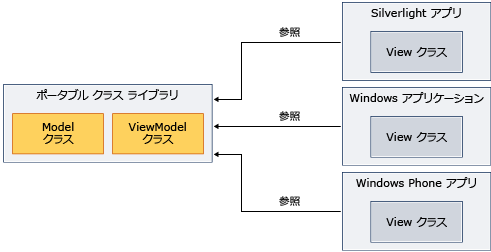

# Model-View-View Model を利用した汎用性のあるクラス ライブラリの使用
.NET Framework を使用して[ポータブル クラス ライブラリ](../../../docs/standard/cross-platform/cross-platform-development-with-the-portable-class-library.md)モデル-ビュー-ビュー モデル (MVVM) パターンを実装し、複数のプラットフォーム間でアセンブリを共有します。  
  
 MVVM は、基になるビジネス ロジックからユーザー インターフェイスを分離するアプリケーション パターンです。 モデルとビューのモデル クラスを実装することができます、[!INCLUDE[net_portable](../../../includes/net-portable-md.md)]プロジェクト[!INCLUDE[vs_dev11_long](../../../includes/vs-dev11-long-md.md)]、し、さまざまなプラットフォーム用にカスタマイズされたビューを作成します。 この方法では、データを記述することができますのモデルとビジネス ロジックを 1 回だけ、.NET Framework、Silverlight、Windows Phone からのコードを使用して[!INCLUDE[win8_appname_long](../../../includes/win8-appname-long-md.md)]アプリの場合、次の図に示すようにします。  
  
   
  
 このトピックには、一般的なパターンについては、MVVM は行いません。 のみを使用する方法に関する情報を提供[!INCLUDE[net_portable](../../../includes/net-portable-md.md)]MVVM を実装します。 MVVM の詳細については、次を参照してください。、 [MVVM クイック スタート](http://go.microsoft.com/fwlink/?LinkId=234934)です。  
  
## MVVM をサポートするクラス  
 対象にする場合、 [!INCLUDE[net_v45](../../../includes/net-v45-md.md)]、 [!INCLUDE[net_win8_profile](../../../includes/net-win8-profile-md.md)]、Silverlight、または Windows Phone 7.5 用、[!INCLUDE[net_portable](../../../includes/net-portable-md.md)]プロジェクトでは、次のクラスは MVVM パターンを実装するために使用できます。  
  
-   <xref:System.Collections.ObjectModel.ObservableCollection%601?displayProperty=nameWithType> クラス  
  
-   <xref:System.Collections.ObjectModel.ReadOnlyObservableCollection%601?displayProperty=nameWithType> クラス  
  
-   <xref:System.Collections.Specialized.INotifyCollectionChanged?displayProperty=nameWithType> クラス  
  
-   <xref:System.Collections.Specialized.NotifyCollectionChangedAction?displayProperty=nameWithType> クラス  
  
-   <xref:System.Collections.Specialized.NotifyCollectionChangedEventArgs?displayProperty=nameWithType> クラス  
  
-   <xref:System.Collections.Specialized.NotifyCollectionChangedEventHandler?displayProperty=nameWithType> クラス  
  
-   <xref:System.ComponentModel.DataErrorsChangedEventArgs?displayProperty=nameWithType> クラス  
  
-   <xref:System.ComponentModel.INotifyDataErrorInfo?displayProperty=nameWithType> クラス  
  
-   <xref:System.ComponentModel.INotifyPropertyChanged?displayProperty=nameWithType> クラス  
  
-   <xref:System.Windows.Input.ICommand?displayProperty=nameWithType> クラス  
  
-   すべてのクラス、<xref:System.ComponentModel.DataAnnotations?displayProperty=nameWithType>名前空間  
  
## MVVM を実装します。  
 MVVM を実装するには、通常を作成するモデルとでは、ビュー モデルの両方、[!INCLUDE[net_portable](../../../includes/net-portable-md.md)]ために、プロジェクト、[!INCLUDE[net_portable](../../../includes/net-portable-md.md)]プロジェクトは、移植性のないプロジェクトを参照できません。 モデルとビューのモデルは、同じプロジェクト内、またはそれぞれ別のプロジェクトを指定できます。 個別のプロジェクトを使用する場合は、モデル プロジェクトをビュー モデル プロジェクトからの参照を追加します。  
  
 モデルをコンパイルして、モデル プロジェクトを表示すると後、は、ビューを含むアプリでそれらのアセンブリを参照します。 をビュー モデルにのみ、ビューが操作する場合のみ、ビュー モデルを含むアセンブリを参照する必要があります。  
  
### モデル  
 次の例にある単純なモデル クラスを示しています、[!INCLUDE[net_portable](../../../includes/net-portable-md.md)]プロジェクト。  
  
 [!code-csharp[PortableClassLibraryMVVM#1](../../../samples/snippets/csharp/VS_Snippets_CLR/portableclasslibrarymvvm/cs/customer.cs#1)]
 [!code-vb[PortableClassLibraryMVVM#1](../../../samples/snippets/visualbasic/VS_Snippets_CLR/portableclasslibrarymvvm/vb/customer.vb#1)]  
  
 次の例は、設定、取得、およびデータの更新を簡単な方法を示しています、[!INCLUDE[net_portable](../../../includes/net-portable-md.md)]プロジェクト。 実際のアプリでは、Windows Communication Foundation (WCF) サービスなどのソースからデータを取得します。  
  
 [!code-csharp[PortableClassLibraryMVVM#2](../../../samples/snippets/csharp/VS_Snippets_CLR/portableclasslibrarymvvm/cs/customerrepository.cs#2)]
 [!code-vb[PortableClassLibraryMVVM#2](../../../samples/snippets/visualbasic/VS_Snippets_CLR/portableclasslibrarymvvm/vb/customerrepository.vb#2)]  
  
### ビュー モデル  
 MVVM パターンを実装するときに、モデルの表示の基本クラスが頻繁に追加されます。 次の例では、基本クラスを示します。  
  
 [!code-csharp[PortableClassLibraryMVVM#3](../../../samples/snippets/csharp/VS_Snippets_CLR/portableclasslibrarymvvm/cs/viewmodelbase.cs#3)]
 [!code-vb[PortableClassLibraryMVVM#3](../../../samples/snippets/visualbasic/VS_Snippets_CLR/portableclasslibrarymvvm/vb/viewmodelbase.vb#3)]  
  
 実装、<xref:System.Windows.Input.ICommand>インターフェイスは MVVM パターンでよく使用します。 <xref:System.Windows.Input.ICommand> インターフェイスを実装する例を次に示します。  
  
 [!code-csharp[PortableClassLibraryMVVM#4](../../../samples/snippets/csharp/VS_Snippets_CLR/portableclasslibrarymvvm/cs/relaycommand.cs#4)]
 [!code-vb[PortableClassLibraryMVVM#4](../../../samples/snippets/visualbasic/VS_Snippets_CLR/portableclasslibrarymvvm/vb/relaycommand.vb#4)]  
  
 次の例は、簡略化されたビュー モデルを示しています。  
  
 [!code-csharp[PortableClassLibraryMVVM#5](../../../samples/snippets/csharp/VS_Snippets_CLR/portableclasslibrarymvvm/cs/mainpageviewmodel.cs#5)]
 [!code-vb[PortableClassLibraryMVVM#5](../../../samples/snippets/visualbasic/VS_Snippets_CLR/portableclasslibrarymvvm/vb/customerviewmodel.vb#5)]  
  
### 表示  
 [!INCLUDE[net_v45](../../../includes/net-v45-md.md)]アプリ、[!INCLUDE[win8_appname_long](../../../includes/win8-appname-long-md.md)]アプリ、Silverlight ベースのアプリまたは Windows Phone 7.5 アプリの場合は、モデルとビューのモデル プロジェクトを含むアセンブリを参照することができます。  連携するビューを作成するには、ビュー モデルにします。 次の例を取得し、ビュー モデルからデータを更新するシンプルな Windows Presentation Foundation (WPF) アプリを示します。 Silverlight では、Windows Phone のようなビューを作成する可能性がありますまたは[!INCLUDE[win8_appname_long](../../../includes/win8-appname-long-md.md)]アプリ。  
  
 [!code-xaml[PortableClassLibraryMVVM#6](../../../samples/snippets/csharp/VS_Snippets_CLR/portableclasslibrarymvvm/cs/mainwindow.xaml#6)]  
  
## 参照  
 [ポータブル クラス ライブラリ](../../../docs/standard/cross-platform/cross-platform-development-with-the-portable-class-library.md)
