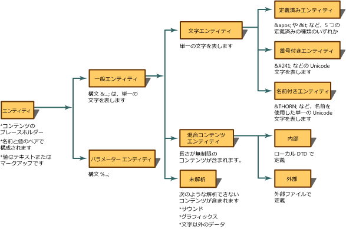
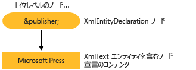

# <a name="reading-entity-declarations-and-entity-references-into-the-dom"></a><span data-ttu-id="bd4ce-102">エンティティ宣言とエンティティ参照の DOM への読み込み</span><span class="sxs-lookup"><span data-stu-id="bd4ce-102">Reading Entity Declarations and Entity References into the DOM</span></span>
<span data-ttu-id="bd4ce-103">エンティティとは、コンテンツやマークアップの代わりに XML で使われる名前を指定する宣言です。</span><span class="sxs-lookup"><span data-stu-id="bd4ce-103">An entity is a declaration that states a name to be used in the XML in place of content or markup.</span></span> <span data-ttu-id="bd4ce-104">エンティティを使用するには、2 つの手順が必要です。</span><span class="sxs-lookup"><span data-stu-id="bd4ce-104">There are two parts to entities.</span></span> <span data-ttu-id="bd4ce-105">まず、エンティティ宣言を使用して、置換するコンテンツに名前を結び付ける必要があります。</span><span class="sxs-lookup"><span data-stu-id="bd4ce-105">First, you must tie a name to the replacement content using an entity declaration.</span></span> <span data-ttu-id="bd4ce-106">エンティティ宣言は、ドキュメント型定義 (DTD) または XML スキーマの中で、`<!ENTITY name "value">` 構文を使って作成します。</span><span class="sxs-lookup"><span data-stu-id="bd4ce-106">An entity declaration is created by using the `<!ENTITY name "value">` syntax in a document type definition (DTD) or XML schema.</span></span> <span data-ttu-id="bd4ce-107">次に、エンティティ宣言で定義した名前を XML で使用します。</span><span class="sxs-lookup"><span data-stu-id="bd4ce-107">Secondly, the name defined in the entity declaration is subsequently used in the XML.</span></span> <span data-ttu-id="bd4ce-108">XML で使用するときは、エンティティ参照と呼ばれます。</span><span class="sxs-lookup"><span data-stu-id="bd4ce-108">When used in the XML, it is called an entity reference.</span></span> <span data-ttu-id="bd4ce-109">たとえば、次のエンティティ宣言は、`publisher` という名前のエンティティを宣言し、それを "Microsoft Press" というコンテンツに関連付けます。</span><span class="sxs-lookup"><span data-stu-id="bd4ce-109">For example, the following entity declaration declares an entity of the name `publisher` being associated with the content of "Microsoft Press".</span></span>  
  
```xml  
<!ENTITY publisher "Microsoft Press">  
```  
  
 <span data-ttu-id="bd4ce-110">このエンティティ宣言を、XML でエンティティ参照として使用する例を次に示します。</span><span class="sxs-lookup"><span data-stu-id="bd4ce-110">The following example shows the use of this entity declaration in XML as an entity reference.</span></span>  
  
```xml  
<author>Fred</author>  
<pubinfo>Published by &publisher;</pubinfo>  
```  
  
 <span data-ttu-id="bd4ce-111">パーサーの中には、ドキュメントをメモリに読み込むとき、エンティティを自動的に展開するものがあります。</span><span class="sxs-lookup"><span data-stu-id="bd4ce-111">Some parsers automatically expand entities when a document is loaded into memory.</span></span> <span data-ttu-id="bd4ce-112">この場合は、XML がメモリに読み込まれるときに、エンティティ宣言が記憶されて保存されます。</span><span class="sxs-lookup"><span data-stu-id="bd4ce-112">Therefore, when the XML is being read into memory, entity declarations are remembered and saved.</span></span> <span data-ttu-id="bd4ce-113">その後、一般エンティティ参照を識別する `&;` 文字を検出すると、パーサーはその名前をエンティティ宣言テーブルで検索します。</span><span class="sxs-lookup"><span data-stu-id="bd4ce-113">When the parser subsequently encounters `&;` characters, which identify a general entity reference, the parser looks up that name in an entity declaration table.</span></span> <span data-ttu-id="bd4ce-114">`&publisher;` という参照は、それが表すコンテンツに置き換えられます。</span><span class="sxs-lookup"><span data-stu-id="bd4ce-114">The reference, `&publisher;` is replaced by the content that it represents.</span></span> <span data-ttu-id="bd4ce-115">たとえば、次の XML を使用します。</span><span class="sxs-lookup"><span data-stu-id="bd4ce-115">Using the following XML,</span></span>  
  
```xml  
<author>Fred</author>  
<pubinfo>Published by &publisher;</pubinfo>  
```  
  
 <span data-ttu-id="bd4ce-116">エンティティ参照は展開され、`&publisher;` が Microsoft Press というコンテンツに置き換えられます。展開された XML は次のようになります。</span><span class="sxs-lookup"><span data-stu-id="bd4ce-116">expanding the entity reference and replacing the `&publisher;` with the Microsoft Press content gives the following expanded XML.</span></span>  
  
 <span data-ttu-id="bd4ce-117">**出力**</span><span class="sxs-lookup"><span data-stu-id="bd4ce-117">**Output**</span></span>  
  
```xml  
<author>Fred</author>  
<pubinfo>Published by Microsoft Press</pubinfo>  
```  
  
 <span data-ttu-id="bd4ce-118">エンティティには多くの種類があります。</span><span class="sxs-lookup"><span data-stu-id="bd4ce-118">There are many kinds of entities.</span></span> <span data-ttu-id="bd4ce-119">エンティティの分類と用語を次の図に示します。</span><span class="sxs-lookup"><span data-stu-id="bd4ce-119">The following diagram shows the breakdown of entity types and terminology.</span></span>  
  
 <span data-ttu-id="bd4ce-120"></span><span class="sxs-lookup"><span data-stu-id="bd4ce-120"></span></span>  
  
 <span data-ttu-id="bd4ce-121">XML ドキュメント オブジェクト モデル (DOM) の Microsoft .NET Framework の実装では、XML の読み込み時に既定でエンティティ参照を保持し、エンティティを展開しません。</span><span class="sxs-lookup"><span data-stu-id="bd4ce-121">The default for the Microsoft .NET Framework implementation of the XML Document Object Model (DOM) is to preserve the entities references and not expand the entities when the XML is loaded.</span></span> <span data-ttu-id="bd4ce-122">つまり、ドキュメントが DOM に読み込まれるときには、`&publisher;` という参照変数を含む **XmlEntityReference** ノードが作成され、その子ノードとして、DTD に宣言されたエンティティのコンテンツを表すノードが作成されます。</span><span class="sxs-lookup"><span data-stu-id="bd4ce-122">The implication of this is that as a document is loaded in the DOM, an **XmlEntityReference** node containing the reference variable `&publisher;` is created, with child nodes representing the content in the entity declared in the DTD.</span></span>  
  
 <span data-ttu-id="bd4ce-123">`<!ENTITY publisher "Microsoft Press">` というエンティティ宣言を使用した場合に、この宣言によって作成される **XmlEntity** ノードと **XmlText** ノードを次の図に示します。</span><span class="sxs-lookup"><span data-stu-id="bd4ce-123">Using the `<!ENTITY publisher "Microsoft Press">` entity declaration, the following diagram shows the **XmlEntity** and **XmlText** nodes created from this declaration.</span></span>  
  
 <span data-ttu-id="bd4ce-124"></span><span class="sxs-lookup"><span data-stu-id="bd4ce-124"></span></span>  
  
 <span data-ttu-id="bd4ce-125">エンティティ参照が展開されるかどうかによって、メモリの DOM ツリーに生成されるノードが変わります。</span><span class="sxs-lookup"><span data-stu-id="bd4ce-125">The differences when entity references are expanded and when they are not makes a difference in what nodes are generated in the DOM tree, in memory.</span></span> <span data-ttu-id="bd4ce-126">生成されるノードの違いについては、「[保持されるエンティティ参照](../../../../docs/standard/data/xml/entity-references-are-preserved.md)」と「[保持されずに展開されるエンティティ参照](../../../../docs/standard/data/xml/entity-references-are-expanded-and-not-preserved.md)」で説明しています。</span><span class="sxs-lookup"><span data-stu-id="bd4ce-126">The difference in the nodes that are generated is explained in the topics [Entity References are Preserved](../../../../docs/standard/data/xml/entity-references-are-preserved.md) and [Entity References are Expanded and Not Preserved](../../../../docs/standard/data/xml/entity-references-are-expanded-and-not-preserved.md).</span></span>  
  
## <a name="see-also"></a><span data-ttu-id="bd4ce-127">参照</span><span class="sxs-lookup"><span data-stu-id="bd4ce-127">See Also</span></span>  
 [<span data-ttu-id="bd4ce-128">XML ドキュメント オブジェクト モデル (DOM)</span><span class="sxs-lookup"><span data-stu-id="bd4ce-128">XML Document Object Model (DOM)</span></span>](../../../../docs/standard/data/xml/xml-document-object-model-dom.md)
