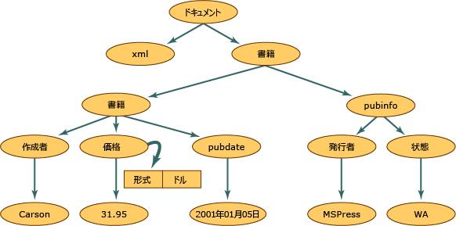

# <a name="xml-document-object-model-dom"></a>XML ドキュメント オブジェクト モデル (DOM)
XML ドキュメント オブジェクト モデル (DOM) クラスは、XML ドキュメントのメモリ内表現です。 DOM を使用すると、XML ドキュメントの読み込み、操作、および変更をプログラムから実行できます。 **XmlReader** クラスも XML を読み込めますが、非キャッシュ、前方参照専用、読み取り専用のアクセスしか実行できません。 つまり、**XmlReader** には、属性の値または要素のコンテンツを編集する機能や、ノードを挿入したり削除したりする機能はありません。 DOM の主な機能は編集です。 XML データは、通常、メモリ上では構造的に表現されますが、実際の XML データをファイルに保存したり、別のオブジェクトから取り込む場合は、直線的な形式で格納されます。 XML データの例を次に示します。  
  
## <a name="input"></a>入力  
  
```xml  
<?xml version="1.0"?>  
  <books>  
    <book>  
        <author>Carson</author>  
        <price format="dollar">31.95</price>  
        <pubdate>05/01/2001</pubdate>  
    </book>  
    <pubinfo>  
        <publisher>MSPress</publisher>  
        <state>WA</state>  
    </pubinfo>  
  </books>   
```  
  
 この XML データが DOM 構造に読み込まれるとき、メモリがどのように構造化されるかを次の図に示します。  
  
   
XML ドキュメントの構造  
  
 図中のそれぞれの円は、XML ドキュメント構造における 1 つのノードを表します。これは **XmlNode** オブジェクトと呼ばれます。 **XmlNode** オブジェクトは、DOM ツリーの基本オブジェクトです。 **XmlNode** を拡張する **XmlDocument** クラスは、たとえばドキュメントをメモリに読み込んだり、XML をファイルに保存するなど、ドキュメント全体を操作するメソッドをサポートしています。 さらに **XmlDocument** では、XML ドキュメント全体のノードを参照して操作する手段も提供されます。 **XmlNode** と **XmlDocument** は、いずれもパフォーマンスと使いやすさが向上しており、次の操作を実行するメソッドとプロパティを持っています。  
  
-   要素ノード、エンティティ参照ノードなど、DOM に固有のノードへのアクセスと変更。  
  
-   要素ノードのテキストなど、ノードに格納されている情報およびノード全体の取得。  
  
    > [!NOTE]
    >  アプリケーションが DOM の提供する構造や編集機能を必要としない場合は、**XmlReader** クラスと **XmlWriter** クラスを使って XML への非キャッシュ、前方参照専用のストリーム アクセスを実行できます。 詳細については、<xref:System.Xml.XmlReader> および <xref:System.Xml.XmlWriter> を参照してください。  
  
 **Node** オブジェクトには、適切に定義された基本的な特性と、メソッドおよびプロパティのセットが含まれます。 オブジェクトが持つ特性のいくつかを次に示します。  
  
-   ノードは 1 つの親ノードを持っています。親ノードはノードの 1 つ上のノードです。 ドキュメント ルートは最上位のノードであり、ドキュメント自身とドキュメント フラグメントしか格納されていないため、親ノードを持っていないノードはドキュメント ルートだけです。  
  
-   ほとんどのノードは、複数の子ノードを持つことができます。子ノードは、ノードの 1 つ下のノードです。 子ノードを持つことができるノード型の一覧を次に示します。  
  
    -   **Document**  
  
    -   **DocumentFragment**  
  
    -   **EntityReference**  
  
    -   **要素**  
  
    -   **属性**  
  
     **XmlDeclaration** ノード、**Notation** ノード、**Entity** ノード、**CDATASection** ノード、**Text** ノード、**Comment** ノード、**ProcessingInstruction** ノード、**DocumentType** ノードは子ノードを持ちません。  
  
-   図中に **book** および **pubinfo** として同レベルに表現されているノードは兄弟です。  
  
 DOM の特性の 1 つは、属性の取り扱い方法にあります。 属性は、互いに親子関係や兄弟関係を持つノードではありません。 属性は要素ノードのプロパティと見なされ、名前と値ペアから構成されます。 たとえば、要素 `format="dollar` に関連付けられている `price`" という形式の XML データがある場合は、単語 `format` が名前になり、`format` 属性の値は `dollar` になります。 **price** ノードの `format="dollar"` 属性を取得するには、カーソルが `price` 要素ノード上にあるときに **GetAttribute** メソッドを呼び出します。 詳細については、「[DOM の属性へのアクセス](../../../../docs/standard/data/xml/accessing-attributes-in-the-dom.md)」を参照してください。  
  
 XML をメモリに読み込むと、ノードが作成されます。 ただし、すべてのノードが同じタイプというわけではありません。 XML の要素の規則と構文は、処理命令の規則と構文とは異なります。 したがって、さまざまなデータが読み込まれるときに、個々のノードにノード型が割り当てられます。 このノード型によって、ノードの特性と機能が決定されます。  
  
 メモリに生成されるノード型の詳細については、「[XML ノードの種類](../../../../docs/standard/data/xml/types-of-xml-nodes.md)」を参照してください。 ノード ツリーに作成されるオブジェクトの詳細については、「[オブジェクト階層の XML データへのマップ](../../../../docs/standard/data/xml/mapping-the-object-hierarchy-to-xml-data.md)」を参照してください。  
  
 Microsoft では、XML ドキュメントの操作を容易にするために、W3C (World Wide Web Consortium) DOM Level 1 および Level 2 で規定されている API を拡張しています。 W3C の標準を完全にサポートする一方で、追加のクラス、メソッド、プロパティにより、W3C の XML DOM で実現できる以上の機能が付加されています。 新しいクラスを使用すると、リレーショナル データにアクセスし、ADO.NET との同期をとりながら、データを XML として公開できます。 詳細については、「[Dataset と XmlDataDocument の同期](../../../../docs/framework/data/adonet/dataset-datatable-dataview/dataset-and-xmldatadocument-synchronization.md)」を参照してください。  
  
 DOM が最も役に立つのは、XML データをメモリに読み込み、その構造を変更したり、ノードを追加または削除したり、要素内のテキストとしてノードが保持しているデータを変更したりする場合です。 ただし、他のクラスも用意されており、シナリオによっては DOM より高速になる場合もあります。 XML に対して高速、非キャッシュ、前方参照専用のストリーム アクセスを行うには、**XmlReader** と **XmlWriter** を使用します。 カーソル モデルと **XPath** を使用したランダム アクセスが必要な場合は、**XPathNavigator** クラスを使用します。  
  
## <a name="see-also"></a>参照  
 [XML ノードの種類](../../../../docs/standard/data/xml/types-of-xml-nodes.md)  
 [オブジェクト階層の XML データへのマップ](../../../../docs/standard/data/xml/mapping-the-object-hierarchy-to-xml-data.md)
