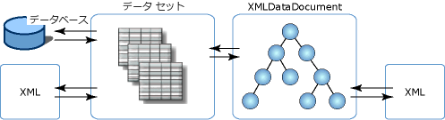

# XML とリレーショナル データおよび ADO.NET との統合XML Integration with Relational Data and ADO.NET
**XmlDataDocument**クラスは、派生クラスの**XmlDocument**、XML データが含まれています。The **XmlDataDocument** class is a derived class of the **XmlDocument**, and contains XML data. 利点、 **XmlDataDocument**リレーショナル データと階層データ間のブリッジを提供できることです。The advantage of the **XmlDataDocument** is that it provides a bridge between relational and hierarchical data. **XmlDocument**に連結できる、**データセット**2 つのクラスに含まれるデータに加えられた変更を同期できるは、両方のクラスとします。It is an **XmlDocument** that can be bound to a **DataSet** and both classes can synchronize changes made to data contained in the two classes. **XmlDocument**にバインドされている、**データセット**XML とリレーショナル データを統合することができ、データ、XML、またはリレーショナル形式で表現する必要はありません。An **XmlDocument** that is bound to a **DataSet** allows XML to integrate with relational data, and you do not have to have your data represented as either XML or in a relational format. 両方の処理ができ、一方のデータ表現だけに制限されることもありません。You can do both and not be constrained to a single representation of the data.  
  
 2 つの形式でデータが使用できる利点は次のとおりです。The benefits of having data available in two views are:  
  
-   XML ドキュメントの構造部分はデータセットに対応付けることができ、効率的な格納、インデックス付け、および検索ができる。The structured portion of an XML document can be mapped to a dataset, and be efficiently stored, indexed, and searched.  
  
-   リレーション形式で格納された XML データに対して、カーソル モデルを使用して、効率的な変換、検証、および移動ができる。Transformations, validation, and navigation can be done efficiently through a cursor model over the XML data that is stored relationally. ときに、実行できますより効率的によりに、XML が格納されている場合は、リレーショナル構造、 **XmlDocument**モデル。At times, it can be done more efficiently against relational structures than if the XML is stored in an **XmlDocument** model.  
  
-   **データセット**XML の一部を格納することができます。The **DataSet** can store a portion of the XML. つまり、使用することができます**XPath**または**XslTransform**に保存する、**データセット**要素や関心のある属性だけです。That is, you can use **XPath** or **XslTransform** to store to a **DataSet** only those elements and attributes of interest. そこから、変更できるよう、データのより小さく、フィルター選択されたサブセットにでより大きなデータを反映する変更内容を**XmlDataDocument**です。From there, changes can be made to the smaller, filtered subset of data, with the changes propagating to the larger data in the **XmlDataDocument**.  
  
 読み込まれたデータの変換を実行することも、**データセット**SQL Server からです。You can also run a transform over data that was loaded into the **DataSet** from SQL Server. 別のオプションは、.NET Framework クラスからスタイル マネージ WinForm をバインドして、WebForm のコントロールを**データセット**ですが、XML 入力ストリームから設定します。Another option is to bind .NET Framework classes-style-managed WinForm and WebForm controls to a **DataSet** that was populated from an XML input stream.  
  
 サポートするだけでなく**XslTransform**、 **XmlDataDocument**リレーショナル データを公開**XPath**クエリおよび検証します。In addition to supporting **XslTransform**, an **XmlDataDocument** exposes relational data to **XPath** queries and validation.  基本的には、すべての XML サービスをリレーショナル データで利用でき、コントロールの連結やコード生成などのすべてのリレーショナル機能を XML に基づく構造化データで、XML の厳密性を損なうことなく利用できます。Basically, all XML services are available over relational data, and relational facilities, such as control binding, codegen, and so on, are available over a structured projection of XML without compromising XML fidelity.  
  
 **XmlDataDocument**から継承されますが、 **XmlDocument**、W3C DOM の実装を提供Because **XmlDataDocument** is inherited from an **XmlDocument**, it provides an implementation of the W3C DOM. ファクトを**XmlDataDocument**が関連付けられ、そのデータのサブセットを格納、**データセット**制限またはとしての使用を変更していない、 **XmlDocument**任意の方法でします。The fact that the **XmlDataDocument** is associated with, and stores a subset of its data within, a **DataSet** does not restrict or alter its use as an **XmlDocument** in any way. 使用する記述されたコード、 **XmlDocument**に対して動作が変更されない、 **XmlDataDocument**です。Code written to consume an **XmlDocument** works unaltered against an **XmlDataDocument**. **データセット**テーブル、列、リレーション、および制約を定義することで、同じデータのリレーショナル ビューを提供し、スタンドアロンのメモリ内のユーザーのデータ ストアです。The **DataSet** provides the relational view of the same data by defining tables, columns, relations, and constraints, and is a stand-alone, in-memory user data store.  
  
 次の図は、XML データを持つことを別の関連付けには、**データセット**と**XmlDataDocument**です。The following illustration shows the different associations that XML data has with the **DataSet** and **XmlDataDocument**.  
  
   
  
 図に示す XML データを直接に読み込めること、**データセット**、リレーショナルな方法で XML を直接操作できます。The illustration shows that XML data can be loaded directly into a **DataSet**, which allows direct manipulation with XML in the relational manner. または、これは、DOM の派生クラスに、XML を読み込むことができます、 **XmlDataDocument**、およびその後読み込みと同期されている、**データセット**です。Or, the XML can be loaded into a derived class of the DOM, which is the **XmlDataDocument**, and subsequently loaded and synchronized with the **DataSet**. **データセット**と**XmlDataDocument** 1 つのセット上で同期が、データの 1 つのストア内のデータに加えられた変更は他方のストアに反映されます。Because the **DataSet** and **XmlDataDocument** are synchronized over a single set of data, changes made to the data in one store are reflected in the other store.  
  
 **XmlDataDocument**からすべての編集と移動機能を継承、 **XmlDocument**です。The **XmlDataDocument** inherits all the editing and navigational features from the **XmlDocument**. ありますを使用する場合、 **XmlDataDocument**と同期されているその継承された機能と、**データセット**に直接 XML を読み込むよりも適切なオプションは、**データセット**.There are times when using the **XmlDataDocument** and its inherited features, synchronized with a **DataSet**, is a more appropriate option than loading XML directly into the **DataSet**. 次の表に、読み込みに使用する方法を選択する際に考慮すべき項目、**データセット**です。The following table shows the items to be considered when choosing which method to use to load the **DataSet**.  
  
|XML を DataSet に直接読み込む方がよい場合When to load XML directly into a DataSet|XmlDataDocument と DataSet の同期をとる方がよい場合When to synchronize an XmlDataDocument with a DataSet|  
|----------------------------------------------|-----------------------------------------------------------|  
|内のデータのクエリ、**データセット**は XPath よりも SQL を使用して容易に行えます。Queries of data in the **DataSet** are easier using SQL than XPath.|内のデータに対して XPath クエリが必要、**データセット**です。XPath queries are needed over data in the **DataSet**.|  
|ソース XML 内での要素の順序を保つ必要がない。Preservation of element ordering in the source XML is not critical.|ソース XML 内での要素の順序を保つ必要がある。Preservation of element ordering in the source XML is critical.|  
|要素間の空白や形式をソース XML で保持する必要がない。White space between elements and formatting does not need to be preserved in the source XML.|空白や形式をソース XML で保持する必要がある。White space and formatting preservation in the source XML is critical.|  
  
 読み込みと XML の記述に直接および out の場合、**データセット**、ニーズに対応するを参照してください[XML からの DataSet の読み込み](../../../../docs/framework/data/adonet/dataset-datatable-dataview/loading-a-dataset-from-xml.md)と[XML データとしての DataSet の書き込み](../../../../docs/framework/data/adonet/dataset-datatable-dataview/writing-dataset-contents-as-xml-data.md)です。If loading and writing XML directly into and out of a **DataSet** addresses your needs, see [Loading a DataSet from XML](../../../../docs/framework/data/adonet/dataset-datatable-dataview/loading-a-dataset-from-xml.md) and [Writing a DataSet as XML Data](../../../../docs/framework/data/adonet/dataset-datatable-dataview/writing-dataset-contents-as-xml-data.md).  
  
 読み込んでいる場合、**データセット**から、 **XmlDataDocument** 、ニーズに対応するを参照してください[Datasetwith XML ドキュメントを同期する](../../../../docs/framework/data/adonet/dataset-datatable-dataview/dataset-and-xmldatadocument-synchronization.md)です。If loading the **DataSet** from an **XmlDataDocument** addresses your needs, see [Synchronizing a Datasetwith an XML Document](../../../../docs/framework/data/adonet/dataset-datatable-dataview/dataset-and-xmldatadocument-synchronization.md).  
  
## 関連項目See Also  
 [DataSet での XML の使用Using XML in a DataSet](../../../../docs/framework/data/adonet/dataset-datatable-dataview/using-xml-in-a-dataset.md)
