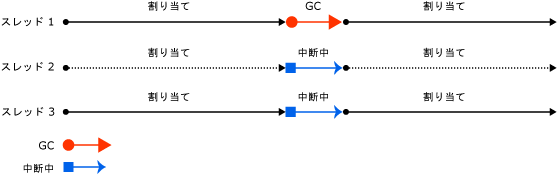
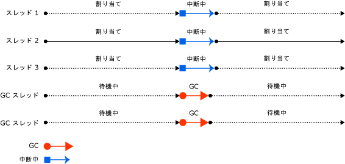
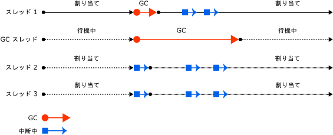
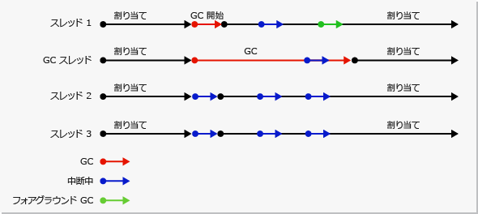
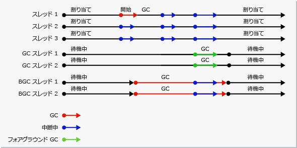

# ガベージ コレクションの基礎
 共通言語ランタイム (CLR) では、自動メモリ マネージャーとしてガベージ コレクターを使用できます。 次のような利点があります。  
  
-   アプリケーションを開発するときにメモリを解放する必要がありません。  
  
-   オブジェクトが効率的にマネージ ヒープに割り当てられます。  
  
-   使用されなくなったオブジェクトが解放され、メモリがクリアされてその後の割り当てに使用できるようになります。 マネージ オブジェクトは自動的にクリーンな内容で開始されるため、コンストラクターでデータ フィールドごとに初期化する必要はありません。  
  
-   オブジェクトで別のオブジェクトの内容を使用できなくすることで、メモリの安全が確保されます。  
  
 このトピックでは、ガベージ コレクションの主要な概念について説明します。 このチュートリアルは、次のセクションで構成されています。  
  
-   [メモリの基礎](#fundamentals_of_memory)  
  
-   [ガベージ コレクションの条件](#conditions_for_a_garbage_collection)  
  
-   [マネージ ヒープ](#the_managed_heap)  
  
-   [ジェネレーション](#generations)  
  
-   [ガベージ コレクションの実行時の動作](#what_happens_during_a_garbage_collection)  
  
-   [アンマネージ リソースの操作](#manipulating_unmanaged_resources)  
  
-   [ワークステーションとサーバーのガベージ コレクション](#workstation_and_server_garbage_collection)  
  
-   [同時実行ガベージ コレクション](#concurrent_garbage_collection)  
  
-   [バックグラウンド ワークステーション ガベージ コレクション](#background_garbage_collection)  
  
-   [バックグラウンド サーバー ガベージ コレクション](#background_server_garbage_collection)  
  
   
## メモリの基礎  
 CLR のメモリに関する重要な概念の概要を以下に示します。  
  
-   各プロセスは、分離された独自の仮想アドレス空間を持ちます。 同じコンピューターのすべてのプロセスが同じ物理メモリとページ ファイル (存在する場合) を共有します。  
  
-   32 ビット コンピューターでは、各プロセスが既定で 2 GB のユーザー モード仮想アドレス空間を持ちます。  
  
-   アプリケーション開発者が操作するのは仮想アドレス空間だけで、直接物理メモリを操作することはありません。 マネージ ヒープの仮想メモリの割り当てと解放はガベージ コレクターによって行われます。  
  
     ネイティブ コードを記述する場合は、Win32 関数を使用して仮想アドレス空間を操作します。 ネイティブ ヒープの仮想メモリの割り当てと解放はこれらの関数によって行われます。  
  
-   仮想メモリには次の 3 つの状態があります。  
  
    -   空き。 参照されていない、割り当てに使用できるメモリ ブロックです。  
  
    -   予約済み。 使用できるように確保された、他の割り当て要求には使用できないメモリ ブロックです。 ただし、このメモリ ブロックがコミットされるまではデータを格納できません。  
  
    -   コミット済み。 物理ストレージに割り当てられたメモリ ブロックです。  
  
-   仮想アドレス空間は、断片化することがあります。 断片化とは、アドレス空間に複数の空きブロック (ホールとも呼ばれます) がある状態です。 仮想メモリの割り当てが要求された場合、仮想メモリ マネージャーは、その割り当て要求を満たすのに十分な大きさの単一の空きブロックを見つけなければなりません。 場合でも、2 GB の空き領域がある場合は、2 GB を必要とする割り当てされません成功した 1 つのアドレス ブロックにない限り、そのすべての空き領域。  
  
-   メモリが足りなくなるのは、予約する仮想アドレス空間が足りなくなった場合か、コミットする物理領域が足りなくなった場合です。  
  
 ページ ファイルは、物理メモリの圧迫度 (物理メモリに対する需要) が低い場合にも使用されます。 最初に物理メモリの圧迫度が高まると、データを格納するための領域を確保するために物理メモリのデータの一部がページ ファイルにバックアップされますが、 そのデータは必要になるまでページングされないため、物理メモリの圧迫度が非常に低い状況でページングが発生する可能性もあります。 
 
 [ページのトップへ](#top)  
  
   
## ガベージ コレクションの条件  
 ガベージ コレクションは、次のいずれかの条件に当てはまる場合に発生します。  
  
-   システムの物理メモリが少ない場合。 これは、OS からいずれか、メモリ不足の通知またはホストによって示されるメモリの不足によって検出されました。
  
-   マネージ ヒープで割り当てられたオブジェクトによって使用されているメモリが、許容されるしきい値を超える場合。 このしきい値は、プロセスの進行に合わせて絶えず調整されます。  
  
-   <xref:System.GC.Collect%2A?displayProperty=nameWithType> メソッドが呼び出された場合。 ほとんどの場合、ガベージ コレクターは継続して実行されるため、このメソッドを呼び出す必要はありません。 このメソッドは、主に特別な状況やテストで使用されます。  
  
 [ページのトップへ](#top)  
  
   
## マネージ ヒープ  
 ガベージ コレクターは、CLR によって初期化された後、オブジェクトを格納および管理するためのメモリのセグメントを割り当てます。 オペレーティング システムのネイティブ ヒープに対し、このメモリのことをマネージ ヒープと呼びます。  
  
 マネージ ヒープはマネージ プロセスごとに割り当てられます。 プロセス内のすべてのスレッドは、同じヒープにオブジェクト用のメモリを割り当てます。  
  
 メモリを予約するために、ガベージ コレクターは Win32 [VirtualAlloc](http://go.microsoft.com/fwlink/?LinkId=179047) 関数を呼び出し、マネージ アプリケーション用のメモリのセグメントを一度に 1 つずつ予約します。 また、ガベージ コレクターは、必要に応じてセグメントを予約したり、Win32 [VirtualFree](http://go.microsoft.com/fwlink/?LinkId=179050) 関数を呼び出すことで (オブジェクトのセグメントをクリアしてから) セグメントを解放してオペレーティング システムに戻したりします。  
  
> [!IMPORTANT]
>  ガベージ コレクターによって割り当てらるセグメントのサイズは実装に固有であり、定期的な更新プログラムによる場合を含め、いつでも変更されることがあります。 アプリでは、セグメント サイズを推測することや、特定のセグメント サイズに依存することを絶対に避けてください。また、セグメントの割り当てに使用可能なメモリの量を構成しようとしてもなりません。  
  
 ヒープに割り当てられたオブジェクトが少ないほど、ガベージ コレクターの処理も少なくなります。 そのため、オブジェクトを割り当てるときに、必要な量より多く割り当てないようにしてください。たとえば、15 バイトしか必要がないときに 32 バイトの配列を割り当てないようにしてください。  
  
 ガベージ コレクションがトリガーされると、ガベージ コレクターは、使用されなくなったオブジェクトに占有されているメモリを解放します。 この解放プロセスでは、まとめて移動できるように有効なオブジェクトを圧縮し、使用されなくなったスペースを削除することで、ヒープを小さくします。 これにより、一緒に割り当てられたオブジェクトが同じマネージ ヒープにまとめられ、局所性が保持されます。  
  
 ガベージ コレクションの割り込みの動作 (頻度と期間) は、割り当てのボリュームとマネージ ヒープ上の残ったメモリの量によって決まります。  
  
 ヒープは、大きなオブジェクト ヒープと小さなオブジェクト ヒープの 2 つを累積したものと見なすことができます。  
  
 大きなオブジェクト ヒープには、85,000 バイトを超える非常に大きなオブジェクトが格納されます。 大きなオブジェクト ヒープの中のオブジェクトは、通常は配列になります。 インスタンス オブジェクトが極端に大きくなることはほとんどありません。  
  
 [ページのトップへ](#top)  
  
   
## ジェネレーション  
 ヒープは、有効期間が長いオブジェクトと有効期間が短いオブジェクトに対処できるようにジェネレーションにまとめられます。 ガベージ コレクションは主に、通常はヒープのごく一部だけを占有する有効期間が短いオブジェクトを解放する場合に発生します。 ヒープのオブジェクトのジェネレーションには次の 3 つがあります。  
  
-   **ジェネレーション 0**。 これは一番最初のジェネレーションで、有効期間が短いオブジェクトが格納されます。 有効期間が短いオブジェクトには、たとえば、テンポラリ変数などがあります。 ガベージ コレクションは、このジェネレーションで最も頻繁に発生します。  
  
     オブジェクトが新しく割り当てられると、大きなオブジェクトの場合以外は、オブジェクトの新しいジェネレーションが形成されて暗黙的にジェネレーション 0 のコレクションになります。大きなオブジェクトの場合は、ジェネレーション 2 のコレクションの大きなオブジェクトのヒープに割り当てられます。  
  
     ジェネレーション 0 では、ほとんどのオブジェクトがガベージ コレクションで解放され、次のジェネレーションには残りません。  
  
-   **ジェネレーション 1**。 このジェネレーションには有効期間が短いオブジェクトが格納されます。有効期間が短いオブジェクトと有効期間が長いオブジェクトの間のバッファーとして機能します。  
  
-   **ジェネレーション 2**。 このジェネレーションには、有効期間が長いオブジェクトが格納されます。 有効期間が長いオブジェクトには、たとえば、プロセスの存続期間を通じて有効な静的データを含むサーバー アプリケーションのオブジェクトなどがあります。  
  
 ガベージ コレクションは、条件に応じて特定のジェネレーションで発生します。 ジェネレーションのコレクションでは、そのジェネレーションとそれよりも前のすべてのジェネレーションのオブジェクトがコレクションの対象になります。 ジェネレーション 2 のガベージ コレクションは、すべてのジェネレーションのすべてのオブジェクト (つまり、マネージ ヒープのすべてのオブジェクト) を解放することから、フル ガベージ コレクションとも呼ばれます。  
  
### 存続と昇格  
 ガベージ コレクションで解放されなかったオブジェクトは残存オブジェクトと呼ばれ、次のジェネレーションに昇格されます。 ジェネレーション 0 のガベージ コレクションでごみではないと判断されたオブジェクトは、ジェネレーション 1 に昇格されます。ジェネレーション 1 のガベージ コレクションでごみではないと判断されたオブジェクトは、ジェネレーション 2 に昇格されます。ジェネレーション 2 のガベージ コレクションでごみではないと判断されたオブジェクトは、ジェネレーション 2 に残ります。  
  
 ガベージ コレクターは、ジェネレーションでごみではないと判断される割合が高いことを検出すると、そのジェネレーションに対する割り当てのしきい値を高くして、次のジェネレーションで十分なサイズの解放されたメモリを受け取ることができるようにします。 CLR は、アプリケーションのワーキング セットが大きくなりすぎないようにすることと、ガベージ コレクションに時間がかかりすぎないようにすることに注意して、それらの 2 つの優先事項のバランスを絶えず調整します。  
  
### 短期のジェネレーションとセグメント  
 ジェネレーション 0 および 1 のオブジェクトは有効期間が短いことから、それらのジェネレーションのことを短期ジェネレーションと呼びます。  
  
 短期ジェネレーションは、短期セグメントと呼ばれるメモリ セグメントに割り当てる必要があります。 ガベージ コレクターによって新しいセグメントが取得されると、いずれも新しい短期セグメントになり、ジェネレーション 0 のガベージ コレクションで残ったオブジェクトが格納されます。 古い短期セグメントは新しいジェネレーション 2 のセグメントになります。  
  
 短期セグメントのサイズは、システムが 32 ビット 64 ビットのどちらであるか、および実行されているガベージ コレクターの種類に応じて異なります。 既定の値を次の表に示します。  
  
||32 ビット|64 ビット|  
|-|-------------|-------------|  
|ワークステーションの GC|16 MB|256 MB|  
|サーバーの GC|64 MB|4 GB|  
|サーバーの GC (論理 CPU が 4 個以上の場合)|32 MB|2 GB|  
|サーバーの GC (論理 CPU が 8 個以上の場合)|16 MB|1 GB|  
  
 短期セグメントには、ジェネレーション 2 のオブジェクトも含めることができます。 ジェネレーション 2 のオブジェクトでは複数のセグメントを使用できます (プロセスでの必要に応じてメモリが許容できる限りいくつでも使用できます)。  
  
 短期ガベージ コレクションによって解放されるメモリの量は、短期セグメントのサイズまでに限られます。 解放されるメモリの量は、使用されなくなったオブジェクトに占有されていた領域に比例します。  
  
 [ページのトップへ](#top)  
  
   
## ガベージ コレクションの実行時の動作  
 ガベージ コレクションには次のフェーズがあります。  
  
-   マーキング フェーズ。有効なすべてのオブジェクトを探し、そのリストを作成します。  
  
-   再配置フェーズ。圧縮するオブジェクトへの参照を更新します。  
  
-   圧縮フェーズ。使用されなくなったオブジェクトに占有されている領域を解放し、残ったオブジェクトを圧縮します。 圧縮フェーズでは、ガベージ コレクションで残ったオブジェクトをセグメントの後ろに移動します。  
  
     ジェネレーション 2 のコレクションでは複数のセグメントを占有できるため、ジェネレーション 2 に昇格されたオブジェクトはより古いセグメントに移動できます。 ジェネレーション 1 とジェネレーション 2 の残存オブジェクトは、どちらもジェネレーション 2 に昇格されるため、別のセグメントに移動できます。  
  
     通常、大きなオブジェクト ヒープは圧縮されません。これは、大きなオブジェクトをコピーするとパフォーマンスが低下するためです。 ただし [!INCLUDE[net_v451](../../../includes/net-v451-md.md)] 以降では、<xref:System.Runtime.GCSettings.LargeObjectHeapCompactionMode%2A?displayProperty=nameWithType> プロパティを使用して、大きなオブジェクト ヒープを必要に応じて圧縮できます。  
  
 ガベージ コレクターは、次の情報に基づいてオブジェクトが有効かどうかを判断します。  
  
-   **スタック ルート**。 Just-In-Time (JIT) コンパイラとスタック ウォーカーによって提供されるスタック変数。  
  
-   **ガベージ コレクション ハンドル**。 マネージ オブジェクトを参照するハンドル。これらのハンドルは、ユーザー コードまたは共通言語ランタイムで割り当てることができます。  
  
-   **静的データ**。 他のオブジェクトを参照している可能性があるアプリケーション ドメインの静的オブジェクト。 静的オブジェクトはそれぞれのアプリケーション ドメインで追跡されます。  
  
 ガベージ コレクションが開始される前に、そのガベージ コレクションをトリガーしたスレッドを除くすべてのマネージ スレッドが中断されます。  
  
 次の図は、ガベージ コレクションを発生させて他のスレッドの中断を引き起こすスレッドを示しています。  
  
   
ガベージ コレクションを発生させるスレッド  
  
 [ページのトップへ](#top)  
  
   
## アンマネージ リソースの操作  
 ガベージ コレクターではマネージ ヒープのメモリのみを追跡するため、マネージ オブジェクトでネイティブのファイル ハンドルを使用してアンマネージ オブジェクトを参照している場合は、そのアンマネージ オブジェクトを明示的に解放する必要があります。  
  
 マネージ オブジェクトのユーザーは、オブジェクトで使用されているネイティブ リソースを破棄できません。 そのため、クリーンアップを行うには、マネージ オブジェクトをファイナライズ可能にします。 ファイナライズは、オブジェクトが使用されなくなったときに実行するクリーンアップ アクションで構成されます。 マネージ オブジェクトが使用されなくなると、ファイナライザー メソッドで指定されたクリーンアップ アクションが実行されます。  
  
 ファイナライズ可能なオブジェクトが使用されなくなったことが検出されると、クリーンアップ アクションを実行するためにファイナライザーによってキューに入れられますが、オブジェクト自体は次のジェネレーションに昇格されます。 そのため、そのジェネレーションで次のガベージ コレクション (次回のガベージ コレクションではない場合もあります) が発生するまで、オブジェクトが解放されたかどうかは確認できません。  
  
 [ページのトップへ](#top)  
  
   
## ワークステーションとサーバーのガベージ コレクション  
 ガベージ コレクターは、さまざまなシナリオに対応できるように自動的に調整されます。 構成ファイルの設定を使って、作業負荷の特性に基づいてガベージ コレクションの種類を設定できます。 CLR には、次の種類のガベージ コレクションが用意されています。  
  
-   ワークステーションのガベージ コレクション。すべてのクライアント ワークステーションとスタンドアロンの PC を対象としたオプションです。 これは、既定の設定、 [ \<gcServer > 要素](../../../docs/framework/configure-apps/file-schema/runtime/gcserver-element.md)ランタイム構成スキーマでします。  
  
     ワークステーションのガベージ コレクションは、同時実行または非同時実行のどちらかで実行できます。 同時実行ガベージ コレクションでは、ガベージ コレクションの実行中にマネージ スレッドの操作を続けることができます。  
  
     [!INCLUDE[net_v40_long](../../../includes/net-v40-long-md.md)]以降では、同時実行ガベージ コレクションに代わるものとしてバックグラウンド ガベージ コレクションが使用されます。  
  
-   サーバーのガベージ コレクション。高いスループットとスケーラビリティが必要なサーバー アプリケーションを対象としたオプションです。 サーバーのガベージ コレクションは、非同時実行ガベージ コレクションまたはバックグラウンド ガベージ コレクションである場合があります。  
  
 次の図は、サーバー上でガベージ コレクションを実行する専用のスレッドを示しています。  
  
   
サーバー ガベージ コレクション  
  
### ガベージ コレクションの構成  
 使用することができます、 [ \<gcServer > 要素](../../../docs/framework/configure-apps/file-schema/runtime/gcserver-element.md)CLR で実行する場合、ランタイム構成スキーマのガベージ コレクションの種類を指定します。 この要素の `enabled` 属性が `false` (既定値) に設定されている場合、ワークステーションのガベージ コレクションが実行されます。 `enabled` 属性を `true`に設定すると、サーバーのガベージ コレクションが実行されます。  
  
 同時実行ガベージ コレクションを指定した、 [ \<gcConcurrent > 要素](../../../docs/framework/configure-apps/file-schema/runtime/gcconcurrent-element.md)ランタイム構成スキーマのです。 既定値は `enabled`です。 この設定は、同時実行ガベージ コレクションとバックグラウンド ガベージ コレクションの両方を制御します。  
  
 サーバーのガベージ コレクションは、アンマネージ ホスト インターフェイスを使用して指定することもできます。 ASP.NET および SQL Server では、アプリケーションがそのいずれかの環境内でホストされている場合、自動的にサーバーのガベージ コレクションが有効になることに注意してください。  
  
### ワークステーションとサーバーのガベージ コレクションの比較  
 ワークステーションのガベージ コレクションにおける、スレッド処理とパフォーマンスについての注意点を次に示します。  
  
-   コレクションは、ガベージ コレクションをトリガーしたユーザー スレッドで、それと同じ優先順位で実行されます。 ユーザー スレッドは一般に通常の優先順位で実行されるため、その場合 (通常の優先順位のスレッドで実行された場合)、ガベージ コレクターの CPU 時間が他のスレッドと競合します。  
  
     ネイティブ コードを実行しているスレッドは中断されません。  
  
-   関係なく 1 つのみのプロセッサをあるコンピューター上で常にワークステーションのガベージ コレクションを使用、 [ \<gcServer >](../../../docs/framework/configure-apps/file-schema/runtime/gcserver-element.md)設定します。 サーバーのガベージ コレクションを指定した場合、CLR は、同時実行を無効にしてワークステーションのガベージ コレクションを使用します。  
  
 サーバーのガベージ コレクションにおける、スレッド処理とパフォーマンスについての注意点を次に示します。  
  
-   コレクションは、 `THREAD_PRIORITY_HIGHEST` の優先順位で実行される複数の専用スレッドで実行されます。  
  
-   ヒープおよびガベージ コレクションを実行するための専用スレッドは CPU ごとに 1 つずつ用意され、複数のヒープのコレクションが同時に行われます。 各ヒープには小さなオブジェクト ヒープと大きなオブジェクト ヒープがあり、どのヒープもユーザー コードからアクセスできます。 異なるヒープのオブジェクトを相互に参照できます。  
  
-   複数のガベージ コレクション スレッドが連携して処理を行うため、同じサイズのヒープを処理した場合、サーバーのガベージ コレクションの方がワークステーションのガベージ コレクションよりも高速です。  
  
-   一般に、サーバーのガベージ コレクションの方が、格納されるセグメントのサイズは大きくなります。 ただし、これは一般論に過ぎません。セグメントのサイズは実装に固有であり、変更されることがあります。 アプリをチューニングする時に、ガベージ コレクターによって割り当てられるセグメントのサイズに関して何らかの仮定をすることは避けてください。  
  
-   サーバーのガベージ コレクションでは、リソースが大量に消費されることがあります。 たとえば、4 つのプロセッサを搭載したコンピューターで 12 のプロセスを実行する場合、そのすべてでサーバーのガベージ コレクションを使用するには、48 の専用のガベージ コレクション スレッドが必要です。 メモリの負荷が高い状況で、すべてのプロセスがガベージ コレクションの処理を開始した場合、ガベージ コレクターは 48 のスレッドをスケジュールすることになります。  
  
 実行するアプリケーションのインスタンスが数百に及ぶ場合は、同時実行ガベージ コレクションを無効にしてワークステーションのガベージ コレクションを使用することを検討してください。 これによって、コンテキストの切り替えが少なくなり、パフォーマンスが向上します。  
  
 [ページのトップへ](#top)  
  
   
## 同時実行ガベージ コレクション  
 ワークステーションまたはサーバーのガベージ コレクションでは、同時実行ガベージ コレクションを有効にすることで、複数のスレッドを同時に実行できます。同時実行ガベージ コレクションでは、コレクションの実行中は、ほとんどの場合、ガベージ コレクションの処理を行う専用のスレッドが使用されます。 このオプションは、ジェネレーション 2 のガベージ コレクションにのみ影響します。ジェネレーション 0 と 1 の処理はすぐに終了するため、常に非同時実行で行われます。  
  
 同時実行ガベージ コレクションでは、コレクションの一時停止を最小限にすることで、インタラクティブ アプリケーションの応答性を高めることができます。 マネージ スレッドは、同時実行ガベージ コレクションのスレッドが実行されている間も、ほぼ常に処理を続けることができます。 そのため、ガベージ コレクションの実行中の一時停止が短くなります。  
  
 複数のプロセスを実行している場合にパフォーマンスを向上させるには、同時実行ガベージ コレクションを無効にします。 追加することでこれを行う、 [ \<gcConcurrent > 要素](../../../docs/framework/configure-apps/file-schema/runtime/gcconcurrent-element.md)アプリの構成ファイルと設定の値をその`enabled`属性を`"false"`です。  
  
 同時実行ガベージ コレクションは、専用のスレッドで実行されます。 既定では、CLR は、同時実行ガベージ コレクションを有効にしてワークステーションのガベージ コレクションを実行します。 これは、シングルプロセッサのコンピューターでもマルチプロセッサのコンピューターでも同じです。  
  
 同時実行ガベージ コレクションの実行中にヒープに小さなオブジェクトを割り当てる機能は、同時実行ガベージ コレクションの開始時に短期セグメントに残っていたオブジェクトによって制限されます。 セグメントの最後に達した後は、同時実行ガベージ コレクションが終了するまで、小さなオブジェクトを割り当てる必要があるマネージ スレッドは中断されたままになります。  
  
 同時実行ガベージ コレクションのワーキング セットは、同時実行コレクションの実行中にオブジェクトを割り当てることができるように (非同時実行ガベージ コレクションに比べて) 若干大きくなっています。 ただし、オブジェクトを割り当てるとそれもワーキング セットの一部になるため、パフォーマンスに影響することがあります。 基本的に、同時実行ガベージ コレクションでは、ある程度の CPU およびメモリと引き換えに一時停止が短くなります。  
  
 次の図は、別々の専用のスレッドで実行される同時実行ガベージ コレクションを示しています。  
  
   
同時実行ガベージ コレクション  
  
 [ページのトップへ](#top)  
  
   
## バックグラウンド ワークステーション ガベージ コレクション  
 バックグラウンド ガベージ コレクションでは、ジェネレーション 2 のコレクションの実行中に、必要に応じて短期ジェネレーション (0 および 1) のコレクションが行われます。 バックグラウンド ガベージ コレクションの設定はありません。同時実行ガベージ コレクションを有効にすると自動的に有効になります。 バックグラウンド ガベージ コレクションは同時実行ガベージ コレクションに代わるものです。 同時実行ガベージ コレクションと同様に、バックグラウンド ガベージ コレクションは専用のスレッドで実行され、ジェネレーション 2 のコレクションにのみ適用されます。  
  
> [!NOTE]
>  バックグラウンド ガベージ コレクションは、 [!INCLUDE[net_v40_short](../../../includes/net-v40-short-md.md)] 以降のバージョンでのみ使用できます。 [!INCLUDE[net_v40_short](../../../includes/net-v40-short-md.md)]では、ワークステーションのガベージ コレクションのみがサポートされます。 .NET Framework 4.5 以降では、バックグラウンド ガベージ コレクションは、ワークステーションとサーバーのガベージ コレクションの両方で使用できます。  
  
 バックグラウンド ガベージ コレクションの実行中に行われる短期ジェネレーションに対するコレクションのことを、フォアグラウンド ガベージ コレクションと呼びます。 フォアグラウンド ガベージ コレクションが発生すると、マネージ スレッドはすべて中断されます。  
  
 バックグラウンド ガベージ コレクションの実行中にジェネレーション 0 に十分なオブジェクトが割り当てられていれば、CLR はジェネレーション 0 またはジェネレーション 1 のフォアグラウンド ガベージ コレクションを実行します。 バックグラウンド ガベージ コレクションの専用スレッドは、フォアグラウンド ガベージ コレクションの要求がないかどうかをセーフ ポイントで頻繁に確認します。 要求があると、バックグラウンド コレクションを中断して、フォアグラウンド ガベージ コレクションを実行します。 フォアグラウンド ガベージ コレクションが完了すると、バックグラウンド ガベージ コレクションの専用スレッドとユーザー スレッドが再開されます。  
  
 バックグラウンド ガベージ コレクションでは、バックグラウンド ガベージ コレクションの実行中に短期ガベージ コレクションが発生する可能性があるため、同時実行ガベージ コレクションによる割り当ての制限が解除されます。 つまり、バックグラウンド ガベージ コレクションで短期ジェネレーションの使用されなくなったオブジェクトを削除でき、また、ジェネレーション 1 のガベージ コレクションの実行中に必要に応じてヒープを拡張することもできます。  
  
 次の図は、ワークステーション上の別々の専用スレッドで実行されるバックグラウンド ガベージ コレクションを示しています。  
  
   
バックグラウンド ワークステーション ガベージ コレクション  
  
 [ページのトップへ](#top)  
  
   
## バックグラウンド サーバー ガベージ コレクション  
 .NET Framework 4.5 以降では、サーバーのバックグラウンド ガベージ コレクションは、サーバーのガベージ コレクションの既定のモードです。 このモードを選択するには設定、`enabled`の属性、 [ \<gcServer > 要素](../../../docs/framework/configure-apps/file-schema/runtime/gcserver-element.md)に`true`ランタイム構成スキーマでします。 このモードは、前のセクションで説明したワークステーションのバックグラウンド ガベージ コレクションと同様に機能しますが、いくつかの違いがあります。 ワークステーションのバックグラウンド ガベージ コレクションでは専用のバックグラウンド ガベージ コレクション スレッドを 1 つ使用します。これに対して、サーバーのバックグラウンド ガベージ コレクションでは複数のスレッドを使用し、通常、論理プロセッサごとに専用のスレッドが使用されます。 ワークステーションのバックグラウンド ガベージ コレクション スレッドとは異なり、これらのスレッドはタイムアウトになりません。  
  
 次の図は、サーバー上の別々の専用スレッドで実行されるバックグラウンド ガベージ コレクションを示しています。  
  
   
バックグラウンド サーバー ガベージ コレクション  
  
## 関連項目  
 [ガベージ コレクション](../../../docs/standard/garbage-collection/index.md)
