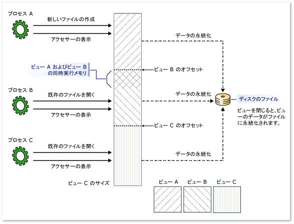

# <a name="memory-mapped-files"></a><span data-ttu-id="75aeb-102">メモリ マップト ファイル</span><span class="sxs-lookup"><span data-stu-id="75aeb-102">Memory-Mapped Files</span></span>
<span data-ttu-id="75aeb-103">メモリ マップト ファイルには、仮想メモリ内のファイルの内容が含まれています。</span><span class="sxs-lookup"><span data-stu-id="75aeb-103">A memory-mapped file contains the contents of a file in virtual memory.</span></span> <span data-ttu-id="75aeb-104">ファイルとメモリ空間の間のこのマッピングによって、複数のプロセスを含むアプリケーションは、メモリを直接読み書きすることでファイルを変更できます。</span><span class="sxs-lookup"><span data-stu-id="75aeb-104">This mapping between a file and memory space enables an application, including multiple processes, to modify the file by reading and writing directly to the memory.</span></span> <span data-ttu-id="75aeb-105">[!INCLUDE[net_v40_long](../../../includes/net-v40-long-md.md)] 以降では、「[Managing Memory-Mapped Files](https://msdn.microsoft.com/library/ms810613.aspx)」 (メモリマップ ファイルの管理) で説明されているように、マネージ コードを使用して、ネイティブ Windows 関数がメモリ マップ済みファイルにアクセスする場合と同じ方法でメモリ マップ済みファイルにアクセスできます。</span><span class="sxs-lookup"><span data-stu-id="75aeb-105">Starting with the [!INCLUDE[net_v40_long](../../../includes/net-v40-long-md.md)], you can use managed code to access memory-mapped files in the same way that native Windows functions access memory-mapped files, as described in [Managing Memory-Mapped Files](https://msdn.microsoft.com/library/ms810613.aspx).</span></span>  
  
 <span data-ttu-id="75aeb-106">メモリ マップト ファイルには次の 2 種類があります。</span><span class="sxs-lookup"><span data-stu-id="75aeb-106">There are two types of memory-mapped files:</span></span>  
  
-   <span data-ttu-id="75aeb-107">永続化メモリ マップト ファイル</span><span class="sxs-lookup"><span data-stu-id="75aeb-107">Persisted memory-mapped files</span></span>  
  
     <span data-ttu-id="75aeb-108">永続化ファイルは、ディスク上のソース ファイルに関連付けられているメモリ マップト ファイルです。</span><span class="sxs-lookup"><span data-stu-id="75aeb-108">Persisted files are memory-mapped files that are associated with a source file on a disk.</span></span> <span data-ttu-id="75aeb-109">最後のプロセスがファイルの操作を終了すると、データがディスク上のソース ファイルに保存されます。</span><span class="sxs-lookup"><span data-stu-id="75aeb-109">When the last process has finished working with the file, the data is saved to the source file on the disk.</span></span> <span data-ttu-id="75aeb-110">これらのメモリ マップト ファイルは、きわめて大きなソース ファイルの操作に適しています。</span><span class="sxs-lookup"><span data-stu-id="75aeb-110">These memory-mapped files are suitable for working with extremely large source files.</span></span>  
  
-   <span data-ttu-id="75aeb-111">非永続化メモリ マップト ファイル</span><span class="sxs-lookup"><span data-stu-id="75aeb-111">Non-persisted memory-mapped files</span></span>  
  
     <span data-ttu-id="75aeb-112">非永続化ファイルは、ディスク上のファイルに関連付けられていないメモリ マップト ファイルです。</span><span class="sxs-lookup"><span data-stu-id="75aeb-112">Non-persisted files are memory-mapped files that are not associated with a file on a disk.</span></span> <span data-ttu-id="75aeb-113">最後のプロセスがファイルの操作を終了すると、データが失われ、ガベージ コレクションによってファイルが解放されます。</span><span class="sxs-lookup"><span data-stu-id="75aeb-113">When the last process has finished working with the file, the data is lost and the file is reclaimed by garbage collection.</span></span> <span data-ttu-id="75aeb-114">これらのファイルは、プロセス間通信 (IPC) 用の共有メモリの作成に適しています。</span><span class="sxs-lookup"><span data-stu-id="75aeb-114">These files are suitable for creating shared memory for inter-process communications (IPC).</span></span>  
  
## <a name="processes-views-and-managing-memory"></a><span data-ttu-id="75aeb-115">プロセス、ビュー、およびメモリ管理</span><span class="sxs-lookup"><span data-stu-id="75aeb-115">Processes, Views, and Managing Memory</span></span>  
 <span data-ttu-id="75aeb-116">メモリ マップト ファイルは、複数のプロセス間で共有できます。</span><span class="sxs-lookup"><span data-stu-id="75aeb-116">Memory-mapped files can be shared across multiple processes.</span></span> <span data-ttu-id="75aeb-117">ファイルを作成したプロセスによって割り当てられている共通名を使用して、複数のプロセスを同じメモリ マップト ファイルにマップできます。</span><span class="sxs-lookup"><span data-stu-id="75aeb-117">Processes can map to the same memory-mapped file by using a common name that is assigned by the process that created the file.</span></span>  
  
 <span data-ttu-id="75aeb-118">メモリ マップト ファイルを操作するには、メモリ マップト ファイル全体またはその一部のビューを作成する必要があります。</span><span class="sxs-lookup"><span data-stu-id="75aeb-118">To work with a memory-mapped file, you must create a view of the entire memory-mapped file or a part of it.</span></span> <span data-ttu-id="75aeb-119">また、メモリ マップト ファイルの同じ部分に対するマルチ ビューを作成し、それによって同時実行メモリを作成することもできます。</span><span class="sxs-lookup"><span data-stu-id="75aeb-119">You can also create multiple views to the same part of the memory-mapped file, thereby creating concurrent memory.</span></span> <span data-ttu-id="75aeb-120">2 つのビューが同時実行されるには、それらのビューを同じメモリ マップト ファイルから作成する必要があります。</span><span class="sxs-lookup"><span data-stu-id="75aeb-120">For two views to remain concurrent, they have to be created from the same memory-mapped file.</span></span>  
  
 <span data-ttu-id="75aeb-121">ファイルがメモリ マッピングで使用できるアプリケーションの論理メモリ空間のサイズ (32 ビット コンピューターでは 2 GB) よりも大きい場合にも、マルチ ビューが必要になる可能性があります。</span><span class="sxs-lookup"><span data-stu-id="75aeb-121">Multiple views may also be necessary if the file is greater than the size of the application’s logical memory space available for memory mapping (2 GB on a 32-bit computer).</span></span>  
  
 <span data-ttu-id="75aeb-122">ビューには、ストリーム アクセス ビューとランダム アクセス ビューの 2 種類があります。</span><span class="sxs-lookup"><span data-stu-id="75aeb-122">There are two types of views: stream access view and random access view.</span></span> <span data-ttu-id="75aeb-123">ファイルへの順次アクセスにはストリーム アクセス ビューを使用します。これは、非永続化ファイルと IPC に推奨されます。</span><span class="sxs-lookup"><span data-stu-id="75aeb-123">Use stream access views for sequential access to a file; this is recommended for non-persisted files and IPC.</span></span> <span data-ttu-id="75aeb-124">ランダム アクセス ビューは、永続化ファイルの操作に適しています。</span><span class="sxs-lookup"><span data-stu-id="75aeb-124">Random access views are preferred for working with persisted files.</span></span>  
  
 <span data-ttu-id="75aeb-125">メモリ マップト ファイルへは、オペレーティング システムのメモリ マネージャーを通じてアクセスするため、ファイルは複数のページに自動的に分割され、必要に応じてアクセスされます。</span><span class="sxs-lookup"><span data-stu-id="75aeb-125">Memory-mapped files are accessed through the operating system’s memory manager, so the file is automatically partitioned into a number of pages and accessed as needed.</span></span> <span data-ttu-id="75aeb-126">メモリ管理を自分で行う必要はありません。</span><span class="sxs-lookup"><span data-stu-id="75aeb-126">You do not have to handle the memory management yourself.</span></span>  
  
 <span data-ttu-id="75aeb-127">次の図に、複数のプロセスがどのように同じメモリ マップト ファイルへの複数の重なるビューを同時に持つことができるかを示します。</span><span class="sxs-lookup"><span data-stu-id="75aeb-127">The following illustration shows how multiple processes can have multiple and overlapping views to the same memory-mapped file at the same time.</span></span>  
  
 <span data-ttu-id="75aeb-128">![メモリ マップト ファイルへのビューの表示。] (../../../docs/standard/io/media/memmappersisted.png "MemMapPersisted")</span><span class="sxs-lookup"><span data-stu-id="75aeb-128"></span></span>  
<span data-ttu-id="75aeb-129">メモリ マップト ファイルへの複数の重なるビュー</span><span class="sxs-lookup"><span data-stu-id="75aeb-129">Multiple and overlapped views to a memory-mapped file</span></span>  
  
## <a name="programming-with-memory-mapped-files"></a><span data-ttu-id="75aeb-130">メモリ マップト ファイルのプログラミング</span><span class="sxs-lookup"><span data-stu-id="75aeb-130">Programming with Memory-Mapped Files</span></span>  
 <span data-ttu-id="75aeb-131">メモリ マップト ファイル オブジェクトとそのメンバーを使用するための手引きを次の表に示します。</span><span class="sxs-lookup"><span data-stu-id="75aeb-131">The following table provides a guide for using memory-mapped file objects and their members.</span></span>  
  
|<span data-ttu-id="75aeb-132">タスク</span><span class="sxs-lookup"><span data-stu-id="75aeb-132">Task</span></span>|<span data-ttu-id="75aeb-133">使用するメソッドまたはプロパティ</span><span class="sxs-lookup"><span data-stu-id="75aeb-133">Methods or properties to use</span></span>|  
|----------|----------------------------------|  
|<span data-ttu-id="75aeb-134">ディスク上のファイルからの永続化メモリ マップト ファイルを表す <xref:System.IO.MemoryMappedFiles.MemoryMappedFile> オブジェクトを取得する。</span><span class="sxs-lookup"><span data-stu-id="75aeb-134">To obtain a <xref:System.IO.MemoryMappedFiles.MemoryMappedFile> object that represents a persisted memory-mapped file from a file on disk.</span></span>|<span data-ttu-id="75aeb-135"><xref:System.IO.MemoryMappedFiles.MemoryMappedFile.CreateFromFile%2A?displayProperty=nameWithType> メソッド</span><span class="sxs-lookup"><span data-stu-id="75aeb-135"><xref:System.IO.MemoryMappedFiles.MemoryMappedFile.CreateFromFile%2A?displayProperty=nameWithType> method.</span></span>|  
|<span data-ttu-id="75aeb-136">(ディスク上のファイルに関連付けられていない) 非永続化メモリ マップト ファイルを表す <xref:System.IO.MemoryMappedFiles.MemoryMappedFile> オブジェクトを取得する。</span><span class="sxs-lookup"><span data-stu-id="75aeb-136">To obtain a <xref:System.IO.MemoryMappedFiles.MemoryMappedFile> object that represents a non-persisted memory-mapped file (not associated with a file on disk).</span></span>|<span data-ttu-id="75aeb-137"><xref:System.IO.MemoryMappedFiles.MemoryMappedFile.CreateNew%2A?displayProperty=nameWithType> メソッド</span><span class="sxs-lookup"><span data-stu-id="75aeb-137"><xref:System.IO.MemoryMappedFiles.MemoryMappedFile.CreateNew%2A?displayProperty=nameWithType> method.</span></span><br /><br /> <span data-ttu-id="75aeb-138">または</span><span class="sxs-lookup"><span data-stu-id="75aeb-138">- or -</span></span><br /><br /> <span data-ttu-id="75aeb-139"><xref:System.IO.MemoryMappedFiles.MemoryMappedFile.CreateOrOpen%2A?displayProperty=nameWithType> メソッド</span><span class="sxs-lookup"><span data-stu-id="75aeb-139"><xref:System.IO.MemoryMappedFiles.MemoryMappedFile.CreateOrOpen%2A?displayProperty=nameWithType> method.</span></span>|  
|<span data-ttu-id="75aeb-140">既存の (永続化または非永続化) メモリ マップト ファイルの <xref:System.IO.MemoryMappedFiles.MemoryMappedFile> オブジェクトを取得する。</span><span class="sxs-lookup"><span data-stu-id="75aeb-140">To obtain a <xref:System.IO.MemoryMappedFiles.MemoryMappedFile> object of an existing memory-mapped file (either persisted or non-persisted).</span></span>|<span data-ttu-id="75aeb-141"><xref:System.IO.MemoryMappedFiles.MemoryMappedFile.OpenExisting%2A?displayProperty=nameWithType> メソッド</span><span class="sxs-lookup"><span data-stu-id="75aeb-141"><xref:System.IO.MemoryMappedFiles.MemoryMappedFile.OpenExisting%2A?displayProperty=nameWithType> method.</span></span>|  
|<span data-ttu-id="75aeb-142">メモリ マップト ファイルへの順次アクセス ビューを表す <xref:System.IO.UnmanagedMemoryStream> オブジェクトを取得する。</span><span class="sxs-lookup"><span data-stu-id="75aeb-142">To obtain a <xref:System.IO.UnmanagedMemoryStream> object for a sequentially accessed view to the memory-mapped file.</span></span>|<span data-ttu-id="75aeb-143"><xref:System.IO.MemoryMappedFiles.MemoryMappedFile.CreateViewStream%2A?displayProperty=nameWithType> メソッド</span><span class="sxs-lookup"><span data-stu-id="75aeb-143"><xref:System.IO.MemoryMappedFiles.MemoryMappedFile.CreateViewStream%2A?displayProperty=nameWithType> method.</span></span>|  
|<span data-ttu-id="75aeb-144">メモリ マップト ファイルへのランダム アクセス ビューを表す <xref:System.IO.UnmanagedMemoryAccessor> を取得する。</span><span class="sxs-lookup"><span data-stu-id="75aeb-144">To obtain a <xref:System.IO.UnmanagedMemoryAccessor> object for a random access view to a memory-mapped fie.</span></span>|<span data-ttu-id="75aeb-145"><xref:System.IO.MemoryMappedFiles.MemoryMappedFile.CreateViewAccessor%2A?displayProperty=nameWithType> メソッド</span><span class="sxs-lookup"><span data-stu-id="75aeb-145"><xref:System.IO.MemoryMappedFiles.MemoryMappedFile.CreateViewAccessor%2A?displayProperty=nameWithType> method.</span></span>|  
|<span data-ttu-id="75aeb-146">アンマネージ コードで使用するために <xref:Microsoft.Win32.SafeHandles.SafeMemoryMappedViewHandle> オブジェクトを取得する。</span><span class="sxs-lookup"><span data-stu-id="75aeb-146">To obtain a <xref:Microsoft.Win32.SafeHandles.SafeMemoryMappedViewHandle> object to use with unmanaged code.</span></span>|<span data-ttu-id="75aeb-147"><xref:System.IO.MemoryMappedFiles.MemoryMappedFile.SafeMemoryMappedFileHandle%2A?displayProperty=nameWithType> プロパティ。</span><span class="sxs-lookup"><span data-stu-id="75aeb-147"><xref:System.IO.MemoryMappedFiles.MemoryMappedFile.SafeMemoryMappedFileHandle%2A?displayProperty=nameWithType> property.</span></span><br /><br /> <span data-ttu-id="75aeb-148">または</span><span class="sxs-lookup"><span data-stu-id="75aeb-148">- or -</span></span><br /><br /> <span data-ttu-id="75aeb-149"><xref:System.IO.MemoryMappedFiles.MemoryMappedViewAccessor.SafeMemoryMappedViewHandle%2A?displayProperty=nameWithType> プロパティ。</span><span class="sxs-lookup"><span data-stu-id="75aeb-149"><xref:System.IO.MemoryMappedFiles.MemoryMappedViewAccessor.SafeMemoryMappedViewHandle%2A?displayProperty=nameWithType> property.</span></span><br /><br /> <span data-ttu-id="75aeb-150">または</span><span class="sxs-lookup"><span data-stu-id="75aeb-150">- or -</span></span><br /><br /> <span data-ttu-id="75aeb-151"><xref:System.IO.MemoryMappedFiles.MemoryMappedViewStream.SafeMemoryMappedViewHandle%2A?displayProperty=nameWithType> プロパティ。</span><span class="sxs-lookup"><span data-stu-id="75aeb-151"><xref:System.IO.MemoryMappedFiles.MemoryMappedViewStream.SafeMemoryMappedViewHandle%2A?displayProperty=nameWithType> property.</span></span>|  
|<span data-ttu-id="75aeb-152">ビューが作成されるまで、メモリ割り当てを延期する (非永続化ファイルのみ)。</span><span class="sxs-lookup"><span data-stu-id="75aeb-152">To delay allocating memory until a view is created (non-persisted files only).</span></span><br /><br /> <span data-ttu-id="75aeb-153">(現在のシステム ページ サイズを確認するには、<xref:System.Environment.SystemPageSize%2A?displayProperty=nameWithType> プロパティを使用します)。</span><span class="sxs-lookup"><span data-stu-id="75aeb-153">(To determine the current system page size, use the <xref:System.Environment.SystemPageSize%2A?displayProperty=nameWithType> property.)</span></span>|<span data-ttu-id="75aeb-154"><xref:System.IO.MemoryMappedFiles.MemoryMappedFile.CreateNew%2A> 値を持つ <xref:System.IO.MemoryMappedFiles.MemoryMappedFileOptions.DelayAllocatePages?displayProperty=nameWithType> メソッド</span><span class="sxs-lookup"><span data-stu-id="75aeb-154"><xref:System.IO.MemoryMappedFiles.MemoryMappedFile.CreateNew%2A> method with the <xref:System.IO.MemoryMappedFiles.MemoryMappedFileOptions.DelayAllocatePages?displayProperty=nameWithType> value.</span></span><br /><br /> <span data-ttu-id="75aeb-155">または</span><span class="sxs-lookup"><span data-stu-id="75aeb-155">- or -</span></span><br /><br /> <span data-ttu-id="75aeb-156"><xref:System.IO.MemoryMappedFiles.MemoryMappedFile.CreateOrOpen%2A> 列挙体をパラメーターとして持つ <xref:System.IO.MemoryMappedFiles.MemoryMappedFileOptions> メソッド。</span><span class="sxs-lookup"><span data-stu-id="75aeb-156"><xref:System.IO.MemoryMappedFiles.MemoryMappedFile.CreateOrOpen%2A> methods that have a <xref:System.IO.MemoryMappedFiles.MemoryMappedFileOptions> enumeration as a parameter.</span></span>|  
  
### <a name="security"></a><span data-ttu-id="75aeb-157">セキュリティ</span><span class="sxs-lookup"><span data-stu-id="75aeb-157">Security</span></span>  
 <span data-ttu-id="75aeb-158"><xref:System.IO.MemoryMappedFiles.MemoryMappedFileAccess> 列挙体をパラメーターとして受け取る次のメソッドを使用して、メモリ マップト ファイルの作成時にアクセス権を適用できます。</span><span class="sxs-lookup"><span data-stu-id="75aeb-158">You can apply access rights when you create a memory-mapped file, by using the following methods that take a <xref:System.IO.MemoryMappedFiles.MemoryMappedFileAccess> enumeration as a parameter:</span></span>  
  
-   <xref:System.IO.MemoryMappedFiles.MemoryMappedFile.CreateFromFile%2A?displayProperty=nameWithType>  
  
-   <xref:System.IO.MemoryMappedFiles.MemoryMappedFile.CreateNew%2A?displayProperty=nameWithType>  
  
-   <xref:System.IO.MemoryMappedFiles.MemoryMappedFile.CreateOrOpen%2A?displayProperty=nameWithType>  
  
 <span data-ttu-id="75aeb-159"><xref:System.IO.MemoryMappedFiles.MemoryMappedFile.OpenExisting%2A> をパラメーターとして受け取る <xref:System.IO.MemoryMappedFiles.MemoryMappedFileRights> メソッドを使用して、既存のメモリ マップト ファイルを開く操作に対するアクセス権を指定できます。</span><span class="sxs-lookup"><span data-stu-id="75aeb-159">You can specify access rights for opening an existing memory-mapped file by using the <xref:System.IO.MemoryMappedFiles.MemoryMappedFile.OpenExisting%2A> methods that take an <xref:System.IO.MemoryMappedFiles.MemoryMappedFileRights> as a parameter.</span></span>  
  
 <span data-ttu-id="75aeb-160">また、定義済みのアクセス規則が格納されている <xref:System.IO.MemoryMappedFiles.MemoryMappedFileSecurity> オブジェクトを含めることもできます。</span><span class="sxs-lookup"><span data-stu-id="75aeb-160">In addition, you can include a <xref:System.IO.MemoryMappedFiles.MemoryMappedFileSecurity> object that contains predefined access rules.</span></span>  
  
 <span data-ttu-id="75aeb-161">メモリ マップト ファイルに新規または変更済みのアクセス規則を適用するには、<xref:System.IO.MemoryMappedFiles.MemoryMappedFile.SetAccessControl%2A> メソッドを使用します。</span><span class="sxs-lookup"><span data-stu-id="75aeb-161">To apply new or changed access rules to a memory-mapped file, use the <xref:System.IO.MemoryMappedFiles.MemoryMappedFile.SetAccessControl%2A> method.</span></span> <span data-ttu-id="75aeb-162">既存のファイルからアクセス規則または監査規則を取得するには、<xref:System.IO.MemoryMappedFiles.MemoryMappedFile.GetAccessControl%2A> メソッドを使用します。</span><span class="sxs-lookup"><span data-stu-id="75aeb-162">To retrieve access or audit rules from an existing file, use the <xref:System.IO.MemoryMappedFiles.MemoryMappedFile.GetAccessControl%2A> method.</span></span>  
  
## <a name="examples"></a><span data-ttu-id="75aeb-163">使用例</span><span class="sxs-lookup"><span data-stu-id="75aeb-163">Examples</span></span>  
  
### <a name="persisted-memory-mapped-files"></a><span data-ttu-id="75aeb-164">永続化メモリ マップト ファイル</span><span class="sxs-lookup"><span data-stu-id="75aeb-164">Persisted Memory-Mapped Files</span></span>  
 <span data-ttu-id="75aeb-165"><xref:System.IO.MemoryMappedFiles.MemoryMappedFile.CreateFromFile%2A> メソッドは、ディスク上の既存のファイルからメモリ マップト ファイルを作成します。</span><span class="sxs-lookup"><span data-stu-id="75aeb-165">The <xref:System.IO.MemoryMappedFiles.MemoryMappedFile.CreateFromFile%2A> methods create a memory-mapped file from an existing file on disk.</span></span>  
  
 <span data-ttu-id="75aeb-166">次の例では、きわめて大きなファイルの一部のメモリ マップト ビューを作成し、その一部分を操作します。</span><span class="sxs-lookup"><span data-stu-id="75aeb-166">The following example creates a memory-mapped view of a part of an extremely large file and manipulates a portion of it.</span></span>  
  
 [!code-csharp[MemoryMappedFiles.MemoryMappedFile.CreateFromFile#1](../../../samples/snippets/csharp/VS_Snippets_CLR/memorymappedfiles.memorymappedfile.createfromfile/cs/program.cs#1)]
 [!code-vb[MemoryMappedFiles.MemoryMappedFile.CreateFromFile#1](../../../samples/snippets/visualbasic/VS_Snippets_CLR/memorymappedfiles.memorymappedfile.createfromfile/vb/program.vb#1)]  
  
 <span data-ttu-id="75aeb-167">別のプロセスに対して同じメモリ マップト ファイルを開く例を、次に示します。</span><span class="sxs-lookup"><span data-stu-id="75aeb-167">The following example opens the same memory-mapped file for another process.</span></span>  
  
 [!code-csharp[MemoryMappedFiles.MemoryMappedFile.OpenExisting#1](../../../samples/snippets/csharp/VS_Snippets_CLR/memorymappedfiles.memorymappedfile.openexisting/cs/program.cs#1)]
 [!code-vb[MemoryMappedFiles.MemoryMappedFile.OpenExisting#1](../../../samples/snippets/visualbasic/VS_Snippets_CLR/memorymappedfiles.memorymappedfile.openexisting/vb/program.vb#1)]  
  
### <a name="non-persisted-memory-mapped-files"></a><span data-ttu-id="75aeb-168">非永続化メモリ マップト ファイル</span><span class="sxs-lookup"><span data-stu-id="75aeb-168">Non-Persisted Memory-Mapped Files</span></span>  
 <span data-ttu-id="75aeb-169"><xref:System.IO.MemoryMappedFiles.MemoryMappedFile.CreateNew%2A> メソッドおよび <xref:System.IO.MemoryMappedFiles.MemoryMappedFile.CreateOrOpen%2A> メソッドは、ディスク上の既存のファイルに対応付けられないメモリ マップト ファイルを作成します。</span><span class="sxs-lookup"><span data-stu-id="75aeb-169">The <xref:System.IO.MemoryMappedFiles.MemoryMappedFile.CreateNew%2A> and <xref:System.IO.MemoryMappedFiles.MemoryMappedFile.CreateOrOpen%2A> methods create a memory-mapped file that is not mapped to an existing file on disk.</span></span>  
  
 <span data-ttu-id="75aeb-170">次の例は、メモリ マップト ファイルにブール値を書き込む、3 つの独立したプロセス (コンソール アプリケーション) で構成されます。</span><span class="sxs-lookup"><span data-stu-id="75aeb-170">The following example consists of three separate processes (console applications) that write Boolean values to a memory-mapped file.</span></span> <span data-ttu-id="75aeb-171">次の順序で処理が実行されます。</span><span class="sxs-lookup"><span data-stu-id="75aeb-171">The following sequence of actions occur:</span></span>  
  
1.  <span data-ttu-id="75aeb-172">`Process A` がメモリ マップト ファイルを作成し、値を書き込みます。</span><span class="sxs-lookup"><span data-stu-id="75aeb-172">`Process A` creates the memory-mapped file and writes a value to it.</span></span>  
  
2.  <span data-ttu-id="75aeb-173">`Process B` がメモリ マップト ファイルを開き、値を書き込みます。</span><span class="sxs-lookup"><span data-stu-id="75aeb-173">`Process B` opens the memory-mapped file and writes a value to it.</span></span>  
  
3.  <span data-ttu-id="75aeb-174">`Process C` がメモリ マップト ファイルを開き、値を書き込みます。</span><span class="sxs-lookup"><span data-stu-id="75aeb-174">`Process C` opens the memory-mapped file and writes a value to it.</span></span>  
  
4.  <span data-ttu-id="75aeb-175">`Process A` がメモリ マップト ファイルの値を読み込み、表示します。</span><span class="sxs-lookup"><span data-stu-id="75aeb-175">`Process A` reads and displays the values from the memory-mapped file.</span></span>  
  
5.  <span data-ttu-id="75aeb-176">`Process A` がメモリ マップト ファイルの処理を終了すると、ガベージ コレクションによってファイルが直ちにクリアされます。</span><span class="sxs-lookup"><span data-stu-id="75aeb-176">After `Process A` is finished with the memory-mapped file, the file is immediately reclaimed by garbage collection.</span></span>  
  
 <span data-ttu-id="75aeb-177">この例を実行するには、次の手順に従います。</span><span class="sxs-lookup"><span data-stu-id="75aeb-177">To run this example, do the following:</span></span>  
  
1.  <span data-ttu-id="75aeb-178">アプリケーションをコンパイルし、3 つのコマンド プロンプト ウィンドウを開きます。</span><span class="sxs-lookup"><span data-stu-id="75aeb-178">Compile the applications and open three Command Prompt windows.</span></span>  
  
2.  <span data-ttu-id="75aeb-179">最初のコマンド プロンプト ウィンドウで、`Process A` を実行します。</span><span class="sxs-lookup"><span data-stu-id="75aeb-179">In the first Command Prompt window, run `Process A`.</span></span>  
  
3.  <span data-ttu-id="75aeb-180">2 つ目のコマンド プロンプト ウィンドウで、`Process B` を実行します。</span><span class="sxs-lookup"><span data-stu-id="75aeb-180">In the second Command Prompt window, run `Process B`.</span></span>  
  
4.  <span data-ttu-id="75aeb-181">`Process A` に戻り、Enter キーを押します。</span><span class="sxs-lookup"><span data-stu-id="75aeb-181">Return to `Process A` and press ENTER.</span></span>  
  
5.  <span data-ttu-id="75aeb-182">3 つ目のコマンド プロンプト ウィンドウで、`Process C` を実行します。</span><span class="sxs-lookup"><span data-stu-id="75aeb-182">In the third Command Prompt window, run `Process C`.</span></span>  
  
6.  <span data-ttu-id="75aeb-183">`Process A` に戻り、Enter キーを押します。</span><span class="sxs-lookup"><span data-stu-id="75aeb-183">Return to `Process A` and press ENTER.</span></span>  
  
 <span data-ttu-id="75aeb-184">`Process A` の出力は次のとおりです。</span><span class="sxs-lookup"><span data-stu-id="75aeb-184">The output of `Process A` is as follows:</span></span>  
  
```  
Start Process B and press ENTER to continue.  
Start Process C and press ENTER to continue.  
Process A says: True  
Process B says: False  
Process C says: True  
```  
  
 <span data-ttu-id="75aeb-185">**プロセス A**</span><span class="sxs-lookup"><span data-stu-id="75aeb-185">**Process A**</span></span>  
  
 [!code-csharp[System.IO.MemoryMappedFiles_IPC_X#1](../../../samples/snippets/csharp/VS_Snippets_CLR_System/system.io.memorymappedfiles_ipc_x/cs/program.cs#1)]
 [!code-vb[System.IO.MemoryMappedFiles_IPC_X#1](../../../samples/snippets/visualbasic/VS_Snippets_CLR_System/system.io.memorymappedfiles_ipc_x/vb/program.vb#1)]  
  
 <span data-ttu-id="75aeb-186">**プロセス B**</span><span class="sxs-lookup"><span data-stu-id="75aeb-186">**Process B**</span></span>  
  
 [!code-csharp[System.IO.MemoryMappedFiles_IPC_A#1](../../../samples/snippets/csharp/VS_Snippets_CLR_System/system.io.memorymappedfiles_ipc_a/cs/program.cs#1)]
 [!code-vb[System.IO.MemoryMappedFiles_IPC_A#1](../../../samples/snippets/visualbasic/VS_Snippets_CLR_System/system.io.memorymappedfiles_ipc_a/vb/program.vb#1)]  
  
 <span data-ttu-id="75aeb-187">**プロセス C**</span><span class="sxs-lookup"><span data-stu-id="75aeb-187">**Process C**</span></span>  
  
 [!code-csharp[System.IO.MemoryMappedFiles_IPC_B#1](../../../samples/snippets/csharp/VS_Snippets_CLR_System/system.io.memorymappedfiles_ipc_b/cs/program.cs#1)]
 [!code-vb[System.IO.MemoryMappedFiles_IPC_B#1](../../../samples/snippets/visualbasic/VS_Snippets_CLR_System/system.io.memorymappedfiles_ipc_b/vb/program.vb#1)]  
  
## <a name="see-also"></a><span data-ttu-id="75aeb-188">参照</span><span class="sxs-lookup"><span data-stu-id="75aeb-188">See Also</span></span>  
 [<span data-ttu-id="75aeb-189">ファイルおよびストリーム入出力</span><span class="sxs-lookup"><span data-stu-id="75aeb-189">File and Stream I/O</span></span>](../../../docs/standard/io/index.md)
