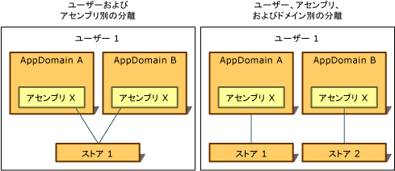

# 分離のタイプ
分離ストレージへのアクセスは、常にそのストレージを作成したユーザーに限定されます。 この種の分離を実装するために、共通言語ランタイムは、オペレーティング システムが認識するユーザー ID (ストアを開くときにコードが実行しているプロセスに関連付けられた ID) と同じ概念を使用します。 この ID は認証されたユーザーの ID ですが、偽装によって現在のユーザーの ID が動的に変更される可能性があります。  
  
 また、分離ストレージへのアクセスは、アプリケーションのドメインおよびアセンブリ、またはアセンブリのみに関連付けられた ID に従って制限されます。 ランタイムは、以下の方法でこのような ID を取得します。  
  
-   ドメイン ID は、アプリケーションの証拠を表します。Web アプリケーションの場合は、完全な URL の可能性があります。 シェルでホストされるコードの場合、ドメイン ID はアプリケーション ディレクトリのパスに基づいている可能性があります。 たとえば、実行可能ファイルが C:\Office\MyApp.exe というパスから実行される場合、ドメイン ID は C:\Office\MyApp.exe になります。  
  
-   アセンブリ ID はアセンブリの証拠です。 アセンブリ ID は暗号化デジタル署名に由来することがあります。この場合、アセンブリの[厳密な名前](../../../docs/framework/app-domains/strong-named-assemblies.md)、アセンブリのソフトウェア発行元、または URL の ID である可能性があります。 アセンブリに厳密な名前とソフトウェア発行元 ID が両方ともある場合は、ソフトウェア発行元 ID が使用されます。 アセンブリがインターネットから取得され、署名されていない場合は、URL ID が使用されます。 アセンブリおよび厳密な名前の詳細については、「[アセンブリを使用したプログラミング](../../../docs/framework/app-domains/programming-with-assemblies.md)」を参照してください。  
  
-   ローミング ストアは、ローミング ユーザー プロファイルを持つユーザーと共に移動します。 ファイルはネットワーク ディレクトリに書き込まれ、ユーザーがログインする任意のコンピューターにダウンロードされます。 ローミング ユーザー プロファイルの詳細については、「<xref:System.IO.IsolatedStorage.IsolatedStorageScope.Roaming?displayProperty=nameWithType>」を参照してください。  
  
 分離ストレージは、ユーザー、ドメイン、アセンブリの ID の概念を組み合わせることで、次のようにそれぞれ独自の使用シナリオを持つ方法でデータを分離できます。  
  
-   [ユーザーとアセンブリによる分離](#UserAssembly)  
  
-   [ユーザー、ドメイン、アセンブリによる分離](#UserDomainAssembly)  
  
 これらの分離のいずれかをローミング ユーザー プロファイルと組み合わせることができます。 詳細については、「[分離ストレージとローミング](#Roaming)」セクションを参照してください。  
  
 次の図は、異なるスコープにストアがどのように分離されるかを示しています。  
  
   
分離ストレージの種類  
  
 分離ストレージは、ローミング ストアを除き、特定のコンピューターのローカルであるストレージ機能を使用するため、常にコンピューターによって暗黙的に隔離されています。  
  
> [!IMPORTANT]
>  分離ストレージは [!INCLUDE[win8_appname_long](../../../includes/win8-appname-long-md.md)] アプリでは使用できません。 代わりに、 `Windows.Storage` API に含まれる [!INCLUDE[wrt](../../../includes/wrt-md.md)] 名前空間内のアプリケーション データ クラスを使用して、ローカル データとローカル ファイルを格納します。 詳細については、Windows デベロッパー センターの[アプリケーション データ](/previous-versions/windows/apps/hh464917(v=win.10))に関する説明を参照してください。  
  
   
## ユーザーおよびアセンブリによる分離  
 データ ストアを使用するアセンブリにアプリケーションのドメインからアクセスできる必要がある場合は、ユーザーとアセンブリによる分離が適しています。 通常、このような状況では、複数のアプリケーションに適用され、ユーザーの名前やライセンス情報など、特定のアプリケーションには関連付けられないデータを格納するために分離ストレージが使用されます。 ユーザーとアセンブリによって分離されたストレージにアクセスするには、アプリケーション間で情報を転送するためにコードを信頼する必要があります。 通常、ユーザーとアセンブリによる分離はイントラネット上では使用できますが、インターネット上では使用できません。 静的な <xref:System.IO.IsolatedStorage.IsolatedStorageFile.GetStore%2A?displayProperty=nameWithType> メソッドを呼び出してユーザーとアセンブリ <xref:System.IO.IsolatedStorage.IsolatedStorageScope> を渡すと、このような分離のストレージが返されます。  
  
 次のコード例では、ユーザーとアセンブリによって分離されたストアを取得します。 このストアには `isoFile` オブジェクトを介してアクセスできます。  
  
 [!code-cpp[Conceptual.IsolatedStorage#17](../../../samples/snippets/cpp/VS_Snippets_CLR/conceptual.isolatedstorage/cpp/source11.cpp#17)]
 [!code-csharp[Conceptual.IsolatedStorage#17](../../../samples/snippets/csharp/VS_Snippets_CLR/conceptual.isolatedstorage/cs/source11.cs#17)]
 [!code-vb[Conceptual.IsolatedStorage#17](../../../samples/snippets/visualbasic/VS_Snippets_CLR/conceptual.isolatedstorage/vb/source11.vb#17)]  
  
 証拠パラメーターを使用する例については、「<xref:System.IO.IsolatedStorage.IsolatedStorageFile.GetStore%28System.IO.IsolatedStorage.IsolatedStorageScope%2CSystem.Security.Policy.Evidence%2CSystem.Type%2CSystem.Security.Policy.Evidence%2CSystem.Type%29>」を参照してください。  
  
 <xref:System.IO.IsolatedStorage.IsolatedStorageFile.GetUserStoreForAssembly%2A> メソッドは、次のコード例に示されているようにショートカットとして使用できます。 このショートカットを使用してローミング可能なストアを開くことはできません。その場合は <xref:System.IO.IsolatedStorage.IsolatedStorageFile.GetStore%2A> を使用してください。  
  
 [!code-cpp[Conceptual.IsolatedStorage#18](../../../samples/snippets/cpp/VS_Snippets_CLR/conceptual.isolatedstorage/cpp/source11.cpp#18)]
 [!code-csharp[Conceptual.IsolatedStorage#18](../../../samples/snippets/csharp/VS_Snippets_CLR/conceptual.isolatedstorage/cs/source11.cs#18)]
 [!code-vb[Conceptual.IsolatedStorage#18](../../../samples/snippets/visualbasic/VS_Snippets_CLR/conceptual.isolatedstorage/vb/source11.vb#18)]  
  
   
## ユーザー、ドメイン、およびアセンブリによる分離  
 アプリケーションでプライベート データ ストアが必要なサードパーティ アセンブリを使用している場合、プライベート データを格納するために分離ストレージを使用できます。 ユーザー、ドメイン、アセンブリによる分離では、アセンブリがストアを作成したときに実行されていたアプリケーションによってアセンブリが使用されている場合、かつストアが作成されたときのユーザーがアプリケーションを実行した場合にのみ、特定のアセンブリ内のコードのみがデータにアクセスできます。 ユーザー、ドメイン、アセンブリによる分離では、サードパーティのアセンブリから他のアプリケーションにデータが漏えいされません。 分離ストレージを使用したくても、使用する隔離の種類がわからない場合は、この分離方法を既定の選択肢にすることをお勧めします。 <xref:System.IO.IsolatedStorage.IsolatedStorageFile> の静的な <xref:System.IO.IsolatedStorage.IsolatedStorageFile.GetStore%2A> メソッドを呼び出し、ユーザー、ドメイン、およびアセンブリ <xref:System.IO.IsolatedStorage.IsolatedStorageScope> を渡すと、この種類の分離でストレージが返されます。  
  
 次のコード例は、ユーザー、ドメイン、アセンブリによって分離されたストアを取得します。 このストアには `isoFile` オブジェクトを介してアクセスできます。  
  
 [!code-cpp[Conceptual.IsolatedStorage#14](../../../samples/snippets/cpp/VS_Snippets_CLR/conceptual.isolatedstorage/cpp/source10.cpp#14)]
 [!code-csharp[Conceptual.IsolatedStorage#14](../../../samples/snippets/csharp/VS_Snippets_CLR/conceptual.isolatedstorage/cs/source10.cs#14)]
 [!code-vb[Conceptual.IsolatedStorage#14](../../../samples/snippets/visualbasic/VS_Snippets_CLR/conceptual.isolatedstorage/vb/source10.vb#14)]  
  
 次のコード例に示すように、別のメソッドをショートカットとして使用できます。 このショートカットを使用してローミング可能なストアを開くことはできません。その場合は <xref:System.IO.IsolatedStorage.IsolatedStorageFile.GetStore%2A> を使用してください。  
  
 [!code-cpp[Conceptual.IsolatedStorage#15](../../../samples/snippets/cpp/VS_Snippets_CLR/conceptual.isolatedstorage/cpp/source10.cpp#15)]
 [!code-csharp[Conceptual.IsolatedStorage#15](../../../samples/snippets/csharp/VS_Snippets_CLR/conceptual.isolatedstorage/cs/source10.cs#15)]
 [!code-vb[Conceptual.IsolatedStorage#15](../../../samples/snippets/visualbasic/VS_Snippets_CLR/conceptual.isolatedstorage/vb/source10.vb#15)]  
  
   
## 分離ストレージとローミング  
 ローミング ユーザー プロファイルは、ユーザーがネットワーク上で ID を設定し、その ID を使用してネットワーク コンピューターにログインし、すべてのパーソナライズされた設定を実行できる Windows 機能です。 分離ストレージを使用するアセンブリでは、ユーザーの分離ストレージをローミング ユーザー プロファイルと一緒に移動する必要があることを指定できます。 ローミングは、ユーザーとアセンブリによる分離、またはユーザー、ドメイン、アセンブリによる分離と組み合わせて使用​​できます。 ローミング スコープが使用されない場合、ローミング ユーザー プロファイルが使用されていても、ストアはローミングされません。  
  
 次のコード例では、ユーザーとアセンブリによって分離されたローミング ストアを取得します。 このストアには `isoFile` オブジェクトを介してアクセスできます。  
  
 [!code-cpp[Conceptual.IsolatedStorage#11](../../../samples/snippets/cpp/VS_Snippets_CLR/conceptual.isolatedstorage/cpp/source9.cpp#11)]
 [!code-csharp[Conceptual.IsolatedStorage#11](../../../samples/snippets/csharp/VS_Snippets_CLR/conceptual.isolatedstorage/cs/source9.cs#11)]
 [!code-vb[Conceptual.IsolatedStorage#11](../../../samples/snippets/visualbasic/VS_Snippets_CLR/conceptual.isolatedstorage/vb/source9.vb#11)]  
  
 ドメイン スコープを追加すると、ユーザー、ドメイン、およびアプリケーションによって分離されたローミング ストアを作成できます。 次のコード例はこの処理方法を示しています。  
  
 [!code-cpp[Conceptual.IsolatedStorage#12](../../../samples/snippets/cpp/VS_Snippets_CLR/conceptual.isolatedstorage/cpp/source9.cpp#12)]
 [!code-csharp[Conceptual.IsolatedStorage#12](../../../samples/snippets/csharp/VS_Snippets_CLR/conceptual.isolatedstorage/cs/source9.cs#12)]
 [!code-vb[Conceptual.IsolatedStorage#12](../../../samples/snippets/visualbasic/VS_Snippets_CLR/conceptual.isolatedstorage/vb/source9.vb#12)]  
  
## 参照  
 <xref:System.IO.IsolatedStorage.IsolatedStorageScope>  
 [分離ストレージ](../../../docs/standard/io/isolated-storage.md)
