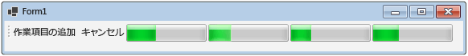

# 方法: データフロー ブロックをキャンセルするHow to: Cancel a Dataflow Block
このドキュメントでは、アプリケーションでキャンセルを有効にする方法を示します。This document demonstrates how to enable cancellation in your application. この例では、Windows フォームを使用して、データフロー パイプラインで作業項目がアクティブである場所と、キャンセルの影響を示します。This example uses Windows Forms to show where work items are active in a dataflow pipeline and also the effects of cancellation.  
  
> [!TIP]
>  TPL データ フローのライブラリ (<xref:System.Threading.Tasks.Dataflow?displayProperty=nameWithType> 名前空間) は [!INCLUDE[net_v45](../../../includes/net-v45-md.md)] と一緒に配布されません。The TPL Dataflow Library (<xref:System.Threading.Tasks.Dataflow?displayProperty=nameWithType> namespace) is not distributed with the [!INCLUDE[net_v45](../../../includes/net-v45-md.md)]. インストールする、<xref:System.Threading.Tasks.Dataflow>名前空間でプロジェクトを開く[!INCLUDE[vs_dev11_long](../../../includes/vs-dev11-long-md.md)]、選択**NuGet パッケージの管理**プロジェクト メニューのおよびオンラインで検索から、`Microsoft.Tpl.Dataflow`パッケージ。To install the <xref:System.Threading.Tasks.Dataflow> namespace, open your project in [!INCLUDE[vs_dev11_long](../../../includes/vs-dev11-long-md.md)], choose **Manage NuGet Packages** from the Project menu, and search online for the `Microsoft.Tpl.Dataflow` package.  
  
### Windows フォーム アプリケーションを作成するにはTo Create the Windows Forms Application  
  
1.  C# または Visual Basic の **Windows フォーム アプリケーション** プロジェクトを作成します。Create a C# or Visual Basic **Windows Forms Application** project. 以降の手順では、プロジェクトの名前は `CancellationWinForms` とします。In the following steps, the project is named `CancellationWinForms`.  
  
2.  メイン フォーム Form1.cs のフォーム デザイナーで (の Form1.vb [!INCLUDE[vbprvb](../../../includes/vbprvb-md.md)])、追加、<xref:System.Windows.Forms.ToolStrip>コントロール。On the form designer for the main form, Form1.cs (Form1.vb for [!INCLUDE[vbprvb](../../../includes/vbprvb-md.md)]), add a <xref:System.Windows.Forms.ToolStrip> control.  
  
3.  追加、<xref:System.Windows.Forms.ToolStripButton>コントロールを<xref:System.Windows.Forms.ToolStrip>コントロール。Add a <xref:System.Windows.Forms.ToolStripButton> control to the <xref:System.Windows.Forms.ToolStrip> control. 設定、<xref:System.Windows.Forms.ToolStripItem.DisplayStyle%2A>プロパティを<xref:System.Windows.Forms.ToolStripItemDisplayStyle.Text>と<xref:System.Windows.Forms.ToolStripItem.Text%2A>プロパティを**作業項目の追加**です。Set the <xref:System.Windows.Forms.ToolStripItem.DisplayStyle%2A> property to <xref:System.Windows.Forms.ToolStripItemDisplayStyle.Text> and the <xref:System.Windows.Forms.ToolStripItem.Text%2A> property to **Add Work Items**.  
  
4.  1 秒あたりの追加<xref:System.Windows.Forms.ToolStripButton>コントロールを<xref:System.Windows.Forms.ToolStrip>コントロール。Add a second <xref:System.Windows.Forms.ToolStripButton> control to the <xref:System.Windows.Forms.ToolStrip> control. 設定、<xref:System.Windows.Forms.ToolStripItem.DisplayStyle%2A>プロパティを<xref:System.Windows.Forms.ToolStripItemDisplayStyle.Text>、<xref:System.Windows.Forms.ToolStripItem.Text%2A>プロパティを**キャンセル**、および<xref:System.Windows.Forms.ToolStripItem.Enabled%2A>プロパティを`False`です。Set the <xref:System.Windows.Forms.ToolStripItem.DisplayStyle%2A> property to <xref:System.Windows.Forms.ToolStripItemDisplayStyle.Text>, the <xref:System.Windows.Forms.ToolStripItem.Text%2A> property to **Cancel**, and the <xref:System.Windows.Forms.ToolStripItem.Enabled%2A> property to `False`.  
  
5.  次の 4 つの追加<xref:System.Windows.Forms.ToolStripProgressBar>オブジェクトを<xref:System.Windows.Forms.ToolStrip>コントロール。Add four <xref:System.Windows.Forms.ToolStripProgressBar> objects to the <xref:System.Windows.Forms.ToolStrip> control.  
  
## データフロー パイプラインの作成Creating the Dataflow Pipeline  
 このセクションでは、作業項目を処理して進行状況バーを更新するデータフロー パイプラインを作成する方法を示します。This section describes how to create the dataflow pipeline that processes work items and updates the progress bars.  
  
#### データフロー パイプラインを作成するにはTo Create the Dataflow Pipeline  
  
1.  プロジェクトで、System.Threading.Tasks.Dataflow.dll への参照を追加します。In your project, add a reference to System.Threading.Tasks.Dataflow.dll.  
  
2.  Form1.cs ([!INCLUDE[vbprvb](../../../includes/vbprvb-md.md)] の Form1.vb) が次の `using` ステートメント ([!INCLUDE[vbprvb](../../../includes/vbprvb-md.md)] の `Imports`) を含むことを確認します。Ensure that Form1.cs (Form1.vb for [!INCLUDE[vbprvb](../../../includes/vbprvb-md.md)]) contains the following `using` statements (`Imports` in [!INCLUDE[vbprvb](../../../includes/vbprvb-md.md)]).  
  
     [!code-csharp[TPLDataflow_CancellationWinForms#1](../../../samples/snippets/csharp/VS_Snippets_Misc/tpldataflow_cancellationwinforms/cs/cancellationwinforms/form1.cs#1)]
     [!code-vb[TPLDataflow_CancellationWinForms#1](../../../samples/snippets/visualbasic/VS_Snippets_Misc/tpldataflow_cancellationwinforms/vb/cancellationwinforms/form1.vb#1)]  
  
3.  `Form1` クラスの内部の型として `WorkItem` クラスを追加します。Add the `WorkItem` class as an inner type of the `Form1` class.  
  
     [!code-csharp[TPLDataflow_CancellationWinForms#2](../../../samples/snippets/csharp/VS_Snippets_Misc/tpldataflow_cancellationwinforms/cs/cancellationwinforms/form1.cs#2)]
     [!code-vb[TPLDataflow_CancellationWinForms#2](../../../samples/snippets/visualbasic/VS_Snippets_Misc/tpldataflow_cancellationwinforms/vb/cancellationwinforms/form1.vb#2)]  
  
4.  `Form1` クラスに次のデータ メンバーを追加します。Add the following data members to the `Form1` class.  
  
     [!code-csharp[TPLDataflow_CancellationWinForms#3](../../../samples/snippets/csharp/VS_Snippets_Misc/tpldataflow_cancellationwinforms/cs/cancellationwinforms/form1.cs#3)]
     [!code-vb[TPLDataflow_CancellationWinForms#3](../../../samples/snippets/visualbasic/VS_Snippets_Misc/tpldataflow_cancellationwinforms/vb/cancellationwinforms/form1.vb#3)]  
  
5.  次の `CreatePipeline` メソッドを `Form1` クラスに追加します。Add the following method, `CreatePipeline`, to the `Form1` class.  
  
     [!code-csharp[TPLDataflow_CancellationWinForms#4](../../../samples/snippets/csharp/VS_Snippets_Misc/tpldataflow_cancellationwinforms/cs/cancellationwinforms/form1.cs#4)]
     [!code-vb[TPLDataflow_CancellationWinForms#4](../../../samples/snippets/visualbasic/VS_Snippets_Misc/tpldataflow_cancellationwinforms/vb/cancellationwinforms/form1.vb#4)]  
  
 `incrementProgress` と `decrementProgress` のデータフロー ブロックはユーザー インターフェイスで機能するので、これらの操作をユーザー インターフェイス スレッドで実行することが重要です。Because the `incrementProgress` and `decrementProgress` dataflow blocks act on the user interface, it is important that these actions occur on the user-interface thread. これを実現する、構築時にこれらのオブジェクトが各提供、<xref:System.Threading.Tasks.Dataflow.ExecutionDataflowBlockOptions>を持つオブジェクトを<xref:System.Threading.Tasks.Dataflow.DataflowBlockOptions.TaskScheduler%2A>プロパティに設定<xref:System.Threading.Tasks.TaskScheduler.FromCurrentSynchronizationContext%2A?displayProperty=nameWithType>です。To accomplish this, during construction these objects each provide a <xref:System.Threading.Tasks.Dataflow.ExecutionDataflowBlockOptions> object that has the <xref:System.Threading.Tasks.Dataflow.DataflowBlockOptions.TaskScheduler%2A> property set to <xref:System.Threading.Tasks.TaskScheduler.FromCurrentSynchronizationContext%2A?displayProperty=nameWithType>. <xref:System.Threading.Tasks.TaskScheduler.FromCurrentSynchronizationContext%2A?displayProperty=nameWithType> メソッドは、現行の同期コンテキストで作業を実行する <xref:System.Threading.Tasks.TaskScheduler> オブジェクトを作成します。The <xref:System.Threading.Tasks.TaskScheduler.FromCurrentSynchronizationContext%2A?displayProperty=nameWithType> method creates a <xref:System.Threading.Tasks.TaskScheduler> object that performs work on the current synchronization context. `Form1` コンストラクターはユーザー インターフェイス スレッドから呼び出されるので、`incrementProgress` および `decrementProgress` データフロー ブロックに対するアクションも、ユーザー インターフェイス スレッドで実行されます。Because the `Form1` constructor is called from the user-interface thread, the actions for the `incrementProgress` and `decrementProgress` dataflow blocks also run on the user-interface thread.  
  
 この例では設定、<xref:System.Threading.Tasks.Dataflow.DataflowBlockOptions.CancellationToken%2A>プロパティ、パイプラインのメンバーを作成するときにします。This example sets the <xref:System.Threading.Tasks.Dataflow.DataflowBlockOptions.CancellationToken%2A> property when it constructs the members of the pipeline. <xref:System.Threading.Tasks.Dataflow.DataflowBlockOptions.CancellationToken%2A>プロパティが完全にデータ フロー ブロックの実行をキャンセル、ユーザーが操作をキャンセルし、次がパイプラインに多くの作業項目を追加した後、全体のパイプラインを再作成する必要があります。Because the <xref:System.Threading.Tasks.Dataflow.DataflowBlockOptions.CancellationToken%2A> property permanently cancels dataflow block execution, the whole pipeline must be recreated after the user cancels the operation and then wants to add more work items to the pipeline. 操作をキャンセルした後も他の作業を実行できるようにデータフロー ブロックをキャンセルする方法もあります。例については、「[チュートリアル: Windows フォーム アプリケーションでのデータフローの使用](../../../docs/standard/parallel-programming/walkthrough-using-dataflow-in-a-windows-forms-application.md)」を参照してください。For an example that demonstrates an alternative way to cancel a dataflow block so that other work can be performed after an operation is canceled, see [Walkthrough: Using Dataflow in a Windows Forms Application](../../../docs/standard/parallel-programming/walkthrough-using-dataflow-in-a-windows-forms-application.md).  
  
## ユーザー インターフェイスへのデータフロー パイプラインの接続Connecting the Dataflow Pipeline to the User Interface  
 このセクションでは、ユーザー インターフェイスにデータフロー パイプラインを接続する方法を説明します。This section describes how to connect the dataflow pipeline to the user interface. パイプラインの作成とパイプラインへの作業項目の追加は、どちらも **[作業項目の追加]** ボタンのインベント ハンドラーによって制御されます。Both creating the pipeline and adding work items to the pipeline are controlled by the event handler for the **Add Work Items** button. キャンセルは **[キャンセル]** ボタンによって開始されます。Cancellation is initiated by the **Cancel** button. ユーザーがこのいずれかのボタンをクリックすると、適切な操作が非同期的に開始されます。When the user clicks either of these buttons, the appropriate action is initiated in an asynchronous manner.  
  
#### ユーザー インターフェイスにデータフロー パイプラインを接続するにはTo Connect the Dataflow Pipeline to the User Interface  
  
1.  メイン フォームのフォーム デザイナーでのイベント ハンドラーを作成、<xref:System.Windows.Forms.ToolStripItem.Click>イベントを**作業項目の追加**ボタンをクリックします。On the form designer for the main form, create an event handler for the <xref:System.Windows.Forms.ToolStripItem.Click> event for the **Add Work Items** button.  
  
2.  実装、<xref:System.Windows.Forms.ToolStripItem.Click>イベントを**作業項目の追加**ボタンをクリックします。Implement the <xref:System.Windows.Forms.ToolStripItem.Click> event for the **Add Work Items** button.  
  
     [!code-csharp[TPLDataflow_CancellationWinForms#5](../../../samples/snippets/csharp/VS_Snippets_Misc/tpldataflow_cancellationwinforms/cs/cancellationwinforms/form1.cs#5)]
     [!code-vb[TPLDataflow_CancellationWinForms#5](../../../samples/snippets/visualbasic/VS_Snippets_Misc/tpldataflow_cancellationwinforms/vb/cancellationwinforms/form1.vb#5)]  
  
3.  メイン フォームのフォーム デザイナーでのイベント ハンドラーを作成、<xref:System.Windows.Forms.ToolStripItem.Click>のイベント ハンドラー、**キャンセル**ボタンをクリックします。On the form designer for the main form, create an event handler for the <xref:System.Windows.Forms.ToolStripItem.Click> event handler for the **Cancel** button.  
  
4.  実装、<xref:System.Windows.Forms.ToolStripItem.Click>のイベント ハンドラー、**キャンセル**ボタンをクリックします。Implement the <xref:System.Windows.Forms.ToolStripItem.Click> event handler for the **Cancel** button.  
  
     [!code-csharp[TPLDataflow_CancellationWinForms#6](../../../samples/snippets/csharp/VS_Snippets_Misc/tpldataflow_cancellationwinforms/cs/cancellationwinforms/form1.cs#6)]
     [!code-vb[TPLDataflow_CancellationWinForms#6](../../../samples/snippets/visualbasic/VS_Snippets_Misc/tpldataflow_cancellationwinforms/vb/cancellationwinforms/form1.vb#6)]  
  
## 例Example  
 次の例は、Form1.cs ([!INCLUDE[vbprvb](../../../includes/vbprvb-md.md)] の Form1.vb) のコード全体を示しています。The following example shows the complete code for Form1.cs (Form1.vb for [!INCLUDE[vbprvb](../../../includes/vbprvb-md.md)]).  
  
 [!code-csharp[TPLDataflow_CancellationWinForms#100](../../../samples/snippets/csharp/VS_Snippets_Misc/tpldataflow_cancellationwinforms/cs/cancellationwinforms/form1.cs#100)]
 [!code-vb[TPLDataflow_CancellationWinForms#100](../../../samples/snippets/visualbasic/VS_Snippets_Misc/tpldataflow_cancellationwinforms/vb/cancellationwinforms/form1.vb#100)]  
  
 次の図は、実行中のアプリケーションを示しています。The following illustration shows the running application.  
  
   
  
## 信頼性の高いプログラミングRobust Programming  
  
## 関連項目See Also  
 [データフローDataflow](../../../docs/standard/parallel-programming/dataflow-task-parallel-library.md)
