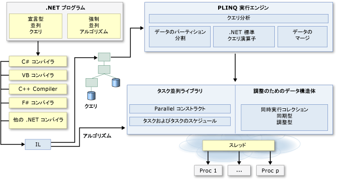

# .NET での並列プログラミングParallel Programming in .NET
多くのパーソナル コンピューターとワークステーションには、複数スレッドの同時実行を可能にする 2 つまたは 4 つのコア (CPU) があります。Many personal computers and workstations have two or four cores (that is, CPUs) that enable multiple threads to be executed simultaneously. 近い将来、コンピューターは、これよりはるかに多くのコアを搭載すると予想されています。Computers in the near future are expected to have significantly more cores. 現在および将来のハードウェアを活用するには、コードを並列化して複数のプロセッサに負荷を分散します。To take advantage of the hardware of today and tomorrow, you can parallelize your code to distribute work across multiple processors. 以前は、並列化には低水準のスレッドおよびロックの操作が必要でした。In the past, parallelization required low-level manipulation of threads and locks. [!INCLUDE[vs_dev10_long](../../../includes/vs-dev10-long-md.md)] および [!INCLUDE[net_v40_short](../../../includes/net-v40-short-md.md)] では、新しいランタイム、新しいクラス ライブラリの型、および新しい診断ツールを提供することで、並列プログラミングのサポートを強化しています。 and the [!INCLUDE[net_v40_short](../../../includes/net-v40-short-md.md)] enhance support for parallel programming by providing a new runtime, new class library types, and new diagnostic tools. これらの機能により並行開発が簡素化され、スレッドやスレッド プールを直接操作することなく、効率的で詳細な、拡張性のある並列コードを自然な表現方法で記述できるようになります。These features simplify parallel development so that you can write efficient, fine-grained, and scalable parallel code in a natural idiom without having to work directly with threads or the thread pool. [!INCLUDE[net_v40_short](../../../includes/net-v40-short-md.md)] の並列プログラミング アーキテクチャの高度な概要を次の図に示します。The following illustration provides a high-level overview of the parallel programming architecture in the [!INCLUDE[net_v40_short](../../../includes/net-v40-short-md.md)].  
  
   
  
## 関連トピックRelated Topics  
  
|テクノロジTechnology|説明Description|  
|----------------|-----------------|  
|[タスク並列ライブラリ (TPL)Task Parallel Library (TPL)](../../../docs/standard/parallel-programming/task-parallel-library-tpl.md)|並列バージョンの <xref:System.Threading.Tasks.Parallel?displayProperty=nameWithType> ループおよび `For` ループを含む `ForEach` クラスに関するドキュメントと、非同期操作の推奨される表現方法を表す <xref:System.Threading.Tasks.Task?displayProperty=nameWithType> クラスに関するドキュメントが用意されています。Provides documentation for the <xref:System.Threading.Tasks.Parallel?displayProperty=nameWithType> class, which includes parallel versions of `For` and `ForEach` loops, and also for the <xref:System.Threading.Tasks.Task?displayProperty=nameWithType> class, which represents the preferred way to express asynchronous operations.|  
|[Parallel LINQ (PLINQ)Parallel LINQ (PLINQ)](../../../docs/standard/parallel-programming/parallel-linq-plinq.md)|さまざまなシナリオでパフォーマンスを大幅に向上させる、LINQ to Objects の並列実装です。A parallel implementation of LINQ to Objects that significantly improves performance in many scenarios.|  
|[並列プログラミングのデータ構造Data Structures for Parallel Programming](../../../docs/standard/parallel-programming/data-structures-for-parallel-programming.md)|スレッド セーフなコレクション クラス、軽量な同期型、および限定的な初期化の種類に関するドキュメントへのリンクを示します。Provides links to documentation for thread-safe collection classes, lightweight synchronization types, and types for lazy initialization.|  
|[並列診断ツールParallel Diagnostic Tools](../../../docs/standard/parallel-programming/parallel-diagnostic-tools.md)|Visual Studio デバッガーのタスク ウィンドウと並列スタック ウィンドウに関するドキュメントと、デバッグおよび並列コードのパフォーマンスの調整に使用できる [!INCLUDE[vsprvsts](../../../includes/vsprvsts-md.md)] プロファイラーの一連のビューで構成される [同時実行ビジュアライザー](/visualstudio/profiling/concurrency-visualizer) に関するドキュメントへのリンクを示します。Provides links to documentation for Visual Studio debugger windows for tasks and parallel stacks, and the [Concurrency Visualizer](/visualstudio/profiling/concurrency-visualizer), which consists of a set of views in the [!INCLUDE[vsprvsts](../../../includes/vsprvsts-md.md)] Profiler that you can use to debug and to tune the performance of parallel code.|  
|[PLINQ および TPL 用のカスタム パーティショナーCustom Partitioners for PLINQ and TPL](../../../docs/standard/parallel-programming/custom-partitioners-for-plinq-and-tpl.md)|パーティションのしくみと、既定のパーティションの設定方法または新しいパーティションの作成方法について説明します。Describes how partitioners work and how to configure the default partitioners or create a new partitioner.|  
|[タスク スケジューラTask Schedulers](http://msdn.microsoft.com/library/638f8ea5-21db-47a2-a934-86e1e961bf65)|スケジューラのしくみと既定のスケジューラの構成方法について説明します。Describes how schedulers work and how the default schedulers may be configured.|  
|[PLINQ および TPL のラムダ式Lambda Expressions in PLINQ and TPL](../../../docs/standard/parallel-programming/lambda-expressions-in-plinq-and-tpl.md)|C# および Visual Basic のラムダ式について簡単に説明し、PLINQ およびタスク並列ライブラリでラムダ式を使用する方法を示します。Provides a brief overview of lambda expressions in C# and Visual Basic, and shows how they are used in PLINQ and the Task Parallel Library.|  
|[関連項目For Further Reading](../../../docs/standard/parallel-programming/for-further-reading-parallel-programming.md)|.NET Framework での並列プログラミングに関する追加のドキュメントとサンプル リソースへのリンクを示します。Provides links to additional documentation and sample resources for parallel programming in the .NET Framework.|  
  
## 参照See Also  
 [Patterns for Parallel Programming: Understanding and Applying Parallel Patterns with the .NET Framework 4 (並列プログラミングのパターン: .NET Framework 4 での並列パターンの理解と適用)Patterns for Parallel Programming: Understanding and Applying Parallel Patterns with the .NET Framework 4](https://www.microsoft.com/download/details.aspx?id=19222)  
 [.NET Framework による並列プログラミングのサンプルSamples for Parallel Programming with the .NET Framework](http://code.msdn.microsoft.com/Samples-for-Parallel-b4b76364)
