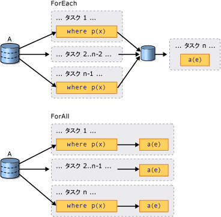

# PLINQ の概要Introduction to PLINQ
## 並列クエリとはWhat is a Parallel Query?  
 統合言語クエリ (LINQ) は [!INCLUDE[net_v35_long](../../../includes/net-v35-long-md.md)] で導入されました。Language-Integrated Query (LINQ) was introduced in the [!INCLUDE[net_v35_long](../../../includes/net-v35-long-md.md)].  これはタイプ セーフな方法で任意の <xref:System.Collections.IEnumerable?displayProperty=nameWithType> または <xref:System.Collections.Generic.IEnumerable%601?displayProperty=nameWithType> のデータ ソースを照会する、統一されたモデルです。It features a unified model for querying any <xref:System.Collections.IEnumerable?displayProperty=nameWithType> or <xref:System.Collections.Generic.IEnumerable%601?displayProperty=nameWithType> data source in a type-safe manner. LINQ to Objects とは、<xref:System.Collections.Generic.List%601> や配列などのメモリ内コレクションに対して実行される LINQ クエリの名前です。LINQ to Objects is the name for LINQ queries that are run against in-memory collections such as <xref:System.Collections.Generic.List%601> and arrays. この記事では、LINQ の基礎を理解していることを前提としています。This article assumes that you have a basic understanding of LINQ. 詳細については、「[LINQ (Language-Integrated Query) (LINQ (統合言語クエリ))](https://msdn.microsoft.com/library/a73c4aec-5d15-4e98-b962-1274021ea93d)」をご覧ください。For more information, see [LINQ (Language-Integrated Query)](https://msdn.microsoft.com/library/a73c4aec-5d15-4e98-b962-1274021ea93d).  
  
 Parallel LINQ (PLINQ) は、LINQ パターンの並列実装です。Parallel LINQ (PLINQ) is a parallel implementation of the LINQ pattern. PLINQ クエリは、あらゆる意味において、並列ではない LINQ to Objects クエリに似ています。A PLINQ query in many ways resembles a non-parallel LINQ to Objects query. PLINQ クエリは、[!INCLUDE[vbteclinq](../../../includes/vbteclinq-md.md)] の順次クエリと同様、メモリ内の <xref:System.Collections.IEnumerable> または <xref:System.Collections.Generic.IEnumerable%601> データ ソースで実行され、遅延実行が存在するので、クエリが列挙されるまでは実行されません。PLINQ queries, just like sequential [!INCLUDE[vbteclinq](../../../includes/vbteclinq-md.md)] queries, operate on any in-memory <xref:System.Collections.IEnumerable> or <xref:System.Collections.Generic.IEnumerable%601> data source, and have deferred execution, which means they do not begin executing until the query is enumerated. 主な相違点は、PLINQ は、システムのすべてのプロセッサを十分に活用しようとする点です。The primary difference is that PLINQ attempts to make full use of all the processors on the system. そのために、データ ソースをセグメントにパーティション分割し、複数のプロセッサで個々のワーカー スレッドの各セグメントに対してクエリを並行実行します。It does this by partitioning the data source into segments, and then executing the query on each segment on separate worker threads in parallel on multiple processors. 多くの場合、並行実行によって、クエリは非常に高速に処理されます。In many cases, parallel execution means that the query runs significantly faster.  
  
 一部の種類のクエリについては、データ ソースに <xref:System.Linq.ParallelEnumerable.AsParallel%2A> クエリ操作を追加して並行実行することで、レガシ コードよりも大幅なパフォーマンスの向上を PLINQ で実現できます。Through parallel execution, PLINQ can achieve significant performance improvements over legacy code for certain kinds of queries, often just by adding the <xref:System.Linq.ParallelEnumerable.AsParallel%2A> query operation to the data source. ただし、並列処理にはある程度の複雑さが伴うため、すべてのクエリ操作が PLINQ でより速く実行されるわけではありません。However, parallelism can introduce its own complexities, and not all query operations run faster in PLINQ. 実際、一部のクエリについては、並列化によって処理速度が遅くなります。In fact, parallelization actually slows down certain queries. そのため、順序付けなどの問題が並列クエリに与える影響を理解しておく必要があります。Therefore, you should understand how issues such as ordering affect parallel queries. 詳細については、「[Understanding Speedup in PLINQ (PLINQ での高速化について)](../../../docs/standard/parallel-programming/understanding-speedup-in-plinq.md)」を参照してください。For more information, see [Understanding Speedup in PLINQ](../../../docs/standard/parallel-programming/understanding-speedup-in-plinq.md).  
  
> [!NOTE]
>  ここでは、ラムダ式を使用して PLINQ でデリゲートを定義します。This documentation uses lambda expressions to define delegates in PLINQ. C# または Visual Basic のラムダ式についての情報が必要な場合は、「[Lambda Expressions in PLINQ and TPL (PLINQ および TPL のラムダ式)](../../../docs/standard/parallel-programming/lambda-expressions-in-plinq-and-tpl.md)」を参照してください。If you are not familiar with lambda expressions in C# or Visual Basic, see [Lambda Expressions in PLINQ and TPL](../../../docs/standard/parallel-programming/lambda-expressions-in-plinq-and-tpl.md).  
  
 この記事の残りの部分では、主な PLINQ クラスの概要を紹介し、PLINQ クエリの作成方法について説明します。The remainder of this article gives an overview of the main PLINQ classes, and discusses how to create PLINQ queries. 各セクションには、詳細情報とコード例へのリンクも含まれています。Each section contains links to more detailed information and code examples.  
  
## ParallelEnumerable クラスThe ParallelEnumerable Class  
 <xref:System.Linq.ParallelEnumerable?displayProperty=nameWithType> クラスは、ほぼすべての PLINQ 機能を公開します。The <xref:System.Linq.ParallelEnumerable?displayProperty=nameWithType> class exposes almost all of PLINQ's functionality.  このクラスと、その他の <xref:System.Linq?displayProperty=nameWithType> 名前空間の型は、System.Core.dll アセンブリにコンパイルされます。It and the rest of the <xref:System.Linq?displayProperty=nameWithType> namespace types are compiled into the System.Core.dll assembly. Visual Studio の既定の C# プロジェクトと Visual Basic プロジェクトは、どちらもアセンブリを参照し、名前空間をインポートします。The default C# and Visual Basic projects in Visual Studio both reference the assembly and import the namespace.  
  
 <xref:System.Linq.ParallelEnumerable> には、LINQ to Objects がサポートするすべての標準クエリ演算子の実装が含まれていますが、各演算子の並列化は試行しません。<xref:System.Linq.ParallelEnumerable> includes implementations of all the standard query operators that LINQ to Objects supports, although it does not attempt to parallelize each one. [!INCLUDE[vbteclinq](../../../includes/vbteclinq-md.md)] についての情報が必要な場合は、「[Introduction to LINQ (LINQ の概要)](https://msdn.microsoft.com/library/24dddf19-12a0-4707-a4bc-eba4fa7f219e)」を参照してください。If you are not familiar with [!INCLUDE[vbteclinq](../../../includes/vbteclinq-md.md)], see [Introduction to LINQ](https://msdn.microsoft.com/library/24dddf19-12a0-4707-a4bc-eba4fa7f219e).  
  
 <xref:System.Linq.ParallelEnumerable> クラスには、標準クエリ演算子に加え、並行実行固有の動作を可能にする一連のメソッドが含まれています。In addition to the standard query operators, the <xref:System.Linq.ParallelEnumerable> class contains a set of methods that enable behaviors specific to parallel execution. 次の表に、これらの PLINQ 固有のメソッドを示します。These PLINQ-specific methods are listed in the following table.  
  
|ParallelEnumerable 演算子ParallelEnumerable Operator|説明Description|  
|---------------------------------|-----------------|  
|<xref:System.Linq.ParallelEnumerable.AsParallel%2A>|PLINQ のエントリ ポイント。The entry point for PLINQ. 可能な場合は、クエリの残りの部分は並列化されることを示します。Specifies that the rest of the query should be parallelized, if it is possible.|  
|<xref:System.Linq.ParallelEnumerable.AsSequential%2A>|クエリの残りの部分は、並列ではない LINQ クエリとして順次実行されることを示します。Specifies that the rest of the query should be run sequentially, as a non-parallel LINQ query.|  
|<xref:System.Linq.ParallelEnumerable.AsOrdered%2A>|PLINQ は、クエリの残り部分について、または orderby (Visual Basic の場合は Order By) 句を使用するなどして順序が変更されるまでは、ソース シーケンスの順序を保持する必要があることを示します。Specifies that PLINQ should preserve the ordering of the source sequence for the rest of the query, or until the ordering is changed, for example by the use of an orderby (Order By in Vlsual Basic) clause.|  
|<xref:System.Linq.ParallelEnumerable.AsUnordered%2A>|クエリの残りの部分の PLINQ では、ソース シーケンスの順序を保持する必要がないことを示します。Specifies that PLINQ for the rest of the query is not required to preserve the ordering of the source sequence.|  
|<xref:System.Linq.ParallelEnumerable.WithCancellation%2A>|PLINQ は、提示されたキャンセル トークンの状態を定期的に監視し、要求された場合は、実行を取り消す必要があることを示します。Specifies that PLINQ should periodically monitor the state of the provided cancellation token and cancel execution if it is requested.|  
|<xref:System.Linq.ParallelEnumerable.WithDegreeOfParallelism%2A>|クエリを並列化するために PLINQ が使用する必要がある、プロセッサの最大数を示します。Specifies the maximum number of processors that PLINQ should use to parallelize the query.|  
|<xref:System.Linq.ParallelEnumerable.WithMergeOptions%2A>|PLINQ が並列化の結果を consumer スレッドの単一のシーケンスに再マージできる場合は、その方法についてのヒントを示します。Provides a hint about how PLINQ should, if it is possible, merge parallel results back into just one sequence on the consuming thread.|  
|<xref:System.Linq.ParallelEnumerable.WithExecutionMode%2A>|既定の動作が順次実行である場合でも、PLINQ がクエリを並列化する必要があるかどうかを指定します。Specifies whether PLINQ should parallelize the query even when the default behavior would be to run it sequentially.|  
|<xref:System.Linq.ParallelEnumerable.ForAll%2A>|マルチスレッドの列挙型メソッド。クエリの結果の反復処理とは異なり、先に consumer スレッドに再マージしなくても、結果を並列処理できます。A multithreaded enumeration method that, unlike iterating over the results of the query, enables results to be processed in parallel without first merging back to the consumer thread.|  
|<xref:System.Linq.ParallelEnumerable.Aggregate%2A> オーバーロード<xref:System.Linq.ParallelEnumerable.Aggregate%2A> overload|PLINQ 固有のオーバーロードで、スレッド ローカルのパーティション上で中間的な集約を行うと共に、すべてのパーティションの結果を結合する最終的なアグリゲーション関数も使用できます。An overload that is unique to PLINQ and enables intermediate aggregation over thread-local partitions, plus a final aggregation function to combine the results of all partitions.|  
  
## オプトイン モデルThe Opt-in Model  
 クエリを記述するときに、次の例に示すようにデータ ソースの <xref:System.Linq.ParallelEnumerable.AsParallel%2A?displayProperty=nameWithType> 拡張メソッドを呼び出し、PLINQ を有効にします。When you write a query, opt in to PLINQ by invoking the <xref:System.Linq.ParallelEnumerable.AsParallel%2A?displayProperty=nameWithType> extension method on the data source, as shown in the following example.  
  
 [!code-csharp[PLINQ#1](../../../samples/snippets/csharp/VS_Snippets_Misc/plinq/cs/plinq2_cs.cs#1)]
 [!code-vb[PLINQ#1](../../../samples/snippets/visualbasic/VS_Snippets_Misc/plinq/vb/plinq2_vb.vb#1)]  
  
 <xref:System.Linq.ParallelEnumerable.AsParallel%2A> 拡張メソッドは、それ以降のクエリ演算子 (この場合は `where` および `select`) を <xref:System.Linq.ParallelEnumerable?displayProperty=nameWithType> の実装にバインドします。The <xref:System.Linq.ParallelEnumerable.AsParallel%2A> extension method binds the subsequent query operators, in this case, `where` and `select`, to the <xref:System.Linq.ParallelEnumerable?displayProperty=nameWithType> implementations.  
  
## 実行モードExecution Modes  
 既定では、PLINQ は保守的です。By default, PLINQ is conservative. PLINQ インフラストラクチャは、実行時に、クエリの全体的な構造を分析します。At run time, the PLINQ infrastructure analyzes the overall structure of the query. 並列化によってクエリを高速化できることが見込まれる場合は、PLINQ は、同時実行できるタスクにソース シーケンスをパーティション分割します。If the query is likely to yield speedups by parallelization, PLINQ partitions the source sequence into tasks that can be run concurrently. クエリの並列化が安全ではない場合は、PLINQ はクエリを順次実行します。If it is not safe to parallelize a query, PLINQ just runs the query sequentially. PLINQ で、負荷が高くなる可能性がある並列アルゴリズムと負荷が低い順次アルゴリズムを選ぶ必要がある場合は、既定では順次アルゴリズムが選択されます。If PLINQ has a choice between a potentially expensive parallel algorithm or an inexpensive sequential algorithm, it chooses the sequential algorithm by default. 並列アルゴリズムを選択するよう PLINQ に指示するには、<xref:System.Linq.ParallelEnumerable.WithExecutionMode%2A> メソッドと <xref:System.Linq.ParallelExecutionMode?displayProperty=nameWithType> 列挙型を使用します。You can use the <xref:System.Linq.ParallelEnumerable.WithExecutionMode%2A> method and the <xref:System.Linq.ParallelExecutionMode?displayProperty=nameWithType> enumeration to instruct PLINQ to select the parallel algorithm. これは、テストと測定の結果、特定のクエリで並列化の方が速く実行されることが判明している場合に便利です。This is useful when you know by testing and measurement that a particular query executes faster in parallel. 詳細については、「[How to: Specify the Execution Mode in PLINQ (方法: PLINQ の実行モードを指定する)](../../../docs/standard/parallel-programming/how-to-specify-the-execution-mode-in-plinq.md)」を参照してください。For more information, see [How to: Specify the Execution Mode in PLINQ](../../../docs/standard/parallel-programming/how-to-specify-the-execution-mode-in-plinq.md).  
  
## 並列化の次数Degree of Parallelism  
 既定では、PLINQ はホスト コンピューター上のすべてのプロセッサを使用します。By default, PLINQ uses all of the processors on the host computer. <xref:System.Linq.ParallelEnumerable.WithDegreeOfParallelism%2A> メソッドを使用すると、指定されたプロセッサ数よりも多くのプロセッサを使用するよう、PLINQ に指示できます。You can instruct PLINQ to use no more than a specified number of processors by using the <xref:System.Linq.ParallelEnumerable.WithDegreeOfParallelism%2A> method. これは、コンピューター上で実行されるその他のプロセスが、一定の CPU 時間を確保できるようにする場合に便利です。This is useful when you want to make sure that other processes running on the computer receive a certain amount of CPU time. 次のスニペットでは、クエリが最大で 2 つのプロセッサしか使用できないように制限します。The following snippet limits the query to utilizing a maximum of two processors.  
  
 [!code-csharp[PLINQ#5](../../../samples/snippets/csharp/VS_Snippets_Misc/plinq/cs/plinqsamples.cs#5)]
 [!code-vb[PLINQ#5](../../../samples/snippets/visualbasic/VS_Snippets_Misc/plinq/vb/plinq2_vb.vb#5)]  
  
 クエリが、ファイル I/O など計算主体ではない作業を大量に実行している場合は、マシンのコア数よりも大きい並列化の次数を指定することをお勧めします。In cases where a query is performing a significant amount of non-compute-bound work such as File I/O, it might be beneficial to specify a degree of parallelism greater than the number of cores on the machine.  
  
## 順序ありの並列クエリと順序なしの並列クエリOrdered Versus Unordered Parallel Queries  
 一部のクエリでは、クエリ演算子は、ソース シーケンスの順序を保持する結果を生成する必要があります。In some queries, a query operator must produce results that preserve the ordering of the source sequence. そのために、PLINQ には <xref:System.Linq.ParallelEnumerable.AsOrdered%2A> 演算子が用意されています。PLINQ provides the <xref:System.Linq.ParallelEnumerable.AsOrdered%2A> operator for this purpose. <xref:System.Linq.ParallelEnumerable.AsOrdered%2A> は、<xref:System.Linq.ParallelEnumerable.AsSequential%2A> とは異なります。<xref:System.Linq.ParallelEnumerable.AsOrdered%2A> is distinct from <xref:System.Linq.ParallelEnumerable.AsSequential%2A>. <xref:System.Linq.ParallelEnumerable.AsOrdered%2A> シーケンスは並列で処理されますが、その結果はバッファーに格納されて並べ替えられます。An <xref:System.Linq.ParallelEnumerable.AsOrdered%2A> sequence is still processed in parallel, but its results are buffered and sorted. 通常、順序を保持するには追加の処理が必要となるため、<xref:System.Linq.ParallelEnumerable.AsOrdered%2A> シーケンスの処理は、既定の <xref:System.Linq.ParallelEnumerable.AsUnordered%2A> シーケンスよりも遅くなることがあります。Because order preservation typically involves extra work, an <xref:System.Linq.ParallelEnumerable.AsOrdered%2A> sequence might be processed more slowly than the default <xref:System.Linq.ParallelEnumerable.AsUnordered%2A> sequence. 特定の順序ありの並列操作が、同じ操作の順次処理よりも高速であるかどうかは、さまざまな要因によって左右されます。Whether a particular ordered parallel operation is faster than a sequential version of the operation depends on many factors.  
  
 次のコード例に、順序の維持を有効にする方法を示します。The following code example shows how to opt in to order preservation.  
  
 [!code-csharp[PLINQ#3](../../../samples/snippets/csharp/VS_Snippets_Misc/plinq/cs/plinq2_cs.cs#3)]
 [!code-vb[PLINQ#3](../../../samples/snippets/visualbasic/VS_Snippets_Misc/plinq/vb/plinq2_vb.vb#3)]  
  
 詳細については、「[Order Preservation in PLINQ (PLINQ における順序維持)](../../../docs/standard/parallel-programming/order-preservation-in-plinq.md)」を参照してください。For more information, see [Order Preservation in PLINQ](../../../docs/standard/parallel-programming/order-preservation-in-plinq.md).  
  
## 並列クエリと順次クエリParallel vs. Sequential Queries  
 一部の操作では、ソース データを順次提供する必要があります。Some operations require that the source data be delivered in a sequential manner. <xref:System.Linq.ParallelEnumerable> クエリ演算子は、必要に応じて、順次モードに自動的に切り替わります。The <xref:System.Linq.ParallelEnumerable> query operators revert to sequential mode automatically when it is required. ユーザー定義のクエリ演算子と、順次実行を必要とするユーザー デリゲート向けに、PLINQ では <xref:System.Linq.ParallelEnumerable.AsSequential%2A> メソッドを使用できます。For user-defined query operators and user delegates that require sequential execution, PLINQ provides the <xref:System.Linq.ParallelEnumerable.AsSequential%2A> method. <xref:System.Linq.ParallelEnumerable.AsSequential%2A> を使用すると、それ以降のクエリの演算子は、<xref:System.Linq.ParallelEnumerable.AsParallel%2A> が再度呼び出されるまで順次実行されます。When you use <xref:System.Linq.ParallelEnumerable.AsSequential%2A>, all subsequent operators in the query are executed sequentially until <xref:System.Linq.ParallelEnumerable.AsParallel%2A> is called again. 詳細については、「[How to: Combine Parallel and Sequential LINQ Queries (方法: 並列および順次の LINQ クエリを連結する)](../../../docs/standard/parallel-programming/how-to-combine-parallel-and-sequential-linq-queries.md)」を参照してください。For more information, see [How to: Combine Parallel and Sequential LINQ Queries](../../../docs/standard/parallel-programming/how-to-combine-parallel-and-sequential-linq-queries.md).  
  
## クエリ結果のマージのオプションOptions for Merging Query Results  
 PLINQ クエリが並列実行される場合、`foreach` ループ (Visual Basic では `For Each`) による消費、またはリストや配列への挿入を行うことができるよう、各ワーカー スレッドからの結果をメイン スレッドに再マージする必要があります。When a PLINQ query executes in parallel, its results from each worker thread must be merged back onto the main thread for consumption by a `foreach` loop (`For Each` in Visual Basic), or insertion into a list or array. 結果をより迅速に生成する場合など、特定のマージ操作を指定すると便利なこともあります。In some cases, it might be beneficial to specify a particular kind of merge operation, for example, to begin producing results more quickly. そのために、PLINQ では <xref:System.Linq.ParallelEnumerable.WithMergeOptions%2A> メソッドと <xref:System.Linq.ParallelMergeOptions> 列挙型をサポートしています。For this purpose, PLINQ supports the <xref:System.Linq.ParallelEnumerable.WithMergeOptions%2A> method, and the <xref:System.Linq.ParallelMergeOptions> enumeration. 詳細については、「[Merge Options in PLINQ (PLINQ のマージ オプション)](../../../docs/standard/parallel-programming/merge-options-in-plinq.md)」を参照してください。For more information, see [Merge Options in PLINQ](../../../docs/standard/parallel-programming/merge-options-in-plinq.md).  
  
## ForAll 演算子The ForAll Operator  
 [!INCLUDE[vbteclinq](../../../includes/vbteclinq-md.md)] の順次クエリでは、`foreach` (Visual Basic の場合は `For Each`) ループで列挙されるか、<xref:System.Linq.ParallelEnumerable.ToList%2A>、<xref:System.Linq.ParallelEnumerable.ToArray%2A>、<xref:System.Linq.ParallelEnumerable.ToDictionary%2A> などのメソッドを呼び出すまで、クエリの実行は延期されます。In sequential [!INCLUDE[vbteclinq](../../../includes/vbteclinq-md.md)] queries, execution is deferred until the query is enumerated either in a `foreach` (`For Each` in Visual Basic) loop or by invoking a method such as <xref:System.Linq.ParallelEnumerable.ToList%2A> , <xref:System.Linq.ParallelEnumerable.ToArray%2A> , or <xref:System.Linq.ParallelEnumerable.ToDictionary%2A>. PLINQ では、`foreach` を使用してクエリを実行し、結果を反復処理することもできます。In PLINQ, you can also use `foreach` to execute the query and iterate through the results. ただし、`foreach` 自体は並列実行されないので、ループが実行されるスレッドに、すべての並列タスクの出力を再マージする必要があります。However, `foreach` itself does not run in parallel, and therefore, it requires that the output from all parallel tasks be merged back into the thread on which the loop is running. PLINQ では、クエリ結果の最終的な順序を維持する必要がある場合や、結果を順次的に処理している場合は (たとえば、各要素に対して `foreach` を呼び出している場合など)、`Console.WriteLine` を使用できます。In PLINQ, you can use `foreach` when you must preserve the final ordering of the query results, and also whenever you are processing the results in a serial manner, for example when you are calling `Console.WriteLine` for each element. 順序の維持が必要ない場合や、結果の処理自体を並列化できる場合にクエリ実行を高速化するには、<xref:System.Linq.ParallelEnumerable.ForAll%2A> メソッドで PLINQ クエリを実行します。For faster query execution when order preservation is not required and when the processing of the results can itself be parallelized, use the <xref:System.Linq.ParallelEnumerable.ForAll%2A> method to execute a PLINQ query. <xref:System.Linq.ParallelEnumerable.ForAll%2A> は、この最終的なマージ ステップを実行しません。<xref:System.Linq.ParallelEnumerable.ForAll%2A> does not perform this final merge step. <xref:System.Linq.ParallelEnumerable.ForAll%2A> メソッドを使用するコード例を次に示します。The following code example shows how to use the <xref:System.Linq.ParallelEnumerable.ForAll%2A> method. ここで <xref:System.Collections.Concurrent.ConcurrentBag%601?displayProperty=nameWithType> が使用されるのは、項目を削除せずに、同時に複数スレッドの追加を行うために最適化されるためです。<xref:System.Collections.Concurrent.ConcurrentBag%601?displayProperty=nameWithType> is used here because it is optimized for multiple threads adding concurrently without attempting to remove any items.  
  
 [!code-csharp[PLINQ#4](../../../samples/snippets/csharp/VS_Snippets_Misc/plinq/cs/plinq2_cs.cs#4)]
 [!code-vb[PLINQ#4](../../../samples/snippets/visualbasic/VS_Snippets_Misc/plinq/vb/plinq2_vb.vb#4)]  
  
 次の図に、クエリ実行における `foreach` と <xref:System.Linq.ParallelEnumerable.ForAll%2A> の相違点を示します。The following illustration shows the difference between `foreach` and <xref:System.Linq.ParallelEnumerable.ForAll%2A> with regard to query execution.  
  
   
  
## キャンセルCancellation  
 PLINQ は、[!INCLUDE[net_v40_short](../../../includes/net-v40-short-md.md)] のキャンセルの型に統合されています PLINQ is integrated with the cancellation types in [!INCLUDE[net_v40_short](../../../includes/net-v40-short-md.md)]. 詳細については、「[Cancellation in Managed Threads (マネージ スレッドのキャンセル)](../../../docs/standard/threading/cancellation-in-managed-threads.md)」を参照してください。そのため、順次的な LINQ to Objects クエリとは異なり、PLINQ クエリは取り消すことができます。(For more information, see [Cancellation in Managed Threads](../../../docs/standard/threading/cancellation-in-managed-threads.md).) Therefore, unlike sequential LINQ to Objects queries, PLINQ queries can be canceled. キャンセル可能な PLINQ クエリを作成するには、クエリで <xref:System.Linq.ParallelEnumerable.WithCancellation%2A> 演算子を使用し、引数として <xref:System.Threading.CancellationToken> インスタンスを指定します。To create a cancelable PLINQ query, use the <xref:System.Linq.ParallelEnumerable.WithCancellation%2A> operator on the query and provide a <xref:System.Threading.CancellationToken> instance as the argument. トークンの <xref:System.Threading.CancellationToken.IsCancellationRequested%2A> プロパティが true に設定されていると、PLINQ はそれに気付き、すべてのスレッドの処理を中止して <xref:System.OperationCanceledException> をスローします。When the <xref:System.Threading.CancellationToken.IsCancellationRequested%2A> property on the token is set to true, PLINQ will notice it, stop processing on all threads, and throw an <xref:System.OperationCanceledException>.  
  
 キャンセル トークンが設定された後も、PLINQ クエリが一部の要素の処理を継続する可能性があります。It is possible that a PLINQ query might continue to process some elements after the cancellation token is set.  
  
 応答性を高めるため、長時間にわたるユーザー デリゲートのキャンセル要求に対応することもできます。For greater responsiveness, you can also respond to cancellation requests in long-running user delegates. 詳細については、「[How to: Cancel a PLINQ Query (方法: PLINQ クエリを取り消す)](../../../docs/standard/parallel-programming/how-to-cancel-a-plinq-query.md)」を参照してください。For more information, see [How to: Cancel a PLINQ Query](../../../docs/standard/parallel-programming/how-to-cancel-a-plinq-query.md).  
  
## 例外Exceptions  
 PLINQ クエリが実行されると、異なるスレッドから複数の例外が同時にスローされることがあります。When a PLINQ query executes, multiple exceptions might be thrown from different threads simultaneously. また、例外を処理するコードが、例外をスローしたコードとは異なるスレッドにあることもあります。Also, the code to handle the exception might be on a different thread than the code that threw the exception. PLINQ では <xref:System.AggregateException> 型を使用し、クエリによってスローされたすべての例外をカプセル化し、それらの例外を呼び出し元のスレッドにマーシャリングします。PLINQ uses the <xref:System.AggregateException> type to encapsulate all the exceptions that were thrown by a query, and marshal those exceptions back to the calling thread. 呼び出し元のクエリでは、try-catch ブロックが 1 つだけ必要です。On the calling thread, only one try-catch block is required. ただし、<xref:System.AggregateException> でカプセル化されたすべての例外を反復処理し、安全に回復できる例外をキャッチできます。However, you can iterate through all of the exceptions that are encapsulated in the <xref:System.AggregateException> and catch any that you can safely recover from. まれに、<xref:System.AggregateException> にラップされていない例外がスローされ、<xref:System.Threading.ThreadAbortException> もラップされていないことがあります。In rare cases, some exceptions may be thrown that are not wrapped in an <xref:System.AggregateException>, and <xref:System.Threading.ThreadAbortException>s  are also not wrapped.  
  
 連結しているスレッドへ例外が上方向へ通知されると、例外が発生した後も、クエリによって一部の項目の処理が続行される可能性があります。When exceptions are allowed to bubble up back to the joining thread, then it is possible that a query may continue to process some items after the exception is raised.  
  
 詳細については、「[How to: Handle Exceptions in a PLINQ Query (方法: PLINQ クエリの例外を処理する)](../../../docs/standard/parallel-programming/how-to-handle-exceptions-in-a-plinq-query.md)」を参照してください。For more information, see [How to: Handle Exceptions in a PLINQ Query](../../../docs/standard/parallel-programming/how-to-handle-exceptions-in-a-plinq-query.md).  
  
## カスタム パーティショナーCustom Partitioners  
 ソース データの特性を活用するカスタム パーティショナーを記述することによって、クエリのパフォーマンスを向上できる場合があります。In some cases, you can improve query performance by writing a custom partitioner that takes advantage of some characteristic of the source data. クエリでは、カスタム パーティショナー自体は、クエリの対象となる列挙可能なオブジェクトです。In the query, the custom partitioner itself is the enumerable object that is queried.  
  
 [!code-csharp[PLINQ#2](../../../samples/snippets/csharp/VS_Snippets_Misc/plinq/cs/plinq2_cs.cs#2)]
 [!code-vb[PLINQ#2](../../../samples/snippets/visualbasic/VS_Snippets_Misc/plinq/vb/plinq3.vb#2)]  
  
 PLINQ は、固定数のパーティションをサポートしています (ただし、負荷分散の目的で、これらのパーティションに対してデータが実行時に動的に再割り当てされることもあります)。PLINQ supports a fixed number of partitions (although data may be dynamically reassigned to those partitions during run time for load balancing.). <xref:System.Threading.Tasks.Parallel.For%2A> および <xref:System.Threading.Tasks.Parallel.ForEach%2A> は動的なパーティション分割しかサポートしていないので、パーティションの数は実行時に変化します。<xref:System.Threading.Tasks.Parallel.For%2A> and <xref:System.Threading.Tasks.Parallel.ForEach%2A> support only dynamic partitioning, which means that the number of partitions changes at run time. 詳細については、「[Custom Partitioners for PLINQ and TPL (PLINQ および TPL 用のカスタム パーティショナー)](../../../docs/standard/parallel-programming/custom-partitioners-for-plinq-and-tpl.md)」を参照してください。For more information, see [Custom Partitioners for PLINQ and TPL](../../../docs/standard/parallel-programming/custom-partitioners-for-plinq-and-tpl.md).  
  
## PLINQ のパフォーマンスの測定Measuring PLINQ Performance  
 クエリは、多くの場合並列化できますが、並列クエリの設定に伴うオーバーヘッドは、並列化によって得られるパフォーマンスの利点よりも大きくなります。In many cases, a query can be parallelized, but the overhead of setting up the parallel query outweighs the performance benefit gained. クエリが大量の計算を実行しない場合、またはデータ ソースが小さい場合、PLINQ クエリは、順次的な LINQ to Objects クエリよりも低速になります。If a query does not perform much computation or if the data source is small, a PLINQ query may be slower than a sequential LINQ to Objects query. Visual Studio Team Server の Parallel Performance Analyzer を使用し、さまざまなクエリのパフォーマンスの比較、処理のボトルネックの場所の特定、クエリが並行処理されているか順次処理されているかの確認を行うことができます。You can use the Parallel Performance Analyzer in Visual Studio Team Server to compare the performance of various queries, to locate processing bottlenecks, and to determine whether your query is running in parallel or sequentially. 詳細については、「[Concurrency Visualizer (同時実行ビジュアライザー)](/visualstudio/profiling/concurrency-visualizer)」と「[How to: Measure PLINQ Query Performance (方法: PLINQ クエリのパフォーマンスを測定する)](../../../docs/standard/parallel-programming/how-to-measure-plinq-query-performance.md)」を参照してください。For more information, see [Concurrency Visualizer](/visualstudio/profiling/concurrency-visualizer) and [How to: Measure PLINQ Query Performance](../../../docs/standard/parallel-programming/how-to-measure-plinq-query-performance.md).  
  
## 参照See Also  
 [Parallel LINQ (PLINQ)Parallel LINQ (PLINQ)](../../../docs/standard/parallel-programming/parallel-linq-plinq.md)  
 [PLINQ での高速化についてUnderstanding Speedup in PLINQ](../../../docs/standard/parallel-programming/understanding-speedup-in-plinq.md)
