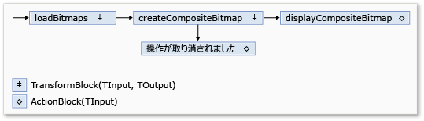
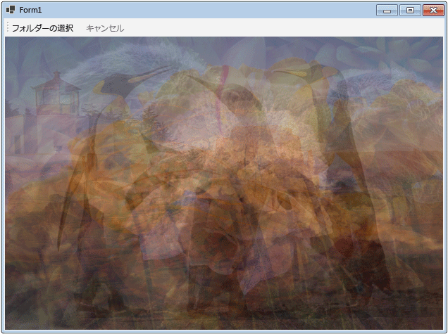

# チュートリアル: Windows フォーム アプリケーションでのデータフローの使用
このドキュメントでは、Windows フォーム アプリケーションでイメージ処理を実行する、データフロー ブロックのネットワークを作成する方法を説明します。  
  
 この例では、指定したフォルダーからイメージ ファイルを読み込み、複合イメージを作成して、結果を表示します。 例では、ネットワーク経由でイメージをルーティングするために、データフロー モデルを使用します。 このデータフロー モデルでは、プログラム内の独立したコンポーネント同士が、メッセージを送信することによって相互に通信します。 1 つのコンポーネントがメッセージを受信すると、何らかのアクションを実行した後に、結果を別のコンポーネントに渡します。 このモデルと制御フロー モデルを比較してください。制御フロー モデルでは、アプリケーションは制御構造 (条件付きステートメントやループなど) を使用してプログラムでの操作順序を制御します。  
  
## 必須コンポーネント  
 このチュートリアルを開始する前に、「[Dataflow (データフロー)](../../../docs/standard/parallel-programming/dataflow-task-parallel-library.md)」をお読みください。  

[!INCLUDE [tpl-install-instructions](../../../includes/tpl-install-instructions.md)]

## セクション  
 このチュートリアルは、次のセクションで構成されています。  
  
-   [Windows フォーム アプリケーションの作成](#winforms)  
  
-   [データフロー ネットワークの作成](#network)  
  
-   [ユーザー インターフェイスへのデータフロー ネットワークの接続](#ui)  
  
-   [コード例全体](#complete)  
  
   
## Windows フォーム アプリケーションの作成  
 このセクションでは、基本的な Windows フォーム アプリケーションを作成し、メイン フォームにコントロールを追加する方法を説明します。  
  
#### Windows フォーム アプリケーションを作成するには  
  
1.  [!INCLUDE[vsprvs](../../../includes/vsprvs-md.md)] で、Visual C# または Visual Basic **Windows フォーム アプリケーション** プロジェクトを作成します。 このドキュメントでは、プロジェクトの名前を `CompositeImages` とします。  
  
2.  メイン フォーム Form1.cs (Visual Basic の Form1.vb) のフォーム デザイナーで、<xref:System.Windows.Forms.ToolStrip> コントロールを追加します。  
  
3.  <xref:System.Windows.Forms.ToolStrip> コントロールに <xref:System.Windows.Forms.ToolStripButton> コントロールを追加します。 <xref:System.Windows.Forms.ToolStripItem.DisplayStyle%2A> プロパティを <xref:System.Windows.Forms.ToolStripItemDisplayStyle.Text> に設定し、<xref:System.Windows.Forms.ToolStripItem.Text%2A> プロパティを「**フォルダーの選択**」に設定します。  
  
4.  <xref:System.Windows.Forms.ToolStrip> コントロールに 2 つ目の <xref:System.Windows.Forms.ToolStripButton> コントロールを追加します。 <xref:System.Windows.Forms.ToolStripItem.DisplayStyle%2A> プロパティを <xref:System.Windows.Forms.ToolStripItemDisplayStyle.Text> に、<xref:System.Windows.Forms.ToolStripItem.Text%2A> プロパティを「**キャンセル**」に、<xref:System.Windows.Forms.ToolStripItem.Enabled%2A> プロパティを `False` に設定します。  
  
5.  <xref:System.Windows.Forms.PictureBox> オブジェクトをメイン フォームに追加します。 <xref:System.Windows.Forms.Control.Dock%2A> プロパティを <xref:System.Windows.Forms.DockStyle.Fill> に設定します。  
  
   
## データフロー ネットワークの作成  
 このセクションでは、イメージ処理を実行するデータフロー ネットワークを作成する方法を説明します。  
  
#### データフロー ネットワークを作成するには  
  
1.  System.Threading.Tasks.Dataflow.dll への参照をプロジェクトに追加します。  
  
2.  Form1.cs (Visual Basic の Form1.vb) に次の `using` (Visual Basic では `Using`) ステートメントが含まれていることを確認します。  
  
     [!code-csharp[TPLDataflow_CompositeImages#1](../../../samples/snippets/csharp/VS_Snippets_Misc/tpldataflow_compositeimages/cs/compositeimages/form1.cs#1)]  
  
3.  `Form1` クラスに次のデータ メンバーを追加します。  
  
     [!code-csharp[TPLDataflow_CompositeImages#2](../../../samples/snippets/csharp/VS_Snippets_Misc/tpldataflow_compositeimages/cs/compositeimages/form1.cs#2)]  
  
4.  次の `CreateImageProcessingNetwork` メソッドを `Form1` クラスに追加します。 このメソッドによって、イメージ処理ネットワークが作成されます。  
  
     [!code-csharp[TPLDataflow_CompositeImages#3](../../../samples/snippets/csharp/VS_Snippets_Misc/tpldataflow_compositeimages/cs/compositeimages/form1.cs#3)]  
  
5.  `LoadBitmaps` メソッドを実装します。  
  
     [!code-csharp[TPLDataflow_CompositeImages#4](../../../samples/snippets/csharp/VS_Snippets_Misc/tpldataflow_compositeimages/cs/compositeimages/form1.cs#4)]  
  
6.  `CreateCompositeBitmap` メソッドを実装します。  
  
     [!code-csharp[TPLDataflow_CompositeImages#5](../../../samples/snippets/csharp/VS_Snippets_Misc/tpldataflow_compositeimages/cs/compositeimages/form1.cs#5)]  
  
    > [!NOTE]
    >  `CreateCompositeBitmap` メソッドの C# バージョンでは、ポインターを使って、<xref:System.Drawing.Bitmap?displayProperty=nameWithType> オブジェクトの効率的な処理を実現します。 したがって、[unsafe](~/docs/csharp/language-reference/keywords/unsafe.md) キーワードを使用するために、プロジェクト内の **[アンセーフ コードの許可]** オプションを有効にしてください。 Visual C# プロジェクトでアンセーフ コードを有効にする方法については、「[[ビルド] ページ (プロジェクト デザイナー) (C#)](/visualstudio/ide/reference/build-page-project-designer-csharp)」を参照してください。  
  
 ネットワークのメンバーを次の表に示します。  
  
|メンバー|型|説明|  
|------------|----------|-----------------|  
|`loadBitmaps`|<xref:System.Threading.Tasks.Dataflow.TransformBlock%602>|フォルダーのパスを入力として取得し、<xref:System.Drawing.Bitmap> オブジェクトのコレクションを出力として生成します。|  
|`createCompositeBitmap`|<xref:System.Threading.Tasks.Dataflow.TransformBlock%602>|<xref:System.Drawing.Bitmap> オブジェクトのコレクションを入力として取得し、複合ビットマップを出力として生成します。|  
|`displayCompositeBitmap`|<xref:System.Threading.Tasks.Dataflow.ActionBlock%601>|フォーム上に複合ビットマップを表示します。|  
|`operationCancelled`|<xref:System.Threading.Tasks.Dataflow.ActionBlock%601>|操作が取り消されたことを示すためにイメージを表示し、ユーザーが別のフォルダーを選択できるようにします。|  
  
 データフロー ブロックを接続してネットワークを形成するため、この例では <xref:System.Threading.Tasks.Dataflow.ISourceBlock%601.LinkTo%2A> メソッドを使います。 <xref:System.Threading.Tasks.Dataflow.ISourceBlock%601.LinkTo%2A> メソッドには、ターゲット ブロックがメッセージを受け入れるか拒否するかを決定する <xref:System.Predicate%601> オブジェクトを受け取るオーバーロード バージョンが含まれます。 このフィルターのしくみによって、メッセージ ブロックは特定の値のみを受信できます。 この例では、ネットワークが、2 つに分岐します。 メイン分岐は、ディスクからイメージを読み込み、複合イメージを作成し、フォームにそのイメージを表示します。 もう 1 つの分岐では、現在の操作がキャンセルされます。 <xref:System.Predicate%601> オブジェクトは、メイン分岐に沿ったデータフロー ブロックで、特定のメッセージを拒否することによって、もう 1 つの分岐に切り替えることができます。 たとえば、ユーザーが操作をキャンセルした場合、データフロー ブロック `createCompositeBitmap` で、`null` (Visual Basic では `Nothing`) が出力として生成されます。 データフロー ブロック `displayCompositeBitmap` では、`null` 入力値が拒否されるため、メッセージが `operationCancelled` に提供されます。 データフロー ブロック `operationCancelled` はすべてのメッセージを受け入れるため、操作が取り消されたことを示すためにイメージを表示します。  
  
 次の図は、イメージ処理ネットワークを示しています。  
  
   
  
 `displayCompositeBitmap` と `operationCancelled` のデータフロー ブロックはユーザー インターフェイスで機能するので、これらの操作をユーザー インターフェイス スレッドで実行することが重要です。 これを実現するため、構築時にこれらのオブジェクトは <xref:System.Threading.Tasks.Dataflow.DataflowBlockOptions.TaskScheduler%2A> プロパティが <xref:System.Threading.Tasks.TaskScheduler.FromCurrentSynchronizationContext%2A?displayProperty=nameWithType> に設定された <xref:System.Threading.Tasks.Dataflow.ExecutionDataflowBlockOptions> オブジェクトを提供します。 <xref:System.Threading.Tasks.TaskScheduler.FromCurrentSynchronizationContext%2A?displayProperty=nameWithType> メソッドは、現行の同期コンテキストで作業を実行する <xref:System.Threading.Tasks.TaskScheduler> オブジェクトを作成します。 ユーザー インターフェイス スレッドで実行される`CreateImageProcessingNetwork` メソッドは、**[フォルダーの選択]** ボタンのハンドラーから呼び出されるため、`displayCompositeBitmap` と`operationCancelled` のデータフロー ブロックのアクションも、ユーザー インターフェイス スレッドで実行されます。  
  
 <xref:System.Threading.Tasks.Dataflow.DataflowBlockOptions.CancellationToken%2A> プロパティはデータフロー ブロックの実行を完全にキャンセルするので、この例では、<xref:System.Threading.Tasks.Dataflow.DataflowBlockOptions.CancellationToken%2A> プロパティを設定する代わりに、共有キャンセル トークンを使います。 キャンセル トークンによって、この例では、ユーザーが 1 つまたは複数の操作をキャンセルしたときにも、同じデータフロー ネットワークを複数回再利用できます。 <xref:System.Threading.Tasks.Dataflow.DataflowBlockOptions.CancellationToken%2A> を使ってデータフロー ブロックの実行を完全に取り消す例については、「[方法: データフロー ブロックをキャンセルする](../../../docs/standard/parallel-programming/how-to-cancel-a-dataflow-block.md)」をご覧ください。  
  
   
## ユーザー インターフェイスへのデータフロー ネットワークの接続  
 このセクションでは、ユーザー インターフェイスにデータフロー ネットワークを接続する方法を説明します。 複合イメージの作成と、操作のキャンセルは、**[フォルダーの選択]** と **[キャンセル]** の各ボタンから開始されます。 ユーザーがこのいずれかのボタンを選択すると、適切な操作が非同期的に開始されます。  
  
#### ユーザー インターフェイスにデータフロー ネットワークを接続するには  
  
1.  メイン フォームのフォーム デザイナーで、**[フォルダーの選択]** ボタンの <xref:System.Windows.Forms.ToolStripItem.Click> イベントのイベント ハンドラーを作成します。  
  
2.  **[フォルダーの選択]** ボタンの <xref:System.Windows.Forms.ToolStripItem.Click> イベントを実装します。  
  
     [!code-csharp[TPLDataflow_CompositeImages#6](../../../samples/snippets/csharp/VS_Snippets_Misc/tpldataflow_compositeimages/cs/compositeimages/form1.cs#6)]  
  
3.  メイン フォームのフォーム デザイナーで、**[キャンセル]** ボタンの <xref:System.Windows.Forms.ToolStripItem.Click> イベントのイベント ハンドラーを作成します。  
  
4.  **[キャンセル]** ボタンの <xref:System.Windows.Forms.ToolStripItem.Click> イベントを実装します。  
  
     [!code-csharp[TPLDataflow_CompositeImages#7](../../../samples/snippets/csharp/VS_Snippets_Misc/tpldataflow_compositeimages/cs/compositeimages/form1.cs#7)]  
  
   
## 完全な例  
 次の例は、このチュートリアルのコード全体を示しています。  
  
 [!code-csharp[TPLDataflow_CompositeImages#100](../../../samples/snippets/csharp/VS_Snippets_Misc/tpldataflow_compositeimages/cs/compositeimages/form1.cs#100)]  
  
 次の図は、一般的な \Sample Pictures\ フォルダーの典型的な出力を示しています。  
  
   

## 参照  
 [データフロー](../../../docs/standard/parallel-programming/dataflow-task-parallel-library.md)
