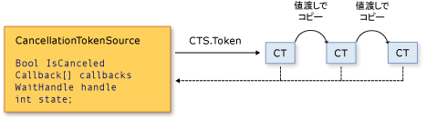

# Cancellation in Managed Threads
[!INCLUDE[net_v40_long](../../../includes/net-v40-long-md.md)] 以降で、非同期操作または長時間にわたる同期操作に対する連携によるキャンセルのための統一されたモデルが .NET Framework に導入されました。  このモデルは、キャンセル トークンと呼ばれる軽量のオブジェクトに基づいています。  新しいスレッドまたは新しいタスクの作成などによって 1 つ以上のキャンセル可能な操作を呼び出すオブジェクトは、各操作にトークンを渡します。  次いで、個々の操作は他の操作にトークンのコピーを渡すことができます。  その後、トークンを作成したオブジェクトは、操作が実行している処理を停止するように、そのトークンを使用してその操作に要求できます。  キャンセル要求は、要求側のオブジェクトからのみ発行できます。各リスナーは要求を確認し、適切な時に定期的にその要求に応答する必要があります。  
  
 連携によるキャンセル処理モデルを実装するための一般的なパターンは次のとおりです。  
  
-   <xref:System.Threading.CancellationTokenSource> オブジェクトのインスタンスを作成します。このオブジェクトでは、個々のキャンセル トークンへのキャンセル通知を管理し、送信します。  
  
-   <xref:System.Threading.CancellationTokenSource.Token%2A?displayProperty=fullName> プロパティによって返されるトークンを、キャンセルをリッスンしているそれぞれのタスクまたはスレッドに渡します。  
  
-   それぞれのタスクまたはスレッドに対し、キャンセルに応答するメカニズムを提供します。  
  
-   キャンセルの通知を提供する <xref:System.Threading.CancellationTokenSource.Cancel%2A?displayProperty=fullName> メソッドを呼び出します。  
  
> [!IMPORTANT]
>  <xref:System.Threading.CancellationTokenSource> クラスは、<xref:System.IDisposable> インターフェイスを実装します。  キャンセル トークン ソースの使用を終えた後は、必ず <xref:System.Threading.CancellationTokenSource.Dispose%2A?displayProperty=fullName> メソッドを呼び出して、キャンセル トークン ソースが保持しているアンマネージ リソースを解放する必要があります。  
  
 トークンのソースとそのトークンのすべてのコピーの間の関係を次の図に示します。  
  
   
  
 新しいキャンセル モデルによって、キャンセルに対応したアプリケーションやライブラリの作成が簡単になりました。このモデルでは次の機能がサポートされます。  
  
-   キャンセルは連携によって行われ、リスナーに強制されません。  リスナー側でキャンセル要求に応じた適切な終了方法を決定できます。  
  
-   要求とリッスンが区別して行われます。  キャンセルをいつ要求するか \(もし要求する場合\) は、キャンセル可能な操作を呼び出すオブジェクトの側で制御できます。  
  
-   要求側のオブジェクトは、1 回のメソッド呼び出しでトークンのすべてのコピーにキャンセル要求を発行できます。  
  
-   リスナーは、複数のトークンを 1 つの*リンク トークン*に結合して同時にリッスンできます。  
  
-   ライブラリ コードからのキャンセル要求をユーザー コードで確認して応答したり、ユーザー コードからのキャンセル要求をライブラリ コードで確認して応答したりすることができます。  
  
-   リスナーはポーリング、コールバックの登録、または待機ハンドルの待機により、キャンセル要求の通知を受け取ることができます。  
  
## キャンセルの型  
 キャンセル フレームワークは、関連する一連の型として実装されます。それらの型を次の表に示します。  
  
|型名|説明|  
|--------|--------|  
|<xref:System.Threading.CancellationTokenSource>|キャンセル トークンを作成するオブジェクトです。そのトークンのすべてのコピーに対するキャンセル要求の発行も、このオブジェクトで行います。|  
|<xref:System.Threading.CancellationToken>|1 つ以上のリスナーに渡される軽量な値型で、通常はメソッド パラメーターとして渡されます。  リスナーはポーリング、コールバック、または待機ハンドルによってトークンの `IsCancellationRequested` プロパティの値を監視します。|  
|<xref:System.OperationCanceledException>|この例外のコンストラクターのオーバーロードで、<xref:System.Threading.CancellationToken> をパラメーターとして受け入れます。  リスナーは必要に応じてこの例外をスローすることができます。この例外により、キャンセルのソースを確認し、キャンセル要求にそのリスナーが応答したことを他のリスナーに通知します。|  
  
 この新しいキャンセル モデルは、[!INCLUDE[dnprdnshort](../../../includes/dnprdnshort-md.md)] のいくつかの型に統合されています。最も重要なものは、<xref:System.Threading.Tasks.Parallel?displayProperty=fullName>、<xref:System.Threading.Tasks.Task?displayProperty=fullName>、<xref:System.Threading.Tasks.Task%601?displayProperty=fullName>、および <xref:System.Linq.ParallelEnumerable?displayProperty=fullName> です。  新しいライブラリおよびアプリケーション コードでは、すべてこの新しいキャンセル モデルを使用することをお勧めします。  
  
## コード例  
 次の例では、要求側のオブジェクトで <xref:System.Threading.CancellationTokenSource> オブジェクトを作成した後、その <xref:System.Threading.CancellationTokenSource.Token%2A> プロパティをキャンセル可能な操作に渡します。  要求を受け取る側の操作では、ポーリングによってトークンの <xref:System.Threading.CancellationToken.IsCancellationRequested%2A> プロパティの値を監視します。  値が `true` になったら、リスナーは適切な方法で終了できます。  この例では、メソッドの終了だけを行っています。多くの場合はこの処理だけで十分です。  
  
> [!NOTE]
>  この例では、新しいキャンセル フレームワークが従来の API と互換性があることを示すために、<xref:System.Threading.ThreadPool.QueueUserWorkItem%2A> メソッドを使用しています。  推奨される新しい <xref:System.Threading.Tasks.Task?displayProperty=fullName> 型を使用した例については、「[How to: Cancel a Task and Its Children](../../../docs/standard/parallel-programming/how-to-cancel-a-task-and-its-children.md)」を参照してください。  
  
 [!code-csharp[Cancellation#1](../../../samples/snippets/csharp/VS_Snippets_Misc/cancellation/cs/cancellationex1.cs#1)]
 [!code-vb[Cancellation#1](../../../samples/snippets/visualbasic/VS_Snippets_Misc/cancellation/vb/cancellationex1.vb#1)]  
  
## 操作のキャンセルとオブジェクトのキャンセル  
 新しいキャンセル フレームワークでは、キャンセルとは、オブジェクトのキャンセルではなく操作のキャンセルのことを指します。  キャンセル要求とは、必要なクリーンアップの実行後にできるだけ早く操作を停止するようにという要求です。  1 つのキャンセル トークンは 1 つの "キャンセル可能な操作" を参照している必要がありますが、その操作がプログラムに実装されている場合があります。  トークンの <xref:System.Threading.CancellationToken.IsCancellationRequested%2A> プロパティを `true` に設定した後に、`false` に再設定することはできません。  そのため、キャンセルが完了したキャンセル トークンを再利用することはできません。  
  
 オブジェクトのキャンセル機構が必要な場合は、<xref:System.Threading.CancellationToken.Register%2A?displayProperty=fullName> メソッドを呼び出すことにより、操作のキャンセル機構に基づいて実装できます。次に例を示します。  
  
 [!code-csharp[Cancellation#2](../../../samples/snippets/csharp/VS_Snippets_Misc/cancellation/cs/objectcancellation1.cs#2)]
 [!code-vb[Cancellation#2](../../../samples/snippets/visualbasic/VS_Snippets_Misc/cancellation/vb/objectcancellation1.vb#2)]  
  
 キャンセル可能な複数の操作の同時処理がオブジェクトでサポートされている場合は、キャンセル可能な各操作への入力として別々のトークンを渡します。  こうすることで、他の操作には影響を与えずに 1 つの操作を取り消すことができます。  
  
## キャンセル要求のリッスンと応答  
 キャンセル可能な操作の実装者は、ユーザー デリゲート内で、キャンセル要求に応じた操作の終了方法を決定します。  多くの場合、ユーザー デリゲートでは、必要なクリーンアップのみ実行してから、できるだけ早く制御を戻すことができます。  
  
 ただし、より複雑なケースでは、キャンセルが発生したことをユーザー デリゲートからライブラリ コードに通知する必要がある場合があります。  そのような場合、操作を終了するための正しい方法はユーザー デリゲートから <xref:System.Threading.CancellationToken.ThrowIfCancellationRequested%2A> メソッドを呼び出すことです。これにより、<xref:System.OperationCanceledException> がスローされます。  ライブラリ コードでは、ユーザー デリゲートのスレッドでこの例外をキャッチし、例外のトークンを調べて、この例外が連携によるキャンセルを示すのか、それ以外の例外的な状況を示すのかを判断できます。  
  
 <xref:System.Threading.Tasks.Task> クラスはこの方法で <xref:System.OperationCanceledException> を処理します。  詳細については、「[Task Cancellation](../../../docs/standard/parallel-programming/task-cancellation.md)」を参照してください。  
  
### ポーリングによるリッスン  
 ループや再帰を伴う長時間にわたる計算では、<xref:System.Threading.CancellationToken.IsCancellationRequested%2A?displayProperty=fullName> プロパティの値を定期的にポーリングすることによってキャンセル要求をリッスンできます。  その値が `true` の場合、メソッドはできるだけ早くクリーンアップを行って終了する必要があります。  最適なポーリング間隔はアプリケーションの種類によって異なります。  プログラムごとに、最適なポーリング間隔を開発者が決定します。  ポーリング自体がパフォーマンスに大きく影響することはありません。  ポーリングを行う方法の 1 つの例を次に示します。  
  
 [!code-csharp[Cancellation#3](../../../samples/snippets/csharp/VS_Snippets_Misc/cancellation/cs/cancellationex11.cs#3)]
 [!code-vb[Cancellation#3](../../../samples/snippets/visualbasic/VS_Snippets_Misc/cancellation/vb/cancellationex11.vb#3)]  
  
 さらに完全に近い例については、「[How to: Listen for Cancellation Requests by Polling](../../../docs/standard/threading/how-to-listen-for-cancellation-requests-by-polling.md)」を参照してください。  
  
### コールバックの登録によるリッスン  
 操作によっては、キャンセル トークンの値を定期的に確認できないことによりブロックされる場合があります。  そのような場合は、キャンセル要求を受け取ったときにメソッドのブロックを解除するコールバック メソッドを登録できます。  
  
 <xref:System.Threading.CancellationToken.Register%2A> メソッドは、特にこの目的のために使用される <xref:System.Threading.CancellationTokenRegistration> オブジェクトを返します。  <xref:System.Threading.CancellationToken.Register%2A> メソッドを使用して非同期 Web 要求を取り消す方法を次の例に示します。  
  
 [!code-csharp[Cancellation#4](../../../samples/snippets/csharp/VS_Snippets_Misc/cancellation/cs/cancellationex4.cs#4)]
 [!code-vb[Cancellation#4](../../../samples/snippets/visualbasic/VS_Snippets_Misc/cancellation/vb/cancellationex4.vb#4)]  
  
 <xref:System.Threading.CancellationTokenRegistration> オブジェクトは、スレッドの同期を管理し、適切な時点でコールバックの実行を中止できるようにします。  
  
 システムの応答性を確保し、デッドロックを回避するには、コールバックの登録時に次のガイドラインに従ってください。  
  
-   コールバック メソッドは同期的に呼び出され、コールバックが戻るまで <xref:System.Threading.CancellationTokenSource.Cancel%2A> の呼び出しは戻りません。そのため、コールバック メソッドは高速に動作する必要があります。  
  
-   コールバックの実行中に <xref:System.Threading.CancellationTokenRegistration.Dispose%2A> を呼び出し、そのコールバックが待機しているロックを保持する場合は、プログラムのデッドロックが発生する可能性があります。  `Dispose` が戻った後に、コールバックで使用されていたすべてのリソースを解放してください。  
  
-   コールバックでは、手動によるスレッド処理を実行したり、<xref:System.Threading.SynchronizationContext> を使用したりしないでください。  特定のスレッドでコールバックを実行する必要がある場合は、<xref:System.Threading.CancellationTokenRegistration?displayProperty=fullName> コンストラクターを使用します。これにより、ターゲットの syncContext がアクティブな <xref:System.Threading.SynchronizationContext.Current%2A?displayProperty=fullName> であることを指定できます。  コールバックで手動によるスレッド処理を実行すると、デッドロックが発生する可能性があります。  
  
 さらに完全に近い例については、「[How to: Register Callbacks for Cancellation Requests](../../../docs/standard/threading/how-to-register-callbacks-for-cancellation-requests.md)」を参照してください。  
  
### 待機ハンドルを使用したリッスン  
 <xref:System.Threading.ManualResetEvent?displayProperty=fullName> や <xref:System.Threading.Semaphore?displayProperty=fullName> などの同期プリミティブを待機している間、キャンセル可能な操作をブロックできる場合は、<xref:System.Threading.CancellationToken.WaitHandle%2A?displayProperty=fullName> プロパティを使用してその操作がイベントとキャンセル要求の両方を待機するようにできます。  キャンセル トークンの待機ハンドルは、キャンセル要求への応答としてシグナル状態になります。メソッドは <xref:System.Threading.WaitHandle.WaitAny%2A> メソッドの戻り値を使用して、キャンセル トークンがシグナル状態であったかどうかを判断できます。  操作はその後、状況に合わせて、そのまま終了するか、<xref:System.OperationCanceledException> をスローします。  
  
 [!code-csharp[Cancellation#5](../../../samples/snippets/csharp/VS_Snippets_Misc/cancellation/cs/cancellationex9.cs#5)]
 [!code-vb[Cancellation#5](../../../samples/snippets/visualbasic/VS_Snippets_Misc/cancellation/vb/cancellationex9.vb#5)]  
  
 [!INCLUDE[net_v40_long](../../../includes/net-v40-long-md.md)] を対象とする新しいコードでは、<xref:System.Threading.ManualResetEventSlim?displayProperty=fullName> と <xref:System.Threading.SemaphoreSlim?displayProperty=fullName> はどちらも、`Wait` メソッドで新しいキャンセル フレームワークをサポートしています。  メソッドに <xref:System.Threading.CancellationToken> を渡すことができ、キャンセルが要求されると、イベントが起動して <xref:System.OperationCanceledException> がスローされます。  
  
 [!code-csharp[Cancellation#6](../../../samples/snippets/csharp/VS_Snippets_Misc/cancellation/cs/cancellationex10.cs#6)]
 [!code-vb[Cancellation#6](../../../samples/snippets/visualbasic/VS_Snippets_Misc/cancellation/vb/cancellationex10.vb#6)]  
  
 さらに完全に近い例については、「[How to: Listen for Cancellation Requests That Have Wait Handles](../../../docs/standard/threading/how-to-listen-for-cancellation-requests-that-have-wait-handles.md)」を参照してください。  
  
### 同時に複数のトークンをリッスンする  
 リスナーでは、複数のキャンセル トークンを同時にリッスンしなければならない場合もあります。  たとえば、キャンセル可能な操作で、メソッド パラメーターの引数として外部から渡されるトークンのほかに、内部のキャンセル トークンも監視する必要がある場合などです。  これを行うには、複数のトークンを 1 つのトークンに結合できるリンク トークン ソースを作成します。次に例を示します。  
  
 [!code-csharp[Cancellation#7](../../../samples/snippets/csharp/VS_Snippets_Misc/cancellation/cs/cancellationex13.cs#7)]
 [!code-vb[Cancellation#7](../../../samples/snippets/visualbasic/VS_Snippets_Misc/cancellation/vb/cancellationex13.vb#7)]  
  
 処理の終了後にリンク トークン ソースに対して `Dispose` を呼び出す必要があることに注意してください。  さらに完全に近い例については、「[How to: Listen for Multiple Cancellation Requests](../../../docs/standard/threading/how-to-listen-for-multiple-cancellation-requests.md)」を参照してください。  
  
## ライブラリ コードとユーザー コードの連携  
 統合キャンセル フレームワークでは、ライブラリ コードとユーザー コードを連携させ、どちらのコードからも他方のコードを取り消せるようにすることができます。  円滑な連携のためには、それぞれで以下のガイドラインに従う必要があります。  
  
-   ライブラリ コードでキャンセル可能な操作を提供する場合は、ユーザー コードからキャンセルを要求できるように、外部のキャンセル トークンを受け入れるパブリック メソッドも提供します。  
  
-   ライブラリ コードからユーザー コードを呼び出す場合は、ライブラリ コードで  OperationCanceledException\(externalToken\) を常にエラー例外として解釈するのではなく、*連携によるキャンセル*としても解釈するようにします。  
  
-   ユーザー デリゲートでは、ライブラリ コードからのキャンセル要求に定期的に応答するようにします。  
  
 <xref:System.Threading.Tasks.Task?displayProperty=fullName> および <xref:System.Linq.ParallelEnumerable?displayProperty=fullName> は、これらのガイドラインに従ったクラスの例です。  詳細については、「[Task Cancellation](../../../docs/standard/parallel-programming/task-cancellation.md)」および「[How to: Cancel a PLINQ Query](../../../docs/standard/parallel-programming/how-to-cancel-a-plinq-query.md)」を参照してください。  
  
## 参照  
 [Managed Threading Basics](../../../docs/standard/threading/managed-threading-basics.md)