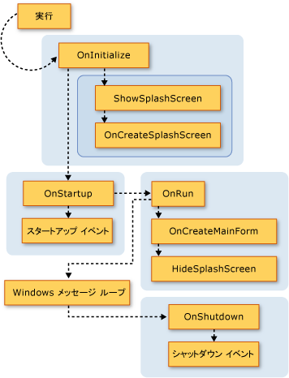

# Visual Basic アプリケーション モデルの拡張
アプリケーション モデルに機能を追加するにはオーバーライドすることで、`Overridable`のメンバー、<xref:Microsoft.VisualBasic.ApplicationServices.WindowsFormsApplicationBase>クラスです。 この手法を使用すると、アプリケーション モデルの動作をカスタマイズし、アプリケーションの起動およびシャット ダウン、独自のメソッドへの呼び出しを追加できます。  
  
## アプリケーション モデルの視覚的な概要  
 ここでは、視覚的に、Visual Basic アプリケーション モデルで関数呼び出しのシーケンスを示します。 次のセクションでは、詳細内の各関数の目的について説明します。  
  
 次の図は、通常 Visual Basic Windows フォーム アプリケーションでアプリケーション モデルの呼び出しシーケンスを示します。 シーケンスが開始、`Sub Main`プロシージャの呼び出し、<xref:Microsoft.VisualBasic.ApplicationServices.WindowsFormsApplicationBase.Run%2A>メソッドです。  
  
   
  
 Visual Basic アプリケーション モデルも提供、<xref:Microsoft.VisualBasic.ApplicationServices.WindowsFormsApplicationBase.StartupNextInstance>と<xref:Microsoft.VisualBasic.ApplicationServices.WindowsFormsApplicationBase.UnhandledException>イベント。 次の図は、これらのイベントを発生させるためのメカニズムを示します。  
  
   
  
   
  
## 基本メソッドのオーバーライド  
 <xref:Microsoft.VisualBasic.ApplicationServices.WindowsFormsApplicationBase.Run%2A>メソッドでは、順序を定義する、`Application`メソッドを実行します。 既定では、 `Sub Main` Windows フォーム アプリケーションのプロシージャを呼び出す、<xref:Microsoft.VisualBasic.ApplicationServices.WindowsFormsApplicationBase.Run%2A>メソッドです。  
  
 アプリケーションが通常のアプリケーション (複数のインスタンス アプリケーション)、または単一インスタンスのアプリケーションの最初のインスタンスの場合、<xref:Microsoft.VisualBasic.ApplicationServices.WindowsFormsApplicationBase.Run%2A>メソッドの実行、`Overridable`方法を次の順序で。  
  
1.  <xref:Microsoft.VisualBasic.ApplicationServices.WindowsFormsApplicationBase.OnInitialize%2A>。 Visual スタイル、テキストの表示スタイル、および (アプリケーションでは、Windows 認証を使用) 場合は、メイン アプリケーション スレッドの現在のプリンシパル既定では、このメソッドを設定および呼び出し`ShowSplashScreen`どちらの場合`/nosplash`も`-nosplash`コマンドラインの引数として使用されます。  
  
     この関数を返した場合、アプリケーションの起動処理が取り消された`False`です。 これは、アプリケーションを実行するはいけない状況がある場合に役立ちます。 ことができます。  
  
     <xref:Microsoft.VisualBasic.ApplicationServices.WindowsFormsApplicationBase.OnInitialize%2A>メソッドは、次のメソッドを呼び出します。  
  
    1.  <xref:Microsoft.VisualBasic.ApplicationServices.WindowsFormsApplicationBase.ShowSplashScreen%2A>。 かどうかをアプリケーション定義のスプラッシュ スクリーンと場合は、別のスレッドでスプラッシュ画面が表示されます。  
  
         <xref:Microsoft.VisualBasic.ApplicationServices.WindowsFormsApplicationBase.ShowSplashScreen%2A>メソッドには、スプラッシュを表示するコードが含まれています。 少なくともで指定された時間をミリ秒単位での画面、<xref:Microsoft.VisualBasic.ApplicationServices.WindowsFormsApplicationBase.MinimumSplashScreenDisplayTime%2A>プロパティです。 この機能を使用するアプリケーションを使用して、、スプラッシュ スクリーンを追加する必要があります、**プロジェクト デザイナー** (設定する、`My.Application.MinimumSplashScreenDisplayTime`プロパティを 2 秒)、設定や、 `My.Application.MinimumSplashScreenDisplayTime` をオーバーライドするメソッドのプロパティ<xref:Microsoft.VisualBasic.ApplicationServices.WindowsFormsApplicationBase.OnInitialize%2A>または<xref:Microsoft.VisualBasic.ApplicationServices.WindowsFormsApplicationBase.OnCreateSplashScreen%2A>メソッドです。 詳細については、「<xref:Microsoft.VisualBasic.ApplicationServices.WindowsFormsApplicationBase.MinimumSplashScreenDisplayTime%2A>」を参照してください。  
  
    2.  <xref:Microsoft.VisualBasic.ApplicationServices.WindowsFormsApplicationBase.OnCreateSplashScreen%2A>。 スプラッシュ スクリーンを初期化するコードを出力するデザイナーを使用します。  
  
         既定では、このメソッドは何も行いません。 Visual Basic でのアプリケーションのスプラッシュ スクリーンを選択するかどうかは**プロジェクト デザイナー**、デザイナーをオーバーライドし、<xref:Microsoft.VisualBasic.ApplicationServices.WindowsFormsApplicationBase.OnCreateSplashScreen%2A>メソッドを設定するメソッドを<xref:Microsoft.VisualBasic.ApplicationServices.WindowsFormsApplicationBase.SplashScreen%2A>プロパティ スプラッシュ スクリーン フォームの新しいインスタンスを.  
  
2.  <xref:Microsoft.VisualBasic.ApplicationServices.WindowsFormsApplicationBase.OnStartup%2A>。 発生させるための拡張ポイントを提供、`Startup`イベント。 この関数を返した場合、アプリケーションの起動処理が停止した`False`です。  
  
     既定では、このメソッドを発生させます、<xref:Microsoft.VisualBasic.ApplicationServices.WindowsFormsApplicationBase.Startup>イベント。 イベント ハンドラーを設定する場合、<xref:System.ComponentModel.CancelEventArgs.Cancel>にイベント引数の`True`、メソッドを返します`False`をアプリケーションの起動を取り消します。  
  
3.  <xref:Microsoft.VisualBasic.ApplicationServices.WindowsFormsApplicationBase.OnRun%2A>。 場合、メイン アプリケーション初期化の完了後も、実行を開始する準備が開始点を提供します。  
  
     既定では、Windows フォームのメッセージ ループに入るまでこのメソッドは、 `OnCreateMainForm` (フォームを作成するアプリケーションのメイン) と`HideSplashScreen`にスプラッシュ スクリーン) メソッド。  
  
    1.  <xref:Microsoft.VisualBasic.ApplicationServices.WindowsFormsApplicationBase.OnCreateMainForm%2A>。 デザイナーでメイン フォームの初期化コードを出力する方法を提供します。  
  
         既定では、このメソッドは何も行いません。 ただし、Visual Basic でのアプリケーションのメイン フォームを選択すると**プロジェクト デザイナー**、デザイナーをオーバーライドし、<xref:Microsoft.VisualBasic.ApplicationServices.WindowsFormsApplicationBase.OnCreateMainForm%2A>メソッドを設定するメソッドを<xref:Microsoft.VisualBasic.ApplicationServices.WindowsFormsApplicationBase.MainForm%2A>プロパティをメイン フォームの新しいインスタンスにします。  
  
    2.  <xref:Microsoft.VisualBasic.ApplicationServices.WindowsFormsApplicationBase.HideSplashScreen%2A>。 スプラッシュ スクリーンが定義されているいるアプリケーションが開いている場合は、このメソッドは、スプラッシュ スクリーンを閉じます。  
  
         既定では、このメソッドは、スプラッシュ スクリーンを閉じます。  
  
4.  <xref:Microsoft.VisualBasic.ApplicationServices.WindowsFormsApplicationBase.OnStartupNextInstance%2A>。 アプリケーションの別のインスタンスの起動時の単一インスタンス アプリケーションの動作をカスタマイズする方法を提供します。  
  
     既定では、このメソッドを発生させます、<xref:Microsoft.VisualBasic.ApplicationServices.WindowsFormsApplicationBase.StartupNextInstance>イベント。  
  
5.  <xref:Microsoft.VisualBasic.ApplicationServices.WindowsFormsApplicationBase.OnShutdown%2A>。 発生させるための拡張ポイントを提供、`Shutdown`イベント。 このメソッドは、メイン アプリケーションでハンドルされない例外が発生した場合に実行されません。  
  
     既定では、このメソッドを発生させます、<xref:Microsoft.VisualBasic.ApplicationServices.WindowsFormsApplicationBase.Shutdown>イベント。  
  
6.  <xref:Microsoft.VisualBasic.ApplicationServices.WindowsFormsApplicationBase.OnUnhandledException%2A>。 上記の表示されているメソッドのいずれかでハンドルされない例外が発生した場合に実行します。  
  
     既定では、このメソッドを発生させます、<xref:Microsoft.VisualBasic.ApplicationServices.WindowsFormsApplicationBase.UnhandledException>イベントをデバッガーがアタッチされていないと、アプリケーションの処理とならない限り、`UnhandledException`イベント。  
  
 アプリケーションが単一インスタンス アプリケーションでは、アプリケーションが既に実行されている場合は、アプリケーションの後続のインスタンスを呼び出す、<xref:Microsoft.VisualBasic.ApplicationServices.WindowsFormsApplicationBase.OnStartupNextInstance%2A>アプリケーション、および、終了の元のインスタンス上のメソッドです。  
 
 <xref:Microsoft.VisualBasic.ApplicationServices.WindowsFormsApplicationBase.OnStartupNextInstance(Microsoft.VisualBasic.ApplicationServices.StartupNextInstanceEventArgs)>コンス トラクターの呼び出し、<xref:Microsoft.VisualBasic.ApplicationServices.WindowsFormsApplicationBase.UseCompatibleTextRendering%2A>プロパティをアプリケーションのフォームを使用するどのテキスト レンダリング エンジンを確認します。 既定では、<xref:Microsoft.VisualBasic.ApplicationServices.WindowsFormsApplicationBase.UseCompatibleTextRendering%2A>プロパティから返される`False`、GDI テキスト レンダリング エンジンを使用することを示すは、既定で[!INCLUDE[vbprvblong](~/includes/vbprvblong-md.md)]です。 オーバーライドすることができます、<xref:Microsoft.VisualBasic.ApplicationServices.WindowsFormsApplicationBase.UseCompatibleTextRendering%2A>返されるプロパティを`True`GDI + テキスト レンダリング エンジンを使用することを示す Visual Basic .NET 2002 および Visual Basic .NET 2003 で既定値は。  
  
## アプリケーションを構成します。  
 Visual Basic アプリケーション モデルの一部として、<xref:Microsoft.VisualBasic.ApplicationServices.WindowsFormsApplicationBase.UseCompatibleTextRendering>クラスには、アプリケーションを構成する保護対象のプロパティが用意されています。 これらのプロパティは、実装するクラスのコンス トラクターで設定する必要があります。  
  
 既定の Windows フォーム プロジェクトで、**プロジェクト デザイナー**デザイナーの設定とプロパティを設定するコードを作成します。 アプリケーションの起動時にのみ、プロパティを使用します。アプリケーションの起動後に設定しても効果はありません。  
  
|プロパティ|決定|プロジェクト デザイナーのアプリケーション ウィンドウの設定|  
|---|---|---|  
|<xref:Microsoft.VisualBasic.ApplicationServices.WindowsFormsApplicationBase.IsSingleInstance%2A>|かどうか、アプリケーションは、単一インスタンスまたは複数のインスタンスのアプリケーションとして実行されます。|**単一インスタンス アプリケーションを作成する** チェック ボックス|  
|<xref:Microsoft.VisualBasic.ApplicationServices.WindowsFormsApplicationBase.EnableVisualStyles%2A>|場合は、アプリケーションは、Windows XP に一致する visual スタイルを使用します。|**XP の visual スタイルを有効にする** チェック ボックス|  
|<xref:Microsoft.VisualBasic.ApplicationServices.WindowsFormsApplicationBase.SaveMySettingsOnExit%2A>|場合は、アプリケーションの終了時に、アプリケーションは自動的にアプリケーションのユーザー設定の変更を保存します。|**シャット ダウン時に My.Settings を保存** チェック ボックス|  
|<xref:Microsoft.VisualBasic.ApplicationServices.WindowsFormsApplicationBase.ShutdownStyle%2A>|アプリケーションをスタートアップ フォームが閉じるときや、最後のフォームを閉じたときなど、終了の原因です。|**シャット ダウン モード**一覧|  
  
## 関連項目  
 <xref:Microsoft.VisualBasic.ApplicationServices.ApplicationBase>  
 <xref:Microsoft.VisualBasic.ApplicationServices.WindowsFormsApplicationBase.Startup>  
 <xref:Microsoft.VisualBasic.ApplicationServices.WindowsFormsApplicationBase.StartupNextInstance>  
 <xref:Microsoft.VisualBasic.ApplicationServices.WindowsFormsApplicationBase.UnhandledException>  
 <xref:Microsoft.VisualBasic.ApplicationServices.WindowsFormsApplicationBase.Shutdown>  
 <xref:Microsoft.VisualBasic.ApplicationServices.WindowsFormsApplicationBase.NetworkAvailabilityChanged>  
 <xref:Microsoft.VisualBasic.ApplicationServices.WindowsFormsApplicationBase.NetworkAvailabilityChanged>  
 [Visual Basic アプリケーション モデルの概要](../../../visual-basic/developing-apps/development-with-my/overview-of-the-visual-basic-application-model.md)  
 [[アプリケーション] ページ (プロジェクト デザイナー)](/visualstudio/ide/reference/application-page-project-designer-visual-basic)
