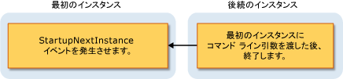

# Visual Basic アプリケーション モデルの概要
Visual Basic Windows フォーム アプリケーションの動作を制御するための適切に定義されたモデルの提供: Visual Basic アプリケーション モデルです。 このモデルには、アプリケーションのスタートアップ、シャット ダウンとハンドルされない例外のキャッチのイベントを処理するためのイベントが含まれています。 単一インスタンス アプリケーションを開発するためのサポートも提供します。 アプリケーション モデルは、拡張を詳細に制御を必要とする開発者は、オーバーライド可能なメソッドをカスタマイズできます。  
  
## アプリケーション モデルの使用方法  
 一般的なアプリケーションは、起動時およびシャット ダウン時にタスクを実行する必要があります。 たとえば、起動時には、アプリケーションことができますスプラッシュ画面を表示する、データベース接続の確立、保存された状態を読み込むおよびなどです。 アプリケーションがシャット ダウンした、データベース接続を閉じて現在の状態を保存などし、できます。 さらに、アプリケーション コードを実行できる特定アプリケーションがシャット ダウンが予期せずなど、未処理の例外時にします。  
  
 Visual Basic アプリケーション モデルでは、簡単に作成、*単一インスタンス*アプリケーションです。 単一インスタンス アプリケーションは、コンピューターを一度に実行される通常のアプリケーションから、アプリケーションの 1 つだけのインスタンスは異なります。 単一インスタンスのアプリケーションの別のインスタンスの起動を読み取ろうとして通知を送信元のインスタンスで — により、`StartupNextInstance`イベント — を別の起動しようとしました。 通知には、後続のインスタンスのコマンドライン引数が含まれています。 任意の初期化を行う前に、アプリケーションの後続のインスタンスは閉じられます。  
  
 単一インスタンス アプリケーションは開始され、最初のインスタンスまたはアプリケーションの後続のインスタンスであるかどうかをチェックします。  
  
-   最初のインスタンスの場合、通常どおり起動します。  
  
-   最初のインスタンスの実行中に、アプリケーションを開始する各後の試行は、非常に異なる動作になります。 後の試行は、コマンドラインの引数の最初のインスタンスに通知し、すぐに終了します。 最初のインスタンスのハンドル、`StartupNextInstance`後続のインスタンスのコマンドライン引数を通知し、引き続き実行を決定するイベントです。  
  
     この図では、後続のインスタンスが最初のインスタンスを通知する方法を示します。  
  
       
  
 処理することにより、`StartupNextInstance`イベント、単一インスタンス アプリケーションの動作を制御できます。 たとえば、Microsoft Outlook が通常; 単一インスタンス アプリケーションとして実行します。Outlook が実行されていると、Outlook を起動しようとしたときに再度元のインスタンスにフォーカスを移動しますが、別のインスタンスは開かれません。  
  
## アプリケーション モデル内のイベント  
 次のイベントは、アプリケーション モデル内にあります。  
  
-   **アプリケーションの起動**です。 アプリケーションが例外を<xref:Microsoft.VisualBasic.ApplicationServices.WindowsFormsApplicationBase.Startup>イベントの開始時にします。 このイベントを処理することによって、メイン フォームが読み込まれる前に、アプリケーションを初期化するコードを追加できます。 `Startup`イベントも用意されています、スタートアップ プロセスのフェーズでは、そのアプリケーションの実行のキャンセルが必要な場合です。  
  
     アプリケーションのスタートアップ コードを実行中に、スプラッシュ スクリーンを表示するアプリケーションを構成することができます。 既定では、アプリケーション モデル抑制スプラッシュ スクリーンは表示いずれか、`/nosplash`または`-nosplash`コマンドライン引数を使用します。  
  
-   **単一インスタンス アプリケーション**です。 <xref:Microsoft.VisualBasic.ApplicationServices.WindowsFormsApplicationBase.StartupNextInstance>単一インスタンス アプリケーション、後続のインスタンスの開始時にイベントが発生します。 このイベントは、後続のインスタンスのコマンドライン引数を渡します。  
  
-   **未処理の例外**です。 アプリケーションには、未処理の例外が発生すると場合、は、発生、<xref:Microsoft.VisualBasic.ApplicationServices.WindowsFormsApplicationBase.UnhandledException>イベント。 そのイベントのハンドラーは、例外を確認し、実行を継続するかどうかを判断できます。  
  
     `UnhandledException`イベントは、いくつかの状況では発生しません。 詳細については、「<xref:Microsoft.VisualBasic.ApplicationServices.WindowsFormsApplicationBase.UnhandledException>」を参照してください。  
  
-   **ネットワーク接続の変更**です。 アプリケーションを生成しているコンピューターのネットワークの可用性が変更された場合、<xref:Microsoft.VisualBasic.ApplicationServices.WindowsFormsApplicationBase.NetworkAvailabilityChanged>イベント。  
  
     `NetworkAvailabilityChanged`イベントは、いくつかの状況では発生しません。 詳細については、「<xref:Microsoft.VisualBasic.ApplicationServices.WindowsFormsApplicationBase.NetworkAvailabilityChanged>」を参照してください。  
  
-   **アプリケーションがシャット ダウン**です。 アプリケーションは、提供、<xref:Microsoft.VisualBasic.ApplicationServices.WindowsFormsApplicationBase.Shutdown>シャット ダウンしようとしているときに通知するイベントです。 イベントのハンドラーを行うことができます、運用アプリケーション必要があることを実行することを確認してを閉じると、保存、たとえば — が完了します。 メイン フォームが閉じたときをシャット ダウン、またはすべてのフォームが閉じるときにのみをシャット ダウン、アプリケーションを構成することができます。  
  
## 可用性  
 既定では、Visual Basic アプリケーション モデルは Windows フォーム プロジェクトで使用可能です。 複数のスタートアップ オブジェクトを使用するアプリケーションを構成するかをカスタム アプリケーション コードを開始したかどうか`Sub Main`、オブジェクトをまたはクラスがの実装を提供する必要があります、<xref:Microsoft.VisualBasic.ApplicationServices.WindowsFormsApplicationBase>アプリケーション モデルを使用するクラス。 スタートアップ オブジェクトの変更については、次を参照してください。[アプリケーション ページで、プロジェクト デザイナー) (Visual Basic)](/visualstudio/ide/reference/application-page-project-designer-visual-basic)です。  
  
## 関連項目  
 <xref:Microsoft.VisualBasic.ApplicationServices.WindowsFormsApplicationBase>  
 <xref:Microsoft.VisualBasic.ApplicationServices.WindowsFormsApplicationBase.Startup>  
 <xref:Microsoft.VisualBasic.ApplicationServices.WindowsFormsApplicationBase.StartupNextInstance>  
 <xref:Microsoft.VisualBasic.ApplicationServices.WindowsFormsApplicationBase.UnhandledException>  
 <xref:Microsoft.VisualBasic.ApplicationServices.WindowsFormsApplicationBase.Shutdown>  
 <xref:Microsoft.VisualBasic.ApplicationServices.WindowsFormsApplicationBase.NetworkAvailabilityChanged>  
 <xref:Microsoft.VisualBasic.ApplicationServices.WindowsFormsApplicationBase>  
 [Visual Basic アプリケーション モデルの拡張](../../../visual-basic/developing-apps/customizing-extending-my/extending-the-visual-basic-application-model.md)
