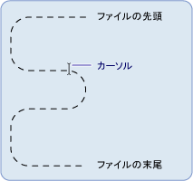

# .NET Framework のファイル I/O とファイル システムの基礎 (Visual Basic)Basics of .NET Framework File I/O and the File System (Visual Basic)
<xref:System.IO> 名前空間のクラスは、ドライブ、ファイル、ディレクトリの操作に使用されます。Classes in the <xref:System.IO> namespace are used to work with drives, files, and directories.  
  
 <xref:System.IO> 名前空間には <xref:System.IO.File> クラスと <xref:System.IO.Directory> クラスが含まれています。これらのクラスを使用すると、[!INCLUDE[dnprdnshort](~/includes/dnprdnshort-md.md)] でファイルとディレクトリを操作できます。The <xref:System.IO> namespace contains the <xref:System.IO.File> and <xref:System.IO.Directory> classes, which provide the [!INCLUDE[dnprdnshort](~/includes/dnprdnshort-md.md)] functionality that manipulates files and directories. これらのオブジェクトのメソッドは静的メンバーまたは共有メンバーなので、あらかじめクラスのインスタンスを作成しなくてもメンバーを直接使用できます。Because the methods of these objects are static or shared members, you can use them directly without creating an instance of the class first. これらのクラスに関連するクラスとして、<xref:System.IO.FileInfo> クラスと <xref:System.IO.DirectoryInfo> クラスがあります。`My` 機能を使用しているユーザーには使い慣れたクラスです。Associated with these classes are the <xref:System.IO.FileInfo> and <xref:System.IO.DirectoryInfo> classes, which will be familiar to users of the `My` feature. これらのクラスを使用するには、名前を完全修飾するか、または、関係するコードの先頭に `Imports` ステートメントを記述して、適切な名前空間をインポートする必要があります。To use these classes, you must fully qualify the names or import the appropriate namespaces by including the `Imports` statement(s) at the beginning of the affected code. 詳細については、「[Imports ステートメント (.NET 名前空間および型)](../../../../visual-basic/language-reference/statements/imports-statement-net-namespace-and-type.md)」を参照してください。For more information, see [Imports Statement (.NET Namespace and Type)](../../../../visual-basic/language-reference/statements/imports-statement-net-namespace-and-type.md).  
  
> [!NOTE]
>  このセクションのそのほかのトピックでは `My.Computer.FileSystem` のクラスではなく、 `System.IO` オブジェクトを使用して、ドライブ、ファイル、およびディレクトリを操作します。Other topics in this section use the `My.Computer.FileSystem` object instead of `System.IO` classes to work with drives, files, and directories. `My.Computer.FileSystem` オブジェクトは主に Visual Basic のプログラムで使用することを目的としています。The `My.Computer.FileSystem` object is intended primarily for use in Visual Basic programs. `System.IO` のクラスは [!INCLUDE[dnprdnshort](~/includes/dnprdnshort-md.md)] をサポートする Visual Basic などの言語で使用するためのものです。`System.IO` classes are intended for use by any language that supports the [!INCLUDE[dnprdnshort](~/includes/dnprdnshort-md.md)], including Visual Basic.  
  
## ストリームの定義Definition of a Stream  
 [!INCLUDE[dnprdnshort](~/includes/dnprdnshort-md.md)] では、ファイルに対する読み取りと書き込みをサポートするストリームを使用できます。The [!INCLUDE[dnprdnshort](~/includes/dnprdnshort-md.md)] uses streams to support reading from and writing to files. ストリームとは、1 次元の連続したデータの集まりと考えることができます。ストリームには先頭と末尾があり、カーソルでストリーム内での現在の位置を示します。You can think of a stream as a one-dimensional set of contiguous data, which has a beginning and an end, and where the cursor indicates the current position in the stream.  
  
 ![Filestream 内の現在位置を示すカーソル。] (../../../../visual-basic/developing-apps/programming/drives-directories-files/media/filestream.gif "FileStream")  
  
## ストリームの操作Stream Operations  
 ストリームに格納されているデータは、メモリ、ファイル、または TCP/IP ソケットから取得したものです。The data contained in the stream may come from memory, a file, or a TCP/IP socket. ストリームに対しては、次の基本操作を実行できます。Streams have fundamental operations that can be applied to them:  
  
-   読み取り。Reading. ストリームを読み取ったり、文字列やバイト配列などのデータ構造にストリームからデータを転送したりできます。You can read from a stream, transferring data from the stream into a data structure, such as a string or an array of bytes.  
  
-   **書き込み**。**Writing**. ストリームに書き込んだり、データ ソースからストリームにデータを転送したりできます。You can write to a stream, transferring data from a data source into the stream.  
  
-   **シーク**。**Seeking**. ストリーム内の現在の位置をクエリおよび変更できます。You can query and modify your position in the stream.  
  
 詳細については、「 [Composing Streams](../../../../standard/io/composing-streams.md)」を参照してください。For more information, see [Composing Streams](../../../../standard/io/composing-streams.md).  
  
## ストリームの種類Types of Streams  
 [!INCLUDE[dnprdnshort](~/includes/dnprdnshort-md.md)] では、ストリームは <xref:System.IO.Stream> クラスで表されます。これは、その他のすべてのストリームのための抽象クラスです。In the [!INCLUDE[dnprdnshort](~/includes/dnprdnshort-md.md)], a stream is represented by the <xref:System.IO.Stream> class, which forms the abstract class for all other streams. <xref:System.IO.Stream> クラスのインスタンスを直接作成することはできません。これを実装するいずれかのクラスを使用する必要があります。You cannot directly create an instance of the <xref:System.IO.Stream> class, but must use one of the classes it implements.  
  
 ストリームにはさまざまな種類がありますが、ファイルの入出力 (I/O) を処理するという目的のために最も重要なのは、ファイルに対する読み取りと書き込みを実現する <xref:System.IO.FileStream> クラスと、分離ストレージに対するファイルやディレクトリの作成を実現する <xref:System.IO.IsolatedStorage.IsolatedStorageFileStream> クラスです。There are many types of streams, but for the purposes of working with file input/output (I/O), the most important types are the <xref:System.IO.FileStream> class, which provides a way to read from and write to files, and the <xref:System.IO.IsolatedStorage.IsolatedStorageFileStream> class, which provides a way to create files and directories in isolated storage. この他、ファイル I/O を処理する場合、以下のようなストリームを使用できます。Other streams that can be used when working with file I/O include:  
  
-   <xref:System.IO.BufferedStream>  
  
-   <xref:System.Security.Cryptography.CryptoStream>  
  
-   <xref:System.IO.MemoryStream>  
  
-   <xref:System.Net.Sockets.NetworkStream>。<xref:System.Net.Sockets.NetworkStream>.  
  
 次の表は、ストリームで一般的に実行するタスクの一覧です。The following table lists tasks commonly accomplished with a stream:  
  
|目的To|解決方法については、See|
|---|---|   
|データ ファイルに対する読み取りと書き込みRead and write to a data file|[方法: 新しく作成されたデータ ファイルに対して読み書きするHow to: Read and Write to a Newly Created Data File](../../../../standard/io/how-to-read-and-write-to-a-newly-created-data-file.md)|  
|ファイルのテキストの読み取りRead text from a file|[方法: ファイルからテキストを読み取るHow to: Read Text from a File](../../../../standard/io/how-to-read-text-from-a-file.md)|  
|テキストのファイルへの書き込みWrite text to a file|[方法: ファイルにテキストを書き込むHow to: Write Text to a File](../../../../standard/io/how-to-write-text-to-a-file.md)|  
|文字列からの文字の読み取りRead characters from a string|[方法: 文字列から文字を読み取るHow to: Read Characters from a String](../../../../standard/io/how-to-read-characters-from-a-string.md)|  
|文字列への文字の書き込みWrite characters to a string|[方法: 文字列に文字を書き込むHow to: Write Characters to a String](../../../../standard/io/how-to-write-characters-to-a-string.md)|  
|データの暗号化Encrypt data|[データの暗号化Encrypting Data](../../../../standard/security/encrypting-data.md)|  
|データの復号化Decrypt data|[データの復号化Decrypting Data](../../../../standard/security/decrypting-data.md)|  
  
## ファイル アクセスと属性File Access and Attributes  
 ファイルの作成、オープン、および共有の方法は、<xref:System.IO.FileAccess>、<xref:System.IO.FileMode>、および <xref:System.IO.FileShare> の各列挙体で制御できます。これらの列挙体には、<xref:System.IO.FileStream> クラスのコンストラクターで使用するフラグが含まれています。You can control how files are created, opened, and shared with the <xref:System.IO.FileAccess>, <xref:System.IO.FileMode>, and <xref:System.IO.FileShare> enumerations, which contain the flags used by the constructors of the <xref:System.IO.FileStream> class. たとえば、<xref:System.IO.FileStream> を開くかまたは新規作成するときに、ファイルを追加書き込み用に開くかどうか、指定のファイルが存在しない場合にファイルを新規作成するかどうか、ファイルを上書きするかどうか、などを <xref:System.IO.FileMode> 列挙体で指定できます。For example, when you open or create a new <xref:System.IO.FileStream>, the <xref:System.IO.FileMode> enumeration allows you to specify whether the file is opened for appending, whether a new file is created if the specified file does not exist, whether the file is overwritten, and so forth.  
  
 <xref:System.IO.FileAttributes> 列挙体を使用すると、ファイル固有の情報を収集できます。The <xref:System.IO.FileAttributes> enumeration enables the gathering of file-specific information. <xref:System.IO.FileAttributes> 列挙体は、格納されているファイルの属性を返します。これらの属性によって、圧縮ファイル、暗号化されたファイル、隠しファイル、読み取り専用ファイル、アーカイブ、ディレクトリ、システム ファイル、一時ファイルであるかどうかがわかります。The <xref:System.IO.FileAttributes> enumeration returns the file's stored attributes, such as whether it is compressed, encrypted, hidden, read-only, an archive, a directory, a system file, or a temporary file.  
  
 次の表は、ファイル アクセスとファイル属性に関連するタスクの一覧です。The following table lists tasks involving file access and file attributes:  
  
|終了To|解決方法については、See|  
|---|---|
|ログ ファイルのオープンとテキストの追加Open and append text to a log file|[方法: ログ ファイルを開いて情報を追加するHow to: Open and Append to a Log File](../../../../standard/io/how-to-open-and-append-to-a-log-file.md)|  
|ファイルの属性の判断Determine the attributes of a file|<xref:System.IO.FileAttributes>|  
  
## ファイルのアクセス許可File Permissions  
 ファイルおよびディレクトリに対するアクセスの制御は、<xref:System.Security.Permissions.FileIOPermission> クラスで行うことができます。Controlling access to files and directories can be done with the <xref:System.Security.Permissions.FileIOPermission> class. これは、Web フォームの開発者には特に重要な場合があります。既定では、Web フォームは、ASPNET という名前の特別なローカル ユーザー アカウントのコンテキストで実行されます。ASPNET は、[!INCLUDE[vstecasp](~/includes/vstecasp-md.md)] および [!INCLUDE[dnprdnshort](~/includes/dnprdnshort-md.md)] のインストール時に作成されます。This may be particularly important for developers working with Web Forms, which by default run within the context of a special local user account named ASPNET, which is created as part of the [!INCLUDE[vstecasp](~/includes/vstecasp-md.md)] and [!INCLUDE[dnprdnshort](~/includes/dnprdnshort-md.md)] installations. ASPNET ユーザー アカウントはアクセス許可が制限されているため、アプリケーションがリソースへのアクセスを要求したときに、ユーザーが処理を実行できない場合があります (たとえば、Web アプリケーションからファイルへの書き込みなど)。When such an application requests access to a resource, the ASPNET user account has limited permissions, which may prevent the user from performing actions such as writing to a file from a Web application. 詳細については、「<xref:System.Security.Permissions.FileIOPermission>」を参照してください。For more information, see <xref:System.Security.Permissions.FileIOPermission>.  
  
## 分離ファイル ストレージIsolated File Storage  
 分離ストレージとは、ファイルを扱うときに、必要なアクセス許可をユーザーまたはコードが持っていないために生じる問題を解決するためのものです。Isolated storage is an attempt to solve problems created when working with files where the user or code may lack necessary permissions. 分離ストレージでは、各ユーザーにデータ コンパートメントが割り当てられます。このデータ コンパートメントには、1 つまたは複数のストアを保持できます。Isolated storage assigns each user a data compartment, which can hold one or more stores. ストア間は、ユーザーおよびアセンブリごとに分離できます。Stores can be isolated from each other by user and by assembly. ストアにアクセスできるのは、それを作成したユーザーおよびアセンブリのみです。Only the user and assembly that created a store have access to it. ストアは、完全な仮想ファイル システムとして機能します。つまり、ストア内でディレクトリやファイルを作成および操作できます。A store acts as a complete virtual file system—within one store you can create and manipulate directories and files.  
  
 次の表は、分離ファイル ストレージに一般に関連するタスクの一覧です。The following table lists tasks commonly associated with isolated file storage.  
  
|終了To|解決方法については、See|
|---|---|  
|分離ストアの作成Create an isolated store|[方法: 分離ストレージでストアを取得するHow to: Obtain Stores for Isolated Storage](../../../../standard/io/how-to-obtain-stores-for-isolated-storage.md)|  
|分離ストアの列挙Enumerate isolated stores|[方法: 分離ストレージでストアを列挙するHow to: Enumerate Stores for Isolated Storage](../../../../standard/io/how-to-enumerate-stores-for-isolated-storage.md)|  
|分離ストアの削除Delete an isolated store|[方法: 分離ストレージでストアを削除するHow to: Delete Stores in Isolated Storage](../../../../standard/io/how-to-delete-stores-in-isolated-storage.md)|  
|分離ストレージのファイルまたはディレクトリの作成Create a file or directory in isolated storage|[方法: 分離ストレージでファイルおよびディレクトリを作成するHow to: Create Files and Directories in Isolated Storage](../../../../standard/io/how-to-create-files-and-directories-in-isolated-storage.md)|  
|分離ストレージのファイルの検索Find a file in isolated storage|[方法: 分離ストレージ内でファイルおよびディレクトリを検索するHow to: Find Existing Files and Directories in Isolated Storage](../../../../standard/io/how-to-find-existing-files-and-directories-in-isolated-storage.md)|  
|分離ストレージのファイルに対する読み取りと書き込みRead from or write to a file in insolated storage|[方法: 分離ストレージ内でファイルの読み取りと書き込みを行うHow to: Read and Write to Files in Isolated Storage](../../../../standard/io/how-to-read-and-write-to-files-in-isolated-storage.md)|  
|分離ストレージのファイルまたはディレクトリの削除Delete a file or directory in isolated storage|[方法: 分離ストレージでファイルおよびディレクトリを削除するHow to: Delete Files and Directories in Isolated Storage](../../../../standard/io/how-to-delete-files-and-directories-in-isolated-storage.md)|  
  
## ファイルのイベントFile Events  
 <xref:System.IO.FileSystemWatcher> コンポーネントを使用すると、自システム上のファイルとディレクトリ、またはネットワークでアクセスできる任意のコンピューター上のファイルとディレクトリの変更を監視できます。The <xref:System.IO.FileSystemWatcher> component allows you to watch for changes in files and directories on your system or on any computer to which you have network access. たとえば、ファイルが変更されたときに、その旨をユーザーに警告することが必要な場合があります。For example, if a file is modified, you might want to send a user an alert that the change has taken place. 変更が行われると、1 つまたは複数のイベントが発生し、バッファーに格納され、<xref:System.IO.FileSystemWatcher> コンポーネントに渡されて処理されます。When changes occur, one or more events are raised, stored in a buffer, and handed to the <xref:System.IO.FileSystemWatcher> component for processing.  
  
## 参照See Also  
 [ストリームの構成Composing Streams](../../../../standard/io/composing-streams.md)  
 [ファイルおよびストリーム入出力File and Stream I/O](../../../../standard/io/index.md)  
 [非同期ファイル I/OAsynchronous File I/O](../../../../standard/io/asynchronous-file-i-o.md)  
 [.NET Framework のファイル I/O とファイル システムで使用するクラス (Visual Basic)Classes Used in .NET Framework File I/O and the File System (Visual Basic)](../../../../visual-basic/developing-apps/programming/drives-directories-files/classes-used-in-net-framework-file-io-and-the-file-system.md)
