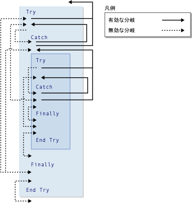

# <a name="goto-statement"></a>GoTo ステートメント
プロシージャ内の指定した行に無条件に分岐します。  
  
## <a name="syntax"></a>構文  
  
```  
GoTo line  
```  
  
## <a name="part"></a>パーツ  
 `line`  
 必須。 任意の行ラベル。  
  
## <a name="remarks"></a>コメント  
 `GoTo`ステートメントの分岐が表示されるプロシージャ内の行にのみです。 行がある行をいる必要があります`GoTo`を参照できます。 詳細については、次を参照してください。[する方法: ラベル ステートメント](../../../visual-basic/programming-guide/program-structure/how-to-label-statements.md)です。  
  
> [!NOTE]
>  `GoTo` ステートメントを使用するコードの管理を読み取ったりするが困難です。 可能な限り、制御構造を使用します。 詳細については、次を参照してください。[制御フロー](../../../visual-basic/programming-guide/language-features/control-flow/index.md)です。  
  
 使用することはできません、`GoTo`ステートメントの外部からの分岐を`For`しています.`Next`, `For Each`...`Next`, `SyncLock`...`End SyncLock`, `Try`...`Catch`...`Finally`, `With`...`End With`、または`Using`しています.`End Using`内のラベルに構築します。  
  
## <a name="branching-and-try-constructions"></a>分岐と構造を再試行してください  
 内で、`Try`しています.`Catch`...`Finally`を使用して分岐をコンストラクションは、次の規則の適用、`GoTo`ステートメントです。  
  
|ブロックまたは地域|外部からへの分岐|外部への分岐からの内部|  
|---------------------|-------------------------------|-------------------------------|  
|`Try` ブロック|のみ、`Catch`同じ構築ブロック<sup>1</sup>|のみ、全体の構造の外部|  
|`Catch` ブロック|許可されることはありません。|のみ、全体の構造の外部にまたは、`Try`同じ構築ブロック<sup>1</sup>|  
|`Finally` ブロック|許可されることはありません。|許可されることはありません。|  
  
 <sup>1</sup>場合`Try`しています.`Catch`...`Finally`コンストラクションは、別の入れ子になった、`Catch`ブロックに分岐、`Try`独自入れ子のレベルにあるではなく、他のブロック`Try`ブロックします。 入れ子になった`Try`しています.`Catch`...`Finally`構築は完全に含まれる必要があります、`Try`または`Catch`は構造の内部で入れ子にされているブロックです。  
  
 次の図に 1 つ`Try`別内で入れ子になった構築します。 有効または無効では、2 つの構築のブロック間でさまざまな分岐が示されます。  
  
   
Try 構造内の有効および無効な分岐  
  
## <a name="example"></a>例  
 次の例では、`GoTo`ステートメントをプロシージャ内の行ラベルに分岐します。  
  
 [!code-vb[VbVbalrStatements#31](../../../visual-basic/language-reference/error-messages/codesnippet/VisualBasic/goto-statement_1.vb)]  
  
## <a name="see-also"></a>関連項目  
 [Do...Loop ステートメント](../../../visual-basic/language-reference/statements/do-loop-statement.md)  
 [For...Next ステートメント](../../../visual-basic/language-reference/statements/for-next-statement.md)  
 [For Each...Next ステートメント](../../../visual-basic/language-reference/statements/for-each-next-statement.md)  
 [If...Then...Else ステートメント](../../../visual-basic/language-reference/statements/if-then-else-statement.md)  
 [Select...Case ステートメント](../../../visual-basic/language-reference/statements/select-case-statement.md)  
 [Try...Catch...Finally ステートメント](../../../visual-basic/language-reference/statements/try-catch-finally-statement.md)  
 [While...End While ステートメント](../../../visual-basic/language-reference/statements/while-end-while-statement.md)  
 [With...End With ステートメント](../../../visual-basic/language-reference/statements/with-end-with-statement.md)
