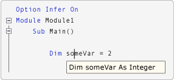

# <a name="option-infer-statement"></a><span data-ttu-id="d2189-102">Option Infer ステートメント</span><span class="sxs-lookup"><span data-stu-id="d2189-102">Option Infer Statement</span></span>
<span data-ttu-id="d2189-103">変数の宣言でローカル型推論を使用できるようにします。</span><span class="sxs-lookup"><span data-stu-id="d2189-103">Enables the use of local type inference in declaring variables.</span></span>  
  
## <a name="syntax"></a><span data-ttu-id="d2189-104">構文</span><span class="sxs-lookup"><span data-stu-id="d2189-104">Syntax</span></span>  
  
```  
Option Infer { On | Off }  
```  
  
## <a name="parts"></a><span data-ttu-id="d2189-105">指定項目</span><span class="sxs-lookup"><span data-stu-id="d2189-105">Parts</span></span>  
  
|<span data-ttu-id="d2189-106">用語</span><span class="sxs-lookup"><span data-stu-id="d2189-106">Term</span></span>|<span data-ttu-id="d2189-107">定義</span><span class="sxs-lookup"><span data-stu-id="d2189-107">Definition</span></span>|  
|---|---|  
|`On`|<span data-ttu-id="d2189-108">省略可能です。</span><span class="sxs-lookup"><span data-stu-id="d2189-108">Optional.</span></span> <span data-ttu-id="d2189-109">ローカル型推論を有効にします。</span><span class="sxs-lookup"><span data-stu-id="d2189-109">Enables local type inference.</span></span>|  
|`Off`|<span data-ttu-id="d2189-110">省略可能です。</span><span class="sxs-lookup"><span data-stu-id="d2189-110">Optional.</span></span> <span data-ttu-id="d2189-111">ローカル型推論を無効にします。</span><span class="sxs-lookup"><span data-stu-id="d2189-111">Disables local type inference.</span></span>|  
  
## <a name="remarks"></a><span data-ttu-id="d2189-112">コメント</span><span class="sxs-lookup"><span data-stu-id="d2189-112">Remarks</span></span>  
 <span data-ttu-id="d2189-113">ファイルに `Option Infer` を設定するには、ファイルの先頭に他のソース コードよりも前に `Option Infer On` または `Option Infer Off` を入力します。</span><span class="sxs-lookup"><span data-stu-id="d2189-113">To set `Option Infer` in a file, type `Option Infer On` or `Option Infer Off` at the top of the file, before any other source code.</span></span> <span data-ttu-id="d2189-114">ファイルの `Option Infer` に設定した値が IDE またはコマンド ラインに設定した値と競合した場合は、ファイルの値が優先されます。</span><span class="sxs-lookup"><span data-stu-id="d2189-114">If the value set for `Option Infer` in a file conflicts with the value set in the IDE or on the command line, the value in the file has precedence.</span></span>  
  
 <span data-ttu-id="d2189-115">`Option Infer` を `On` に設定すると、データ型を明示的に指定せずにローカル変数を宣言できます。</span><span class="sxs-lookup"><span data-stu-id="d2189-115">When you set `Option Infer` to `On`, you can declare local variables without explicitly stating a data type.</span></span> <span data-ttu-id="d2189-116">コンパイラは、初期化式の型から変数のデータ型を推測します。</span><span class="sxs-lookup"><span data-stu-id="d2189-116">The compiler infers the data type of a variable from the type of its initialization expression.</span></span>  
  
 <span data-ttu-id="d2189-117">次の図では、`Option Infer` がオンになっています。</span><span class="sxs-lookup"><span data-stu-id="d2189-117">In the following illustration, `Option Infer` is turned on.</span></span> <span data-ttu-id="d2189-118">宣言 `Dim someVar = 2` 内の変数は、型の推定によって整数として宣言されています。</span><span class="sxs-lookup"><span data-stu-id="d2189-118">The variable in the declaration `Dim someVar = 2` is declared as an integer by type inference.</span></span>  
  
 <span data-ttu-id="d2189-119">![宣言の IntelliSense ビュー。] (../../../visual-basic/language-reference/statements/media/optioninferasinteger.png "optionInferAsInteger")</span><span class="sxs-lookup"><span data-stu-id="d2189-119"></span></span>  
<span data-ttu-id="d2189-120">Option Infer がオンのときの IntelliSense</span><span class="sxs-lookup"><span data-stu-id="d2189-120">IntelliSense when Option Infer is on</span></span>  
  
 <span data-ttu-id="d2189-121">次の図では、`Option Infer` がオフになっています。</span><span class="sxs-lookup"><span data-stu-id="d2189-121">In the following illustration, `Option Infer` is turned off.</span></span> <span data-ttu-id="d2189-122">宣言 `Dim someVar = 2` 内の変数は、型の推定によって `Object` として宣言されています。</span><span class="sxs-lookup"><span data-stu-id="d2189-122">The variable in the declaration `Dim someVar = 2` is declared as an `Object` by type inference.</span></span> <span data-ttu-id="d2189-123">この例では、 **Option Strict**に設定した**オフ**上、[コンパイル ページで、プロジェクト デザイナー) (Visual Basic)](/visualstudio/ide/reference/compile-page-project-designer-visual-basic)です。</span><span class="sxs-lookup"><span data-stu-id="d2189-123">In this example, the **Option Strict** setting is set to **Off** on the [Compile Page, Project Designer (Visual Basic)](/visualstudio/ide/reference/compile-page-project-designer-visual-basic).</span></span>  
  
 <span data-ttu-id="d2189-124">![宣言の IntelliSense ビュー。] (../../../visual-basic/language-reference/statements/media/optioninferasobject.png "optionInferAsObject")</span><span class="sxs-lookup"><span data-stu-id="d2189-124"></span></span>  
<span data-ttu-id="d2189-125">Option Infer がオフのときの IntelliSense</span><span class="sxs-lookup"><span data-stu-id="d2189-125">IntelliSense when Option Infer is off</span></span>  
  
> [!NOTE]
>  <span data-ttu-id="d2189-126">変数を `Object` として宣言すると、プログラムの実行中にランタイム型が変更される場合があります。</span><span class="sxs-lookup"><span data-stu-id="d2189-126">When a variable is declared as an `Object`, the run-time type can change while the program is running.</span></span> <span data-ttu-id="d2189-127">Visual Basic という操作を実行する*ボックス化*と*ボックス化解除*間で変換する、`Object`と値の種類、これにより実行速度が低下します。</span><span class="sxs-lookup"><span data-stu-id="d2189-127">Visual Basic performs operations called *boxing* and *unboxing* to convert between an `Object` and a value type, which makes execution slower.</span></span> <span data-ttu-id="d2189-128">ボックス化とボックス化解除については、次を参照してください。、 [Visual Basic 言語仕様](../../../visual-basic/reference/language-specification/index.md)です。</span><span class="sxs-lookup"><span data-stu-id="d2189-128">For information about boxing and unboxing, see the [Visual Basic Language Specification](../../../visual-basic/reference/language-specification/index.md).</span></span>
  
 <span data-ttu-id="d2189-129">型の推定は、プロシージャ レベルで適用され、クラス、構造体、モジュール、またはインターフェイスのプロシージャの外側には適用されません。</span><span class="sxs-lookup"><span data-stu-id="d2189-129">Type inference applies at the procedure level, and does not apply outside a procedure in a class, structure, module, or interface.</span></span>  
  
 <span data-ttu-id="d2189-130">詳細については、次を参照してください。[ローカル型推論](../../../visual-basic/programming-guide/language-features/variables/local-type-inference.md)です。</span><span class="sxs-lookup"><span data-stu-id="d2189-130">For additional information, see [Local Type Inference](../../../visual-basic/programming-guide/language-features/variables/local-type-inference.md).</span></span>  
  
## <a name="when-an-option-infer-statement-is-not-present"></a><span data-ttu-id="d2189-131">Option Infer ステートメントが指定されていない場合</span><span class="sxs-lookup"><span data-stu-id="d2189-131">When an Option Infer Statement Is Not Present</span></span>  
 <span data-ttu-id="d2189-132">ソース コードが含まれていない場合、`Option Infer`ステートメントでは、 **Option Infer**の設定、[コンパイル ページで、プロジェクト デザイナー) (Visual Basic)](/visualstudio/ide/reference/compile-page-project-designer-visual-basic)を使用します。</span><span class="sxs-lookup"><span data-stu-id="d2189-132">If the source code does not contain an `Option Infer` statement, the **Option Infer** setting on the [Compile Page, Project Designer (Visual Basic)](/visualstudio/ide/reference/compile-page-project-designer-visual-basic) is used.</span></span> <span data-ttu-id="d2189-133">コマンド ライン コンパイラを使用する場合、 [/optioninfer](../../../visual-basic/reference/command-line-compiler/optioninfer.md)コンパイラ オプションを使用します。</span><span class="sxs-lookup"><span data-stu-id="d2189-133">If the command-line compiler is used, the [/optioninfer](../../../visual-basic/reference/command-line-compiler/optioninfer.md) compiler option is used.</span></span>  
  
#### <a name="to-set-option-infer-in-the-ide"></a><span data-ttu-id="d2189-134">IDE の Option Infer を設定するには</span><span class="sxs-lookup"><span data-stu-id="d2189-134">To set Option Infer in the IDE</span></span>  
  
1.  <span data-ttu-id="d2189-135">**ソリューション エクスプローラー**でプロジェクトを選択します。</span><span class="sxs-lookup"><span data-stu-id="d2189-135">In **Solution Explorer**, select a project.</span></span> <span data-ttu-id="d2189-136">**[プロジェクト]** メニューの **[プロパティ]** をクリックします。</span><span class="sxs-lookup"><span data-stu-id="d2189-136">On the **Project** menu, click **Properties**.</span></span>  
  
2.  <span data-ttu-id="d2189-137">**[コンパイル]** タブをクリックします。</span><span class="sxs-lookup"><span data-stu-id="d2189-137">Click the **Compile** tab.</span></span>  
  
3.  <span data-ttu-id="d2189-138">値を設定、 **Option infer**ボックス。</span><span class="sxs-lookup"><span data-stu-id="d2189-138">Set the value in the **Option infer** box.</span></span>  
  
 <span data-ttu-id="d2189-139">新しいプロジェクトを作成するときに、 **Option Infer**の設定、**コンパイル** タブに設定されている、 **Option Infer**で設定、**既定値は VB**ダイアログ ボックス。</span><span class="sxs-lookup"><span data-stu-id="d2189-139">When you create a new project, the **Option Infer** setting on the **Compile** tab is set to the **Option Infer** setting in the **VB Defaults** dialog box.</span></span> <span data-ttu-id="d2189-140">アクセスする、**既定値は VB**  ダイアログ ボックスで、**ツール** メニューのをクリックして**オプション**です。</span><span class="sxs-lookup"><span data-stu-id="d2189-140">To access the **VB Defaults** dialog box, on the **Tools** menu, click **Options**.</span></span> <span data-ttu-id="d2189-141">**[オプション]** ダイアログ ボックスの **[プロジェクトおよびソリューション]** を展開し、**[VISUAL BASIC の既定値]** をクリックします。</span><span class="sxs-lookup"><span data-stu-id="d2189-141">In the **Options** dialog box, expand **Projects and Solutions**, and then click **VB Defaults**.</span></span> <span data-ttu-id="d2189-142">初期の既定の設定**VB 既定**は`On`します。</span><span class="sxs-lookup"><span data-stu-id="d2189-142">The initial default setting in **VB Defaults** is `On`.</span></span>  
  
#### <a name="to-set-option-infer-on-the-command-line"></a><span data-ttu-id="d2189-143">コマンド ラインで Option Infer を設定するには</span><span class="sxs-lookup"><span data-stu-id="d2189-143">To set Option Infer on the command line</span></span>  
  
-   <span data-ttu-id="d2189-144">含める、 [/optioninfer](../../../visual-basic/reference/command-line-compiler/optioninfer.md)コンパイラ オプション、 **vbc**コマンド。</span><span class="sxs-lookup"><span data-stu-id="d2189-144">Include the [/optioninfer](../../../visual-basic/reference/command-line-compiler/optioninfer.md) compiler option in the **vbc** command.</span></span>  
  
## <a name="default-data-types-and-values"></a><span data-ttu-id="d2189-145">既定のデータ型と値</span><span class="sxs-lookup"><span data-stu-id="d2189-145">Default Data Types and Values</span></span>  
 <span data-ttu-id="d2189-146">次の表では、`Dim` ステートメントのデータ型と初期化子を指定するさまざまな組み合わせの結果を示します。</span><span class="sxs-lookup"><span data-stu-id="d2189-146">The following table describes the results of various combinations of specifying the data type and initializer in a `Dim` statement.</span></span>  
  
|<span data-ttu-id="d2189-147">データ型が指定されているか</span><span class="sxs-lookup"><span data-stu-id="d2189-147">Data type specified?</span></span>|<span data-ttu-id="d2189-148">初期化子が指定されているか</span><span class="sxs-lookup"><span data-stu-id="d2189-148">Initializer specified?</span></span>|<span data-ttu-id="d2189-149">例</span><span class="sxs-lookup"><span data-stu-id="d2189-149">Example</span></span>|<span data-ttu-id="d2189-150">結果</span><span class="sxs-lookup"><span data-stu-id="d2189-150">Result</span></span>|  
|---|---|---|---|  
|<span data-ttu-id="d2189-151">Ｘ</span><span class="sxs-lookup"><span data-stu-id="d2189-151">No</span></span>|<span data-ttu-id="d2189-152">Ｘ</span><span class="sxs-lookup"><span data-stu-id="d2189-152">No</span></span>|`Dim qty`|<span data-ttu-id="d2189-153">`Option Strict` がオフ (既定値) の場合、変数は `Nothing` に設定されます。</span><span class="sxs-lookup"><span data-stu-id="d2189-153">If `Option Strict` is off (the default), the variable is set to `Nothing`.</span></span><br /><br /> <span data-ttu-id="d2189-154">`Option Strict` がオンの場合、コンパイル時エラーが発生します。</span><span class="sxs-lookup"><span data-stu-id="d2189-154">If `Option Strict` is on, a compile-time error occurs.</span></span>|  
|<span data-ttu-id="d2189-155">Ｘ</span><span class="sxs-lookup"><span data-stu-id="d2189-155">No</span></span>|<span data-ttu-id="d2189-156">○</span><span class="sxs-lookup"><span data-stu-id="d2189-156">Yes</span></span>|`Dim qty = 5`|<span data-ttu-id="d2189-157">`Option Infer` がオン (既定値) の場合、変数は初期化子のデータ型になります。</span><span class="sxs-lookup"><span data-stu-id="d2189-157">If `Option Infer` is on (the default), the variable takes the data type of the initializer.</span></span> <span data-ttu-id="d2189-158">参照してください[ローカル型推論](../../../visual-basic/programming-guide/language-features/variables/local-type-inference.md)です。</span><span class="sxs-lookup"><span data-stu-id="d2189-158">See [Local Type Inference](../../../visual-basic/programming-guide/language-features/variables/local-type-inference.md).</span></span><br /><br /> <span data-ttu-id="d2189-159">`Option Infer` がオフで、`Option Strict` がオフの場合、変数は `Object` のデータ型になります。</span><span class="sxs-lookup"><span data-stu-id="d2189-159">If `Option Infer` is off and `Option Strict` is off, the variable takes the data type of `Object`.</span></span><br /><br /> <span data-ttu-id="d2189-160">`Option Infer` がオフで、`Option Strict` がオンの場合、コンパイル時エラーが発生します。</span><span class="sxs-lookup"><span data-stu-id="d2189-160">If `Option Infer` is off and `Option Strict` is on, a compile-time error occurs.</span></span>|  
|<span data-ttu-id="d2189-161">○</span><span class="sxs-lookup"><span data-stu-id="d2189-161">Yes</span></span>|<span data-ttu-id="d2189-162">Ｘ</span><span class="sxs-lookup"><span data-stu-id="d2189-162">No</span></span>|`Dim qty As Integer`|<span data-ttu-id="d2189-163">変数は、データ型の既定値に初期化されます。</span><span class="sxs-lookup"><span data-stu-id="d2189-163">The variable is initialized to the default value for the data type.</span></span> <span data-ttu-id="d2189-164">詳細については、次を参照してください。 [Dim ステートメント](../../../visual-basic/language-reference/statements/dim-statement.md)です。</span><span class="sxs-lookup"><span data-stu-id="d2189-164">For more information, see [Dim Statement](../../../visual-basic/language-reference/statements/dim-statement.md).</span></span>|  
|<span data-ttu-id="d2189-165">[はい]</span><span class="sxs-lookup"><span data-stu-id="d2189-165">Yes</span></span>|<span data-ttu-id="d2189-166">○</span><span class="sxs-lookup"><span data-stu-id="d2189-166">Yes</span></span>|`Dim qty  As Integer = 5`|<span data-ttu-id="d2189-167">初期化子のデータ型を指定したデータ型に変換できない場合は、コンパイル時エラーが発生します。</span><span class="sxs-lookup"><span data-stu-id="d2189-167">If the data type of the initializer is not convertible to the specified data type, a compile-time error occurs.</span></span>|  
  
## <a name="example"></a><span data-ttu-id="d2189-168">例</span><span class="sxs-lookup"><span data-stu-id="d2189-168">Example</span></span>  
 <span data-ttu-id="d2189-169">次の例では、`Option Infer` ステートメントがローカル型推論をどのように有効にするかを示します。</span><span class="sxs-lookup"><span data-stu-id="d2189-169">The following examples demonstrate how the `Option Infer` statement enables local type inference.</span></span>  
  
 [!code-vb[VbVbalrTypeInference#6](../../../visual-basic/language-reference/statements/codesnippet/VisualBasic/option-infer-statement_1.vb)]  
  
## <a name="example"></a><span data-ttu-id="d2189-170">例</span><span class="sxs-lookup"><span data-stu-id="d2189-170">Example</span></span>  
 <span data-ttu-id="d2189-171">次の例では、変数が `Object` として識別されたときに、ランタイム型が異なる場合があることを示します。</span><span class="sxs-lookup"><span data-stu-id="d2189-171">The following example demonstrates that the run-time type can differ when a variable is identified as an `Object`.</span></span>  
  
 [!code-vb[VbVbalrTypeInference#11](../../../visual-basic/language-reference/statements/codesnippet/VisualBasic/option-infer-statement_2.vb)]  
  
## <a name="see-also"></a><span data-ttu-id="d2189-172">関連項目</span><span class="sxs-lookup"><span data-stu-id="d2189-172">See Also</span></span>  
 [<span data-ttu-id="d2189-173">Dim ステートメント</span><span class="sxs-lookup"><span data-stu-id="d2189-173">Dim Statement</span></span>](../../../visual-basic/language-reference/statements/dim-statement.md)  
 [<span data-ttu-id="d2189-174">ローカル型の推論</span><span class="sxs-lookup"><span data-stu-id="d2189-174">Local Type Inference</span></span>](../../../visual-basic/programming-guide/language-features/variables/local-type-inference.md)  
 [<span data-ttu-id="d2189-175">Option Compare ステートメント</span><span class="sxs-lookup"><span data-stu-id="d2189-175">Option Compare Statement</span></span>](../../../visual-basic/language-reference/statements/option-compare-statement.md)  
 [<span data-ttu-id="d2189-176">Option Explicit ステートメント</span><span class="sxs-lookup"><span data-stu-id="d2189-176">Option Explicit Statement</span></span>](../../../visual-basic/language-reference/statements/option-explicit-statement.md)  
 [<span data-ttu-id="d2189-177">Option Strict ステートメント</span><span class="sxs-lookup"><span data-stu-id="d2189-177">Option Strict Statement</span></span>](../../../visual-basic/language-reference/statements/option-strict-statement.md)  
 <span data-ttu-id="d2189-178">[[Visual Basic の既定値] ([オプション] ダイアログ ボックス - [プロジェクト])](/visualstudio/ide/reference/visual-basic-defaults-projects-options-dialog-box)</span><span class="sxs-lookup"><span data-stu-id="d2189-178">[Visual Basic Defaults, Projects, Options Dialog Box](/visualstudio/ide/reference/visual-basic-defaults-projects-options-dialog-box)</span></span>  
 [<span data-ttu-id="d2189-179">/optioninfer</span><span class="sxs-lookup"><span data-stu-id="d2189-179">/optioninfer</span></span>](../../../visual-basic/reference/command-line-compiler/optioninfer.md)  
 [<span data-ttu-id="d2189-180">ボックス化とボックス化解除</span><span class="sxs-lookup"><span data-stu-id="d2189-180">Boxing and Unboxing</span></span>](../../../csharp/programming-guide/types/boxing-and-unboxing.md)
