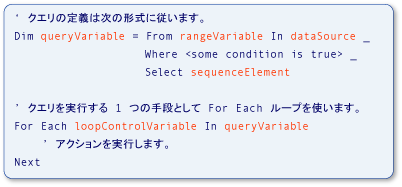

# クエリ操作での型の関係 (Visual Basic)
使用される変数[!INCLUDE[vbteclinqext](../../../../csharp/getting-started/includes/vbteclinqext_md.md)]クエリ操作は、厳密に型指定し、相互に互換性がある必要があります。 厳密な型指定は、データ ソース、クエリ自体、およびクエリの実行に使用されます。 次の図は、説明に使用される用語の識別、[!INCLUDE[vbteclinq](../../../../csharp/includes/vbteclinq_md.md)]クエリ。 クエリの部分の詳細については、次を参照してください。[基本的なクエリ操作 (Visual Basic)](../../../../visual-basic/programming-guide/concepts/linq/basic-query-operations.md)します。  
  
   
LINQ クエリの部分  
  
 クエリの範囲変数の型のデータ ソース内の要素の型と互換性があります。 クエリ変数の型と互換性があるシーケンスの要素で定義されている、`Select`句。 最後に、シーケンスの要素の型もする必要がありますで使用されているループ制御変数の型と互換性のある、`For Each`クエリを実行するステートメントです。 この厳密な型指定すると、コンパイル時に型のエラーの識別が容易になります。  
  
 [!INCLUDE[vbprvb](../../../../csharp/programming-guide/concepts/linq/includes/vbprvb_md.md)]により、厳密な型指定便利とも呼ばれるローカル型推論を実装することによって*暗黙の型指定*します。 機能は、前の例で使用して、全体で使用されることが表示されます、[!INCLUDE[vbteclinq](../../../../csharp/includes/vbteclinq_md.md)]サンプルとドキュメントです。 Visual basic でローカル型推論を使用するだけで完了、`Dim`せずステートメント、`As`句。 次の例で`city`を文字列として厳密に型指定します。  
  
 [!code-vb[VbLINQTypeRels&#1;](../../../../visual-basic/programming-guide/concepts/linq/codesnippet/VisualBasic/type-relationships-in-query-operations_1.vb)]  
  
> [!NOTE]
>  ローカル型推論場合にのみの機能`Option Infer`に設定されている`On`します。 詳細については、次を参照してください。 [Option Infer ステートメント](../../../../visual-basic/language-reference/statements/option-infer-statement.md)します。  
  
 ただし、クエリでローカル型推論を使用する場合でも、同じ型の関係がデータ ソース内の変数、クエリ変数、およびクエリの実行ループの間存在します。 作成しているときにこれらの型の関係の基本を理解するおくと便利です[!INCLUDE[vbteclinq](../../../../csharp/includes/vbteclinq_md.md)]クエリ、またはサンプルとドキュメントのコード例を使用します。  
  
 たとえば、データ ソースから返される型に一致しない範囲変数の明示的な型を指定する必要があります。 範囲変数の型を指定するにを使用して、`As`句。 その結果、エラーに変換すると、[縮小変換](../../../../visual-basic/programming-guide/language-features/data-types/widening-and-narrowing-conversions.md)と`Option Strict`に設定されている`On`します。 そのため、データ ソースから取得した値を変換を実行することをお勧めします。 使用して明示的な範囲変数の型へのデータ ソースからの値を変換することができます、<xref:System.Linq.Enumerable.Cast%2A>メソッド</xref:System.Linq.Enumerable.Cast%2A>。 選択した値をキャストすることも、`Select`句の範囲変数の型に違いは、明示的な型にします。 これらのポイントは、次のコードに示します。  
  
 [!code-vb[VbLINQTypeRels&4;](../../../../visual-basic/programming-guide/concepts/linq/codesnippet/VisualBasic/type-relationships-in-query-operations_2.vb)]  
  
## ソース データの全体の要素を返すクエリ  
 例を次に、[!INCLUDE[vbteclinq](../../../../csharp/includes/vbteclinq_md.md)]をソース データから選択した要素のシーケンスを返す操作のクエリを実行します。 ソース`names`文字列の配列が含まれていて、クエリの出力は次の文字 M で始まる文字列を含むシーケンスです。  
  
 [!code-vb[VbLINQTypeRels&#2;](../../../../visual-basic/programming-guide/concepts/linq/codesnippet/VisualBasic/type-relationships-in-query-operations_3.vb)]  
  
 これは、次のコードに相当がより短く、簡単に記述します。 クエリでローカル型推論に依存するいるとは、Visual Basic では優先スタイルです。  
  
 [!code-vb[VbLINQTypeRels&#3;](../../../../visual-basic/programming-guide/concepts/linq/codesnippet/VisualBasic/type-relationships-in-query-operations_4.vb)]  
  
 次のリレーションシップは、明示的または暗黙的に型が表示されるかどうか、前のコード例の両方に存在します。  
  
1.  データ ソース内の要素の種類`names`、範囲変数の型は、`name`クエリにします。  
  
2.  選択されているオブジェクトの種類`name`、クエリ変数の種類を決定`mNames`します。 ここで`name`は文字列であるため、クエリ変数は Visual Basic での IEnumerable (Of String)。  
  
3.  定義されたクエリ`mNames`で実行される、`For Each`ループします。 ループは、クエリの実行の結果を反復処理します。 `mNames`が実行されるときに、ループの反復変数の文字列のシーケンスを返す`nm`も文字列です。  
  
## 選択した要素から&1; つのフィールドを取得するクエリ  
 例を次に、[!INCLUDE[vbtecdlinq](../../../../csharp/includes/vbtecdlinq_md.md)]クエリ データ ソースから選択された各要素の&1; つだけのパーツを含むシーケンスを返す操作。 クエリのコレクションを受け取って`Customer`、データ ソースとしてオブジェクトし、プロジェクトのみ、`Name`プロパティを結果にします。 顧客名は文字列であるため、クエリは、出力として文字列のシーケンスを生成します。  
  
<CodeContentPlaceHolder>0</CodeContentPlaceHolder>  
 変数間のリレーションシップは、単純な例のようです。  
  
1.  データ ソース内の要素の種類`customers`、範囲変数の型は、`cust`クエリにします。 型であるこの例では`Customer`です。  
  
2.  `Select`ステートメントから返される、`Name`の各プロパティ`Customer`オブジェクト全体ではなくオブジェクトです。 `Name`文字列であり、クエリ変数`custNames`、もう一度されません IEnumerable (Of String) の`Customer`です。  
  
3.  `custNames` 、文字列のシーケンスを表し、`For Each`ループの反復変数`custName`文字列である必要があります。  
  
 ローカル型推論では、前の例がなければを記述し、詳細については、次の例のようには煩雑です。  
  
<CodeContentPlaceHolder>1</CodeContentPlaceHolder>  
## 匿名型を必要とするクエリ  
 次の例より複雑な状況を示しています。 前の例では、すべての変数の型を明示的に指定するときに便利でした。 この例ではことはできません。 全体を選択する代わりに`Customer`データ ソースまたは各要素から&1; つのフィールドから要素、`Select`このクエリで句は、元の&2; つのプロパティを返します`Customer`オブジェクト:`Name`と`City`です。 応答で、`Select`句、コンパイラはこれら&2; つのプロパティを含む匿名型を定義します。 実行した結果`nameCityQuery`で、`For Each`ループは新しい匿名型のインスタンスのコレクション。 匿名型に使用可能な名前があるないためにの種類を指定することはできません`nameCityQuery`または`custInfo`明示的にします。 匿名の型のない型の名前があるの代わりに使用する`String`で`IEnumerable(Of String)`します。 詳細については、次を参照してください。[匿名型](../../../../visual-basic/programming-guide/language-features/objects-and-classes/anonymous-types.md)します。  
  
<CodeContentPlaceHolder>2</CodeContentPlaceHolder>  
 前の例で、すべての変数の型を指定することはありませんが、リレーションシップが同じになります。  
  
1.  データ ソース内の要素の型は、クエリの範囲変数の型ではもう一度です。 この例では`cust`のインスタンスは、`Customer`です。  
  
2.  `Select`ステートメントは、匿名型をクエリ変数を生成する`nameCityQuery`、匿名型として暗黙的に型指定する必要があります。 匿名型は、使用可能な名前を持たず、したがって、明示的に指定することはできません。  
  
3.  反復変数の種類、`For Each`ループは、手順 2. で作成された匿名型。 型に使用可能な名前があるないために、ループの反復変数の型は暗黙的に決定する必要があります。  
  
## 関連項目  
 [Visual Basic における LINQ の概要](../../../../visual-basic/programming-guide/concepts/linq/getting-started-with-linq.md)   
 [匿名型](../../../../visual-basic/programming-guide/language-features/objects-and-classes/anonymous-types.md)   
 [ローカル型推論](../../../../visual-basic/programming-guide/language-features/variables/local-type-inference.md)   
 [Visual Basic における LINQ の概要](../../../../visual-basic/programming-guide/language-features/linq/introduction-to-linq.md)   
 [LINQ](../../../../visual-basic/programming-guide/language-features/linq/index.md)   
 [クエリ](../../../../visual-basic/language-reference/queries/queries.md)
