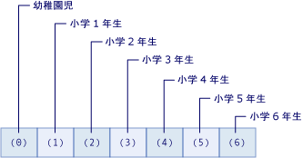

# <a name="arrays-in-visual-basic"></a>Visual Basic における配列
配列と呼ばれるものの値のセットとは、*要素*、互いに論理的に関連します。 たとえば、配列で構成されます; 学校の各学年の生徒の数配列の各要素は、1 つ学年の生徒の数です。 同様に、配列が、クラスの学生の成績のあります。配列の各要素は、1 つのレベルです。    

各データ項目を格納するそれぞれの変数は可能です。 たとえば、アプリケーションは、学生の成績を分析し場合、お個別の変数付け、学生の成績のなど、使用できる`englishGrade1`、 `englishGrade2`, などです。この方法では、次の 3 つの主要な制限があります。
- 成績の数だけを処理する必要はデザイン時に把握お必要があります。
- 多数の成績をすばやく処理は、扱いにくくなります。 これは、結果、アプリケーションが深刻なバグが存在する可能性が高くなります。
- 維持するために困難です。 新しい各学年を追加するには、こと、アプリケーションを変更が再コンパイルして再展開が必要です。  
 
 配列を使用すると、これらの関連する値を同じ名前で参照およびと呼ばれる番号を使用して、*インデックス*または*添字*を配列内の位置に基づいて、個々 の要素を識別します。 配列内の要素の合計数より 1 小さい値に 0 の配列範囲のインデックス。 配列のサイズを定義する Visual Basic 構文を使用する場合は、最高のインデックス、配列内の要素の合計数されませんを指定します。 単位として配列を使用することができ、その要素を反復処理する機能を正確にデザイン時に含まれている数の要素を把握しておかなくてから解放します。
  
 説明する前に、簡単な例をいくつか紹介します。  
  
```vb  
' Declare a single-dimension array of 5 numbers.  
Dim numbers(4) As Integer   
  
'Declare a single-dimension array and set its 4 values.  
Dim numbers = New Integer() {1, 2, 4, 8}  
  
' Change the size of an existing array to 16 elements and retain the current values.
ReDim Preserve numbers(15)
  
' Redefine the size of an existing array and reset the values.
ReDim numbers(15)  
  
' Declare a 6 x 6 multidimensional array.
Dim matrix(5, 5) As Double  
  
' Declare a 4 x 3 multidimensional array and set array element values.  
Dim matrix = New Integer(3, 2) {{1, 2, 3}, {2, 3, 4}, {3, 4, 5}, {4, 5, 6}}  
  
' Declare a jagged array  
Dim sales()() As Double = New Double(11)() {}  
```  
  
 ## <a name="in-this-article"></a>この記事の内容
  
- [単純な配列の配列要素](#array-elements-in-a-simple-array)  
  
- [配列の作成](#creating-an-array)  
  
- [配列内の値を格納します。](#storing-values-in-an-array)  
  
- [配列リテラルを含む配列を設定します。](#populating-an-array-with-array-literals)  
  
- [配列を反復処理します。](#iterating-through-an-array)  
  
- [配列のサイズ](#BKMK_ArraySize)  

- [配列の型](#the-array-type)  
  
- [戻り値およびパラメーターとしての配列](#arrays-as-return-values-and-parameters)  
- [ジャグ配列](#jagged-arrays)  
  
- [長さ 0 の配列](#zero-length-arrays)  

- [配列の分割](#splitting-an-array)
  
- [配列の代わりとしてのコレクション](#collections-as-an-alternative-to-arrays)  
  
##  <a name="array-elements-in-a-simple-array"></a>単純な配列の配列要素  

という名前の配列を作成しましょう`students`学校の各学年の生徒の数を格納します。 要素のインデックスの範囲は 0 から 6 までです。 この配列を使用することは、7 つの変数を宣言するよりも簡単です。

次の図は、`students`配列。 配列の各要素は、次のとおりです。  
  
-   要素のインデックスは、学年を表します (インデックス 0 は幼稚園を表します)。
  
-   要素に含まれている値は、その学年の生徒の数を表します。
  
   
"生徒" 配列の要素  
 
次の例には、作成し、配列を使用している Visual Basic コードが含まれています。

 [!code-vb[simple-array](../../../../../samples/snippets/visualbasic/programming-guide/language-features/arrays/simple-array.vb)]  

この例では、次の 3 つをは。

- 宣言して、 `students` 7 つの要素を持つ配列です。 数`6`配列では、宣言は、配列内の最後のインデックスをことを示します。 これは 1 つの配列内の要素数よりも小さいです。
- 配列内の各要素に値を割り当てます。 配列要素にはかっこで囲まれた個々 の要素のインデックスを含むを配列の名前を使用してアクセスします。
- これには、配列の各値が表示されます。 この例では、 [ `For` ](../../../language-reference/statements/for-next-statement.md)インデックス番号で、配列の各要素にアクセスするステートメント。
  
 `students` 1 つのインデックスを使用しているために、前の例での配列は 1 次元配列。 1 つ以上のインデックスまたは添字を使用する配列と呼びます*多次元*です。 詳細については、この記事の残りを表示および[Visual Basic における配列の次元](../../../../visual-basic/programming-guide/language-features/arrays/array-dimensions.md)です。  
  
##  <a name="creating-an-array"></a>配列の作成  
 
いくつかの方法では、配列のサイズを定義できます。 

- 配列が宣言されている場合は、サイズを指定できます。
  
    [!code-vb[creating1](../../../../../samples/snippets/visualbasic/programming-guide/language-features/arrays/create-array.vb#1)]  
  
 - 使用することができます、`New`句を作成するときに、配列のサイズを指定します。  
  
    [!code-vb[creating2](../../../../../samples/snippets/visualbasic/programming-guide/language-features/arrays/create-array.vb#2)]  
  
 使用してサイズを再定義できる既存の配列があれば、 [ `Redim` ](../../../../visual-basic/language-reference/statements/redim-statement.md)ステートメントです。 指定することができます、`Redim`ステートメントは、配列内に値を保持または空の配列を作成するを指定することができます。 次に、 `Redim` ステートメントを使用して既存の配列のサイズを変更する例をいくつか示します。  
  
 [!code-vb[redimensioning](../../../../../samples/snippets/visualbasic/programming-guide/language-features/arrays/create-array.vb#3)]  
  
 詳細については、次を参照してください。、 [ReDim ステートメント](../../../../visual-basic/language-reference/statements/redim-statement.md)です。  
  
##  <a name="storing-values-in-an-array"></a>配列への値の格納
 
 配列のそれぞれの位置には、`Integer` 型のインデックスを使用してアクセスできます。 かっこで囲まれたインデックスを使用して配列のそれぞれの位置を参照することで、配列の値を格納および取得することができます。 多次元配列のインデックスは、コンマ (,) で区切られます。 配列の次元ごとに 1 つのインデックスが必要です。 

次の例では、格納および配列の値を取得するステートメントを示します。
  
 [!code-vb[store-and-retrieve](../../../../../samples/snippets/visualbasic/programming-guide/language-features/arrays/store-and-retrieve.vb)]  
  
## <a name="populating-an-array-with-array-literals"></a>配列リテラルを含む配列を設定します。
 配列リテラルを使用すると、同時に作成すること、初期値のセットを含む配列を設定できます。 配列リテラルは、中かっこ (`{}`) で囲んだ値のコンマ区切りの一覧で構成されます。  
  
 配列リテラルを使用して配列を作成する場合、配列の型を指定するか、型の推定を使用して配列の型を決定することができます。 次の例では、両方のオプションを示します。  
  
 [!code-vb[create-with-literals](../../../../../samples/snippets/visualbasic/programming-guide/language-features/arrays/create-array.vb#4)]  
  
 型推論を使用する場合、配列の型はによって決まります、*基準となる型*リテラル値の一覧にします。 主要な型を配列内の他のすべての型から拡大変換できる型です。 この一意の型を特定できない場合、最も優先度の高い型は、配列内の他のすべての型から縮小変換できる一意の型になります。 これらの一意の型をどちらも特定できない場合は、 `Object`が最も優先度の高い型になります。 たとえば、配列リテラルに指定された値の一覧に `Integer`型、 `Long`型、および `Double`型の値が含まれている場合、結果の配列の型は `Double`です。 `Integer`と`Long`にのみ拡大変換`Double`、`Double`は、主要な型です。 詳細については、「 [Widening and Narrowing Conversions](../../../../visual-basic/programming-guide/language-features/data-types/widening-and-narrowing-conversions.md)」を参照してください。 
 
> [!NOTE] 
> 型のメンバーのローカル変数として定義されている配列に対してのみ型の推定を使用することができます。 クラス レベルの配列リテラルで定義されている配列は型の場合は、明示的な型定義がない場合、`Object[]`です。 詳細については、次を参照してください。[ローカル型推論](../variables/local-type-inference.md)です。 

前の例を定義する注`values`型の配列として`Double`場合でも、すべての配列リテラルが型`Integer`です。 この配列を作成するには、配列リテラル内の値に拡大変換することができますので`Double`値。 
  
 作成しを使用して多次元配列を設定できます*配列リテラルを入れ子になった*です。 入れ子になった配列リテラルには、次元数が、結果の配列と一致する必要があります。 次の例では、入れ子になった配列リテラルを使用して整数の 2 次元配列を作成します。  
  
 [!code-vb[nested-array-literals](../../../../../samples/snippets/visualbasic/programming-guide/language-features/arrays/create-array.vb#5)]  
  
配列を作成し、入れ子になった配列リテラルを使用している場合は、入れ子になった配列リテラル内の要素の数が一致しない場合にエラーが発生します。 エラーは、明示的により、配列リテラルのディメンションの数が異なるを持つ配列変数を宣言する場合にも発生します。 
  
1 次元配列にすることができますと同様、入れ子になった配列リテラルに多次元配列を作成するときに型の推定に依存することができます。 推論された型は、主要な型のすべての入れ子レベルのすべての配列リテラル内のすべての値です。 次の例では、型の 2 次元配列`Double[,]`は型の値から`Integer`と`Double`です。  
  
 [!code-vb[nested-type-inference](../../../../../samples/snippets/visualbasic/programming-guide/language-features/arrays/create-array.vb#6)]  
  
 他の例については、「[方法: Visual Basic で配列変数を初期化する](../../../../visual-basic/programming-guide/language-features/arrays/how-to-initialize-an-array-variable.md)」を参照してください。  
  
##  <a name="iterating-through-an-array"></a>配列を反復処理します。  
 配列内の各要素にアクセスするまたは最高の値から最高の値を最小のインデックスから配列を反復処理するときに、最下位までです。 通常、使用をいずれも使用、[をしています.次のステートメントの](../../../../visual-basic/language-reference/statements/for-next-statement.md)または[ごとにしています.次のステートメントの](../../../../visual-basic/language-reference/statements/for-each-next-statement.md)配列の要素を反復処理します。 配列の上限がわからない場合は、呼び出すことができます、<xref:System.Array.GetUpperBound%2A?displayProperty=nameWithType>インデックスの最高値を取得します。 一番低いインデックス値がほとんど常に 0 を呼び出すことができます、<xref:System.Array.GetLowerBound%2A?displayProperty=nameWithType>インデックスの最小値を取得します。   
  
 次の例を使用して、1 次元配列を反復処理、 [ `For...Next` ](../../../../visual-basic/language-reference/statements/for-next-statement.md)ステートメントです。 
  
 [!code-vb[iterate-one-dimensional-array](../../../../../samples/snippets/visualbasic/programming-guide/language-features/arrays/iterate1d.vb)]  
  
 次の例を使用して、多次元配列を反復処理する[ `For...Next` ](../../../../visual-basic/language-reference/statements/for-next-statement.md)ステートメントです。 <xref:System.Array.GetUpperBound%2A> メソッドには、次元を指定するパラメーターがあります。 `GetUpperBound(0)` 最初の次元のインデックスの最大値を返しますと`GetUpperBound(1)`2 番目の次元のインデックスの最大値を返します。
  
 [!code-vb[iterate-two-dimensional-array](../../../../../samples/snippets/visualbasic/programming-guide/language-features/arrays/iterate2d.vb)]  
  
 次の例では、[ごとにしています.次のステートメントの](../../../../visual-basic/language-reference/statements/for-each-next-statement.md)1 次元配列と、2 次元の配列を反復処理します。  
  
 [!code-vb[iterate-for-each-next](../../../../../samples/snippets/visualbasic/programming-guide/language-features/arrays/iterate-for-each-next.vb)]  
  
## <a name="array-size"></a>配列のサイズ  

 配列のサイズは、そのすべての次元の長さの積です。 これは、現在配列に含まれている要素の総数を表します。  たとえば、次の例では、各ディメンション内の 4 つの要素を持つ 2 次元配列を宣言します。 例の出力を示しています、配列のサイズは 16 (または (3 + 1) * (3 + 1)。

 [!code-vb[array-size](../../../../../samples/snippets/visualbasic/programming-guide/language-features/arrays/array-size.vb)]  

> [!NOTE] 
> 配列のサイズには、この説明は、ジャグ配列には適用されません。 ジャグ配列およびジャグ配列のサイズを決定については、次を参照してください。、[ジャグ配列](#jagged-arrays)セクションです。
  
  配列のサイズは、<xref:System.Array.Length%2A?displayProperty=nameWithType> プロパティを使用して確認できます。 使用して多次元配列の各次元の長さを見つけることができます、<xref:System.Array.GetLength%2A?displayProperty=nameWithType>メソッドです。  
  
 新しい配列オブジェクトを割り当てるかを使用して配列変数のサイズ変更できます、 [ `ReDim`ステートメント](../../../../visual-basic/language-reference/statements/redim-statement.md)ステートメントです。 次の例では、 `ReDim` 51 要素を配列に 100 要素を含む配列を変更するステートメント。

 [!code-vb[resize-an-array](../../../../../samples/snippets/visualbasic/programming-guide/language-features/arrays/array-size2.vb)]  
  
 配列のサイズを扱う際に考慮する必要がある点がいくつかあります。  
  
|||  
|---|---|  
|次元の長さ|各次元のインデックスには、上限を範囲は 0 からつまり、0 から始まります。 したがって、指定した次元の長さは、そのディメンションの宣言された上限より小さい値のいずれかです。|  
|長さの制限|配列のすべての次元の長さの最大値に制限されて、`Integer`はこのデータ型は<xref:System.Int32.MaxValue?displayProperty=nameWithType>または (2 ^31) - 1。 しかし、配列のサイズの総数も、システムで利用できるメモリによって制限されます。 使用可能なメモリの容量を超える配列を初期化しようとする場合、ランタイムは、スロー、<xref:System.OutOfMemoryException>です。|  
|サイズおよび要素のサイズ|配列のサイズは、その要素のデータ型には依存しません。 サイズは、常にメモリ内に消費するバイト数ではなく、要素の合計数を表します。|  
|メモリの使用量|配列がどのようにメモリに格納されるかに関して、前提を置くことは安全ではありません。 ストレージは、プラットフォームのデータ幅が異なると変わります。したがって、同じ配列でも、32 ビットのシステムよりも 64 ビットのシステムの方が多くのメモリを使用します。 配列を初期化すると、システム構成に応じて、要素をできるだけ近くに集めるように、またはすべてがハードウェア自体の境界に合致するように、共通言語ランタイム (CLR: Common Language Runtime) によってストレージが割り当てられます。 また、配列は制御情報のためにストレージのオーバーヘッドを必要とします。このオーバーヘッドは、次元が追加されるごとに増加します。|  

## <a name="the-array-type"></a>配列の型 
 すべての配列には、その要素のデータ型と異なるデータ型があります。 すべての配列を包括する 1 つのデータ型はありません。 代わりに、配列のデータ型は、配列の次元数 ( *ランク*) と配列の要素のデータ型によって決まります。 2 つの配列変数は、同じランクである、ときにのみを入力し、その要素が同じデータ型を持つは、同じデータです。 配列の次元の長さは、配列のデータ型には影響しません。  
  
 すべての配列は、<xref:System.Array?displayProperty=nameWithType> クラスから継承しています。また、`Array` 型として変数を宣言できますが、`Array` 型の配列は作成できません。 たとえば、次のコードを宣言していますが、`arr`型の変数`Array`を呼び出すと、 <xref:System.Array.CreateInstance%2A?displayProperty=nameWithType> object[] をこと、配列、配列の型のインスタンスを作成する方法がわかったです。

 [!code-vb[array-class](../../../../../samples/snippets/visualbasic/programming-guide/language-features/arrays/array-class.vb)] 

また、[ReDim ステートメント](../../../../visual-basic/language-reference/statements/redim-statement.md) は、`Array` 型として宣言された変数上では使用できません。 これらの理由やタイプ セーフでは、特定の型としてすべての配列を宣言することをお勧めします。  
  
 いくつかの方法で、配列またはその要素のいずれかのデータ型を知ることができます。 
  
-   呼び出すことができます、<xref:System.Object.GetType%2A>メソッドを取得する変数を<xref:System.Type>変数の実行時の型を表すオブジェクト。 <xref:System.Type> オブジェクトでは、プロパティおよびメソッドに詳細情報が保持されます。  
  
-   変数を渡すことができます、<xref:Microsoft.VisualBasic.Information.TypeName%2A>を取得する関数、`String`実行時の型の名前に置き換えます。  
  
 次の例では、どちらも、`GetType`メソッドおよび`TypeName`配列の型を判断する関数。 配列の型は`Byte(,)`します。 なお、<xref:System.Type.BaseType%2A?displayProperty=nameWithType>もプロパティでは、バイト配列の基本の種類があることを示します、<xref:System.Array>クラスです。  
  
 [!code-vb[array-type](../../../../../samples/snippets/visualbasic/programming-guide/language-features/arrays/array-type.vb)]  
  
##  <a name="arrays-as-return-values-and-parameters"></a>戻り値およびパラメーターとしての配列  
 `Function` プロシージャから配列を返すには、[Function ステートメント](../../../../visual-basic/language-reference/statements/function-statement.md)の戻り値の型として配列のデータ型と次元数を指定します。 関数内で、同じデータ型と次元数を持つローカルの配列変数を宣言します。 [Return ステートメント](../../../../visual-basic/language-reference/statements/return-statement.md)には、かっこを使用せずにローカルの配列変数を含めます。  
  
 配列を `Sub` プロシージャまたは `Function` プロシージャのパラメーターとして指定するには、パラメーターを配列として定義して、データ型と次元数を指定します。 プロシージャの呼び出しでは、同じデータ型と次元数で配列変数を渡します。  
  
 次の例で、`GetNumbers`関数が返される、 `Integer()`、型の 1 次元配列`Integer`です。 `ShowNumbers` プロシージャは、 `Integer()` の引数を受け取ります。 
  
 [!code-vb[return-value-and-params](../../../../../samples/snippets/visualbasic/programming-guide/language-features/arrays/return-values-and-params.vb)]  
  
 次の例で、`GetNumbersMultiDim`関数が返される、 `Integer(,)`、型の 2 次元配列`Integer`です。  `ShowNumbersMultiDim` プロシージャは、 `Integer(,)` の引数を受け取ります。  
  
 [!code-vb[multidimensional-return-value](../../../../../samples/snippets/visualbasic/programming-guide/language-features/arrays/return-values-and-params-2d.vb)]  
  
## <a name="jagged-arrays"></a>ジャグ配列  
 
アプリケーションのデータ構造は、2 次元の配列であっても四角形の 2 次元配列ではない場合があります。 たとえば、月の日の最高気温に関するデータを格納するのに配列を使用する場合があります。 配列の最初の次元が、月を表すが、2 番目の次元数日間を表し、1 か月の日数が固定されていません。 A*ジャグ配列*もと呼ばれる、*配列の配列*、このようなシナリオに適しています。 ジャグ配列とは、配列要素も配列です。 ジャグ配列と、ジャグ配列の各要素は、1 次元でも多次元でもかまいません。  
  
 次の例では、数か月の各要素が日の配列の配列を使用します。 異なる月の日数の数が異なるため、ジャグ配列を使用します。  この例では、ジャグ配列を作成し、値を割り当てる、取得、およびその値を表示する方法を示します。
  
 [!code-vb[jagged-arrays](../../../../../samples/snippets/visualbasic/programming-guide/language-features/arrays/jagged.vb)]  

前の例では、要素単位ごとにジャグ配列に値を割り当てますを使用して、`For...Next`ループします。 入れ子になった配列リテラルを使用してジャグ配列の要素に値を割り当てることもできます。 ただし、使用しようとすると、入れ子になった配列リテラル (たとえば、 ```Dim valuesjagged = {{1, 2}, {2, 3, 4}}```) コンパイラ エラーが発生[BC30568](../../../,,/../misc/bc30568.md)です。 エラーを修正するには、内部の配列リテラルをかっこで囲みます。 かっこは、強制的に、配列リテラルに評価される式、され、次の例のように、外側の配列リテラルで結果の値が使用されます。  
  
 [!code-vb[jagged-array-initialization](../../../../../samples/snippets/visualbasic/programming-guide/language-features/arrays/jagged-assign.vb)] 

ジャグ配列とは、1 次元配列の配列の要素を格納します。 したがって、<xref:System.Array.Length%2A?displayProperty=nameWithType>プロパティおよび`Array.GetLength(0)`メソッドは、1 次元の配列要素の数を返すと`Array.GetLength(1)`をスロー、<xref:System.IndexOutOfRangeException>ジャグ配列が多次元ではないためです。 各サブ配列の値を取得することによって各サブ配列の要素の数を決定する<xref:System.Array.Length%2A?displayProperty=nameWithType>プロパティです。 次の例では、ジャグ配列の要素の数を決定する方法を示します。

[!code-vb[jagged-array-size](../../../../../samples/snippets/visualbasic/programming-guide/language-features/arrays/jagged-length.vb)] 

## <a name="zero-length-arrays"></a>長さ 0 の配列  
Visual Basic が初期化されていない配列間で区別 (値が配列`Nothing`) および*長さ 0 の配列*または空の配列 (配列要素が存在しないことです)。初期化されていない配列である多次元化されていないか、任意の値がそれに割り当てられます。 例えば:

```vb
Dim arr() As String
```
長さ 0 の配列は、-1 のディメンションと宣言されます。 例えば:

```vb
Dim arrZ(-1) As String
```
次のような場合に、長さ 0 の配列を作成する必要があります。  
  
-   危険にさらす、<xref:System.NullReferenceException>例外、コードのメンバーにアクセスする必要があります、<xref:System.Array>クラスなど<xref:System.Array.Length%2A>または<xref:System.Array.Rank%2A>、または Visual Basic の関数を呼び出すなど<xref:Microsoft.VisualBasic.Information.UBound%2A>です。  
  
-   保持する、コードを確認する必要がない単純な`Nothing`特殊なケースとして。  
  
-   コードで、長さ 0 の配列を 1 つ以上のプロシージャに渡す必要があるアプリケーション プログラミング インターフェイス (API: Application Programming Interface) とやり取りする場合、または API の 1 つ以上のプロシージャから長さ 0 の配列が返される場合。

## <a name="splitting-an-array"></a>配列の分割

場合によっては、1 つの配列を複数の配列に分割する必要があります。 これには、配列を分割するにはポイントを特定し、2 つ以上の独立した配列に配列を送信が含まれます。 

> [!NOTE] 
> このセクションでは、1 つの文字列を分割していくつかの区切り記号に基づいて文字列配列には説明しません。 文字列の分割方法の詳細については、次を参照してください。、<xref:System.String.Split%2A?displayProperty=nameWithType>メソッドです。

分割して配列の最も一般的な条件は次のとおりです。

- 配列の要素数。 たとえば、約と同等の部分の数の指定した要素数を超える配列に分割することができます。 このため、いずれかによって返される値を使用することができます、<xref:System.Array.Length%2A?displayProperty=nameWithType>または<xref:System.Array.GetLength%2A?displayProperty=nameWithType>メソッドです。

- 配列の位置を示す区切り記号として機能する要素の値を分割する必要があります。 呼び出して、特定の値を検索することができます、<xref:System.Array.FindIndex%2A?displayProperty=nameWithType>と<xref:System.Array.FindLastIndex%2A?displayProperty=nameWithType>メソッドです。
 
呼び出して個々 の配列を作成できますし、インデックスまたはインデックスの配列に分割する必要がありますを特定した後、<xref:System.Array.Copy%2A?displayProperty=nameWithType>メソッドです。 

次の例では、ほぼ等しいサイズの 2 つの配列に配列を分割します。 (配列の要素の合計数が奇数の場合は、最初の配列が 2 番目の要素が 1 つです。) 

[!code-vb[splitting-an-array-by-length](../../../../../samples/snippets/visualbasic/programming-guide/language-features/arrays/split1.vb)] 

次の例では、文字列の配列をその値は"zzz"配列の区切り記号として機能する要素の有無に基づいて 2 つの配列に分割します。 新しい配列には、区切り記号を格納する要素を含めないでください。

[!code-vb[splitting-an-array-by-delimiter](../../../../../samples/snippets/visualbasic/programming-guide/language-features/arrays/split2.vb)] 

## <a name="joining-arrays"></a>配列への参加

単一の大きな配列に配列の番号を組み合わせることもできます。 これを行うには、使用することも、<xref:System.Array.Copy%2A?displayProperty=nameWithType>メソッドです。 

> [!NOTE] 
> このセクションでは、1 つの文字列に文字列の配列を結合するには説明しません。 文字列の配列を結合する方法については、次を参照してください。、<xref:System.String.Join%2A?displayProperty=nameWithType>メソッドです。

新しい配列に各配列の要素をコピーする前にまず accompodate 新しい配列に十分な大きさがよう、配列を初期化することを確認する必要があります。 2 つの方法のいずれかでこれを行うことができます。

- 使用して、 [ `ReDim Preserve` ](../../../../visual-basic/language-reference/statements/redim-statement.md)ステートメントを動的に新しい要素を追加する前に、配列を展開します。 これは、最も簡単な手法が大きな配列をコピーするときにパフォーマンスが低下したり大量のメモリ消費量になります。
- 新しいの大きな配列の必要な要素の合計数を計算し、各ソース配列の要素を追加します。

次の例では、2 番目の方法を使用して、1 つの配列に 10 個の要素を持つ 4 つの配列を追加します。  

[!code-vb[joining-an-array](../../../../../samples/snippets/visualbasic/programming-guide/language-features/arrays/join.vb)] 

ソース配列が小さすべてここでは、以降おも動的に拡大する可能性が配列に各新しい配列の要素を追加しました。 次の例でこれを確認できます。

[!code-vb[joining-an-array-dynamically](../../../../../samples/snippets/visualbasic/programming-guide/language-features/arrays/join2.vb)] 

##  <a name="collections-as-an-alternative-to-arrays"></a>配列の代わりとしてのコレクション  
 配列は、数が固定されている厳密に型指定されたオブジェクトの作成および処理に最も適しています。 コレクションは、オブジェクトのグループをより柔軟に処理できます。 配列とは異なりを必要とする格納された配列のサイズを明示的に変更すること、 [ `ReDim`ステートメント](../../../../visual-basic/language-reference/statements/redim-statement.md)コレクションの拡大し、アプリケーションの変更の必要に応じて動的に縮小します。  
  
 使用すると`ReDim`配列の次元を変更する Visual Basic が新しい配列を作成し、前の 1 つを解放します。 これには、実行時間がかかります。 そのため、頻繁に変更するかを使用するアイテムの数は、必要な項目の最大数を予測できない場合、するを通常パフォーマンスを向上コレクションを使用しています。  
  
 コレクションによっては、コレクションに含まれるオブジェクトのキーを割り当てると、そのキーを使用してオブジェクトを迅速に取り出すことができます。  
  
 含まれる要素が 1 つのデータ型だけのコレクションの場合は、 <xref:System.Collections.Generic?displayProperty=nameWithType> 名前空間のクラスのいずれかを使用できます。 ジェネリック コレクションでは、タイプ セーフが強制されるため、他のデータ型を追加することはできません。  
  
 コレクションの詳細については、「[コレクション](../../concepts/collections.md)」を参照してください。
  
## <a name="related-topics"></a>関連トピック  
  
|用語|定義|  
|----------|----------------|  
|[Array Dimensions in Visual Basic](../../../../visual-basic/programming-guide/language-features/arrays/array-dimensions.md)|配列のランクと次元について説明します。|  
|[方法: Visual Basic で配列変数を初期化する](../../../../visual-basic/programming-guide/language-features/arrays/how-to-initialize-an-array-variable.md)|配列に初期値を設定する方法について説明します。|  
|[方法: 配列を並べ替える (Visual Basic)](../../../../visual-basic/programming-guide/language-features/arrays/how-to-sort-an-array.md)|配列の要素をアルファベット順に並べ替える方法について説明します。|  
|[方法 : 配列を別の配列に代入する](../../../../visual-basic/programming-guide/language-features/arrays/how-to-assign-one-array-to-another-array.md)|配列を別の配列変数に代入するときの手順と規則を説明します。|  
|[配列のトラブルシューティング](../../../../visual-basic/programming-guide/language-features/arrays/troubleshooting-arrays.md)|配列を使用しているときに発生する一般的な問題について説明します。|  
  
## <a name="see-also"></a>関連項目  
 <xref:System.Array?displayProperty=nameWithType>  
 [Dim ステートメント](../../../../visual-basic/language-reference/statements/dim-statement.md)  
 [ReDim ステートメント](../../../../visual-basic/language-reference/statements/redim-statement.md)
