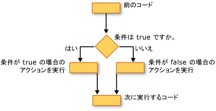

# 条件判断構造 (Visual Basic)
Visual Basic では、条件をテストし、そのテストの結果に応じてさまざまな操作を実行することができます。 True または false の場合、さまざまな値の式、または一連のステートメントを実行するときに生成された例外のさまざまな条件をテストできます。  
  
 次の図は、条件が真性をテストし、true と false であるかに応じて異なる処理を実行する条件判断構造を示します。  
  
   
条件が true と false の場合は、別の操作を実行  
  
## もし...そうしたら...他の構築  
 `If...Then...Else` 構造では、1 つまたは複数の条件をテストし、各条件に応じて 1 つまたは複数のステートメントを実行できます。 条件をテストし、次の方法でアクションを実行できます。  
  
-   条件の場合は、1 つまたは複数のステートメントを実行します。 `True`  
  
-   条件の場合は、1 つまたは複数のステートメントを実行します。 `False`  
  
-   条件の場合は、いくつかのステートメントを実行`True`や他のユーザーである場合 `False`  
  
-   先行する条件が場合は、追加の条件をテストします。 `False`  
  
 これらすべての可能性を提供する制御構造が、[場合.そうしたら...Else ステートメント](../../../../visual-basic/language-reference/statements/if-then-else-statement.md)です。 1 つのテストと 1 つのステートメントを実行している場合は、単一行のバージョンを使用できます。 複雑な条件およびアクションのセットがある場合は、複数行のバージョンを使用することができます。  
  
## このオプションを選択するとしてください.ケースの構築  
 `Select...Case`構築では、1 回式を評価し、別の使用可能な値に基づいたステートメントのさまざまなセットを実行することができます。 詳細については、次を参照してください[を選択しています...ステートメントの case](../../../../visual-basic/language-reference/statements/select-case-statement.md)です。  
  
## Try しています.キャッチしてください.最後に構築  
 `Try...Catch...Finally` 構造では、一連のステートメントのいずれかの例外が発生した場合にコントロールを保持する環境下でステートメントを実行できます。 さまざまな例外のさまざまな操作を実行することができます。 必要に応じて、全体を終了する前に実行されるコードのブロックを指定することができます`Try...Catch...Finally`どうなるかに関係なく、構築します。 詳しくは、「[Try...Catch...Finally ステートメント](../../../../visual-basic/language-reference/statements/try-catch-finally-statement.md)」をご覧ください。  
  
> [!NOTE]
>  多くの制御構造のキーワードをクリックすると、すべての構造のキーワードが強調表示されます。 たとえばをクリックすると`If`で、`If...Then...Else`構築のすべてのインスタンス`If`、 `Then`、 `ElseIf`、 `Else`、および`End If`構築では強調表示されます。 移動する前または次の強調表示されているキーワード、ctrl キーと shift キーを押しながら下方向キーまたは ctrl キーと shift キーを押しながら上方向キーを押します。  
  
## 関連項目  
 [制御フロー](../../../../visual-basic/programming-guide/language-features/control-flow/index.md)  
 [ループ構造](../../../../visual-basic/programming-guide/language-features/control-flow/loop-structures.md)  
 [その他の制御構造](../../../../visual-basic/programming-guide/language-features/control-flow/other-control-structures.md)  
 [入れ子になった制御構造](../../../../visual-basic/programming-guide/language-features/control-flow/nested-control-structures.md)  
 [If 演算子](../../../../visual-basic/language-reference/operators/if-operator.md)
