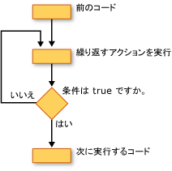

# ループ構造 (Visual Basic)
Visual Basic のループ構造を使用すると、コードの 1 つまたは複数の行を繰り返し実行できます。 条件になるまで、ループ構造内のステートメントを繰り返すことができます`True`条件になるまで、`False`コレクションの回数、または各要素に対して 1 回の数を指定します。  
  
 次の図は、条件が true になるまでの一連のステートメントを実行しているループ構造を示しています。  
  
   
条件が true になるまで、一連のステートメントを実行しています。  
  
## While ループ  
 `While`しています.`End While`で条件が指定されていれば、構築が一連のステートメントを実行、`While`ステートメントが`True`です。 詳細については、次を参照してください[中...While ステートメント終了](../../../../visual-basic/language-reference/statements/while-end-while-statement.md)です。  
  
## Do ループ  
 `Do`しています.`Loop`構築では、ループ構造の末尾または先頭のいずれかに条件をテストすることができます。 条件がある限り、ループ処理を実行するかどうかを指定することも`True`になるまで`True`です。 詳細については、次を参照してください[操作を行います...ステートメントをループ](../../../../visual-basic/language-reference/statements/do-loop-statement.md)です。  
  
## For ループ  
 `For`しています.`Next`構築は、指定された回数だけループを実行します。 呼ばれる、ループ コントロール変数を使用して、*カウンター*繰り返しを追跡します。 開始日と終了このカウンターの値を指定して、必要に応じて量で増加している 1 つの繰り返しから、次を指定することができます。 詳細については、次を参照してください[をしています...次のステートメントの](../../../../visual-basic/language-reference/statements/for-next-statement.md)します。  
  
## For Each ループ  
 `For Each`しています.`Next`構築は、コレクション内の各要素に対して 1 回のステートメントのセットを実行します。 ループ コントロール変数を指定するが、開始または終了値を決定する必要はありません。 詳細については、次を参照してください[ごとにしています...次のステートメントの](../../../../visual-basic/language-reference/statements/for-each-next-statement.md)します。  
  
## 関連項目  
 [制御フロー](../../../../visual-basic/programming-guide/language-features/control-flow/index.md)  
 [条件判断構造](../../../../visual-basic/programming-guide/language-features/control-flow/decision-structures.md)  
 [その他の制御構造](../../../../visual-basic/programming-guide/language-features/control-flow/other-control-structures.md)  
 [入れ子になった制御構造](../../../../visual-basic/programming-guide/language-features/control-flow/nested-control-structures.md)
