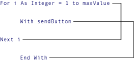

# <a name="nested-control-structures-visual-basic"></a>入れ子になった制御構造 (Visual Basic)
たとえば他のコントロール ステートメント内のコントロール ステートメントを配置することができます、`If...Then...Else`ブロック内で、`For...Next`ループします。 制御ステートメントの中に別のコントロール ステートメントの配置と呼ばれます*入れ子になった*です。  
  
## <a name="nesting-levels"></a>入れ子のレベル  
 Visual Basic での制御構造は、複数のレベルに入れ子にすることができます。 入れ子になった構造体を 1 つずつの本体をインデントして読みやすくするための一般的な方法であります。 統合開発環境 (IDE) のエディターでは、この自動的に行われます。  
  
 次の例では、プロシージャ`sumRows`マトリックスの行ごとの正の要素を一緒に追加します。  
  
```  
Public Sub sumRows(ByVal a(,) As Double, ByRef r() As Double)  
    Dim i, j As Integer  
    For i = 0 To UBound(a, 1)  
        r(i) = 0  
        For j = 0 To UBound(a, 2)  
            If a(i, j) > 0 Then  
                r(i) = r(i) + a(i, j)  
            End If  
        Next j  
    Next i  
End Sub  
```  
  
 前の例で最初`Next`ステートメント終了内部`For`ループし、最後`Next`、外側のステートメントを閉じます`For`ループします。  
  
 同様に、入れ子になった`If`ステートメント、`End If`ステートメントを最も近い前に自動的に適用`If`ステートメントです。 入れ子になった`Do`同様に、最も内側のループが`Loop`ステートメントの内側に一致する`Do`ステートメントです。  
  
> [!NOTE]
>  多くの制御構造のキーワードをクリックすると、すべての構造のキーワードが強調表示されます。 たとえばをクリックすると`If`で、`If...Then...Else`構築のすべてのインスタンス`If`、 `Then`、 `ElseIf`、 `Else`、および`End If`構築では強調表示されます。 移動する前または次の強調表示されているキーワード、ctrl キーと shift キーを押しながら下方向キーまたは ctrl キーと shift キーを押しながら上方向キーを押します。  
  
## <a name="nesting-different-kinds-of-control-structures"></a>さまざまな種類の制御構造の入れ子  
 1 つの種類別の種類内での制御構造の入れ子にすることができます。 次の例では、`With`ブロック、`For Each`ループし、入れ子になった`If`内部ブロック、`With`ブロックします。  
  
```  
For Each ctl As System.Windows.Forms.Control In Me.Controls  
    With ctl  
        .BackColor = System.Drawing.Color.Yellow  
        .ForeColor = System.Drawing.Color.Black  
        If .CanFocus Then  
            .Text = "Colors changed"  
            If Not .Focus() Then  
                ' Insert code to process failed focus.  
            End If  
        End If  
    End With  
Next ctl  
```  
  
## <a name="overlapping-control-structures"></a>重複する制御構造  
 制御構造が重複することはできません。 つまり、入れ子になった構造を完全に最も内側の次の構造内に必要です。 たとえば、次の配置は有効なため、`For`内側の前にループが終了した`With`ブロックを終了します。  
  
   
無効な構造体を使用して対応の入れ子  
  
 Visual Basic コンパイラでは、このような重複する制御構造を検出し、コンパイル時のエラーを通知します。  
  
## <a name="see-also"></a>関連項目  
 [制御フロー](../../../../visual-basic/programming-guide/language-features/control-flow/index.md)  
 [条件判断構造](../../../../visual-basic/programming-guide/language-features/control-flow/decision-structures.md)  
 [ループ構造](../../../../visual-basic/programming-guide/language-features/control-flow/loop-structures.md)  
 [その他の制御構造](../../../../visual-basic/programming-guide/language-features/control-flow/other-control-structures.md)
