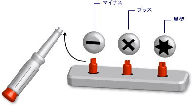

# Visual Basic におけるジェネリック型 (Visual Basic)Generic Types in Visual Basic (Visual Basic)
*ジェネリック型* はさまざまなデータ型に対して同じ機能を実行するために必要な処理を行う、1 つのプログラミング要素です。A *generic type* is a single programming element that adapts to perform the same functionality for a variety of data types. ジェネリック クラスまたはジェネリック プロシージャを定義すると、同じ機能を実行させる各データ型に対して、その機能を別々に定義する必要がありません。When you define a generic class or procedure, you do not have to define a separate version for each data type for which you might want to perform that functionality.  
  
 これは、ヘッドの部分が交換可能な、ねじ回しのセットにたとえることができます。An analogy is a screwdriver set with removable heads. 回すねじを調べて、そのねじに合った正しいヘッド (マイナス、プラス、星型) を選択します。You inspect the screw you need to turn and select the correct head for that screw (slotted, crossed, starred). ねじ回しのハンドルに正しいヘッドを挿入したら、ねじ回しを使ってまったく同じ作業 (ねじを回すこと) を行います。Once you insert the correct head in the screwdriver handle, you perform the exact same function with the screwdriver, namely turning the screw.  
  
   
汎用的な道具であるねじ回しのセットScrewdriver set as a generic tool  
  
 ジェネリック型を定義する場合は、1 つ以上のデータ型でジェネリック型をパラメーター化します。When you define a generic type, you parameterize it with one or more data types. これにより、ジェネリック型を使用するコードで、データ型をコードの要件に合わせて変更できるようになります。This allows the using code to tailor the data types to its requirements. コードでは、1 つのジェネリックな要素から複数のプログラミング要素を宣言し、それぞれを異なるデータ型のセットに使用できます。Your code can declare several different programming elements from the generic element, each one acting on a different set of data types. ただし、使用するデータ型が異なっていても、宣言した要素はどれも同じロジックを実行します。But the declared elements all perform the identical logic, no matter what data types they are using.  
  
 たとえば、 `String`などの特定のデータ型を操作するキュー クラスを作成し、使用する必要があるとします。For example, you might want to create and use a queue class that operates on a specific data type such as `String`. クラスを宣言する<xref:System.Collections.Generic.Queue%601?displayProperty=fullName>次の例を示します</xref:System.Collections.Generic.Queue%601?displayProperty=fullName>。You can declare such a class from <xref:System.Collections.Generic.Queue%601?displayProperty=fullName>, as the following example shows.  
  
 [!code-vb[VbVbalrDataTypes&#1;](../../../../visual-basic/language-reference/data-types/codesnippet/VisualBasic/generic-types_1.vb)][!code-vb[VbVbalrDataTypes#1](../../../../visual-basic/language-reference/data-types/codesnippet/VisualBasic/generic-types_1.vb)]  
  
 このときに、 `stringQ` を使って、 `String` 値だけを扱うように指定できます。You can now use `stringQ` to work exclusively with `String` values. `stringQ` は、 `String` 値を汎用的に扱うのではなく `Object` だけを扱うことを意味するので、遅延バインディングまたは型変換は行いません。Because `stringQ` is specific for `String` instead of being generalized for `Object` values, you do not have late binding or type conversion. その結果、実行時間が短縮され、ランタイム エラーが減少します。This saves execution time and reduces run-time errors.  
  
 ジェネリック型の使用に関する詳細については、次を参照してください。[方法: ジェネリック クラスを使用して](../../../../visual-basic/programming-guide/language-features/data-types/how-to-use-a-generic-class.md)します。For more information on using a generic type, see [How to: Use a Generic Class](../../../../visual-basic/programming-guide/language-features/data-types/how-to-use-a-generic-class.md).  
  
## ジェネリック クラスの例Example of a Generic Class  
 次の例は、ジェネリック クラスのスケルトン定義を示しています。The following example shows a skeleton definition of a generic class.  
  
 [!code-vb[VbVbalrDataTypes&#2;](../../../../visual-basic/language-reference/data-types/codesnippet/VisualBasic/generic-types_2.vb)][!code-vb[VbVbalrDataTypes#2](../../../../visual-basic/language-reference/data-types/codesnippet/VisualBasic/generic-types_2.vb)]  
  
 このスケルトンでは、 `t` は *型パラメーター*です。これはプレースホルダーなので、このクラスを宣言するときにはデータ型で置き換えます。In the preceding skeleton, `t` is a *type parameter*, that is, a placeholder for a data type that you supply when you declare the class. コードの他の部分では、 `classHolder` をさまざまなデータ型で置き換えることにより、 `t`のさまざまなバージョンを宣言できます。Elsewhere in your code, you can declare various versions of `classHolder` by supplying various data types for `t`. このようにして宣言した&2; つのクラスを次の例に示します。The following example shows two such declarations.  
  
 [!code-vb[VbVbalrDataTypes&#3;](../../../../visual-basic/language-reference/data-types/codesnippet/VisualBasic/generic-types_3.vb)][!code-vb[VbVbalrDataTypes#3](../../../../visual-basic/language-reference/data-types/codesnippet/VisualBasic/generic-types_3.vb)]  
  
 このステートメントでは、 *構成されるクラス*を宣言し、その中で型パラメーターを特定の型に置き換えています。The preceding statements declare *constructed classes*, in which a specific type replaces the type parameter. この置き換えは、構成されるクラスのコード全体に反映されます。This replacement is propagated throughout the code within the constructed class. 次の例は、 `processNewItem` の `integerClass`プロシージャがどのようなコードになるかを示しています。The following example shows what the `processNewItem` procedure looks like in `integerClass`.  
  
 [!code-vb[VbVbalrDataTypes&4;](../../../../visual-basic/language-reference/data-types/codesnippet/VisualBasic/generic-types_4.vb)][!code-vb[VbVbalrDataTypes#4](../../../../visual-basic/language-reference/data-types/codesnippet/VisualBasic/generic-types_4.vb)]  
  
 完全な例では、次を参照してください。[方法: 機能を定義する、クラス、ことができます提供と同じ別のデータ型に](../../../../visual-basic/programming-guide/language-features/data-types/how-to-define-a-class-that-can-provide-identical-functionality.md)します。For a more complete example, see [How to: Define a Class That Can Provide Identical Functionality on Different Data Types](../../../../visual-basic/programming-guide/language-features/data-types/how-to-define-a-class-that-can-provide-identical-functionality.md).  
  
## 使用できるプログラミング要素Eligible Programming Elements  
 ジェネリック クラス、構造体、インターフェイス、プロシージャ、およびデリゲートを定義して使用することができます。You can define and use generic classes, structures, interfaces, procedures, and delegates. なお、[!INCLUDE[dnprdnshort](../../../../csharp/getting-started/includes/dnprdnshort_md.md)]いくつかのジェネリック クラス、構造、およびよく使用される一般的な要素を表すインターフェイスを定義します。Note that the [!INCLUDE[dnprdnshort](../../../../csharp/getting-started/includes/dnprdnshort_md.md)] defines several generic classes, structures, and interfaces that represent commonly used generic elements. <xref:System.Collections.Generic?displayProperty=fullName>名前空間は、ディクショナリ、リスト、キュー、およびスタックを提供します</xref:System.Collections.Generic?displayProperty=fullName>。The <xref:System.Collections.Generic?displayProperty=fullName> namespace provides dictionaries, lists, queues, and stacks. 独自のジェネリックな要素を定義する前に既に<xref:System.Collections.Generic?displayProperty=fullName>。</xref:System.Collections.Generic?displayProperty=fullName>で利用可能なかどうかを参照してください。Before defining your own generic element, see if it is already available in <xref:System.Collections.Generic?displayProperty=fullName>.  
  
 プロシージャは型ではありませんが、ジェネリック プロシージャを定義し、使用できます。Procedures are not types, but you can define and use generic procedures. 参照してください[Visual Basic におけるジェネリック プロシージャ](../../../../visual-basic/programming-guide/language-features/data-types/generic-procedures.md)します。See [Generic Procedures in Visual Basic](../../../../visual-basic/programming-guide/language-features/data-types/generic-procedures.md).  
  
## ジェネリック型の利点Advantages of Generic Types  
 ジェネリック型は、それぞれが特定のデータ型を操作する複数のプログラミング要素を宣言するための基礎となります。A generic type serves as a basis for declaring several different programming elements, each of which operates on a specific data type. ジェネリック型の代わりになるものを以下に示します。The alternatives to a generic type are:  
  
1.  `Object` データ型を操作する単一の型。A single type operating on the `Object` data type.  
  
2.  型の *型固有* バージョンのセット。それぞれのバージョンは、個別にコーディングされ、 `String`、 `Integer`、または `customer`などのユーザー定義型などの特定のデータ型を操作します。A set of *type-specific* versions of the type, each version individually coded and operating on one specific data type such as `String`, `Integer`, or a user-defined type such as `customer`.  
  
 ジェネリック型には、これらの代替手段にはない次の利点があります。A generic type has the following advantages over these alternatives:  
  
-   **タイプ セーフです。****Type Safety.** ジェネリック型では、コンパイル時に型がチェックされます。Generic types enforce compile-time type checking. 一方、 `Object` に基づく型はすべてのデータ型を受け入れるので、入力したデータ型が受け入れられる型かどうかをチェックするコードを記述する必要があります。Types based on `Object` accept any data type, and you must write code to check whether an input data type is acceptable. ジェネリック型を使うと、型の不一致は実行する前にコンパイラで検出できます。With generic types, the compiler can catch type mismatches before run time.  
  
-   **パフォーマンスを改善。****Performance.** それぞれが特定の&1; つのデータ型に特化されるので、データを *ボックス化* したり、 *unボックス化* したりする必要がありません。Generic types do not have to *box* and *unbox* data, because each one is specialized for one data type. `Object` に基づいて操作を実行する場合、入力したデータ型をボックス化して `Object` に変換したり、出力時にデータのボックス化を解除したりする必要があります。Operations based on `Object` must box input data types to convert them to `Object` and unbox data destined for output. ボックス化とボックス化解除は、パフォーマンスを低下させます。Boxing and unboxing reduce performance.  
  
     また、 `Object` に基づく型は遅延バインディングでもあります。つまり、この型のメンバーにアクセスするには、実行時に余分なコードが必要になります。Types based on `Object` are also late-bound, which means that accessing their members requires extra code at run time. これも、パフォーマンスを低下させます。This also reduces performance.  
  
-   **コードの統合。****Code Consolidation.** ジェネリック型のコードの定義は、一度だけ行う必要があります。The code in a generic type has to be defined only once. 1 つの型の一連の型固有バージョンでは、同じコードが各バージョンに複製されます。バージョンによって異なるのは、扱うデータ型だけです。A set of type-specific versions of a type must replicate the same code in each version, with the only difference being the specific data type for that version. ジェネリック型では、すべての型固有バージョンが元のジェネリック型から生成されます。With generic types, the type-specific versions are all generated from the original generic type.  
  
-   **コードの再利用をします。****Code Reuse.** 特定のデータ型に依存しないコードは、ジェネリックである場合に、さまざまなデータ型で再利用できます。Code that does not depend on a particular data type can be reused with various data types if it is generic. 予期しなかったデータ型に再利用できることもあります。You can often reuse it even with a data type that you did not originally predict.  
  
-   **IDE のサポート。****IDE Support.** ジェネリック型から宣言した構成型を使用すると、コードの開発中に統合開発環境 (IDE) から提供されるサポートが増えます。When you use a constructed type declared from a generic type, the integrated development environment (IDE) can give you more support while you are developing your code. たとえば、IntelliSense は、コンストラクターまたはメソッドに対して引数の型固有のオプションを示します。For example, IntelliSense can show you the type-specific options for an argument to a constructor or method.  
  
-   **ジェネリックなアルゴリズム。****Generic Algorithms.** 型に依存しない抽象アルゴリズムは、ジェネリック型にすることをお勧めします。Abstract algorithms that are type-independent are good candidates for generic types. <xref:System.IComparable>インターフェイスを使用すると、 <xref:System.IComparable>。</xref:System.IComparable>を実装する任意のデータ型を</xref:System.IComparable>使用して項目を並べ替えてジェネリック プロシージャなど、For example, a generic procedure that sorts items using the <xref:System.IComparable> interface can be used with any data type that implements <xref:System.IComparable>.  
  
## 制約Constraints  
 ジェネリック型定義のコードはできる限り型に依存しない必要がありますが、なんらかのデータ型の機能がジェネリック型に必要な場合もあります。Although the code in a generic type definition should be as type-independent as possible, you might need to require a certain capability of any data type supplied to your generic type. たとえば、並べ替えまたは照合するために&2; つの項目を比較する場合は、そのデータ型必要があります実装、<xref:System.IComparable>インターフェイス</xref:System.IComparable>。For example, if you want to compare two items for the purpose of sorting or collating, their data type must implement the <xref:System.IComparable> interface. この要件を強制するには、 *制約* を型パラメーターに追加します。You can enforce this requirement by adding a *constraint* to the type parameter.  
  
### 制約の例Example of a Constraint  
 次の例は、 <xref:System.IComparable>。</xref:System.IComparable>を実装する型引数が必要な制約が設定されたクラスのスケルトンの定義を示しています。The following example shows a skeleton definition of a class with a constraint that requires the type argument to implement <xref:System.IComparable>.  
  
 [!code-vb[VbVbalrDataTypes&#5;](../../../../visual-basic/language-reference/data-types/codesnippet/VisualBasic/generic-types_5.vb)][!code-vb[VbVbalrDataTypes#5](../../../../visual-basic/language-reference/data-types/codesnippet/VisualBasic/generic-types_5.vb)]  
  
 後続のコードからクラスを作成しようとしました場合`itemManager`を実装しない型を指定して<xref:System.IComparable>、コンパイラはエラーです。</xref:System.IComparable> 。If subsequent code attempts to construct a class from `itemManager` supplying a type that does not implement <xref:System.IComparable>, the compiler signals an error.  
  
### 制約の種類Types of Constraints  
 次の要件を任意に組み合わせて制約を指定できます。Your constraint can specify the following requirements in any combination:  
  
-   型引数は、1 つまたは複数のインターフェイスを実装する必要がありますThe type argument must implement one or more interfaces  
  
-   型引数は、クラスの型そのものであるか、最大&1; つのクラスを継承する必要がありますThe type argument must be of the type of, or inherit from, at most one class  
  
-   型引数はパラメーターなしのコンストラクターを公開し、そのコンストラクターからオブジェクトを作成するコードで使用できる必要がありますThe type argument must expose a parameterless constructor accessible to the code that creates objects from it  
  
-   型引数は、 *参照型*である、または *値型*である必要がありますThe type argument must be a *reference type*, or it must be a *value type*  
  
 複数の要件を指定する場合は、コンマで区切られた *制約リスト* を中かっこ (`{ }`) で囲みます。If you need to impose more than one requirement, you use a comma-separated *constraint list* inside braces (`{ }`). 含めるをアクセス可能なコンス トラクターを必要とする、 [New 演算子](../../../../visual-basic/language-reference/operators/new-operator.md)一覧のキーワードです。To require an accessible constructor, you include the [New Operator](../../../../visual-basic/language-reference/operators/new-operator.md) keyword in the list. 参照型であることを必須とするには、 `Class` キーワードを追加し、値型であることを必須とするには、 `Structure` キーワードを追加します。To require a reference type, you include the `Class` keyword; to require a value type, you include the `Structure` keyword.  
  
 制約の詳細については、次を参照してください。[型リスト](../../../../visual-basic/language-reference/statements/type-list.md)します。For more information on constraints, see [Type List](../../../../visual-basic/language-reference/statements/type-list.md).  
  
### 複数の制約の例Example of Multiple Constraints  
 次の例は、型パラメーターに制約リストがあるジェネリック クラスのスケルトン定義を示しています。The following example shows a skeleton definition of a generic class with a constraint list on the type parameter. をこのクラスのインスタンスを作成したコードで型引数必要があります両方を実装、<xref:System.IComparable>と<xref:System.IDisposable>インターフェイスの参照型であるし、アクセス可能なパラメーターなしコンス トラクターを公開します。</xref:System.IDisposable> </xref:System.IComparable>In the code that creates an instance of this class, the type argument must implement both the <xref:System.IComparable> and <xref:System.IDisposable> interfaces, be a reference type, and expose an accessible parameterless constructor.  
  
 [!code-vb[VbVbalrDataTypes&6;](../../../../visual-basic/language-reference/data-types/codesnippet/VisualBasic/generic-types_6.vb)][!code-vb[VbVbalrDataTypes#6](../../../../visual-basic/language-reference/data-types/codesnippet/VisualBasic/generic-types_6.vb)]  
  
## 重要な用語Important Terms  
 ジェネリック型に関連して、以下の新しい用語が使用されます。Generic types introduce and use the following terms:  
  
-   *ジェネリック型*。*Generic Type*. 宣言時に少なくとも&1; つのデータ型を指定するクラス、構造体、インターフェイス、プロシージャ、またはデリゲートの定義です。A definition of a class, structure, interface, procedure, or delegate for which you supply at least one data type when you declare it.  
  
-   *型パラメーター*。*Type Parameter*. ジェネリック型定義で、型を宣言するときにデータ型の代わりに指定するプレースホルダーです。In a generic type definition, a placeholder for a data type you supply when you declare the type.  
  
-   *型引数*。*Type Argument*. 構成型をジェネリック型から宣言するときに、型パラメーターを置き換える特定のデータ型です。A specific data type that replaces a type parameter when you declare a constructed type from a generic type.  
  
-   *制約*。*Constraint*. 型パラメーターに指定できる型引数を制限する条件です。A condition on a type parameter that restricts the type argument you can supply for it. 型引数が特定のインターフェイスを実装すること、特定のクラスであるか特定のクラスを継承すること、アクセス可能なパラメーターなしのコンストラクターを持つこと、または参照型または値型であることを強制できます。A constraint can require that the type argument must implement a particular interface, be or inherit from a particular class, have an accessible parameterless constructor, or be a reference type or a value type. このような制約は組み合わせて指定できますが、指定できるのは&1; つのクラスだけです。You can combine these constraints, but you can specify at most one class.  
  
-   *構成型*。*Constructed Type*. 型パラメーターに型引数を指定してジェネリック型から宣言されるクラス、構造体、インターフェイス、プロシージャ、またはデリゲートです。A class, structure, interface, procedure, or delegate declared from a generic type by supplying type arguments for its type parameters.  
  
## 関連項目See Also  
 [データ型](../../../../visual-basic/programming-guide/language-features/data-types/index.md) [Data Types](../../../../visual-basic/programming-guide/language-features/data-types/index.md)   
 [型文字](../../../../visual-basic/programming-guide/language-features/data-types/type-characters.md)  [Type Characters](../../../../visual-basic/programming-guide/language-features/data-types/type-characters.md)   
 [値型と参照型](../../../../visual-basic/programming-guide/language-features/data-types/value-types-and-reference-types.md)  [Value Types and Reference Types](../../../../visual-basic/programming-guide/language-features/data-types/value-types-and-reference-types.md)   
 [Visual Basic における型変換](../../../../visual-basic/programming-guide/language-features/data-types/type-conversions.md)  [Type Conversions in Visual Basic](../../../../visual-basic/programming-guide/language-features/data-types/type-conversions.md)   
 [データ型のトラブルシューティング](../../../../visual-basic/programming-guide/language-features/data-types/troubleshooting-data-types.md)  [Troubleshooting Data Types](../../../../visual-basic/programming-guide/language-features/data-types/troubleshooting-data-types.md)   
 [データ型](../../../../visual-basic/language-reference/data-types/data-type-summary.md)  [Data Types](../../../../visual-basic/language-reference/data-types/data-type-summary.md)   
 [Of](../../../../visual-basic/language-reference/statements/of-clause.md)  [Of](../../../../visual-basic/language-reference/statements/of-clause.md)   
 [として](../../../../visual-basic/language-reference/statements/as-clause.md)  [As](../../../../visual-basic/language-reference/statements/as-clause.md)   
 [オブジェクトのデータ型](../../../../visual-basic/language-reference/data-types/object-data-type.md)  [Object Data Type](../../../../visual-basic/language-reference/data-types/object-data-type.md)   
 [ジェネリックの共変性と反変性](http://msdn.microsoft.com/library/a58cc086-276f-4f91-a366-85b7f95f38b8)  [Covariance and Contravariance](http://msdn.microsoft.com/library/a58cc086-276f-4f91-a366-85b7f95f38b8)   
 [反復子](http://msdn.microsoft.com/library/f45331db-d595-46ec-9142-551d3d1eb1a7) [Iterators](http://msdn.microsoft.com/library/f45331db-d595-46ec-9142-551d3d1eb1a7)
