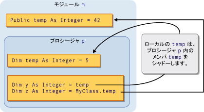
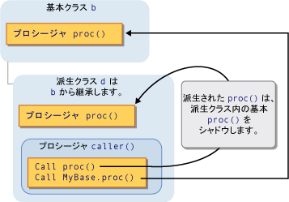

# <a name="shadowing-in-visual-basic"></a>Visual Basic におけるシャドウ
2 つのプログラミング要素は、同じ名前を共有する場合それらのいずれかの非表示に、または*シャドウ*、もう 1 つです。 このような状況で、シャドウされた要素は参照できません。代わりに、コードでは、要素名を使用する場合、Visual Basic コンパイラに解決されます、シャドウする要素。  
  
## <a name="purpose"></a>目的  
 シャドウの主な目的は、クラス メンバーの定義を保護するのにです。 基本クラスがありますを変えることが定義されている 1 つとして同じ名前の要素を作成します。 この場合、`Shadows`修飾子強制的に実行をするメンバーに解決するのには、クラスを参照する基本クラスの新しい要素の代わりに定義された、します。  
  
## <a name="types-of-shadowing"></a>シャドウの種類  
 要素は、2 つの異なる方法で別の要素をシャドウすることができます。 要素はシャドウ ケースを実現する、シャドウされた要素を含む領域のサブ領域内で宣言できます*スコープによる*です。 派生クラスは、シャドウ ケースが行われますが、基底クラスのメンバーを再定義できますまたは*継承によって*です。  
  
### <a name="shadowing-through-scope"></a>スコープによるシャドウ  
 同じモジュール、クラス、または構造体に名前が同じで別のスコープ内の要素をプログラミングする可能性があります。 狭いスコープを持つ要素が他の要素をシャドウするこの方法で 2 つの要素が宣言されているし、コードが共有されている名前を指す、(ブロック スコープは最も狭いです)。  
  
 たとえば、モジュールを定義できます、`Public`という名前の変数`temp`、モジュール内の手順もという名前のローカル変数を宣言できますと`temp`です。 参照`temp`プロシージャ内からへの参照中に、ローカル変数にアクセス`temp`からプロシージャへのアクセス、外部、`Public`変数。 この場合、プロシージャの変数`temp`モジュールの変数のシャドウ`temp`です。  
  
 次の図に、2 つの変数、という名前を`temp`です。 ローカル変数`temp`メンバー変数のシャドウ`temp`独自のプロシージャ内からアクセスするときに`p`です。 ただし、`MyClass`キーワードは、シャドウをバイパスし、メンバー変数にアクセスします。  
  
   
スコープによるシャドウ  
  
 スコープによるシャドウの例は、次を参照してください。[する方法: Your 変数と同じ名前の変数を隠す](../../../../visual-basic/programming-guide/language-features/declared-elements/how-to-hide-a-variable-with-the-same-name-as-your-variable.md)です。  
  
### <a name="shadowing-through-inheritance"></a>継承によるシャドウ  
 派生クラスは、基本クラスから継承されたプログラミング要素を再定義を再定義する要素は、元の要素をシャドウします。 他の種類とは、任意の型の宣言された要素は、または一連のオーバー ロードされた要素をシャドウできます。 たとえば、`Integer`変数をシャドウする、`Function`プロシージャです。 別のプロシージャを持つプロシージャをシャドウする場合は、別のパラメーター リストと異なる戻り値の型を使用できます。  
  
 次の図は、基本クラス`b`と派生クラス`d`から継承する`b`です。 という名前のプロシージャが基本クラスで定義`proc`と、派生クラスは、同じ名前の別のプロシージャをシャドウします。 最初の`Call`シャドウ ステートメントにアクセスする`proc`派生クラスでします。 ただし、`MyBase`キーワードは、シャドウをバイパスし、基本クラスで影付きのプロシージャにアクセスします。  
  
   
継承によるシャドウ  
  
 継承によるシャドウの例は、次を参照してください。[する方法: Your 変数と同じ名前の変数を隠す](../../../../visual-basic/programming-guide/language-features/declared-elements/how-to-hide-a-variable-with-the-same-name-as-your-variable.md)と[する方法:、継承された変数を非表示に](../../../../visual-basic/programming-guide/language-features/declared-elements/how-to-hide-an-inherited-variable.md)です。  
  
#### <a name="shadowing-and-access-level"></a>シャドウとアクセス レベル  
 要素は、常に、派生クラスを使用して、コードからアクセスできません。 たとえば、宣言される可能性があります`Private`です。 このような場合は、シャドウは行われず、コンパイラは必要があります、同じ要素への参照を解決する場合がありますは行われません。 この要素は、最小の継承はステップ後方シャドウするクラスからアクセス可能な要素です。 シャドウされた要素が、プロシージャの場合は、解像度が同じ名前、パラメーター リストを持つ最も近い利用可能なバージョンがあり、型を返すられます。  
  
 次の例では、3 つのクラスの継承階層を示します。 各クラスを定義、`Sub`プロシージャ`display`、および各派生したクラス shadows、`display`その基本クラスのプロシージャです。  
  
```  
Public Class firstClass  
    Public Sub display()  
        MsgBox("This is firstClass")  
    End Sub  
End Class  
Public Class secondClass  
    Inherits firstClass  
    Private Shadows Sub display()  
        MsgBox("This is secondClass")  
    End Sub  
End Class  
Public Class thirdClass  
    Inherits secondClass  
    Public Shadows Sub display()  
        MsgBox("This is thirdClass")  
    End Sub  
End Class  
Module callDisplay  
    Dim first As New firstClass  
    Dim second As New secondClass  
    Dim third As New thirdClass  
    Public Sub callDisplayProcedures()  
        ' The following statement displays "This is firstClass".  
        first.display()  
        ' The following statement displays "This is firstClass".  
        second.display()  
        ' The following statement displays "This is thirdClass".  
        third.display()  
    End Sub  
End Module  
```  
  
 前の例では、派生クラスで`secondClass`shadows`display`で、`Private`プロシージャです。 ときにモジュール`callDisplay`呼び出し`display`で`secondClass`、呼び出し元のコードが範囲外`secondClass`と、プライベート アクセスできないため`display`プロシージャです。 シャドウ処理は行われず、およびコンパイラが基底クラスへの参照を解決`display`プロシージャです。  
  
 ただし、さらに、派生クラス`thirdClass`を宣言`display`として`Public`ため、コードで`callDisplay`にアクセスできます。  
  
## <a name="shadowing-and-overriding"></a>シャドウとオーバーライド  
 シャドウとオーバーライドを混同しないでください。 派生クラスは、基底クラスから継承し、1 つの宣言された要素と他の再定義時にどちらも使用されます。 2 つの重要な違いがあります。 比較については、次を参照してください。[シャドウとの間の相違点およびオーバーライド](../../../../visual-basic/programming-guide/language-features/declared-elements/differences-between-shadowing-and-overriding.md)です。  
  
## <a name="shadowing-and-overloading"></a>シャドウとオーバー ロード  
 派生クラスで複数の要素を持つ同じ基底クラス要素をシャドウする場合は、その要素のオーバー ロードされたバージョンがシャドウする要素になります。 詳細については、次を参照してください。[プロシージャのオーバー ロード](../../../../visual-basic/programming-guide/language-features/procedures/procedure-overloading.md)です。  
  
## <a name="accessing-a-shadowed-element"></a>シャドウされた要素へのアクセス  
 派生クラスからの要素をアクセスするときに通常これを行う、派生クラスの現在のインスタンスを要素名を修飾することにより、`Me`キーワード。 修飾基底クラス要素にアクセスする場合は、派生クラスでは、基本クラスで要素をシャドウを`MyBase`キーワード。  
  
 シャドウされた要素へのアクセスの例は、次を参照してください。[する方法: 派生クラスによって非表示変数にアクセス](../../../../visual-basic/programming-guide/language-features/declared-elements/how-to-access-a-variable-hidden-by-a-derived-class.md)です。  
  
### <a name="declaration-of-the-object-variable"></a>オブジェクト変数の宣言  
 派生クラスは、シャドウ要素またはシャドウされた要素にアクセスするかどうか、オブジェクト変数を作成する方法に影響もします。 次の例では、2 つのオブジェクトを作成、派生クラスからが 1 つのオブジェクトは、基底クラスと、他の派生クラスとして宣言されています。  
  
```  
Public Class baseCls  
    ' The following statement declares the element that is to be shadowed.  
    Public z As Integer = 100  
End Class  
Public Class dervCls  
    Inherits baseCls  
    ' The following statement declares the shadowing element.  
    Public Shadows z As String = "*"  
End Class  
Public Class useClasses  
    ' The following statement creates the object declared as the base class.  
    Dim basObj As baseCls = New dervCls()  
    ' Note that dervCls widens to its base class baseCls.  
    ' The following statement creates the object declared as the derived class.  
    Dim derObj As dervCls = New dervCls()  
    Public Sub showZ()   
    ' The following statement outputs 100 (the shadowed element).  
        MsgBox("Accessed through base class: " & basObj.z)  
    ' The following statement outputs "*" (the shadowing element).  
        MsgBox("Accessed through derived class: " & derObj.z)  
    End Sub  
End Class  
```  
  
 前の例では、変数`basObj`は基底クラスとして宣言されています。 割り当て、`dervCls`オブジェクトをそれには、拡大変換であるためです。 基本クラスがシャドウされた変数にアクセスできませんただし、 `z` 、派生クラスで、コンパイラが解決するか`basObj.z`元の基本クラスの値にします。  
  
## <a name="see-also"></a>関連項目  
 [宣言された要素の参照](../../../../visual-basic/programming-guide/language-features/declared-elements/references-to-declared-elements.md)  
 [Visual Basic におけるスコープ](../../../../visual-basic/programming-guide/language-features/declared-elements/scope.md)  
 [拡大変換と縮小変換](../../../../visual-basic/programming-guide/language-features/data-types/widening-and-narrowing-conversions.md)  
 [Shadows](../../../../visual-basic/language-reference/modifiers/shadows.md)  
 [Overrides](../../../../visual-basic/language-reference/modifiers/overrides.md)  
 [Me、My、MyBase、および MyClass](../../../../visual-basic/programming-guide/program-structure/me-my-mybase-and-myclass.md)  
 [継承の基本](../../../../visual-basic/programming-guide/language-features/objects-and-classes/inheritance-basics.md)
