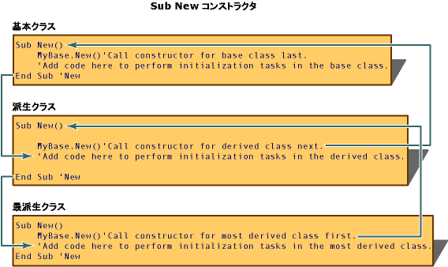

# <a name="object-lifetime-how-objects-are-created-and-destroyed-visual-basic"></a>オブジェクトの有効期間: オブジェクトの作成と破棄 (Visual Basic)
クラスのインスタンス (オブジェクト) を作成するには、`New` キーワードを使用します。 新しいオブジェクトを使用する前に、多くの場合、そのオブジェクトに対して初期化タスクを実行する必要があります。 一般的な初期化タスクとして、ファイルを開く、データベースに接続する、レジストリ キーの値を読み取る、などがあります。 Visual Basic と呼ばれるプロシージャを使用して新しいオブジェクトの初期化を制御する*コンス トラクター* (初期化を制御できる特殊なメソッド)。  
  
 スコープを離れたオブジェクトは、共通言語ランタイム (CLR) によって解放されます。 Visual Basic は、呼び出されるプロシージャを使用してシステム リソースの解放を制御*デストラクター*です。 コンストラクターとデストラクターは共に、堅牢で予測可能なクラス ライブラリの作成をサポートしています。  
  
## <a name="using-constructors-and-destructors"></a>コンストラクターとデストラクターの使用  
 コンストラクターとデストラクターは、オブジェクトの作成および破棄を制御します。 Visual Basic の `Sub New` と `Sub Finalize` の各プロシージャが、オブジェクトを初期化および破棄します。これらは、`Class_Initialize` 6.0 とそれ以前のバージョンで使用される `Class_Terminate` と [!INCLUDE[vbprvb](~/includes/vbprvb-md.md)] の各メソッドに置き換わるものです。  
  
### <a name="sub-new"></a>Sub New  
 `Sub New` コンストラクターは、クラスの作成時に 1 回だけ実行できます。 同じクラスまたは派生クラスから別のコンストラクターの最初のコード行以外の任意の場所で、明示的に呼び出すことはできません。 また、`Sub New` メソッド内のコードは常に、クラス内の他のすべてのコードより先に実行されます。 [!INCLUDE[vbprvblong](~/includes/vbprvblong-md.md)]以降のバージョンが暗黙的に作成し、`Sub New`明示的に定義していない場合、実行時にコンス トラクター、`Sub New`クラスのプロシージャです。  
  
 クラスのコンストラクターを作成するには、クラス定義の任意の場所に `Sub New` という名前のプロシージャを作成します。 パラメーター化されたコンストラクターを作成するには、次のコードに示すように、他のプロシージャの引数を指定する場合と同じく、`Sub New` に引数の名前とデータ型を指定します。  
  
 [!code-vb[VbVbalrOOP#42](../../../../visual-basic/misc/codesnippet/VisualBasic/object-lifetime-how-objects-are-created-and-destroyed_1.vb)]  
  
 コンストラクターは、次のコードに示すように、頻繁にオーバーロードされます。  
  
 [!code-vb[VbVbalrOOP#116](../../../../visual-basic/misc/codesnippet/VisualBasic/object-lifetime-how-objects-are-created-and-destroyed_2.vb)]  
  
 別のクラスから派生したクラスを定義するときは、基本クラスにパラメーターを受け取らないアクセス可能なコンストラクターがある場合を除き、コンストラクターの 1 行目で基本クラスのコンストラクターを呼び出す必要があります。 たとえば、上記のコンストラクターを含む基本クラスの呼び出しは、`MyBase.New(s)` になります。 それ以外の場合、`MyBase.New` はオプションであり、[!INCLUDE[vbprvb](~/includes/vbprvb-md.md)] ランタイムによって暗黙的に呼び出されます。  
  
 親オブジェクトのコンストラクターを呼び出すコードを記述した後、追加の初期化コードを `Sub New` プロシージャに追加できます。 `Sub New`は、パラメーター化されたコンストラクターとして呼び出されたときには、引数を受け取ることができます。 このようなパラメーターは、コンストラクターを呼び出すプロシージャ (たとえば、`Dim AnObject As New ThisClass(X)`) から渡されます。  
  
### <a name="sub-finalize"></a>Sub Finalize  
 オブジェクトを解放する前に、CLR は `Finalize` プロシージャを定義するオブジェクトの `Sub Finalize` メソッドを自動的に呼び出します。 `Finalize` メソッドには、ファイルを閉じて状態情報を保存するコードなど、オブジェクトを破棄する直前に実行する必要があるコードを含めることができます。 `Sub Finalize` の実行には若干のパフォーマンス低下が伴うため、オブジェクトを明示的に解放する必要がある場合にのみ、`Sub Finalize` メソッドを定義してください。  
  
> [!NOTE]
>  CLR のガベージ コレクターがない (しことはできません) を破棄*オブジェクトのアンマネージ*、オペレーティング システムが CLR 環境の外部で直接実行するオブジェクト。 これは、管理されていないオブジェクトごとに異なる方法で破棄する必要があるためです。 その情報は、管理されていないオブジェクトに直接には関連付けられません。オブジェクトのドキュメントに記載する必要があります。 管理されていないオブジェクトを使用するクラスでは、`Finalize` メソッド内でそのオブジェクトを破棄する必要があります。  
  
 `Finalize` デストラクターは、所属先のクラスまたは派生クラスからのみ呼び出し可能な保護されたメソッドです。 `Finalize` はオブジェクトが破棄されるときに自動的に呼び出されるため、派生クラスの `Finalize` 実装の外部から `Finalize` を明示的に呼び出す必要はありません。  
  
 オブジェクトが nothing に設定されるとすぐに実行される `Class_Terminate` と異なり、通常、オブジェクトがスコープを失ってから Visual Basic が `Finalize` デストラクターを呼び出すまでに遅延が発生します。 [!INCLUDE[vbprvblong](~/includes/vbprvblong-md.md)] およびそれ以降のバージョンでは、2 つ目の種類のデストラクターとして <xref:System.IDisposable.Dispose%2A> が使用可能であり、いつでも明示的に呼び出してすぐにリソースを解放できます。  
  
> [!NOTE]
>  `Finalize` デストラクターからは例外をスローしません。これは、その例外をアプリケーションで処理できないために、アプリケーションが異常終了する可能性があるためです。  
  
### <a name="how-new-and-finalize-methods-work-in-a-class-hierarchy"></a>クラス階層での New メソッドおよび Finalize メソッドの動作  
 クラスのインスタンスが作成されると、そのオブジェクト内に `New` という名前のプロシージャが存在する場合、共通言語ランタイム (CLR) はそのプロシージャを実行しようとします。 `New` は、オブジェクトの他のコードを実行する前に新しいオブジェクトを初期化するために使用される、`constructor`と呼ばれる種類のプロシージャです。 `New` コンストラクターを使用すると、ファイルを開く、データベースに接続する、変数を初期化するなど、オブジェクトを使用する前に実行する必要があるタスクを管理できます。  
  
 派生クラスのインスタンスが作成されると、まず基本クラスの `Sub New` コンストラクターが実行され、続いて派生クラスのコンストラクターが実行されます。 このように動作するのは、`Sub New` コンストラクターの最初のコード行では、`MyBase.New()` 構文を使用して、クラス階層の自身のすぐ上位にあるクラスのコンストラクターを呼び出すためです。 `Sub New` コンストラクターはその後、基本クラスのコンストラクターに到達するまで、クラス階層のクラスごとに呼び出されます。 その時点で、基本クラスのコンストラクター内のコードが実行され、続いてすべての派生クラスの各コンストラクター内のコードが実行され、最後にほとんどの派生クラス内のコードが実行されます。  
  
   
  
 オブジェクトが不要になると、CLR はメモリを解放する前にそのオブジェクトに対して <xref:System.Object.Finalize%2A> メソッドを呼び出します。 <xref:System.Object.Finalize%2A> メソッドは、状態情報の保存やファイルおよびデータベース接続の終了などのクリーンアップ タスク、およびオブジェクトを解放する前に行う必要があるその他のタスクを実行するために、`destructor`を呼び出します。  
  
   
  
## <a name="idisposable-interface"></a>IDisposable インターフェイス  
 クラスのインスタンスは、多くの場合、Windows ハンドルやデータベース接続など、CLR では管理されないリソースを制御します。 これらのリソースは、オブジェクトがガベージ コレクターによって破棄されるときに解放されるように、クラスの `Finalize` メソッドで破棄する必要があります。 ただし、ガベージ コレクターは、CLR でより多くの空きメモリが必要な場合にのみ、オブジェクトを破棄します。 つまり、オブジェクトがスコープ外になるまで、リソースが解放されない可能性があります。  
  
 ガベージ コレクションを補足するために、クラスが <xref:System.IDisposable> インターフェイスを実装している場合には、システム リソースを積極的に管理するためのメカニズムをクラスに用意することができます。 <xref:System.IDisposable> には <xref:System.IDisposable.Dispose%2A> という 1 つのメソッドがあり、クライアントはオブジェクトの使用を終了するときにこのメソッドを呼び出す必要があります。 <xref:System.IDisposable.Dispose%2A> メソッドを使用して、すぐにリソースを解放し、ファイルおよびデータベース接続の終了などのタスクを実行できます。 `Finalize` デストラクターとは異なり、<xref:System.IDisposable.Dispose%2A> メソッドは自動的には呼び出されません。 リソースをすぐに解放するときには、クラスのクライアントが <xref:System.IDisposable.Dispose%2A> を明示的に呼び出す必要があります。  
  
### <a name="implementing-idisposable"></a>IDisposable の実装  
 <xref:System.IDisposable> インターフェイスを実装するクラスには、次のコード セクションを含める必要があります。  
  
-   オブジェクトが破棄されているかどうかを追跡するためのフィールド。  
  
    ```  
    Protected disposed As Boolean = False  
    ```  
  
-   クラスのリソースを解放する <xref:System.IDisposable.Dispose%2A> のオーバーロード。 このメソッドは、基本クラスの <xref:System.IDisposable.Dispose%2A> メソッドおよび `Finalize` メソッドによって呼び出す必要があります。  
  
    ```  
    Protected Overridable Sub Dispose(ByVal disposing As Boolean)  
        If Not Me.disposed Then  
            If disposing Then  
                ' Insert code to free managed resources.  
            End If  
            ' Insert code to free unmanaged resources.  
        End If  
        Me.disposed = True  
    End Sub  
    ```  
  
-   次のコードのみを含む <xref:System.IDisposable.Dispose%2A> の実装。  
  
    ```  
    Public Sub Dispose() Implements IDisposable.Dispose  
        Dispose(True)  
        GC.SuppressFinalize(Me)  
    End Sub  
    ```  
  
-   次のコードのみを含む `Finalize` メソッドのオーバーライド。  
  
    ```  
    Protected Overrides Sub Finalize()  
        Dispose(False)  
        MyBase.Finalize()  
    End Sub  
    ```  
  
### <a name="deriving-from-a-class-that-implements-idisposable"></a>IDisposable を実装するクラスからの派生  
 <xref:System.IDisposable> インターフェイスを実装する基本クラスから派生したクラスでは、破棄する必要がある追加のリソースを使用しない限り、基本メソッドをオーバーライドする必要はありません。 その場合、派生クラスでは、派生クラスのリソースを破棄するように基本クラスの `Dispose(disposing)` メソッドをオーバーライドする必要があります。 このオーバーライドでは、基本クラスの `Dispose(disposing)` メソッドを呼び出す必要があります。  
  
```  
Protected Overrides Sub Dispose(ByVal disposing As Boolean)  
    If Not Me.disposed Then  
        If disposing Then  
            ' Insert code to free managed resources.  
        End If  
        ' Insert code to free unmanaged resources.  
    End If  
    MyBase.Dispose(disposing)  
End Sub  
```  
  
 派生クラスでは、基本クラスの <xref:System.IDisposable.Dispose%2A> メソッドおよび `Finalize` メソッドをオーバーライドする必要はありません。 これらのメソッドが派生クラスのインスタンスから呼び出されると、基本クラスでのこれらのメソッドの実装によって、派生クラスでの `Dispose(disposing)` メソッドのオーバーライドが呼び出されます。  
  
## <a name="garbage-collection-and-the-finalize-destructor"></a>ガベージ コレクションと Finalize デストラクター  
 [!INCLUDE[dnprdnshort](~/includes/dnprdnshort-md.md)]を使用して、*参照トレース ガベージ コレクション*システムに定期的に未使用のリソースを解放します。 Visual Basic 6.0 とそれ以前のバージョンの使用と呼ばれる別のシステム*参照カウント*リソースを管理します。 どちらのシステムも同じ機能を自動的に実行しますが、いくつかの重要な違いがあります。  
  
 CLR は、不要と判断したオブジェクトを定期的に破棄します。 オブジェクトは、システム リソースが不足したときには迅速に解放され、それ以外の場合には解放の頻度が低くなります。 オブジェクトがスコープを失ってから CLR が解放するまでに遅延が発生します。つまり、Visual Basic 6.0 とそれ以前のバージョンのオブジェクトとは異なり、オブジェクトがいつ破棄されるかを正確に特定することはできません。 このような状況で、オブジェクトと呼ばれますが*不明確な有効期間*です。 ほとんどの場合、有効期間が不明確でもアプリケーションの作成方法は変わりません。ただし、オブジェクトがスコープを失ってもすぐには `Finalize` デストラクターが実行されない可能性があることに留意する必要があります。  
  
 ガベージ コレクション システム間の相違点にはこの他、`Nothing` を使用することがあります。 Visual Basic 6.0 とそれ以前のバージョンの参照カウントを利用するために、プログラマはオブジェクト変数に `Nothing` を割り当てて、オブジェクト変数が保持する参照を解放することがありました。 変数がオブジェクトへの最後の参照を保持していた場合、オブジェクトのリソースは直ちに解放されました。 Visual Basic のそれ以降のバージョンでも、このプロシージャが有益な場合がありますが、実行しても、参照したオブジェクトによってリソースが直ちに解放されることはありません。 リソースを直ちに解放するには、オブジェクトの <xref:System.IDisposable.Dispose%2A> メソッドを使用してください (使用可能な場合)。 変数を `Nothing` に設定する必要があるのは、ガベージ コレクターが孤立したオブジェクトを検出するのに要する時間よりも、変数の有効期間が長い場合のみです。  
  
## <a name="see-also"></a>関連項目  
 <xref:System.IDisposable.Dispose%2A>  
 [コンポーネントの初期化と終了](http://msdn.microsoft.com/library/58444076-a9d2-4c91-b3f6-0e180dc0695d)  
 [New 演算子](../../../../visual-basic/language-reference/operators/new-operator.md)  
 [アンマネージ リソースのクリーンアップ](../../../../standard/garbage-collection/unmanaged.md)  
 [Nothing](../../../../visual-basic/language-reference/nothing.md)
