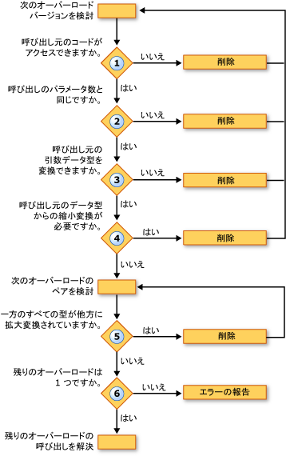

# オーバーロードの解決法 (Visual Basic)
Visual Basic コンパイラには、いくつかのオーバー ロードされたバージョンで定義されているプロシージャへの呼び出しが検出されると、コンパイラはのどのオーバー ロードを呼び出すを決定する必要があります。 これは、次の手順を実行します。  
  
1.  **アクセシビリティ。** 呼び出し元のコードの呼び出しを防止するアクセス レベルを持つオーバー ロードを除外します。  
  
2.  **パラメーターの数。** 呼び出しで指定された数と異なる数のパラメーターが定義されているオーバー ロードを除外します。  
  
3.  **パラメーターのデータ型。** コンパイラは、拡張メソッドよりインスタンス メソッドの基本設定を示します。 拡大に合わせてプロシージャの呼び出しの変換だけを必要とする任意のインスタンス メソッドが見つかった場合は、すべての拡張メソッドは削除され、インスタンス メソッドの候補をコンパイラが続行されます。 このようなインスタンス メソッドが見つからない場合は、インスタンスと拡張メソッドの両方を続行します。  
  
     このステップでは、オーバー ロードで定義されているパラメーターの型への呼び出し元の引数のデータ型を変換できませんオーバー ロードがなくなります。  
  
4.  **縮小変換をします。** 定義済みパラメーターの型への呼び出し元の引数の型から縮小変換を必要なオーバー ロードを除外します。 これは、該当するかどうか、型チェック スイッチの ([Option Strict ステートメント](../../../../visual-basic/language-reference/statements/option-strict-statement.md)) は`On`または`Off`です。  
  
5.  **最小の拡大。** コンパイラでは、ペアで残りのオーバー ロードと見なします。 各ペアに対して定義されているパラメーターのデータ型を比較します。 場合は、他の対応する型に拡大変換するすべてのオーバー ロードのいずれかの型、コンパイラは後者を除外します。 つまり、最低限の拡大変換を必要とするオーバー ロードを保持します。  
  
6.  **1 つの候補です。** まで 1 つだけのペアでオーバー ロードをそのまま残り、オーバー ロードして、呼び出しを解決するオーバー ロードすることを検討して続行します。 コンパイラは、候補を 1 つのオーバー ロードを減らすことはできません、エラーが生成されます。  
  
 次の図は、一連のオーバー ロードされたバージョンを呼び出すのかを決定するプロセスを示します。  
  
   
オーバー ロードされたバージョン間での解決  
  
 次の例は、このオーバー ロードの解決プロセスを示しています。  
  
 [!code-vb[VbVbcnProcedures#62](./codesnippet/VisualBasic/overload-resolution_1.vb)]  
  
 [!code-vb[VbVbcnProcedures#63](./codesnippet/VisualBasic/overload-resolution_2.vb)]  
  
 コンパイラがあるため最初のオーバー ロードを排除最初の呼び出しで最初の引数の型 (`Short`)、対応するパラメーターの型へ縮小変換 (`Byte`)。 次に除去 3 番目のオーバー ロードは、2 番目のオーバー ロードで各引数の型 (`Short`と`Single`) 3 番目のオーバー ロードでは、対応する型に拡大変換 (`Integer`と`Single`)。 2 番目のオーバー ロードが必要な小さい拡大ので、コンパイラは、呼び出しに使用します。  
  
 2 番目の呼び出しでは、コンパイラは縮小に基づいてオーバー ロードのいずれかで除去ことはできません。 引数の型の少ない拡大変換と 2 番目のオーバー ロードを呼び出すことがあるため最初の呼び出しと同様に、同じ理由から、3 番目のオーバー ロードを除外します。 ただし、コンパイラは、最初と 2 番目のオーバー ロードの解決できません。 それぞれが、他の対応する型に拡大する 1 つの定義済みパラメーターの型 (`Byte`に`Short`が`Single`に`Double`)。 そのため、コンパイラには、オーバー ロードの解決エラーが生成されます。  
  
## 省略可能なオーバー ロードと ParamArray 引数  
 最後のパラメーターを宣言する点を除いて、プロシージャの 2 つのオーバー ロードが同じシグネチャを持つ場合[オプション](../../../../visual-basic/language-reference/modifiers/optional.md)いずれかでと[ParamArray](../../../../visual-basic/language-reference/modifiers/paramarray.md)他のコンパイラとしてそのプロシージャの呼び出しを解決次に示します。  
  
|呼び出しが最後の引数として指定した場合|コンパイラは最後の引数として宣言するオーバー ロードへの呼び出しを解決します。|  
|---|---|  
|値なし (引数を省略すると)|`Optional`|  
|1 つの値|`Optional`|  
|コンマ区切りの一覧で、2 つ以上の値|`ParamArray`|  
|(空の配列を含む) 任意の長さの配列|`ParamArray`|  
  
## 関連項目  
 [省略可能なパラメーター](./optional-parameters.md)  
 [パラメーター配列](./parameter-arrays.md)  
 [プロシージャのオーバーロード](./procedure-overloading.md)  
 [プロシージャのトラブルシューティング](./troubleshooting-procedures.md)  
 [方法 : プロシージャの複数のバージョンを定義する](./how-to-define-multiple-versions-of-a-procedure.md)  
 [方法 : オーバーロードされたプロシージャを呼び出す](./how-to-call-an-overloaded-procedure.md)  
 [方法 : 省略可能なパラメーターを受け取るプロシージャをオーバーロードする](./how-to-overload-a-procedure-that-takes-optional-parameters.md)  
 [方法 : 不特定数のパラメーターを受け取るプロシージャをオーバーロードする](./how-to-overload-a-procedure-that-takes-an-indefinite-number-of-parameters.md)  
 [プロシージャのオーバーロードに関する注意事項](./considerations-in-overloading-procedures.md)  
 [オーバーロード](../../../../visual-basic/language-reference/modifiers/overloads.md)  
 [拡張メソッド](./extension-methods.md)
