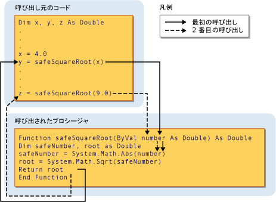

# プロシージャのパラメーターと引数 (Visual Basic)Procedure Parameters and Arguments (Visual Basic)
ほとんどの場合、プロシージャが呼び出されたときの状況に関する情報を必要とします。In most cases, a procedure needs some information about the circumstances in which it has been called. 繰り返しまたは共有のタスクを実行する手順は、呼び出しごとに異なる情報を使用します。A procedure that performs repeated or shared tasks uses different information for each call. この情報は、変数、定数、およびメソッドを呼び出すときに、プロシージャに渡す式で構成されます。This information consists of variables, constants, and expressions that you pass to the procedure when you call it.  
  
 A*パラメーター*プロシージャには、このメソッドを呼び出すときに指定することが期待される値を表します。A *parameter* represents a value that the procedure expects you to supply when you call it. プロシージャの宣言では、そのパラメーターを定義します。The procedure's declaration defines its parameters.  
  
 パラメーターを指定せず、1 つのパラメーター、または 1 つ以上を持つプロシージャを定義することができます。You can define a procedure with no parameters, one parameter, or more than one. パラメーターを指定するプロシージャの定義の一部と呼ばれる、*パラメーター リスト*です。The part of the procedure definition that specifies the parameters is called the *parameter list*.  
  
 *引数*プロシージャを呼び出す場合、プロシージャのパラメーターに指定した値を表します。An *argument* represents the value you supply to a procedure parameter when you call the procedure. 呼び出し元のコードは、プロシージャを呼び出すときに、引数を指定します。The calling code supplies the arguments when it calls the procedure. 引数を指定するプロシージャ呼び出しの一部と呼ばれる、*引数リスト*です。The part of the procedure call that specifies the arguments is called the *argument list*.  
  
 次の図は、プロシージャを呼び出すコード`safeSquareRoot`2 つの異なる場所からします。The following illustration shows code calling the procedure `safeSquareRoot` from two different places. 最初の呼び出しは、変数の値を渡します`x`(4.0) パラメーターに`number`、され、戻り値で`root`(2.0)、変数に割り当てられた`y`です。The first call passes the value of the variable `x` (4.0) to the parameter `number`, and the return value in `root` (2.0) is assigned to the variable `y`. 2 番目の呼び出しにリテラル値 9.0 に渡します`number`、戻り値 (3.0) を変数に代入し、`z`です。The second call passes the literal value 9.0 to `number`, and assigns the return value (3.0) to variable `z`.  
  
   
パラメーターに引数を渡すPassing an argument to a parameter  
  
 詳細については、次を参照してください。[の相違点の間でパラメーターと引数](./differences-between-parameters-and-arguments.md)です。For more information, see [Differences Between Parameters and Arguments](./differences-between-parameters-and-arguments.md).  
  
## パラメーターのデータ型Parameter Data Type  
 使用して、パラメーターのデータ型を定義する、`As`宣言内の句。You define a data type for a parameter by using the `As` clause in its declaration. たとえば、次の関数は、文字列と整数を受け取ります。For example, the following function accepts a string and an integer.  
  
 [!code-vb[VbVbcnProcedures#32](./codesnippet/VisualBasic/procedure-parameters-and-arguments_1.vb)]  
  
 型チェック スイッチの場合 ([Option Strict ステートメント](../../../../visual-basic/language-reference/statements/option-strict-statement.md)) は`Off,`、`As`ことを除き、すべてのパラメーターがそれを使用する必要があります任意の 1 つのパラメーターが使用している場合は、句は省略可能です。If the type checking switch ([Option Strict Statement](../../../../visual-basic/language-reference/statements/option-strict-statement.md)) is `Off,` the `As` clause is optional, except that if any one parameter uses it, all parameters must use it. 型チェックが場合`On`、`As`句はすべてのプロシージャのパラメーターは必須です。If type checking is `On`, the `As` clause is required for all procedure parameters.  
  
 呼び出し元のコードがなど、対応するパラメーターの異なるデータ型の引数を指定するかどうかは`Byte`を`String`パラメーターを次のいずれかの操作にする必要があります。If the calling code expects to supply an argument with a data type different from that of its corresponding parameter, such as `Byte` to a `String` parameter, it must do one of the following:  
  
-   パラメーターのデータ型に拡大変換するデータ型の引数だけを渡すSupply only arguments with data types that widen to the parameter data type;  
  
-   設定`Option Strict Off`暗黙的な縮小変換です使用できるように、または。Set `Option Strict Off` to allow implicit narrowing conversions; or  
  
-   変換キーワードを使用して、データ型を明示的に変換します。Use a conversion keyword to explicitly convert the data type.  
  
### 型パラメーターType Parameters  
 A*ジェネリック プロシージャ*も 1 つまたは複数定義されて*パラメーター入力*だけでなく、通常のパラメーターです。A *generic procedure* also defines one or more *type parameters* in addition to its normal parameters. ジェネリック プロシージャでは、個々 の呼び出しの要件をデータ型を調整できるように、プロシージャを呼び出すたびに異なるデータ型を渡すには、呼び出し元のコードを許可します。A generic procedure allows the calling code to pass different data types each time it calls the procedure, so it can tailor the data types to the requirements of each individual call. 「 [Generic Procedures in Visual Basic](../../../../visual-basic/programming-guide/language-features/data-types/generic-procedures.md)」を参照してください。See [Generic Procedures in Visual Basic](../../../../visual-basic/programming-guide/language-features/data-types/generic-procedures.md).  
  
## 関連項目See Also  
 [手順Procedures](./index.md)  
 [Sub プロシージャSub Procedures](./sub-procedures.md)  
 [Function プロシージャFunction Procedures](./function-procedures.md)  
 [Property プロシージャProperty Procedures](./property-procedures.md)  
 [演算子プロシージャOperator Procedures](./operator-procedures.md)  
 [方法 : プロシージャにパラメーターを定義するHow to: Define a Parameter for a Procedure](./how-to-define-a-parameter-for-a-procedure.md)  
 [方法: プロシージャに引数を渡すHow to: Pass Arguments to a Procedure](./how-to-pass-arguments-to-a-procedure.md)  
 [引数の値渡しと参照渡しPassing Arguments by Value and by Reference](./passing-arguments-by-value-and-by-reference.md)  
 [プロシージャのオーバーロードProcedure Overloading](./procedure-overloading.md)  
 [Visual Basic での型変換Type Conversions in Visual Basic](../../../../visual-basic/programming-guide/language-features/data-types/type-conversions.md)
